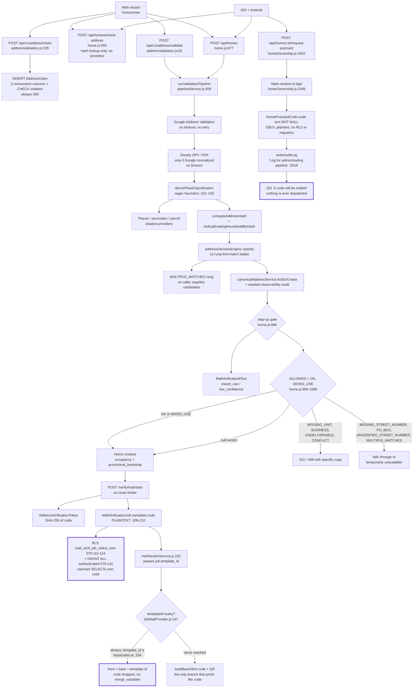

# Pantopus Home Address Verification — Deep Audit

> **⚠️ Historical snapshot — do not read as a description of the current system.**
> This audit describes the tree as of **2026-08-22**, *before* the
> `fix/address-verification-security` branch. That branch exists to remediate
> these findings, and most of the criticals below — the three total bypasses,
> the plaintext codes, the household takeover paths, the undispatched
> postcards — are closed on it. Every `file:line` reference is to the
> pre-remediation tree and many no longer resolve. For what was fixed and what
> remains open, read the branch's commit messages, which name their finding
> ids, and the follow-up branch reviews.

**Date:** 2026-08-22 · **Scope:** the complete home-address verification system — validation pipeline, decision engine, provider layer, both physical-mail paths, household claim and authority, lifecycle, data model and RLS, and the web/iOS/Android surfaces.

**Method.** Six parallel subsystem maps, then eight independent dimension audits (security & abuse, scenario coverage, privacy & compliance, lifecycle, reliability, UX & accessibility, cost & efficiency, i18n & architecture). Every finding was then judged by two independent adversarial verifiers — one testing *"does the code actually do this?"*, one testing *"does it actually matter?"* — and dropped only when **both** refuted it. A completeness critic then hunted for code the audit never opened and closed those gaps itself. 135 findings were raised, 3 refuted by both lenses, and 10 added by the critic: **140 findings**, of which **16 are contested** by one verifier and marked as such.

Findings carry `file:line` evidence taken from code that was actually read. Where the design doc and the code disagree, the code wins and the drift is itself reported.

---

## 1. Verdict

Address verification, as shipped, verifies nothing. Three independent total bypasses are live at the same time, and any one of them alone reduces "verified resident" to "typed an address": (a) `startVerification` writes the plaintext code into `MailVerificationJob.metadata` (`backend/services/addressValidation/mailVerificationService.js:206-210`), and RLS policy `mail_verif_job_select_own` (`backend/database/migrations/070_address_verification_mail.sql:115-124`) together with `GRANT ALL ... TO "authenticated"` (`:142`) deliberately lets the requesting user `SELECT` that exact row — the claimant reads their own code out of the database and never touches the mailbox; (b) the modern mail path can never print the code anyway, because `:204` always sets `template_id: 'address_verification_v1'`, `mailVendorService.js:102` forwards it, and `lobMailProvider.js:147-153` then takes the `if (templateId) { body.front = templateId; body.back = templateId }` branch, which discards the `code` argument and sends no `merge_variables` — the only code-bearing branch is the `else` inline-HTML path at `:151-154`, which is unreachable; (c) the legacy postcard path, the one the iOS and Android clients actually call, generates its code with `String(Math.floor(100000 + Math.random() * 900000))` (`backend/routes/homeOwnership.js:2499`), stores it as `"code" text NOT NULL` in cleartext (`backend/database/migrations/036_postcard_codes.sql:9`, no RLS in that migration), and mails nothing at all — it writes an audit log under the comment `// Log for admin/mailing pipeline` (`:2518-2521`) and returns `201` with "A code will be mailed to the home address" (`:2526`). There is no mail dispatcher behind that promise anywhere in the repository.

The rest of the assessment has to be read against that fact. The surrounding pipeline is genuinely well built: a clean provider abstraction with shadow-comparison harnesses (`placeShadowComparison.js`, `parcelShadowComparison.js`), canonical address persistence and hashing (`canonicalAddressService.js`), a per-call observability audit trail (`addressVerificationObservability.recordPipelineAudit`, `pipelineService.js:732-738`), and an explicit, readable twelve-rung verdict ladder (`addressDecisionEngine.js:182-468`) with a documented outage-fallback contract. That quality is what makes this report worth writing: the gap here is not between a good design and a bad one, it is between a designed system and a shipped one. Almost every enforcement lever the design specifies is a rollout flag that defaults to `false` (`backend/config/addressVerification.js:126-135`, mirrored as `false` in `backend/.env.example:146-153`), so what runs in production is Google plus Smarty, a regex classifier, and a two-value allow-list — with no step-up, no unit intelligence, no parcel or Places enforcement, and no requirement that a home even be validated before creation.

The consequences compound rather than stack. Because possession of a mailed code is never actually established, everything downstream that treats `verified` as evidence — occupancy attach (SEC-15, SCN-06), residency letters (SEC-10, LIF-06), the public profile that discloses a full street address and the owner's legal name to any authenticated user (SEC-01, PRV-02) — is trusting a token the claimant minted for themselves. And because verification never expires and `Home.owner_id` is never cleared on any leave path (LIF-01, LIF-04), that unearned trust is permanent. The honest summary is that Pantopus currently ships the observability and the vocabulary of a verification system without the verification.

---

## 2. How It Actually Works Today

### 2.1 Entry points

| Entry point | Caller | What it does |
|---|---|---|
| `POST /api/v1/address/validate` (`backend/routes/addressValidation.js:81`) | Web wizard only (`frontend/packages/api/src/endpoints/addressValidation.ts:115`) | Runs the full billable pipeline, returns `{verdict, address_id}`. `addressValidationLimiter`: 10/hr, keyed `req.user?.id \|\| req.ip`. |
| `POST /api/v1/address/validate/unit` (`:140`) | Web wizard | Re-runs the whole pipeline with a unit appended. |
| `POST /api/v1/address/claim` (`:235`) | Web wizard | **Always 500s.** The insert (`:337-347`) supplies `confidence` and `verdict_status`, which are not columns in `AddressClaim` (`migrations/067_address_claim.sql:9-24`), and `verification_method: 'escalation_required'` (`:303`) violates the CHECK at `067:19`. This is the only writer of `AddressClaim` in the codebase (ARC-01). |
| `POST /api/homes/check-address` (`backend/routes/home.js:555`) | Web + native | Pure hash/ZIP lookup. Calls no provider, produces no verdict. Returns `HOME_NOT_FOUND` / `HOME_FOUND_UNCLAIMED` / `HOME_FOUND_CLAIMED` plus `home_id` and `formatted_address` (`:661-666`). Uses a different notion of address identity than the create-time gate (SCN-18, ARC-04). |
| `POST /api/homes` (`home.js:677`) | Web **and** native | Re-runs the entire pipeline from scratch (`:770-779`) even when the web wizard validated seconds earlier (CST-03), then applies the verdict gate. |
| `POST /api/v1/address/verify/mail/{start,confirm,resend}` (`addressValidation.js:442,598,511`) | Web only, via `MailVerificationFlow.tsx` | The modern mail path. **No route-level rate limiter of any kind** — only `verifyToken` and Joi (SEC-08, REL-01). |
| `POST /api/homes/:id/request-postcard` (`homeOwnership.js:2452`) | iOS + Android | The legacy path. No membership or authorization check at all — it verifies only that the `Home` row exists (`:2458-2466`). |
| `GET /api/geo/autocomplete` (`backend/routes/geo.js:39`) | All clients | Unauthenticated, unrate-limited proxy in front of a billed geocoder (CST-01). |

Native has no address-validation layer: grepping the iOS and Android sources for `/api/v1/address` returns nothing. Both platforms go `check-address` → `POST /api/homes` → legacy postcard.

### 2.2 Provider fan-out (`pipelineService.runValidationPipeline`, `pipelineService.js:359-750`)

1. **Google Address Validation** (`:393-430`) — normalization, granularity, missing components. Bare `fetch`, no timeout, no retry, no breaker (REL-02, CST-05).
2. **Smarty** (`:432-487`) — DPV match code, RDI type, `missing_secondary`, `commercial_mailbox`, vacancy. Runs **only if Google returned a normalized address** (`:433`). Same: no timeout. On throw it substitutes `{inconclusive: true}`, which the ladder converts to `SERVICE_ERROR`.
3. **Heuristic place classification** (`derivePlaceClassification`, `:101-158`) — pure regex over line1/line2 plus Smarty RDI, producing `parcel_type` and `building_type`. This is the *only* classifier that reaches a production verdict.
4. **Shadow layer — all flag-disabled.** Google Places (`:492-537`), secondary/unit intelligence (`:540-592`), parcel intel (`:596-668`). Each is the only provider in the directory that *does* pass a timeout signal. None of them run.
5. **Hash + household lookup** (`:670-701`) — canonical hash from Google's normalized output, plus a fallback hash from raw input; `lookupExistingHouseholdByHash` (`:312-357`) returns `{home_id, member_count, active_roles}` for any home with an active occupancy.
6. **Decision engine** (`:703-715`), then **canonical persistence** (`:717-731`) and an **awaited** observability write (`:732-738`, CST-12).

Health is defined as `googleProvider.isAvailable() && smartyProvider.isAvailable()` (`addressValidation.js:63-65`), i.e. "the API key string is non-empty." A provider that is hung rather than absent is invisible to it (SCN-22).

### 2.3 The decision ladder (`addressDecisionEngine.classify`, `:182-468`)

First match wins; twelve rungs in fixed order:

`SERVICE_ERROR` (conf 0) → `UNDELIVERABLE` (0.1) → `PO_BOX` (0) → `MISSING_STREET_NUMBER` (0.15) → `UNVERIFIED_STREET_NUMBER` (0.2) → `MISSING_UNIT` (0.3) → `BUSINESS` (0.85) → `MIXED_USE` (0.5) → `LOW_CONFIDENCE` (0.2) → `MULTIPLE_MATCHES` (0.4) → `CONFLICT` (computed) → `OK` (computed).

Notes on what actually fires: `MULTIPLE_MATCHES` (`:428`) requires a `candidates` array that no caller ever supplies — structurally dead (SCN-19). `next_actions: ['manual_review']` is emitted by six rungs and consumed by nothing (SCN-06). Confidence is computed for only two of the twelve outcomes and is composed entirely of USPS/Smarty terms, capping a provider-less address at 0.65 against the hardcoded `AUTO_VERIFY_CONFIDENCE = 0.8` (`addressValidation.js:233`) (ARC-07, ARC-09).

### 2.4 What the verdict gates

At `POST /api/homes` only, in this order:

- **Step-up gate** (`home.js:946-974`) via `getCreateHomeStepUpPolicy` (`:378-403`) — fires only for `MIXED_USE` when `enforceMixedUseStepUp` is true, or `LOW_CONFIDENCE` with a geocode-granularity reason when `enforceLowConfidenceStepUp` is true. Both default false, so **this gate never fires in production** and the 760-line `MailVerificationFlow` it would route to is unreachable from home creation.
- **Allow-list** (`:980-1008`): `ALLOWED_HOME_VERDICT_STATUSES = {OK, MIXED_USE}` (`:236-239`). Everything else is 422, except `SERVICE_ERROR` → 503 and `CONFLICT` → 409. `getHomeValidationError` (`:253-309`) has no branch for `MISSING_STREET_NUMBER`, `UNVERIFIED_STREET_NUMBER`, `PO_BOX`, or `MULTIPLE_MATCHES` — those fall through to the default "Address verification is temporarily unavailable. Please try again in a moment," a permanent condition reported as a transient outage (SCN-14, UX-03).
- **Null verdict passes.** The gate is `if (addressVerdict && ...)`. The `canonical_confirmed_without_revalidation` branch (`:922-931`) leaves `addressVerdict` null, so the home is created with no verdict at all (REL-08).

What the verdict does **not** gate: `startVerification` (`mailVerificationService.js:101-140`) checks only stored `dpv_match_code === 'N'` and `missing_secondary`. A `BUSINESS` address or a CMRA can start a postcard (SCN-09). Nothing gates the legacy `request-postcard` path.

On success the creator gets `applyOccupancyTemplate(home.id, userId, role, 'provisional_bootstrap')` (`home.js:1265`), or `'pending_doc'` if they claimed ownership (`:1258`).

### 2.5 The two mail paths

**Modern (`/api/v1/address/verify/mail/*`, web only).** `startVerification` checks the household conflict gate (`_checkHouseholdConflict`, `:708-749` — reads `HomeAuthority.status = 'verified'`, and uses `.maybeSingle()` on a query that can return several rows, so it fails open on any home with more than one active owner/admin/manager: SEC-07, SCN-08), then two fail-open rate checks (`:659-674`), then generates a crypto-random 6-digit code, stores its SHA-256 in `AddressVerificationToken` — and stores the **plaintext** in `MailVerificationJob.metadata` (`:206-210`). Dispatch hands `job.template_id` to Lob, which takes the template branch and drops the code. `confirmCode` (`:553-650`) does a non-atomic read-modify-write on `attempt_count` (`:591`, `:607-610`) on a route with no limiter (REL-01), and on match returns `{verified: true, occupancy_id: null}` when `_attachOccupancy` finds no `Home` for the address (`:763-794`, SCN-06).

**Legacy (`/api/homes/:id/request-postcard`, iOS + Android).** `Math.random()` code → plaintext row → audit log → `201`. No dispatcher exists.



Dashed nodes are unreachable in shipped configuration. Thick-bordered nodes are the three bypasses from §1.

### 2.6 Rollout flags and what each one turns off

All eight enforcement flags default `false` in `backend/config/addressVerification.js:126-135`, and `backend/.env.example:146-153` ships them `false`. Nothing in the repository sets any of them true outside unit tests.

| Flag / env var | Default | What is off because of it |
|---|---|---|
| `enablePlaceProvider` / `ENABLE_ADDRESS_PLACE_PROVIDER` (`:127`) | `false` | Google Places classification never runs; no shadow comparison is recorded. Institution and named-POI detection falls back entirely to `INSTITUTIONAL_PATTERNS` regex (SCN-12). |
| `enforcePlaceProviderBusiness` / `..._BUSINESS_ENFORCEMENT` (`:128`) | `false` | The `BUSINESS` rung decides from Smarty RDI plus `COMMERCIAL_LINE1/LINE2_KEYWORDS` only. RDI `unknown` on a commercial building yields `OK` (SCN-11). |
| `enableSecondaryProvider` / `ENABLE_ADDRESS_SECONDARY_PROVIDER` (`:129`) | `false` | No unit intelligence. `_evaluateMissingUnit` uses the legacy Smarty-only path, which never compares the *submitted* unit — hence the unbreakable `MISSING_UNIT` loop for ADUs and split duplexes (SCN-10). |
| `enableParcelProvider` / `ENABLE_ADDRESS_PARCEL_PROVIDER` (`:130`) | `false` | No parcel lookup; the parcel cache and its `HomeAddress` scan never execute (CST-08, CST-10). |
| `enforceParcelProviderClassification` / `..._CLASSIFICATION_ENFORCEMENT` (`:131`) | `false` | Parcel usage class never overrides the regex `parcel_type` / `building_type`. |
| `requireAddressIdForHomeCreate` / `REQUIRE_ADDRESS_ID_FOR_HOME_CREATE` (`:132`) | `false` | `POST /api/homes` accepts a raw address with no prior `/validate`, which is exactly how both native clients use it. |
| `enforceMixedUseStepUp` / `ENFORCE_MIXED_USE_STEP_UP` (`:133`) | `false` | `MIXED_USE` creates a home with no mail step-up at all — it is in the allow-list. |
| `enforceLowConfidenceStepUp` / `ENFORCE_LOW_CONFIDENCE_STEP_UP` (`:134`) | `false` | `LOW_CONFIDENCE` 422s instead of offering step-up; the mail flow is unreachable from home creation. |
| `outageFallback.enabled` / `ENABLE_SAFE_ADDRESS_OUTAGE_FALLBACK` (`:116`) | **`true`** | On. Note the inversion: turning it *off* removes the guard and creates homes with a null verdict (REL-08). |
| `observability.enableEvents` / `enableMetrics` (`:122-123`) | **`true`** | On. Events and metrics are collected; there is no consumer, no queue, and no retention job (SCN-06, CST-13). |
| `lob.env` / `LOB_ENV` (`:86`) | **`'test'`** | Unvalidated in production and not in `PRODUCTION_REQUIRED` (`:163-168`). At `'test'`, `lobMailProvider.js:156-163` logs the live code and street address unredacted (SEC-12, PRV-09). |
| `lob.webhookSecret` / `LOB_WEBHOOK_SECRET` (`:87`) | `''` | Also absent from `PRODUCTION_REQUIRED`; signature verification is skipped when unset, with only a `logger.warn` (SEC-11, REL-06). |
---

## 3. Findings

All 140 findings, grouped by dimension and ordered by severity. Findings marked **[CONTESTED]** were upheld by one verifier and refuted by the other; the dissent is noted inline.

### Security and abuse resistance

The system's security posture fails at its own premise: proving that a person actually lives at an address. Every layer of the postcard control is compromised somewhere — the plaintext code is persisted next to its own SHA-256 hash in a row RLS deliberately exposes to the claimant, the legacy path that both native apps and the web app drive issues codes with `Math.random()` into a table with RLS off and `GRANT ALL` to `anon`, and the household-conflict gate that should stop a stranger verifying an occupied address fails open on precisely the multi-admin households it exists to protect. Authorization is missing or self-grantable on four routes (`public-profile`, `POST /:id/claim`, `request-postcard`, `invitations/:id/reject`), which composes into a working address-to-identity and identity-to-address de-anonymization primitive on the one product where that linkage *is* the privacy contract. None of the four modern mail routes carries a rate limiter, both service-level limits `return { exceeded: false }` on DB error, and the per-address budget has no user dimension — so locking a real resident out of their own address for seven days costs three throwaway accounts. Two mitigating facts run through the whole dimension and should temper severity reading: the Supabase anon key is never shipped to any client, so the PostgREST-reachable defects are gated today on that key staying secret; and no delivery pipeline exists for the legacy `HomePostcardCode` at all, so that path currently mints codes nobody can read or receive.

Fourteen findings were adversarially verified as upheld across both lenses, two at low severity, one contested. One finding (third-party QR service leaking codes to `api.qrserver.com`) was refuted by both verifiers as unreachable dead code and is excluded.

#### SEC-01. `public-profile` discloses a home's full street address and its owner's real identity to every authenticated user — **HIGH**

**What's wrong.** `GET /api/homes/:id/public-profile` computes `canView` from three fallback probes, and one of them — "does this home have any verified owner?" — is not a property of the *caller* at all. Any home that has completed ownership verification is therefore readable by every authenticated account, bypassing `Home.visibility` (default `private`) entirely. A second, independent hole: `POST /:id/claim` lets any authenticated user insert a `HomeResidencyClaim` for themselves on any home, and the mere existence of that row also flips `canView`.

**Evidence.** `backend/routes/home.js:2466-2481`. After the `checkHomePermission` / `public_preview` / creator test fails, three probes run in parallel and the results are read as:

```js
if (residencyClaim.data || ownershipClaim.data) canView = true;
if (verifiedOwnerProbe.data) canView = true;
```

The `verifiedOwnerProbe` at `:2470-2477` selects `id` from `HomeOwner` filtered only on `home_id`, `subject_type='user'`, `owner_status='verified'` — no `user_id` predicate. `home.visibility` is selected at `:2448` and never consulted again once `canView` flips. The payload at `:2533-2550` returns `address`, `city`, `state`, `zipcode` plus `owner: { id, username, name, profile_picture_url }` built at `:2524-2531`. The claim self-grant is at `backend/routes/home.js:6479` — `router.post('/:id/claim', verifyToken, ...)` with no `validate()` middleware and no `checkHomePermission`, inserting the caller's `HomeResidencyClaim` at `:6551-6560`. The `home_id` input is free: `POST /api/homes/check-address` returns `home_id` and `formatted_address` at `backend/routes/home.js:661-666`, and `homeCreationLimiter` explicitly skips it (`backend/middleware/rateLimiter.js:63`, `skip: (req) => req.method !== 'POST' || req.path === '/check-address'`). `public-profile` is a GET, so `globalWriteLimiter` skips it too (`rateLimiter.js:20`).

**Failure scenario.** A stalker knows a target's street address. `POST /api/homes/check-address` returns `{ status: 'HOME_FOUND_CLAIMED', home_id }`. `GET /api/homes/<home_id>/public-profile` then returns the full street line plus the verified owner's legal name, username and profile photo — one request, no state change, nothing for the victim to notice, no notification anywhere. Reverse direction works identically: given a `home_id`, recover the address and the resident's identity. If the home has no verified owner, the attacker inserts a claim via `POST /:id/claim` first and reads it on the second try. This directly contradicts the contract asserted on the sibling endpoint at `backend/routes/home.js:551-553`: "Returns status only — never reveals member identities, counts, or roles."

**Fix.** In `backend/routes/home.js:2480`, delete the `verifiedOwnerProbe` clause outright — it grants access based on a property of the home, not the caller. At `:2479`, require the claim to be in an approved state, not merely to exist. Strip `owner.name`, `owner.username`, `owner.profile_picture_url` and the street line from the non-member payload at `:2524-2550`; mask to city/state. Separately, add `validate()` and a rate limiter to `POST /:id/claim` at `:6479` and require the claimant to have passed address validation for that home's address.

#### SEC-02. `POST /api/v1/address/validate` is a household-composition oracle over arbitrary addresses — **HIGH**

**What's wrong.** On a `CONFLICT` verdict the pipeline builds `{ home_id, member_count, active_roles }` from live `HomeOccupancy` rows and the route returns the entire verdict object to the caller with no field filtering. The address is arbitrary caller input; there is no ownership or relationship requirement. Any email-confirmed account can type a street address and learn how many people live there, their role mix, and the `home_id` that feeds SEC-01.

**Evidence.** `backend/services/addressValidation/pipelineService.js:351-355` builds `{ home_id: occupancies[0].home_id, member_count: occupancies.length, active_roles: [...new Set(occupancies.map(r => r.role_base))] }`. `backend/services/addressValidation/addressDecisionEngine.js:441-453` passes it into `_verdict` as `existing_household` on the CONFLICT branch, and `_verdict` (`:1094-1106`) emits it as a top-level verdict field. `backend/routes/addressValidation.js:120-124` returns `{ verdict: result.verdict, address_id: result.address_id }` — the whole object, unfiltered. The only gate is `verifyToken` + Joi + `addressValidationLimiter` (`addressValidation.js:83-86`), which `backend/middleware/rateLimiter.js:123-130` sets to 10/hour keyed on `req.user?.id` — a new account resets the counter.

**Failure scenario.** Attacker POSTs an ex-partner's street address. The response carries `verdict.status = 'CONFLICT'` with `existing_household.member_count` (how many people live there) and `active_roles` — e.g. `['owner','member','lease_resident']`, which says "a family with a tenant" — plus `existing_household.home_id`, which chains straight into the `public-profile` disclosure in SEC-01. Ten addresses per hour per account, unlimited accounts. This is exactly the data the sibling `check-address` endpoint was written to withhold (`backend/routes/home.js:551-553`).

**Fix.** In `backend/routes/addressValidation.js:120-124`, whitelist the verdict fields returned to clients (`status`, `reasons`, `confidence`, `normalized`, `next_actions`) rather than passing `result.verdict` through. Reduce `existing_household` to a boolean in `addressDecisionEngine.js:441-453`, or drop it — the client needs to know CONFLICT, not the household's size and composition.

*Note:* the original finding also claimed rooftop `lat`/`lng` disclosure via `googleProvider.js:187-196`. One verifier refuted that half as immaterial — the caller supplied the street address, and rooftop geocoding of a known address is freely available from any public geocoder. Only the household-composition half is scored here.

#### SEC-03. The invite path mints full IAM owners with no rank check and skips the address-claim gate — **HIGH**

**What's wrong.** `POST /api/homes/:id/invite` maps a caller-supplied `relationship` straight to `proposed_role_base` with no comparison against the inviter's own rank. `manager` and `service_provider` are blocked on open invites; `owner` is not. Acceptance attaches with `method: 'owner_bootstrap'`, which is in `ESCALATED_METHODS` and therefore skips the verified-`AddressClaim` requirement entirely, passing the role through as `roleOverride`. `checkHomePermission` then short-circuits every permission on `role_base === 'owner'`.

**Evidence.** `backend/routes/home.js:5891` `const proposedRoleBase = mapLegacyRole(relationship || 'member');` — the only guard, `:5892-5896`, blocks `manager`/`service_provider` and only when `isOpenInvite` (`:5888`); `owner` is never blocked. `backend/utils/homePermissions.js:238-256` maps `owner -> 'owner'`. Stored at `home.js:5981`. Acceptance at `home.js:1957-1969` reads it back and calls `attach({ method: 'owner_bootstrap', claimType: 'member', roleOverride: roleBase })`. `backend/services/occupancyAttachService.js:36-41` puts `owner_bootstrap` in `ESCALATED_METHODS`; `:95-100` skips `_validateClaim` for escalated methods and `:409-411` skips `member_attach_policy`; `_resolveRole` at `:360-361` returns `roleOverride` first. The IAM route explicitly forbids this: `backend/routes/homeIam.js:232-235` `if (role_base === 'owner' && !access.isOwner) return 403`, plus `assertCanMutateTarget` at `:257`. Finally `backend/utils/homePermissions.js:172-173` `const isIamOwner = roleBase === 'owner'` and `:183` `if (isOwner) return { hasAccess: true, isOwner: true, ... }`. The plaintext invite token is stored beside its hash at `home.js:5978-5979` and the whole row is returned to the caller at `:6050`.

**Failure scenario.** A household `admin` is 403'd by `homeIam.js:232-235` when trying to promote anyone to owner. Instead they call `POST /api/homes/:id/invite` with `{ relationship: 'owner' }` and no email or `user_id` — `isOpenInvite` is true, `owner` passes the blocklist, and the 201 response contains the plaintext `token`. Any authenticated account redeeming that link becomes `role_base: 'owner'` with no address claim, no residency proof, and no approval, and immediately passes `ownership.transfer`, `security.manage`, and `assertCanMutateTarget` against every other member. One nuance that does not save it: `_resolveVerificationStatus('owner_bootstrap')` returns `provisional_bootstrap` (`occupancyAttachService.js:392-393`) so `applyOccupancyTemplate` writes the ALL_FALSE template — irrelevant, because `checkHomePermission` short-circuits on `role_base` alone and never reads `verification_status` or the boolean flags. Precondition: creating the invite needs `can_manage_access`, which `VERIFIED_TEMPLATES` grants to owner and admin (`homePermissions.js:385-386`). So this is admin-to-owner escalation plus anyone-holding-the-link-to-owner, not anonymous-to-owner.

**Fix.** In `backend/routes/home.js:5892-5896`, block `owner` unconditionally the way `manager`/`service_provider` are blocked on open invites, and rank-check `proposedRoleBase` against the inviter's own role. Then break the `owner_bootstrap` + caller-influenced `roleOverride` combination at `home.js:1957-1969` — either drop `roleOverride` for invite acceptance or remove `owner_bootstrap` from `ESCALATED_METHODS` in `occupancyAttachService.js:36-41`. Stop storing the plaintext `token` column at `home.js:5978`.

#### SEC-04. `claimed_role` is unvalidated free text, and on a cold-start address one code grants full IAM ownership — **HIGH**

**What's wrong.** `POST /:id/claim` accepts an arbitrary `claimed_role` string with no Joi schema and no database CHECK constraint. On postcard verification that value is mapped straight through `mapLegacyRole` into `role_base`, and when the home has no active authorities the occupancy is written as `verified` with the full owner template. A self-declared "owner" who enters one code becomes a full IAM owner of the property, with nobody notified.

**Evidence.** `backend/routes/home.js:6479` has no `validate()` middleware; `:6483` destructures `claimed_role` from `req.body` and `:6558` inserts `claimed_role: claimed_role || 'member'` verbatim (the re-claim branch repeats it at `:6531`). No CHECK exists — `backend/database/schema.sql:6748` is bare `"claimed_role" "text" DEFAULT 'member'::"text"`. On verify: `backend/routes/homeOwnership.js:2651-2652` `const claimedRole = claim?.claimed_role || 'member'; const roleBase = mapLegacyRole(claimedRole);` and `backend/utils/homePermissions.js:238-256` maps `owner -> 'owner'`. Authority count at `:2655-2660`; when zero, `:2673-2677` sets `verificationStatus = 'verified'` under the literal comment "NO AUTHORITIES (cold-start resolution) → verified with full access". `:2680` calls `applyOccupancyTemplate(homeId, userId, roleBase, verificationStatus)`, which with a verified status writes the full `VERIFIED_TEMPLATES.owner` template (`homePermissions.js:452-486`). `checkHomePermission` then grants everything (`homePermissions.js:172-173`, `:183`). The authority-notification loop at `homeOwnership.js:2727-2758` is gated on `authorityCount > 0`, so on a cold-start home nobody is told. Note the contradiction with the modern path, which pins mail-derived roles: `backend/services/occupancyAttachService.js:26-27` `mail_code: 'member', // NEVER admin; limited permissions`.

**Failure scenario.** Attacker targets an address whose `Home` row exists but has no active owner/admin/manager occupancy — a home created and abandoned, or one whose occupants are all `pending_*`. They `POST /api/homes/:id/claim` with `{"claimed_role":"owner"}` (accepted verbatim), obtain a code (PATH 2 of `/claim` auto-mints one at `home.js:6613-6626`, so `request-postcard` is not even needed), and `POST /api/homes/:id/verify-postcard`. `authorityCount` is 0, so they land as `role_base: 'owner'`, `verification_status: 'verified'`, `is_active: true` — full ownership of that address, no evidence, no review, no notification. From there they can invite, evict, transfer, and issue residency letters (see SEC-10). The real-world case does not need the plaintext-DB read at all: once postcard delivery works, whoever receives mail at a cold-start address — a new tenant, a short-term guest — can self-declare owner of someone else's property with one code.

**Fix.** Two independent changes. Add a Joi enum on `backend/routes/home.js:6479` restricting `claimed_role` to non-authority values (`member`, `roommate`, `family`, `tenant`) plus a matching DB CHECK on `HomePostcardCode`'s claim table column at `schema.sql:6748`. Then in `backend/routes/homeOwnership.js:2651-2680`, cap the postcard-derived role at `member` regardless of `claimed_role` — a mailed code proves mailbox reach and should never mint `owner`, exactly as `occupancyAttachService.js:26` already encodes for the modern path.

#### SEC-05. The live verification code is persisted in cleartext in a row RLS deliberately exposes to the claimant — **HIGH**

**What's wrong.** `MailVerificationService.startVerification` writes the live 6-digit code in cleartext into `MailVerificationJob.metadata.code` while separately storing its SHA-256 in `AddressVerificationToken.code_hash`. Migration 070 enables RLS on that table and adds a policy granting the attempt owner SELECT on their own row — i.e. on the row containing their own plaintext code. Nothing ever scrubs it, so every live and historical code sits in the database in the clear and the hash is decorative.

**Evidence.** `backend/services/addressValidation/mailVerificationService.js:204-210` inserts `metadata: { code, address_id: addressId, unit: unit || null }`; the resend path repeats it verbatim at `:381-389`. The hash lives separately at `:144`/`:177` (`code_hash: this._hashCode(code)`), so both forms coexist. `backend/database/migrations/070_address_verification_mail.sql:113` `ALTER TABLE "MailVerificationJob" ENABLE ROW LEVEL SECURITY`, `:115-124` `mail_verif_job_select_own ... FOR SELECT TO "authenticated" USING (EXISTS (SELECT 1 FROM "AddressVerificationAttempt" "a" WHERE "a"."id" = ... AND "a"."user_id" = "auth"."uid"()))`, and `:141-143` `GRANT ALL ON TABLE "MailVerificationJob"` to `anon` and `authenticated`. No scrub path exists: `backend/services/addressValidation/mailVendorService.js:219-227` re-spreads `...job.metadata` on every webhook update, and `confirmCode` (`mailVerificationService.js:628-637`) touches only the attempt and token rows. Users hold Supabase-issued JWTs (`backend/middleware/verifyToken.js:69` `supabase.auth.getUser(token)`), so the `auth.uid()` in that policy is the reader's own id.

**Failure scenario.** Both verifiers independently corrected the exploit chain, and the correction is why this is high rather than critical: reaching that RLS-protected row requires a direct PostgREST call, and Supabase's gateway rejects `/rest/v1` without the project `apikey`. No client ships it — `SUPABASE_ANON_KEY` appears only in backend files (`backend/config/supabase.js:5`, `backend/config/auth.js:6`), a full-text grep for `supabase` across `frontend/apps/web/src` returns zero files, and no API route returns job metadata (`addressValidation.js:534-547` exposes only status/expiry/resends). So the live exposure today is at-rest, not over-HTTP: every historical code is readable from backups, replicas, support/analytics DB access, and any log or dump of that table. It becomes an over-HTTP full bypass the moment the anon key ships in a client, a direct Storage/Realtime integration is added, or the key leaks from CI or a build artifact — a key Supabase documents as public. Even with a stolen code, payoff is bounded: `mail_code` is not in `ESCALATED_METHODS` (`occupancyAttachService.js:36-41`) so attach still needs a verified `AddressClaim`, and an occupied address cannot produce one (`addressValidation.js:305-318`). The attempt does flip to `verified` (`mailVerificationService.js:629-632`), satisfying the step-up gate for home creation at unoccupied or low-confidence addresses.

**Fix.** In `backend/services/addressValidation/mailVerificationService.js:204-210` and `:381-389`, stop persisting `code` — pass it to `mailVendorService.dispatchPostcard` in-process, or store it encrypted under a key the API role cannot read. Narrow `mail_verif_job_select_own` in a follow-up migration to expose non-secret columns via a view, and drop `GRANT ALL ... TO "anon"` at `070:141-143`. Ship a backfill that scrubs existing `metadata.code` values.

#### SEC-06. Legacy postcard path: no issuance authorization, `Math.random()` codes, plaintext storage, no RLS, `GRANT ALL` to `anon` — **HIGH**

**What's wrong.** `POST /api/homes/:id/request-postcard` performs no membership, ownership, occupancy, or claim check on the target home — the handler only confirms the `Home` row exists. The code is generated with `Math.random()`, stored in plaintext, and `HomePostcardCode` is the one address-verification table in the schema with no `ENABLE ROW LEVEL SECURITY` anywhere, while carrying `GRANT ALL` to both `anon` and `authenticated`.

**Evidence.** `backend/routes/homeOwnership.js:2452` `router.post('/:id/request-postcard', verifyToken, postcardLimiter, ...)`; the handler body `:2456-2466` does only a `Home` existence select — no `checkHomePermission`, no occupancy check, no claim requirement — before the insert at `:2501-2511`. Code generation at `:2499` is `String(Math.floor(100000 + Math.random() * 900000))`. Storage is plaintext: `backend/database/schema.sql:6617` `"code" "text" NOT NULL`. Grants at `backend/database/schema.sql:16440-16442` to `anon`, `authenticated`, `service_role`. RLS is genuinely absent: `schema.sql` contains 119 `ENABLE ROW LEVEL SECURITY` statements and `HomePostcardCode` is not among them (`HomeGuestPass:13718`, `HomeInvite:13721`, `HomeOccupancy:13787` all are), and `migrations/036_postcard_codes.sql` contains no RLS statement. Contrast the modern tables at `migrations/070:79,93,113`. Note the parallel path at `home.js:6613-6619` uses `generateSafeCode` (`home.js:6904-6912`, crypto-backed) — only `request-postcard` uses `Math.random`. This is the shared legacy flow, not mobile-only: iOS drives it at `frontend/apps/ios/Pantopus/Core/Networking/Endpoints/HomesEndpoints.swift:591-607`, and the web app at `frontend/apps/web/src/components/home/VerificationCenter.tsx:45`.

**Failure scenario.** Two corrections from verification bound this. First, no postcard is ever actually mailed on this path — grepping `backend/` for `HomePostcardCode` outside tests returns only `homeOwnership.js`, `home.js`, and `homeIam.js:85` (which surfaces `expires_at` only). There is no job, admin route, or vendor call that delivers it; the route comment at `:2519` writes an audit log "for admin/mailing pipeline" that does not exist. Second, the `SELECT code FROM HomePostcardCode` step needs the same PostgREST apikey as SEC-05. What *is* directly reachable today with no anon key at all is a DoS, created by the missing authorization combined with the pending-code caps: `:2470-2482` allows 1 pending code per user per home (enforced by the UNIQUE index at `schema.sql:11222`) and `:2486-2496` caps 2 pending per home. Two throwaway accounts calling `request-postcard` against a victim's `home_id` — obtainable for any street address from `POST /api/homes/check-address` (`home.js:661-666`) — exhaust the 2-slot pool and lock the legitimate resident out of the legacy verification path entirely. `Math.random()` is a real weakness but not reachable over HTTP: `verify-postcard` enforces a 5-attempt lockout (`:2576-2586`) plus `verificationAttemptLimiter` against a 900k space, and V8 state recovery would need many consecutive same-process outputs.

**Fix.** Gate `request-postcard` at `backend/routes/homeOwnership.js:2456` on an existing claim or occupancy for the target home. Replace `Math.random()` at `:2499` with `crypto.randomInt`, or reuse `generateSafeCode` from `home.js:6904`. Store only a SHA-256 and compare hashes. Add `ALTER TABLE "HomePostcardCode" ENABLE ROW LEVEL SECURITY` with an owner-scoped SELECT policy on non-secret columns plus a `service_role` policy, and revoke the `anon`/`authenticated` grants at `schema.sql:16440-16442`. Longer term, retire this path in favour of the Lob flow and port both native apps.

#### SEC-07. The household-conflict gate fails open on any home with more than one active owner/admin/manager — **MEDIUM**

**What's wrong.** `_checkHouseholdConflict` — the check that stops a stranger starting mail verification against an already-occupied address — calls `.maybeSingle()` on a query that legitimately returns multiple rows, and destructures only `data`, discarding `error`. supabase-js returns `data: null` plus a PGRST116 error when more than one row matches, so the conflict is silently not detected on exactly the most-established households. The protection inverts: the more admins a household has, the less protected its address.

**Evidence.** `backend/services/addressValidation/mailVerificationService.js:731-737`:

```js
const { data: occupancy } = await supabaseAdmin
  .from('HomeOccupancy').select('id, user_id')
  .eq('home_id', auth.home_id).eq('is_active', true)
  .in('role_base', ['owner', 'admin', 'manager'])
  .maybeSingle();
```

`error` is discarded; `if (occupancy)` at `:739` is the only path returning `{ blocked: true }`; the function falls through to `return { blocked: false }` at `:747`. The shipped supabase-js bundle at `backend/node_modules/@supabase/supabase-js/dist/umd/supabase.js` implements it as `isMaybeSingle && Array.isArray(r) && (r.length>1 ? (n={code:'PGRST116',...}, r=null, ...) : r = r.length===1 ? r[0] : null)` — multiple rows yield `data=null` and put the condition in the discarded `error`. The caller treats a false flag as clearance: `mailVerificationService.js:124-128` proceeds straight to the rate limits and the insert at `:150`. The `for (const auth of authorities)` loop at `:730` makes it worse — a home with two verified `HomeAuthority` rows runs the same multi-row query twice and fails open twice. The identical bug exists in `_attachOccupancy` at `:765-769` against `Home` rows sharing an `address_id`; fix both together.

**Failure scenario.** Victim's home has two active admins — a couple, or an owner plus a property manager — with a verified `HomeAuthority`. Attacker calls `POST /api/v1/address/verify/mail/start` for that `address_id`. The authority lookup at `:722-726` finds the authority, the occupancy query matches 2 rows, `data` comes back null, the loop finishes, and the gate returns `blocked: false`. The attempt is created and a postcard is physically mailed to the victim's house. A single-admin household would have been blocked with 409. Severity is medium, not high, because a downstream gate catches the worst case: attach requires a verified `AddressClaim` (`occupancyAttachService.js:95-100` → `_validateClaim:309-329`, and `mail_code` is not in `ESCALATED_METHODS`), and for an occupied address `/api/v1/address/claim` cannot produce one (`pipelineService.js:343-356` → `addressDecisionEngine.js:441-453` returns CONFLICT → `addressValidation.js:305-318` sends it to the 422 branch). Residual harm: wasted mail to an occupied address, a `verified` attempt row on a home the attacker has no relationship to, and consumption of that address's 5-per-7-days budget (SEC-08).

**Fix.** In `backend/services/addressValidation/mailVerificationService.js:731-737`, drop `.maybeSingle()` and use `.limit(1)` with an array result, or destructure and check `error` explicitly and fail closed on any error. Apply the identical change to `_attachOccupancy` at `:765-769`.

#### SEC-08. No route-level rate limiter on any mail endpoint; both service limits fail open; the per-address budget has no user dimension — **MEDIUM**

**What's wrong.** All four modern mail routes carry only `verifyToken` and Joi validation — the legacy path they replaced does apply limiters, so this is a regression, not a design choice. The service-level user (2/24h) and address (5/7d) limits are the only controls and both `return { exceeded: false }` on any DB error. `_deleteAttemptArtifacts` hard-deletes the attempt row on dispatch failure — the exact row both limiters count. And the address budget is keyed on `address_id` with no user dimension, which is what turns this from a spend problem into a targeted denial of a real resident's own address.

**Evidence.** `backend/routes/addressValidation.js:19` imports `addressValidationLimiter` and `addressClaimLimiter`, applied at `:84`, `:143`, `:238` — but `/verify/mail/start` (`:442-445`), `/verify/mail/:verification_id/resend` (`:511-514`), `/verify/mail/resend` (`:518-522`) and `/verify/mail/confirm` (`:598-600`) have none. The legacy path does: `backend/routes/homeOwnership.js:2452` `postcardLimiter` (3/hr), `:2548` `verificationAttemptLimiter` (10/15min). Fail-open: `backend/services/addressValidation/mailVerificationService.js:667-670` and `:688-692` both `logger.warn(...)` then `return { exceeded: false }; // fail open`. Limiter erasure: `_deleteAttemptArtifacts` (`:53-70`) is invoked on dispatch failure at `:238` and deletes the `AddressVerificationAttempt` row that `_checkUserRateLimit` counts at `:662-666` and `_checkAddressRateLimit` at `:684-688`. The address limit at `:681-692` filters on `address_id` alone. The only HTTP control is `globalWriteLimiter`, mounted at `backend/app.js:286` before any router (first router mount is `:303`), so `req.user` is always undefined there and `backend/middleware/rateLimiter.js:16,19` resolve to 30/min keyed on `req.ip` for the entire API surface. No telemetry exists — grepping `addressVerificationObservability.js` and `addressVerificationMetrics.js` for `mail` returns nothing, so there is no counter for codes sent, confirmed, or rate-limited, and no spend alerting.

**Failure scenario.** *Address-lockout DoS (the sharp edge, fully reachable):* three throwaway accounts each make two `POST /verify/mail/start` calls against one real address. The 5-per-7-days pool for that `address_id` is exhausted, and the legitimate resident who tries to verify their own home gets HTTP 429 "too many verification attempts for this address" for seven days — while five postcards land in their mailbox. *Cost abuse (bounded):* 2 starts/24h/account (`MAIL_VERIFY_USER_RATE_LIMIT=2`, `addressVerification.js:103`) at roughly a dollar a day per email-confirmed account is annoyance-tier, not unmetered — and the limiter-erasure sub-case does not amplify spend, because a failed dispatch means the provider never sent (`mailVendorService.js:140-162` returns before the send succeeds). It does grant unlimited free retries against an address Lob rejects.

**Fix.** Give `_checkAddressRateLimit` (`mailVerificationService.js:681-692`) a per-user dimension so one attacker cannot consume a victim's whole address budget — that is the priority change. Mount `postcardLimiter` on `/verify/mail/start` and both resend routes and `verificationAttemptLimiter` on `/verify/mail/confirm` in `backend/routes/addressValidation.js:442-600`. Make both service checks fail closed at `:667-670` and `:688-692`. Replace the hard delete in `_deleteAttemptArtifacts` with a terminal status so the row still counts. Emit metrics for every mail lifecycle transition.

#### SEC-09. `transfer-admin` accepts any verified co-owner despite claiming primary-owner-only, with no quorum and no state check — **MEDIUM**

**What's wrong.** The gate accepts any row returned by `isVerifiedOwner` — any verified `HomeOwner`, primary or not — while the 403 message says "Only the primary owner can transfer admin". `isVerifiedOwner` does return `isPrimary`; the handler simply ignores it. It then rewrites `Home.owner_id` with no quorum requirement and no dispute/security-state check, sidestepping the Tier-3 quorum machinery that guards the sibling ownership-transfer route.

**Evidence.** `backend/routes/homeIam.js:1298-1301`:

```js
const transferOwnerCheck = await isVerifiedOwner(homeId, actorId);
if (!transferOwnerCheck.isOwner && home.owner_id !== actorId) {
  return res.status(403).json({ error: 'Only the primary owner can transfer admin' });
}
```

No `is_primary_owner` test, even though `backend/utils/homePermissions.js:344-354` returns `isPrimary: owner.is_primary_owner`. The handler `:1282-1345` contains no `isActionBlockedByState` call and no quorum check before the write at `:1329-1332` `update({ owner_id: new_admin_user_id, ownership_state: 'owner_verified', updated_at: now })` and the actor demotion at `:1340-1345`. The guarded sibling does both: `backend/routes/homeOwnership.js:1543-1546` checks `isActionBlockedByState('TRANSFER_OWNERSHIP')` and `:1547` calls `calculateQuorumRequirement`, routing multi-owner transfers through `HomeQuorumAction`. The mismatch between the error string and the check is the clearest signal the missing predicate is an oversight, not intent.

**Failure scenario.** This is not an outsider takeover — the handler does require a verified `HomeOwner` row or `Home.owner_id`, and an active member target (`:1313-1323`). It is a co-owner unilaterally seizing sole primary ownership and demoting the other owner: exactly the divorce / roommate-split / co-investor dispute the quorum machinery was built to prevent. The downstream escalation is real: `canUserDeleteHomeRecord` keys on `Home.owner_id` (`backend/routes/home.js:55-66`), so the seized account can then hard-delete the `Home`, cascading `HomeOwner`, `HomeOccupancy`, `HomeOwnershipClaim` and `ResidencyLetter` rows for the real residents. Reachable from SEC-03 as well: an attacker who obtains a verified `HomeOwner` row via the invite escalation transfers primary ownership to a second account they control.

**Fix.** In `backend/routes/homeIam.js:1298-1301`, require `transferOwnerCheck.isPrimary`, matching the error message. Route the transfer through the same policy path as `/owners/transfer` — add the `isActionBlockedByState('TRANSFER_OWNERSHIP')` check and `calculateQuorumRequirement` from `homeOwnership.js:1543-1547` — or delete the route in favour of the guarded one.

#### SEC-10. Residency letters never expire, cannot be revoked by anyone but the issuer, survive eviction, and report `valid: true` after revocation — **MEDIUM**

**What's wrong.** `ResidencyLetter` has no `expires_at` column and `verifyByCode` applies no age test and no status filter — a revoked letter returns `valid: true` alongside the holder's full name and street address. `revokeLetter` is scoped `.eq('user_id', userId)`, so only the issuer can revoke; no owner, admin, landlord, or move-out path can. Nothing outside the letter service ever touches the table, so detach, move-out, member removal and `endLease` all leave letters live indefinitely.

**Evidence.** `backend/database/migrations/157_residency_letters.sql:18-43` defines the table with no `expires_at`; grepping the file for `expires_at`, `ROW LEVEL SECURITY` and `GRANT` returns nothing — the only constraint added is the `letter_code` UNIQUE at `:45-53`. `verifyByCode` (`backend/services/residencyLetterService.js:309-343`) selects purely by `letter_code` and returns `{ valid: true, status, resident_name, address: {line1, city, state, zipcode}, ... }` at `:330-343` — note `status` and `revoked_at` are already selected and returned right beside the hardcoded `valid: true`. `revokeLetter` at `:289-298` filters on `user_id`. Grepping `backend/routes`, `backend/services` and `backend/jobs` for `ResidencyLetter` returns only `residencyLetterService.js` and `routes/residencyLetters.js`. Issuance requires only `verification_status === 'verified'` (`backend/routes/residencyLetters.js:34-52`) under `residencyLetterIssueLimiter` (10/day).

**Failure scenario.** An attacker who obtains a verified occupancy by any route above (SEC-03, SEC-04, SEC-06) issues a residency letter. The household later discovers the fraud and removes them — the occupancy goes inactive, but the letter stays `status='issued'` and publicly verifiable at `GET /api/public/residency-letters/:code` forever, attesting their legal name at the victim's street address. Even if the household somehow gets it revoked, a third party checking `valid` — the obvious field — still reads `true`. Because the letter is designed as an off-platform credential for landlords, schools and DMVs, the blast radius extends outside Pantopus. Medium rather than high because issuance requires an already-verified occupancy, so this compounds an existing compromise rather than creating one.

**Fix.** Highest value first: in `backend/services/residencyLetterService.js:330-331`, return `valid: false` when `status !== 'issued'` — a straightforward logic bug with the data already in hand. Add `expires_at` (90 days) to `migration 157` and enforce it in `verifyByCode`. Widen `revokeLetter` (`:289-298`) to accept home owners/admins and the system. Call it from `occupancyAttachService.detach`, move-out, member removal and `endLease`.

*Note:* the RLS half of this finding was contested. One verifier refuted it — migration 157 issues no `GRANT`, so `anon`/`authenticated` have no privileges on the table. The other pointed to `backend/database/schema.sql:17003-17004` `ALTER DEFAULT PRIVILEGES ... GRANT ALL ON TABLES TO "anon"`, under which the table inherits blanket grants with no policy behind it. Confirm which applies in the deployed database; if the default privileges bite, this table holds `resident_name`, full street address and `pdf_base64` with no RLS.

#### SEC-11. Lob webhook signature verification is skipped when `LOB_WEBHOOK_SECRET` is unset, and startup validation does not require it — **MEDIUM**

**What's wrong.** The whole signature check is wrapped in `if (lobMailProvider.webhookSecret)`. With the secret unset, an unauthenticated public route parses and acts on attacker-supplied JSON. `LOB_WEBHOOK_SECRET` is absent from `PRODUCTION_REQUIRED`, so the boot-time `process.exit(1)` cannot catch a production deploy that omits it — the only signal is a `logger.warn`. Even with the secret set, the signed `timestamp` is never checked for freshness and `event.id` is never deduped, so valid webhooks replay forever.

**Evidence.** `backend/routes/lobWebhook.js:35` `if (lobMailProvider.webhookSecret) {` wraps the header-presence and signature block at `:36-46`; when unset, control falls to `event = JSON.parse(bodyStr)` at `:48`. `backend/config/addressVerification.js:163-168` lists only `GOOGLE_ADDRESS_VALIDATION_API_KEY`, `SMARTY_AUTH_ID`, `SMARTY_AUTH_TOKEN` and `LOB_API_KEY` as `PRODUCTION_REQUIRED`; the `process.exit(1)` at `:187-194` only fires for listed keys. `backend/services/addressValidation/lobMailProvider.js:254-272` folds `timestamp` into the HMAC at `:259` but never compares it to the clock. `processWebhookEvent` (`backend/services/addressValidation/mailVendorService.js:181-255`) has no seen-event table; `lobWebhook.js:66` uses `event.id` for a log field only. The route is mounted unauthenticated at `backend/app.js:195-199`. The transition is real: `mailVendorService.js:239-245` sets the attempt to `expired` on `postcard.returned_to_sender`. Failures are swallowed: HTTP 200 on both job-not-found (`lobWebhook.js:77-86`) and unhandled exception (`:87-97`). The unit test at `backend/tests/unit/mailVendorService.test.js` pins `webhookSecret: ''`, exercising the unverified path as the happy path.

**Failure scenario.** Both verifiers corrected the targeting step, which is why this lands at medium. `mailVendorService.js:205-208` matches the job by `vendor_job_id` — a Lob-issued `psc_…` identifier stored server-side only and never returned to any client (start/resend responses expose `attempt_id`, `status`, `expires_at`, cooldown and resend counts, never the vendor id). So an unauthenticated attacker cannot select a specific victim's in-flight postcard; they can only spray guesses at an unguessable id space, and a miss returns 200 "job not found". Replay of a captured valid webhook needs a MITM position on the Lob→server TLS session. Reachable transitions are bounded to `delivered_unknown` and `expired` — there is no path to `verified`. What remains is real and worth fixing: a public route that accepts unauthenticated commands whenever an env var is forgotten, with no freshness window, no idempotency, and 200-on-everything hiding genuine delivery failures.

**Fix.** Make the check unconditional in `backend/routes/lobWebhook.js:35` — return 401 when `webhookSecret` is unset. Add `LOB_WEBHOOK_SECRET` to `PRODUCTION_REQUIRED` at `backend/config/addressVerification.js:163-168`. Reject signatures whose `timestamp` is more than ~5 minutes old in `lobMailProvider.js:254-272`. Persist `event.id` in a dedupe table and no-op on repeats. Return non-200 on genuine failures at `lobWebhook.js:77-97`, and fix the test fixture that pins `webhookSecret: ''`.

#### SEC-12. `LOB_ENV` defaults to `'test'` and is unvalidated in production, writing live codes and street addresses to unredacted logs — **MEDIUM**

**What's wrong.** `LOB_ENV` defaults to `'test'` and is absent from `PRODUCTION_REQUIRED`, so a production deploy that sets `LOB_API_KEY` and nothing else lands in the test branch — which logs the live verification code together with the street line, city and state at info level. This is default-insecure, not an unusual misconfiguration. The mock provider is the unconditional fallback and logs codes even more loudly while retaining them in an unbounded in-memory array.

**Evidence.** `backend/config/addressVerification.js:86` `env: envStr('LOB_ENV', 'test')`; `PRODUCTION_REQUIRED` at `:163-168` omits it, so the `process.exit(1)` at `:187-194` cannot catch it, and `validate()` surfaces it only as an info field at `:212`. `backend/services/addressValidation/lobMailProvider.js:156-163`:

```js
if (this.env === 'test') {
  logger.info('LobMailProvider: TEST MODE — code logged for development', { code, addressLine1, city, state });
}
```

`backend/utils/logger.js` has no redaction. Mock fallback is unconditional at `backend/services/addressValidation/mailVendorService.js:27-31` (`if (lobMailProvider.isAvailable()) return lobMailProvider; return mockMailProvider;`), and `mockMailProvider.js:49-60` logs `MOCK VERIFICATION CODE: ${code}` plus the full address while retaining `{ address, code }` in an unbounded array at `:39-47`; `getJobStatus` returns `'delivered'` for anything held (`:76-85`), so mock runs report false delivery. Separately, `backend/app.js:479-480` calls `require('./config/addressVerification').validate()` from *inside* the `server.listen` callback, so the production fail-fast `process.exit(1)` runs with the port already accepting connections.

**Failure scenario.** Prod deploy sets `LOB_API_KEY` but forgets `LOB_ENV=live`. Every verification writes the live code, street line, city and state to the logger, which persists to disk and ships to whatever aggregation vendor is configured. Anyone with log access — an SRE, the log vendor, an attacker who reads a leaked bundle — harvests live codes paired with the real addresses they unlock. One verifier corrected the "silent total outage" half of the original claim: Lob decides test vs live from the API key prefix in the Basic auth header (`lobMailProvider.js:98-100`), and this `env` value feeds nothing but that log line — so a live key with `LOB_ENV` unset still mails real postcards *and* logs the code. That makes it worse, not better: the flow works while leaking.

**Fix.** Add `LOB_ENV` to the validated set in `backend/config/addressVerification.js:163-168` and reject any value but `'live'` when `NODE_ENV === 'production'` — or derive it from the API key prefix and delete the setting. Drop `code` from the log line at `lobMailProvider.js:156-163` and from `mockMailProvider.js:49-60` (log a hash prefix at most). Move `addressConfig.validate()` above `server.listen` in `backend/app.js:479`. Add redaction for `code`, `address*` and `email` keys in `backend/utils/logger.js`.

#### SEC-13. `POST /api/homes/invitations/:invitationId/reject` has no authorization check of any kind — **MEDIUM**

**What's wrong.** The reject handler reads `userId` from `req.user` and never uses it. It updates `HomeInvite` to `status: 'revoked'` by id alone, with no check that the caller is the invitee, the inviter, or a member of the home. The sibling accept-by-id handler does enforce invitee identity, so the omission is an oversight rather than a design decision.

**Evidence.** `backend/routes/home.js:2013-2033` is the complete handler:

```js
const { invitationId } = req.params;
const userId = req.user.id;              // never used again
const { error } = await supabaseAdmin
  .from('HomeInvite')
  .update({ status: 'revoked' })
  .eq('id', invitationId);
```

No ownership, invitee, inviter, or home-membership predicate. Contrast `home.js:1954-1968`, where the accept-by-id sibling fetches the caller's email and enforces `invite.invitee_user_id === userId || invitee_email === user.email`, 403ing otherwise.

**Failure scenario.** Both verifiers rejected the original "enumerate UUIDs" scenario: `HomeInvite.id` is a `gen_random_uuid()` primary key, so blind enumeration is infeasible and no endpoint discloses invite ids to non-members. The realistic abuse is narrower but real — anyone who has legitimately seen an invitation id can revoke it indefinitely: a low-privilege household member (guest/restricted_member) who can list their own home's invites, a removed member who kept the id from an old listing response, or anyone the id leaked to. They can revoke invitations created by the owner, silently, so the intended invitee's accept call fails and the inviter believes the invite is still pending. Cross-tenant write requiring a leaked identifier, hence medium.

**Fix.** In `backend/routes/home.js:2016`, load the invite first and require `invite.invitee_user_id === userId`, `invite.invitee_email === user.email`, or `invite.invited_by === userId` — mirroring `:1954-1968` — or `members.manage` on `invite.home_id`. Return 403/404 otherwise.

#### SEC-14. Address-hash normalization is variant-sensitive and the duplicate-home unique index was never created — **MEDIUM**

**What's wrong.** `computeAddressHash` produces different hashes for trivially different renderings of the same dwelling, because `normalizePart` only trims, lowercases and collapses whitespace before a whole-word abbreviation map — it never strips punctuation, so trailing periods and `#` survive and `apt.` never matches the `apt` key. Separately, the unique index that `POST /api/homes` relies on to reject duplicate active homes was left commented out in its migration and never applied, so the `23505` handler that depends on it is dead code.

**Evidence.** Both verifiers ran `computeAddressHash` from `backend/utils/normalizeAddress.js` directly and reproduced: `123 Main St` → `657bde03f1` vs `123 Main St.` → `dc355f4833`; the five unit renderings `Apt 2B` / `#2B` / `Unit 2B` / `2B` / `Apt. 2B` → `8aed812d17` / `b7ec52d6ad` / `7f1f44b181` / `86f52d339e` / `65ca97b07c`; `97201` → `657bde03f1` vs `97201-1234` → `b1c171497d`. Cause is at `normalizeAddress.js:50-55` (`normalizePart`) and `:40-42` (`expandAbbreviations`). The index: `backend/database/migrations/090_home_ownership_state.sql:97-103` leaves `-- CREATE UNIQUE INDEX CONCURRENTLY IF NOT EXISTS "idx_home_address_hash_active_unique" ...` commented under a "RUN SEPARATELY" header, and `backend/database/schema.sql:10453` has only the non-unique `idx_home_address_hash_active`, so `backend/routes/home.js:1107-1131` is unreachable. The raw-input paths are live: `check-address` hashes raw user input with no pipeline run at `home.js:559`, the direct `HomeAddress` insert at `:1152-1173` reuses that raw-input `addressHash` at `:1161`, and `home.js:1124-1125` prefers `canonicalAddress?.address_hash` but falls back to locally-normalized values — with `rollout.requireAddressIdForHomeCreate` defaulting to **false** (`addressVerification.js:132`), home creation without a pipeline-canonicalized address is permitted.

**Failure scenario.** An attacker blocked by the CONFLICT verdict (`addressDecisionEngine.js:441-453`, which is what makes `POST /api/homes` return 409) resubmits with a ZIP+4 or a trailing period. On the paths that hash raw input rather than Google output, a second `HomeAddress` row and a second active `Home` row are created for the same physical dwelling. Each carries an independent `address_id` — hence an independent 5-per-7-days mail budget (SEC-08), an independent household namespace, and an independent `check-address` result. The attacker now owns a parallel record of the victim's address, and neither household sees the other. Honest scope: on the primary create-home path Google's normalization collapses most of these variants before the hash is taken, so the evasion window is the no-canonical-address path plus units Google renders differently — and the commented-out unique index is the only backstop, which does not exist.

**Fix.** Strip punctuation and normalize unit designators and ZIP+4 in `normalizePart` at `backend/utils/normalizeAddress.js:50-55`; `backend/tests/unit/normalizeAddress.test.js` currently covers only abbreviation, case, whitespace and null-unit, so add the variant set above as regression tests. Apply the unique index from `migrations/090:103` (after the duplicate scan the migration comment already spells out), or delete the dead `23505` handler at `home.js:1107-1131`. Have `check-address` at `home.js:559` run through the canonical pipeline rather than hashing raw input.

#### SEC-15. **[CONTESTED]** Mail verification binds to mailbox possession only, and `confirmCode` reports success when the occupancy attach fails — **MEDIUM**

**What's wrong.** The postcard is addressed to "Current Resident", not the claimant, and no step in the flow compares the claimant's identity to anything about the address — `startVerification` checks address existence, deliverability, household conflict and two rate limits, and nothing else. Independently and more concretely, `confirmCode` marks the attempt `verified` and returns `{ verified: true }` *before* branching on whether `_attachOccupancy` succeeded, so the user is told they are verified when no occupancy exists.

**Evidence.** `backend/services/addressValidation/lobMailProvider.js:135` hardcodes `to: { name: 'Current Resident', ... }`. `startVerification` (`mailVerificationService.js:111-140`) performs exactly four checks — address exists, deliverability via `raw.dpv_match_code === 'N'` / `raw.missing_secondary` at `:114-121`, household conflict at `:124-127`, rate limits at `:130-139` — with no name, identity, or prior-relationship comparison. `confirmCode` marks the attempt verified at `:628-632` and the token used at `:634-637`, calls `_attachOccupancy` at `:640`, and returns `{ verified: true, occupancy_id: occupancyResult.occupancy_id || null }` at `:646-649` with no branch on failure; the failure surfaces only as a `logger.error` at `:785-791`. The route passes it through verbatim at `backend/routes/addressValidation.js:567-572`. The attempt FKs to `HomeAddress`, not `Home` (`migrations/070_address_verification_mail.sql:12`), so a deleted `Home` mid-flight yields HTTP 200 `{status:'confirmed'}` with nothing attached.

**Failure scenario.** *Attach half:* because `mail_code` is not in `ESCALATED_METHODS`, `_validateClaim` requires a separately verified `AddressClaim` — so silent partial success is the **common** path, not an edge case. Users complete the postcard flow, see "confirmed", and get no occupancy, with no error anywhere the user can see. *Identity half:* a roommate, an ex-partner still receiving mail, a landlord, an Airbnb guest, a building manager, or anyone reaching an unlocked cluster box takes the postcard and completes verification as themselves — nothing distinguishes "I live here" from "I can reach this mailbox."

**Fix.** In `backend/services/addressValidation/mailVerificationService.js:646-649`, branch on `occupancyResult` and return the attach failure to the caller instead of `verified: true`; surface it at `backend/routes/addressValidation.js:567-572`. For the identity half, if pursued: address the postcard to the claimant's attested legal name at `lobMailProvider.js:135`, and require a second factor for owner/admin transitions.

**[CONTESTED]** — one verifier refuted the identity-binding half at low severity, arguing that addressing to the occupant is how every postal address proof works (USPS, Google Business, bank verification), that no name match is possible because the platform holds no authoritative name-to-address roster, and that the compensating controls the finding says are absent do exist: `mail_code` is pinned to `'member'` with the comment "NEVER admin" (`occupancyAttachService.js:26`), attach requires a verified `AddressClaim` (`:36-41`, `:95-100`, `:309-329`), an occupied address cannot yield one (`addressDecisionEngine.js:441-453` → `addressValidation.js:305-318`), and the legacy path opens a 7-day challenge window when authorities exist (`homeOwnership.js:2661-2672`). Both verifiers agreed the `confirmCode` partial-success bug is real; the medium score rests on that half.

#### SEC-16. No single-in-flight guard on mail attempts: the active-attempt index is non-unique and rate limiting is check-then-insert — **LOW**

**What's wrong.** `startVerification` never checks for an existing active attempt for the same (user, address), and the partial index migration 070 creates for exactly that pair is a plain `CREATE INDEX`, not `CREATE UNIQUE INDEX` — a regression against the legacy table, whose equivalent index *is* unique. Both rate-limit checks are non-atomic count-then-insert with no transaction, advisory lock, or unique constraint to race against.

**Evidence.** `backend/database/migrations/070_address_verification_mail.sql:62-64` `CREATE INDEX IF NOT EXISTS idx_addr_verif_attempt_active ON "AddressVerificationAttempt" ("user_id", "address_id") WHERE "status" IN ('created','sent','delivered_unknown');` — enforces nothing. The legacy table got it right: `backend/database/schema.sql:11222` `CREATE UNIQUE INDEX "idx_postcard_code_active" ON "public"."HomePostcardCode" USING "btree" ("home_id", "user_id") WHERE ("status" = 'pending')`. Between the address load at `mailVerificationService.js:112` and the attempt insert at `:149-162` there is no query for an existing active attempt. `_checkUserRateLimit` counts at `:662-666` and `_checkAddressRateLimit` at `:684-688`, many awaits before the insert.

**Failure scenario.** Attacker fires N concurrent `POST /verify/mail/start` for the same `address_id`. All N pass the count-based limits before any inserts — classic TOCTOU — so all N attempts are created, all N postcards mail, and each carries its own independently-confirmable token with its own fresh 5-attempt budget (`MAX_ATTEMPTS` at `:177`). The win is small, which is why this is low: the extra brute-force budget is meaningless against a 10^6 space, and the amplification is one-shot — after the burst, the 24h user window and 7d address window are consumed by the rows just inserted. Net effect is a handful of duplicate postcards in a single burst, plus cross-generation confusion where a late webhook for generation 1 expires the attempt while generation 2's card is still in transit (SEC-11). It does mean the SEC-08 address budget can be drained in one burst rather than serially.

**Fix.** Change `migrations/070:62-64` to `CREATE UNIQUE INDEX`, matching the legacy table, and handle the `23505` in `startVerification` at `mailVerificationService.js:149-162`. That single change also gives the insert a constraint to race against, closing the TOCTOU without a transaction rewrite.

#### SEC-17. Unauthenticated guest-pass route enforces two security gates from columns that do not exist — **LOW**

**What's wrong.** `GET /api/homes/guest/:token` is unauthenticated and appears to enforce a passcode and a view cap. Both gates read columns that `HomeGuestPass` does not define, and because the query is `select('*')` the missing columns surface as `undefined` rather than an error — so both conditions evaluate falsy and are silently skipped. The handler reads as though passes are passcode-protected and view-capped; they are neither.

**Evidence.** `backend/routes/homeGuest.js:20` `router.get('/guest/:token', async (req, res) => {` — no `verifyToken`; mounted at `backend/app.js:320` under the comment "Public guest/shared endpoints (no auth)". View cap at `:60` `if (pass.max_views && pass.view_count >= pass.max_views)`; passcode at `:65` `if (pass.passcode_hash) { ... }`. `backend/database/schema.sql:6338-6353` defines `HomeGuestPass` as exactly `id, home_id, label, kind, token_hash, role_base, permissions, start_at, end_at, revoked_at, created_by, created_at, updated_at` — no `passcode_hash`, no `max_views`, no `view_count`, no `included_sections` (used at `:102`). Grepping `backend/database/migrations/` for those column names returns no `HomeGuestPass` hits. The pass query is `select('*')` at `:33-36`.

**Failure scenario.** Nothing is exposed today: the subsequent `Home` select at `:92-95` requests `house_rules`, `trash_day`, `local_tips` and `guest_welcome_message`, none of which exist on `Home` (which has only `entry_instructions` at `schema.sql:5966` and `parking_instructions` at `:5967`), so PostgREST errors, `data` is null, and `:97-99` returns 404. The severity is entirely in the failure mode. Someone fixing that unrelated column bug — a plausible, innocuous-looking cleanup — would unknowingly open an unauthenticated, passcode-free, view-cap-free route serving `HomeAccessSecret` wifi values (`:110-115`) and `HomeEmergency` details (`:117-121`) to anyone holding a pass token. A reviewer reading the handler would conclude the opposite.

**Fix.** Either add the missing columns to `HomeGuestPass` and implement the gates, or delete the dead gate code at `backend/routes/homeGuest.js:60` and `:65-72` so the absence of protection is visible to the next reader. Add a schema-conformance test that fails when a handler reads a column the table does not define. Do not fix the `Home` select at `:92-95` until the gates are real. (Note `HomeGuestPass` itself does have RLS at `schema.sql:13718`, unlike `HomePostcardCode` in SEC-06.)

### Scenario coverage

Scenario coverage is the weakest dimension in the subsystem. Of the 14 rows in the design's Scenario Coverage Matrix (`docs/home-address-verification-design-2026-04-02.md:182-197`), only four are genuinely functional in the shipped default configuration; the rest depend on rollout flags that default `false`, on dead code paths, or on nothing at all. The gaps are structural rather than incidental: the only mail channel any production client calls generates a code and never mails it; every `manual_review` escalation the engine emits has no queue, no route and no consumer; the four routes that approve or reject a residency claim are unconditionally 403; and there is no address-confidentiality concept anywhere, while one endpoint hands the full street address plus the owner's real name to any authenticated caller. Beyond the matrix, entire address classes — APO/FPO/DPO, dorms, barracks, shelters, group homes, nursing homes, tribal addresses, rural routes, highway-contract routes — have zero mentions in `backend/`. The recurring shape of the defect is a decision the engine makes correctly and then nothing downstream can act on.

---

#### SCN-01. Any authenticated user can turn a street address into an occupant's real name; no address-confidentiality path exists — **CRITICAL**

**What's wrong.** `GET /:id/public-profile` grants `canView` to *any* authenticated caller as soon as the home has one verified `HomeOwner` row, and never re-consults `Home.visibility` (default `'private'`). The response returns the full street address plus the owner's username, real name and profile photo. There is no suppression, opt-out, or confidentiality flag for DV survivors, ACP participants or public figures anywhere in the codebase, and the privacy toggles that appear to exist are inert.

**Evidence.** `backend/routes/home.js:2479-2480` — inside the `!canView` fallback: `if (verifiedOwnerProbe.data) canView = true;`. The response body at `backend/routes/home.js:2536-2550` returns `address, city, state, zipcode` and `owner.{username, name, profile_picture_url}`. `Home.visibility` defaults to `'private'` at `backend/database/schema.sql:5968` and is not read again after the probe passes. The UUID is not a barrier: `POST /api/homes/check-address` (`backend/routes/home.js:555-670`) accepts free-text address input from any logged-in user and returns `home_id` at `:663` whenever a match with active occupants exists. Privacy controls are non-functional — `backend/services/homePrivacyService.js:23-37` defines nine toggles and only `address_precision` has a consumer (`backend/services/placeIntelligenceService.js:476`); the service's own header comment at `:9` admits this. Separately, `backend/routes/users.js:2650` mounts a `optionalAuth` GET that returns `residency:{hasHome, city, state, verified}` derived from live occupancy state (`backend/utils/publicResidencyProfile.js:13-71`), and `globalWriteLimiter` skips GET by design (`backend/middleware/rateLimiter.js:20`).

**Failure scenario.** An attacker with any ordinary account types a victim's street address into `POST /api/homes/check-address`, receives `home_id`, then calls `GET /api/homes/:id/public-profile` and receives the victim's exact street address, real name, username and photo. No membership, claim, relationship or approval is required at any step. A DV survivor enrolled in a state Address Confidentiality Program who adds their home has no setting that changes this — turning off `member_name_visibility` does nothing because nothing reads it. The unauthenticated `users.js` endpoint additionally acts as a verified-residency and city/state oracle with no rate limit.

**Fix.** Delete the `verifiedOwnerProbe` bypass at `backend/routes/home.js:2479-2480`; the claim/join flow it serves does not need the address to function. Stop returning `home_id` from `check-address` for homes the caller has no relationship to. Gate the residency summary in `backend/utils/publicResidencyProfile.js` behind the user's own privacy settings, and wire the dormant toggles in `backend/services/homePrivacyService.js:23-37` to real consumers. Add a first-class address-confidentiality flag that suppresses the address on public-profile, discover, and residency letters.

---

#### SCN-02. Every production mail-verification CTA writes a code that is never mailed — **CRITICAL**

**What's wrong.** All production clients route mail verification to the legacy `POST /api/homes/:id/request-postcard`, which inserts a `HomePostcardCode` row, writes an audit line commented "Log for admin/mailing pipeline", and returns copy promising a mailed code. No job, service, route or admin surface anywhere reads pending `HomePostcardCode` rows to dispatch them. The Lob-backed dispatcher exists but sits behind `/api/v1/address/verify/mail/*`, which is flag-gated off in production.

**Evidence.** `backend/routes/homeOwnership.js:2499` generates the code with `Math.random()`, `:2501-2511` inserts the row, `:2518-2521` writes `POSTCARD_CODE_REQUESTED` under the comment `// Log for admin/mailing pipeline`, and `:2526` returns `'Verification code requested. A code will be mailed to the home address.'` A repo-wide grep for `HomePostcardCode` across non-test backend returns only `backend/routes/homeIam.js:85`, `backend/routes/homeOwnership.js` (request/verify) and `backend/routes/home.js:6618,6667` — no dispatcher; none of the 40 files in `backend/jobs/` reads it. `mailVendorService.dispatchPostcard` has exactly one non-test caller, `backend/services/addressValidation/mailVerificationService.js:78`, reachable only from `backend/routes/addressValidation.js:442`. Production CTAs all target the legacy route: `frontend/apps/web/src/components/home/VerificationCenter.tsx:45,169`, `frontend/apps/web/src/app/(app)/app/homes/[id]/verify-postcard/page.tsx:34,55`, `frontend/apps/ios/Pantopus/Core/Networking/Endpoints/HomesEndpoints.swift:591-599`, and the Android `PostcardVerificationViewModel.kt:221`. Cold-start PATH 2 (`backend/routes/home.js:6612-6647`) and the stale-authority fallback (`:6662-6696`) also insert `HomePostcardCode` rows and park the user at `pending_postcard`. The modern `MailVerificationFlow` *is* mounted in production at `frontend/apps/web/src/app/(app)/app/homes/new/page.tsx:616`, but only renders when `addressStepUpRequirement` is set, which requires `enforceMixedUseStepUp` or `enforceLowConfidenceStepUp` — both default `false` (`backend/config/addressVerification.js:133-134`).

**Failure scenario.** A renter claims their apartment. The home has active authorities so PATH 3 runs (or it is cold-start and PATH 2 runs), and the server responds "A code will be mailed to the home address." Nothing is ever printed or posted. `HomeOccupancy.verification_status` stays `pending_postcard` permanently. `VerificationCenter.tsx:165-179` offers "Resend code", which inserts a second row that is also never mailed, until the 2-per-home cap at `backend/routes/homeOwnership.js:2492` starts returning 429. Every matrix row whose remedy is "mail code" — mixed-use, low-confidence, contested address, cold start — terminates here.

**Fix.** Either write a dispatcher job for pending `HomePostcardCode` rows reusing `backend/services/mailVendorService.js`, or migrate all clients to `/api/v1/address/verify/mail/*` and turn on the gating flags. Until one ships, change the response copy at `backend/routes/homeOwnership.js:2526` and `backend/routes/home.js:6645,6694` so it stops asserting that mail is on its way.

---

#### SCN-03. **[CONTESTED]** The ground-truth corpus asserts against a flag configuration that is not shipped; 8 of 14 categories flip to `OK` 0.9 under production defaults — **CRITICAL**

**What's wrong.** Seven of the 14 fixtures in the ground-truth corpus hard-code `use_provider_place_for_business: true` (one sets `use_provider_parcel_for_classification: true`), but those flags default `false` in production. Run the same corpus with production flag values and every institutional, commercial, industrial and retail rejection category returns `OK` at confidence 0.9 instead of `BUSINESS`. CI is green while the behaviour it claims to prove is absent in the shipped build.

**Evidence.** `backend/config/addressVerification.js:127-131` defaults `enablePlaceProvider`, `enforcePlaceProviderBusiness`, `enableSecondaryProvider`, `enableParcelProvider` and `enforceParcelProviderClassification` to `false`; `backend/services/addressValidation/pipelineService.js:707-712` passes those rollout values straight into `classify()`. `backend/tests/fixtures/addressVerificationGroundTruthCorpus.js:168,185,202,219,236,266,283` set the flag true, and `makePlace()` at `:44-50` defaults to `google_place_types:['premise'], parcel_type:'residential', building_type:'single_family'` — so with the flag off, `_isBusiness`'s `hasResidentialCorroboration` early-return at `backend/services/addressValidation/addressDecisionEngine.js:836-845` fires before the institutional test at `:848`. Executing the corpus against the real engine with the three flags at production values: `corporate_office`, `school`, `church`, `hospital`, `stadium`, `warehouse`, `shopping_mall` and `government_building` all return `OK` 0.9. The flip reproduces through the real heuristic too, not only the fixture: `derivePlaceClassification` (`pipelineService.js:101-158`) returns `{google_place_types:[], parcel_type:'unknown', building_type:'unknown'}` for `1500 SW Jefferson St`, `101 School Ln` and `500 Medical Center Dr`. The design requires `BUSINESS` for these rows at `docs/home-address-verification-design-2026-04-02.md:189-192`.

**Failure scenario.** A user enters the street address of a school or a hospital in Add Home. Google returns PREMISE granularity, Smarty returns DPV `Y` with `rdi_type` unknown. The Places provider never runs, so `place.google_place_types` comes only from the regex heuristic, which emits nothing for these addresses. `_isBusiness` returns false, granularity is fine, and the verdict is `OK` at 0.9 — clearing `AUTO_VERIFY_CONFIDENCE = 0.8` (`backend/routes/addressValidation.js:233`), so `POST /claim` mints `claim_status:'verified'` at `:294-296`. The occupant becomes a verified resident of an institution.

**Contested.** The materiality verifier argued the production gate is Smarty RDI, not the Places provider: `addressDecisionEngine.js:852` `if (rdi === 'commercial') return true;` is reached at production defaults, and USPS marks schools, hospitals, offices, malls and warehouses Commercial — so the residual hole is only addresses where Smarty returns `rdi` unknown (`smartyProvider.js:156`), and the test-validity defect is the part that survives unambiguously.

**Fix.** Parameterise `backend/tests/fixtures/addressVerificationGroundTruthCorpus.js` over the actual `addressConfig.rollout` values, or run it twice (flags-on and flags-off) with distinct expectations, so the flags-off behaviour is asserted rather than silently bypassed. Then either enable `ENABLE_ADDRESS_PLACE_PROVIDER` + `ENABLE_ADDRESS_PLACE_PROVIDER_BUSINESS_ENFORCEMENT`, or add an RDI-unknown fallback so institutional detection does not depend on a disabled provider.

---

#### SCN-04. The residency-claim approve/reject routes are permanently 403 — they test a property `checkHomePermission` never returns — **HIGH**

**What's wrong.** Four routes guard on `!access.allowed`. `checkHomePermission` returns `{hasAccess, isOwner, occupancy, permissions}` and has no `allowed` key, so `!undefined` is `true` on every request and all four routes 403 unconditionally. These are the only approve/reject path for `HomeResidencyClaim` — the mechanism PATH 3 of the cold-start router depends on — plus the member-challenge route.

**Evidence.** `grep -n '\.allowed' backend/routes/home.js` returns exactly four hits: `3583`, `6723`, `6760`, `6846`. Every other call site in the file (`2929`, `3007`, `3713`, `3824`, `3870`, `3919`, `3965`, `4121`, and ~60 more) uses `access.hasAccess`. `checkHomePermission` (`backend/utils/homePermissions.js:154-207`) has seven return statements at `:162,177,180,183,196,202,205`; none includes `allowed`. The affected routes are `GET /:id/claims` (`:6715`), `POST /:id/claim/:claimId/approve` (`:6752`), `POST /:id/claim/:claimId/reject` (`:6838`) and `POST /:id/challenge-member/:occupancyId` (`:3575`). PATH 3 at `backend/routes/home.js:6697-6702` sets the claimant to `pending_approval` and calls `notifyHomeAuthorities`, whose recipients then have dead buttons. Three clients are wired to these routes: `frontend/apps/web/src/components/home/ResidencyClaimsPanel.tsx`, `frontend/apps/ios/Pantopus/Features/Homes/ClaimReview/HomeClaimReviewViewModel.swift`, and the Android `claim_review/HomeClaimReviewViewModel.kt`. `applyOccupancyTemplate` writes `is_active: true` unconditionally (`backend/utils/homePermissions.js:465,480`), so the un-approvable claimant already holds member-level read access.

**Failure scenario.** A new roommate moves in and files a residency claim at a home with active authorities. The existing resident is notified, opens Claim Review, and gets 403 on load and 403 on approve — on web, iOS and Android alike. The claimant sits at `pending_approval` indefinitely while `VerificationCenter.tsx:337-343` tells them "This page will update automatically"; the four action conditions at `:164,181,192,203` all exclude `pending_approval`, and the component contains no polling.

**Fix.** `access.allowed` → `access.hasAccess` at `backend/routes/home.js:3583, 6723, 6760, 6846`. Add a regression test asserting the return shape of `checkHomePermission`, and give `pending_approval` a forward action in `VerificationCenter.tsx`. Note `:3583` is the `suspended_challenged` writer, so this fix is a prerequisite for SCN-05.

---

#### SCN-05. A verified occupancy never expires or re-verifies; ex-residents keep issuing residency letters — **HIGH**

**What's wrong.** There is no periodic re-verification, staleness sweep or expiry for `HomeOccupancy.verification_status='verified'`. The only exits are the user's own move-out or an explicit removal, and `suspended_challenged` has no exit at all. Verified-resident status therefore decays into a false claim with no correction mechanism, and the stale record actively blocks the real current resident.

**Evidence.** `ls backend/jobs/` lists 40 jobs; grepping them for `HomeOccupancy` yields only `neighborhoodPreviewRefresh.js`, `notifyClaimWindowExpiry.js` and `processClaimWindows.js` — the last calls `applyOccupancyTemplate(..., 'verified')` at `backend/jobs/processClaimWindows.js:53` and never demotes. Grepping non-test backend for `reverif|re-verif|recertif` returns only unrelated hits in `backend/routes/landlordTenant.js:274` and `backend/stripe/stripeWebhooks.js:2266`. `suspended_challenged` is written at `backend/routes/home.js:3616` behind the permanently-403 route (see SCN-04) and at `backend/services/occupancyAttachService.js:223`; the only reader is a comment at `backend/routes/home.js:1480`. `backend/routes/residencyLetters.js:34-47` gates issuance solely on `access.occupancy.verification_status === 'verified'`. The 30-day stale-authority fallback at `backend/routes/home.js:6650-6660` keys on `User.last_sign_in_at`, not on occupancy freshness.

**Failure scenario.** A tenant verifies, lives there two years, moves out, and never opens the app again — but does still sign in occasionally. Their occupancy stays `is_active=true`, `verification_status='verified'`. They retain neighbour visibility and can still mint publicly verifiable residency letters for an address they no longer occupy. The new tenant's residency claim routes to PATH 3, notifies the stale authority, and the approve button 403s; because the ex-resident still signs in, the 30-day stale-authority fallback never fires either. The actual current resident is locked out indefinitely by the previous one.

**Fix.** Add a periodic occupancy re-attestation job in `backend/jobs/` (annual prompt, or demotion after N months of inactivity when a competing claim exists), give `suspended_challenged` a defined exit in `backend/routes/home.js`, and revoke or expire `ResidencyLetter` rows on detach — `backend/services/residencyLetterService.js:289-298` currently scopes revocation to the issuer only, so no one else can invalidate them.

---

#### SCN-06. `manual_review` is emitted for six verdicts and consumed by nothing; `confirmCode` reports success while attaching no occupancy — **HIGH**

**What's wrong.** `SERVICE_ERROR`, `UNDELIVERABLE`, `UNVERIFIED_STREET_NUMBER`, `BUSINESS`, `MIXED_USE` and `LOW_CONFIDENCE` all return `next_actions: ['manual_review']`, and nothing anywhere reads that value. `AddressClaim.claim_status` has exactly one writer in the whole backend — an INSERT — so `pending` is terminal. The user-visible consequence is worse than an unstaffed queue: `confirmCode` returns `{verified: true, occupancy_id: null}` after the attach silently fails.

**Evidence.** `backend/services/addressValidation/addressDecisionEngine.js:217,239,299,384,407,422` emit `manual_review`. A grep across non-test backend returns only those emit sites, `backend/routes/addressValidation.js:73`, the unused `backend/services/addressValidation/addressValidationService.js`, a null-mapping role entry at `backend/services/occupancyAttachService.js:32`, and a jsdoc line in `types.js` — no consumer. `backend/routes/addressValidation.js:341` is the sole `AddressClaim` INSERT and there is no UPDATE anywhere; `backend/services/occupancyAttachService.js:315-326` requires `claim_status='verified'`. `backend/services/addressValidation/mailVerificationService.js:628-632` marks the attempt verified, `:783-791` logs the attach failure with `logger.error`, and `:645-649` still returns `{verified:true, occupancy_id:null}`. Grepping `backend/routes/admin.js` and `backend/routes/adminVerification.js` for `AddressClaim`, `AddressVerification`, `HomeAddress` or `HomeResidencyClaim` returns nothing — the only admin claim reviewer covers `HomeOwnershipClaim` (`backend/routes/admin.js:342-357`). The design requires a review queue at `docs/home-address-verification-design-2026-04-02.md:762-763,770`.

**Failure scenario.** A user at a genuinely mixed-use building, or with a new-construction address Google scores at low granularity, receives `MIXED_USE` or `LOW_CONFIDENCE`. `POST /claim` writes `claim_status:'pending', verification_method:'escalation_required'` (`backend/routes/addressValidation.js:297-303`). They complete mail verification. `_attachOccupancy` → `attach({method:'mail_code'})` → `_validateClaim` fails on the pending claim. The UI shows verification succeeded. The user has no occupancy, no error, and no path to one; the only record is a server-side log line.

**Fix.** Two changes, independent of each other. First, in `backend/services/addressValidation/mailVerificationService.js:645-649`, stop returning `verified:true` when `occupancy_id` is null — surface the escalation state. Second, build the pending-claim reviewer (list `AddressClaim` where `claim_status='pending'`, promote/reject with audit) and have `confirmCode` promote the caller's `AddressClaim` to `verified` before calling `_attachOccupancy`.

---

#### SCN-07. The landlord/property-manager path is unreachable end to end — **HIGH**

**What's wrong.** Two independent breaks. `HomeAuthority.status` can only leave `pending` via `verifyAuthority`, which no route, job or admin surface calls. Separately, `VerificationCenter` decides whether to render `LandlordVerificationFlow` by probing `GET /api/v1/tenant/home/:homeId/status`, a path that is not registered anywhere in the backend; the 404 is swallowed by a bare catch, so the landlord option never appears.

**Evidence.** `backend/services/addressValidation/landlordAuthorityService.js:98-100` inserts `HomeAuthority` with `status:'pending'`; `:190` `verifyAuthority` is the only transition to `verified`; a repo-wide grep for `verifyAuthority` returns only `backend/tests/unit/landlordAuthorityService.test.js` and `landlordAuthorityPipeline.test.js`. Consumers that require `verified`: `landlordAuthorityService.js:299,550,657`, `backend/middleware/requireAuthority.js:41`, `backend/services/occupancyAttachService.js:464`. The probe is at `frontend/packages/api/src/endpoints/tenant.ts:52-54`. `backend/routes/landlordTenant.js` is mounted at `/api/v1` (`backend/app.js:397`) and registers twelve paths — `/landlord/authority/request`, `/landlord/properties`, `/landlord/properties/:homeId`, `/landlord/lease/invite`, `/landlord/lease/:leaseId/{approve,deny,end}`, `/landlord/properties/:homeId/requests`, `/tenant/request-approval`, `/tenant/accept-invite`, `/tenant/move-out`, `/home/:homeId/dispute` — no `/tenant/home/:homeId/status`; grep for `tenant/home` across backend returns nothing. The catch at `frontend/apps/web/src/components/home/VerificationCenter.tsx:64-70` sets `hasLandlord:false` on any error, so the branch at `:75-83` never renders.

**Failure scenario.** A tenant in a professionally managed building has no mail access — package concierge, or the landlord controls the mailbox. The design's alternative is landlord attestation. The tenant never sees the Landlord option because the capability probe 404s silently. Even if they reached it, the landlord's authority request would sit at `pending` forever because nothing can approve it. A property manager with 200 units has no path at all, bulk or otherwise. Combined with SCN-02, renters in managed buildings have zero working verification route.

**Fix.** Implement `GET /api/v1/tenant/home/:homeId/status` in `backend/routes/landlordTenant.js` or remove the probe from `frontend/packages/api/src/endpoints/tenant.ts`. Expose a reviewer route that calls `verifyAuthority`. Stop swallowing the probe error at `VerificationCenter.tsx:64-70` — a 404 on a core capability check must be logged.

---

#### SCN-08. Mail-code attach joins an occupied household with no approval and no notice, because the conflict gate depends on a status nothing can write — **HIGH**

**What's wrong.** `startVerification`'s household-conflict guard only blocks when a `HomeAuthority` row has `status='verified'` — a status no route in the codebase can produce, so the gate is dead code. `attach` then applies `member_attach_policy`, which defaults to `open_invite` and returns `{deferred:false}` even when a household already exists. The incumbent household gets no approval step and no notification when a stranger attaches.

**Evidence.** `backend/services/addressValidation/mailVerificationService.js:723-728` filters `HomeAuthority` on `.eq('status','verified')`; the only writer is `verifyAuthority` (`backend/services/addressValidation/landlordAuthorityService.js:190`), whose only callers are unit tests (see SCN-07). `requestAuthority` inserts `status:'pending'` (`:98`). `backend/services/occupancyAttachService.js:434-436`: `case 'open_invite': return { deferred: false };` — reached even when `householdExists` is true; `member_attach_policy` defaults to `'open_invite'` at `backend/database/schema.sql:5983` and `backend/database/migrations/031_home_ownership_identity_system.sql:202`. `_resolveVerificationStatus('mail_code')` returns `'verified'` (`occupancyAttachService.js:377-385`). The postcard is addressed to `name: 'Current Resident'` (`backend/services/addressValidation/lobMailProvider.js:137`).

**Failure scenario.** Two gates do constrain this and are worth stating precisely: `confirmCode` binds the attempt to the caller (`mailVerificationService.js:553-557` selects on `.eq('user_id', userId)`), so someone who merely opens another person's postcard cannot redeem it; and `mail_code` is not in `ESCALATED_METHODS` (`occupancyAttachService.js:35-40`), so `attach` runs `_validateClaim` and requires an existing verified `AddressClaim` for that user and address. That claim is free — `POST /claim` mints `claim_status:'verified'` for any `OK` verdict at confidence ≥ 0.8 (`backend/routes/addressValidation.js:233,291-296`) with no proof of anything. So the real exposure is: anyone with mailbox access at a shared address — doorman building, cluster box unit, shared mailroom — starts their own attempt, receives the "Current Resident" postcard, redeems the code, and is inserted as an active `verified` member of the existing household. No existing resident is asked or notified.

**Fix.** In `backend/services/occupancyAttachService.js`, require an approval step or a challenge window whenever `attach` finds an existing active household, regardless of `member_attach_policy`. Rebase the conflict gate in `mailVerificationService.js:709-748` onto active verified `HomeOccupancy` rows rather than the unreachable `HomeAuthority.status='verified'`. Notify existing occupants on every `mail_code` attach. Put the recipient's name on the postcard at `lobMailProvider.js:137` so it is not a bearer token.

---

#### SCN-09. `startVerification` has no verdict gate: any address, including `BUSINESS` and CMRA, can start a Lob postcard — **HIGH**

**What's wrong.** The entire pre-flight for `startVerification` reads `validation_raw_response` and tests only `dpv_match_code === 'N'` and `missing_secondary && !unit`. It never consults `commercial_mailbox`, never consults `rdi_type`, and — most consequentially — never consults the stored verdict status at all. Any `address_id` whose verdict was `BUSINESS`, `CONFLICT` or anything else rejected can start a mail verification.

**Evidence.** `backend/services/addressValidation/mailVerificationService.js:113-121` is the gate in full:
```js
if (raw.dpv_match_code === 'N') return { success:false, error:'Address is not deliverable' };
if (raw.missing_secondary && !unit) return { success:false, error:'Address requires a unit number' };
```
`backend/services/addressValidation/canonicalAddressService.js:437` writes `rawResponse.commercial_mailbox = smarty.commercial_mailbox` into the same blob, so the CMRA signal is stored and never read. `backend/routes/addressValidation.js:442-460` passes `address_id` through with no verdict check. The postcard is addressed to "Current Resident" (`backend/services/addressValidation/lobMailProvider.js:137`). Secondary defect — rule ordering: `MISSING_UNIT` is rule 6 (`backend/services/addressValidation/addressDecisionEngine.js:311-327`) and runs before `BUSINESS`, rule 7 (`:363-386`), whose first test is `if (smarty.commercial_mailbox) return true` at `:813`. Reproduced: `{line1:'123 Main St', line2:'# 250', commercial_mailbox:true, dpv_match_code:'S'}` → `MISSING_UNIT` 0.3; the same input with DPV `'Y'` → `BUSINESS` 0.85 with `CMRA_MAILBOX` in reasons. The design requires rejection at `docs/home-address-verification-design-2026-04-02.md:188`. Also note `_isUndeliverable` (`addressDecisionEngine.js:490-506`) never tests `commercial_mailbox` even though the UNDELIVERABLE reason list at `:230` includes `CMRA_MAILBOX` — that reason string is unreachable from that branch.

**Failure scenario.** An attacker rents a mailbox at a UPS Store for roughly $20/month. They validate the address (verdict `BUSINESS`), then call `POST /api/v1/address/verify/mail/start` with the resulting `address_id`. The gate does not look at the verdict, so a Lob postcard is dispatched to the commercial mail-receiving agency, addressed to "Current Resident." The clerk hands it over with no identity check. The rule-ordering defect is the milder half — a CMRA with DPV `'S'` returns `MISSING_UNIT` rather than `BUSINESS`, which still blocks home creation (`MISSING_UNIT` is not in `ALLOWED_HOME_VERDICT_STATUSES`, `backend/routes/home.js:236-238`) but records the wrong reason.

**Fix.** Add a verdict gate to `backend/services/addressValidation/mailVerificationService.js:112-122` that refuses any stored verdict outside the step-up-eligible set, plus an explicit `if (raw.commercial_mailbox) return { success:false, error:'Mailbox-store addresses cannot be verified by mail' }`. Hoist the CMRA test above the `MISSING_UNIT` rule in `classify` so a CMRA is always `BUSINESS` regardless of DPV code, and add `commercial_mailbox` to `_isUndeliverable` so the `CMRA_MAILBOX` reason becomes reachable.

---

#### SCN-10. A supplied-but-unrecognised unit (DPV `S`) produces an unbreakable `MISSING_UNIT` loop — **HIGH**

**What's wrong.** `_evaluateMissingUnit` treats `dpv_match_code === 'S'` as "unit missing" without checking whether the user supplied one. DPV `S` specifically means the primary matched and a secondary was present but not recognised. The only override, `providerConfirmsUnit`, requires the secondary-address provider, which defaults off. The user is told to supply the unit they just supplied, forever, and there is no step-up escape.

**Evidence.** `backend/services/addressValidation/addressDecisionEngine.js:580`:
```js
const legacyFromSmarty = !!(smarty.missing_secondary || smarty.dpv_match_code === 'S');
```
`submittedUnit` is computed at `:582` and used only on the provider path; `:592-598` returns `isMissing:true` on `legacyFromSmarty` with no reference to it. `_buildProviderUnitSignals` short-circuits `providerConfirmsUnit` to `false` when `enabled` is falsy (`:625-631`); `enabled` is `addressConfig.rollout.enableSecondaryProvider`, default `false` (`backend/config/addressVerification.js:129`), threaded in at `backend/services/addressValidation/pipelineService.js:710`. Reproduced: `{line1:'12 Elm St', line2:'Unit 1', dpv_match_code:'S'}` → `MISSING_UNIT` 0.3 with reasons `MISSING_SECONDARY, DPV_SECONDARY_MISSING`; `{line2:'Bsmt'}` → identical. `MISSING_UNIT` is in neither `ALLOWED_HOME_VERDICT_STATUSES` nor `STEP_UP_ELIGIBLE_HOME_VERDICT_STATUSES` (`backend/routes/home.js:236-243`). Web copy at `frontend/apps/web/src/app/(app)/app/homes/new/page.tsx:409-413` sets `fieldErrors.unit_number = 'This address needs a unit or apartment number.'` unconditionally. The gap is a known deferral — see the comment at `addressDecisionEngine.js:601-604`: defer provider-only invalid-unit enforcement until there is a settled UX path for "unit supplied but not verified". `providerRejectsUnit` is already computed at `:653` and unused.

**Failure scenario.** A tenant in a converted-garage ADU, a basement or garden apartment, a rear house, or unit 1 of an owner-split duplex enters "12 Elm St, Unit 1". USPS has one delivery point at 12 Elm St, so DPV returns `S`. The verdict is `MISSING_UNIT` and the UI highlights the unit field with a message demanding the value that is already in it. There is no "my unit isn't listed" affordance and no step-up path. The only workaround is to do the opposite of what the UI says — omit the unit entirely, yielding DPV `Y` on the primary delivery point and an `OK` verdict — which drops the user into the forced-single-household problem in SCN-17.

**Fix.** Split the DPV `S` handling in `backend/services/addressValidation/addressDecisionEngine.js:580-598`: if `submittedUnit` is non-empty, emit a distinct status (`UNVERIFIED_UNIT`) that is step-up eligible with "my unit isn't listed — verify by mail" copy; keep `MISSING_UNIT` only when no unit was submitted. Add the new status to `STEP_UP_ELIGIBLE_HOME_VERDICT_STATUSES` at `backend/routes/home.js:240-243` and give it a branch in the wizard.

---

#### SCN-11. **[CONTESTED]** Residential buildings are misclassified `MIXED_USE` by the commercial keyword regex, producing a permissive-yet-terminal state — **HIGH**

**What's wrong.** `COMMERCIAL_LINE1_KEYWORDS` contains ordinary building-name nouns — `tower|towers|plaza|center|centre|building|bldg|complex|atrium|pavilion` — and `COMMERCIAL_LINE2_KEYWORDS` contains `fl|rm|ste`. Combined with a residential RDI, either yields `parcel_type:'mixed'` and a `MIXED_USE` verdict for purely residential addresses. The resulting state is contradictory: the home is created but the address claim is permanently stuck.

**Evidence.** `backend/services/addressValidation/pipelineService.js:16-17` — the two regexes, verbatim from the file: line1 includes `tower|towers|plaza|center|centre|building|bldg|complex|mall|atrium|pavilion|…`, line2 includes `suite|ste|floor|fl|office|rm|room`. `:115-116` sets `hasCommercialHint`; `:134-136` sets `parcelType='mixed'` when commercial and residential hints co-occur; `:141-143` sets `buildingType='mixed_use'`. `backend/services/addressValidation/addressDecisionEngine.js:982-983` returns `MIXED_USE` on either. Reproduced: `'300 Park Tower' + 'Apt 9C'` with RDI residential → `MIXED_USE` 0.5; `'500 Market Plaza' + 'Apt 12'` → identical. The divergence: `MIXED_USE` is in `ALLOWED_HOME_VERDICT_STATUSES` (`backend/routes/home.js:236-239`) with `enforceMixedUseStepUp` false (`backend/config/addressVerification.js:133`), so the home is created; `POST /claim` writes `'pending'/'escalation_required'` (`backend/routes/addressValidation.js:296-300`), which nothing can promote (SCN-06). The design's own goal of residential false-positive avoidance is at `docs/home-address-verification-design-2026-04-02.md:131-134`.

**Failure scenario.** A resident of a pure residential high-rise, or a resident who types "Fl 3" or "Rm 2" as their unit, gets `MIXED_USE` 0.5. Via `POST /api/homes` their home is created with no step-up. Via `POST /claim` their claim is written `pending` and can never be promoted, so their occupancy can never be attached through the mail path. Two endpoints, two irreconcilable outcomes for one address. It also poisons the "percentage of MIXED_USE later confirmed as valid homes" metric the design asks for at `:803`.

**Contested.** The code-truth verifier argued the prevalence claim is wrong: `derivePlaceClassification` reads `google?.normalized?.line1` first (`pipelineService.js:102`) and `googleProvider.js:181` builds line1 as `street_number + route` only, so building names are dropped by Google normalization and never reach the regex; the surviving line1 triggers are USPS route names ending in a non-suffix keyword (`1 Rockefeller Plaza`), and the more likely real trigger is the line2 `fl|rm|ste` match.

**Fix.** In `backend/services/addressValidation/pipelineService.js:16`, remove the building-name nouns (`tower`, `towers`, `plaza`, `center`, `centre`, `building`, `bldg`, `complex`, `pavilion`, `atrium`) from `COMMERCIAL_LINE1_KEYWORDS`, and in `:17` drop the ambiguous `fl` and `rm` abbreviations or require corroboration from a commercial line1 hint before setting `parcel_type='mixed'`. Add `300 Park Tower / Apt 9C` and a `Fl 3` case to the corpus asserting `OK`.

---

#### SCN-12. **[CONTESTED]** The institutional keyword detector self-disables on any address whose street ends in a street suffix — **HIGH**

**What's wrong.** `inferInstitutionalPlaceTypes` returns an empty array whenever the text "looks like a street name," i.e. ends in one of 30 street suffixes. Real institutional addresses are ordinary street addresses and the institution's name never appears in the address, so the function emits nothing for the population it exists to detect. With the Places provider disabled, this heuristic is the whole implementation of the matrix's "Institution or venue → Reject as BUSINESS" row.

**Evidence.** `backend/services/addressValidation/pipelineService.js:88-99` — returns `[]` if `looksLikeStreetName(cleaned)` (`:90`) or if there are fewer than two non-numeric words (`:91`). `looksLikeStreetName` (`:76-86`) tests only the last token against `STREET_SUFFIXES` (`:19-42`, 30 entries including `ln`, `st`, `ave`, `way`, `dr`). It is fed `input.line1`, `input.line2` and `routeText` only (`:106-110`) — never a place display name, because no place lookup runs in default config. Reproduced against the real `derivePlaceClassification` plus the engine at production flags: `101 School Ln` → `google_place_types: []` → `OK` 0.9; `20 Hope Center Way` → `[]` → `OK` 0.9; `50 Sunrise Assisted Living Dr` → `[]` → `OK` 0.9; `1500 SW Jefferson St` → `[]` → `OK` 0.9. 0.9 clears `AUTO_VERIFY_CONFIDENCE = 0.8` (`backend/routes/addressValidation.js:233`), so `POST /claim` writes `claim_status:'verified', verification_method:'autocomplete_ok'` at `:291-293`.

**Failure scenario.** Any school, church, hospital, courthouse, stadium or shelter at a normal street address. `1500 SW Jefferson St` carries no institutional token at all; an address that literally contains "School" is discarded because the line ends in "Ln". The verdict is `OK` 0.9 and the claim auto-verifies. The suffix guard is deliberate — the design warns about valid homes on "University Ave" and "Church St" at `docs/home-address-verification-design-2026-04-02.md:124-125` — but it leaves the row with no working implementation in either direction once the Places provider is off.

**Contested.** The materiality verifier argued this is a cosmetic dead branch, not the load-bearing signal: with production flags and `rdi='commercial'`, `1500 SW Jefferson St` classifies `BUSINESS` 0.85 via `addressDecisionEngine.js:852`, and USPS RDI marks schools, hospitals and offices Commercial — so the residual is only RDI-unknown addresses, the same narrow hole as SCN-03.

**Fix.** This heuristic cannot carry the institutional policy. Either promote the Places provider to enforcing, or drop the `looksLikeStreetName` short-circuit at `backend/services/addressValidation/pipelineService.js:90` and match on the Google place display name rather than the address text. Do not present the institutional matrix row as covered while it depends on this function.

---

#### SCN-13. **[CONTESTED]** The hotel/motel rule is unreachable — `hasLodgingPlace` can never be true — **HIGH**

**What's wrong.** `_isBusiness`'s lodging early-return reads `heuristicPlaceSignals.hasLodgingPlace`, derived from `place.google_place_types` containing the literal token `lodging`. `derivePlaceClassification` — the only producer of that array in default config — can emit `premise`, `subpremise`, `store`, `establishment` and the ten institutional types, and never `lodging`. Hotel handling therefore reduces entirely to Smarty RDI.

**Evidence.** `backend/services/addressValidation/addressDecisionEngine.js:42` `LODGING_PLACE_TYPES = new Set(['lodging'])`; `:867` derives `hasLodgingPlace` from that set in `_buildHeuristicPlaceSignals`; `:816` is the only consumer; the call site at `:375` always passes the heuristic signal, never the provider one. Every push into `googlePlaceTypes` in `derivePlaceClassification` is enumerated at `backend/services/addressValidation/pipelineService.js:117-131` — `premise` (`:122`), `subpremise` (`:123`), `store`/`establishment` (`:125`), institutional types (`:127`) — none is `lodging`. `COMMERCIAL_LINE1_KEYWORDS` (`pipelineService.js:16`) contains no `hotel|motel|inn|resort|lodge` either. The corpus concedes the gap: `backend/tests/fixtures/addressVerificationGroundTruthCorpus.js:286-305` is the hotel fixture, which hand-injects `google_place_types:['lodging']` at `:293` and sets `classificationOnly: true` at `:289`, so no verdict is asserted.

**Failure scenario.** `1 Marriott Way` with Smarty RDI unknown → `google_place_types: []` → `OK` 0.9, and a transient-lodging address becomes a verified home. `300 Hotel Row` with RDI commercial → `BUSINESS` 0.85, but via the RDI branch at `addressDecisionEngine.js:852` with reasons `RDI_COMMERCIAL, PARCEL_COMMERCIAL, BUILDING_COMMERCIAL, PLACE_COMMERCIAL` — not the lodging rule. So any hotel, motel, extended-stay or resort that Smarty reports residential or unknown is accepted, and the matrix row "Hotel or short-term lodging → Reject or escalate per product policy" has no implementation of its own.

**Contested.** The materiality verifier accepted the dead-code claim but argued no realistic user reaches a hotel-as-home outcome through it: hotels are Commercial in USPS RDI essentially without exception, so the exposure collapses into the same RDI-unknown residual as SCN-03 and SCN-12.

**Fix.** Either derive a lodging hint in `derivePlaceClassification` (`backend/services/addressValidation/pipelineService.js:101-158` — note an `rv park` keyword already exists at `:18` and is treated as *residential*), or pass `providerBusinessSignals` lodging through at `backend/services/addressValidation/addressDecisionEngine.js:375` instead of always using the heuristic signal. Once one path works, replace the `classificationOnly` hotel fixture with an asserted verdict.

---

#### SCN-14. Permanent address conditions are reported to users as a transient outage at `POST /api/homes` — **MEDIUM**

*Merged: this entry combines the raw findings `po-box-and-street-number-verdicts-unhandled-at-create` and `non-us-and-rural-formats-unsupported`. Both are the same defect — `getHomeValidationError`'s non-exhaustive branch chain rendering structurally permanent conditions as "try again in a moment" — and the second verifier on the latter flagged the overlap explicitly. The `country`→`regionCode` schema mismatch from the second finding is retained here as a distinct sub-item.*

**What's wrong.** `getHomeValidationError` branches on only six of the twelve verdict statuses and then falls through to a generic "temporarily unavailable" response. `MISSING_STREET_NUMBER` and `UNVERIFIED_STREET_NUMBER` hit that fallback, as does every non-US address via `SERVICE_ERROR`. There is no "we don't support this address type" state in the verdict vocabulary at all, so the user cannot distinguish a permanent rejection from a provider incident, and retrying is futile forever.

**Evidence.** `backend/routes/home.js:253-310` covers `MISSING_UNIT`, `BUSINESS`, `UNDELIVERABLE`, `CONFLICT`, `LOW_CONFIDENCE`, `MULTIPLE_MATCHES` and then returns, verbatim from `:304-309`:
```js
return {
  error: 'Address verification is temporarily unavailable.',
  code: 'ADDRESS_VALIDATION_UNAVAILABLE',
  message: 'Please try again in a moment.',
};
```
The status selector at `:987-993` maps everything but `SERVICE_ERROR`/`CONFLICT` to 422. The web wizard's switch at `frontend/apps/web/src/app/(app)/app/homes/new/page.tsx:408-463` ends at `default: break` and proceeds. Non-US path: `backend/services/addressValidation/smartyProvider.js:27` pins the API base to `us-street.api.smarty.com`; `:95-98` returns `_inconclusive(...)` on zero candidates; `backend/services/addressValidation/addressDecisionEngine.js:477-482` maps `smarty.inconclusive` to `SERVICE_ERROR` at confidence 0 (`:206-221`), which `backend/routes/home.js:987-989` maps to HTTP 503 with the same copy. Reproduced: `RR 2 Box 15` → `MISSING_STREET_NUMBER` 0.15 via the fallback at `addressDecisionEngine.js:543-546`. Schema mismatch: `backend/routes/addressValidation.js:47-49` pins `state` to 2 chars and `zip` to `/^\d{5}(-\d{4})?$/`, while `backend/routes/home.js:82` allows `country: Joi.string().min(2).max(80)`, forwarded at `:776` into `backend/services/addressValidation/googleProvider.js:103` as `regionCode` — a CLDR region-code field. Two mitigations worth stating: `PO_BOX` is intercepted upstream by the Joi guard at `backend/routes/addressValidation.js:34-45`, `MIXED_USE` is in `ALLOWED_HOME_VERDICT_STATUSES` so it never reaches this function, and `POST /claim` already carries correct copy for exactly these statuses at `backend/routes/addressValidation.js:305-317`. The response body itself is not lying to *support*: `backend/routes/home.js:989-1007` does pass `verdict_status` and `reasons` into both `recordCreateHomeOutcomeSafe` and the client payload — only the human-readable `error`/`message` strings are wrong.

**Failure scenario.** A user on a rural route enters `RR 2 Box 15`. They clear step 1 (`default: break`, `address_id` present), fill in Details, Setup and Review, press "Create Home", and get "Address verification is temporarily unavailable. Please try again in a moment." Retrying produces the identical result forever with no indication that the address itself is the problem. A user entering a non-US address gets a 503 with the same copy. The verdict vocabulary at `docs/home-address-verification-design-2026-04-02.md:503-513` has no unsupported-address status, so this conflation is in the model, not just the copy.

**Fix.** In `backend/routes/home.js:253-310`, add explicit branches for all twelve members of `AddressVerdictStatus` (`backend/services/addressValidation/types.js:14-27`) — the strings already exist at `backend/routes/addressValidation.js:305-317` and can be copied. Make the switch exhaustive at the type level so a new status cannot silently fall through, and add matching cases in `homes/new/page.tsx` and `AddressEntryFlow.tsx` (which currently leaks the raw enum as `Unexpected verdict: <code>{status}</code>` at `:330`). Introduce an `UNSUPPORTED_REGION`/`UNSUPPORTED_FORMAT` outcome so unsupported input is distinguishable from an outage. Align `createHomeSchema`'s `country`, `state` and `zip` with `validateAddressSchema` so an 80-char free-text string cannot reach a CLDR region field.

---

#### SCN-15. Dorms, barracks, APO/FPO/DPO, shelters, group homes and nursing homes have zero representation in the code — **MEDIUM**

**What's wrong.** There is no reference anywhere in `backend/` to APO, FPO, DPO, military, barracks, dormitory, shelter, homeless, unhoused, tribal, group home, nursing home, assisted living, rural route or highway contract. The matrix has no row for any of them. These addresses resolve to whatever Smarty's RDI happens to say, which produces confident wrong answers rather than escalations — and, for dorm-shaped addresses, two irreconcilable outcomes depending on which endpoint the user hits.

**Evidence.** A case-insensitive grep across `backend/**/*.js` for `apo|fpo|dpo|military|barracks|dormitory|dorm|shelter|homeless|unhoused|tribal|rural route|highway contract|nursing home|assisted living|group home` returns zero real hits (one incidental substring in `backend/jobs/neighborhoodPreviewRefresh.js`). `docs/home-address-verification-design-2026-04-02.md:182-196` has no corresponding row. Reproduced at production flags: `20 Hope Center Way` → `OK` 0.9; `50 Sunrise Assisted Living Dr` → `OK` 0.9; `1200 University Ave` + `Room 214` → `MIXED_USE` 0.5 (`COMMERCIAL_LINE2_KEYWORDS` at `backend/services/addressValidation/pipelineService.js:17` matches `room`, plus residential RDI → `parcel_type 'mixed'`). `backend/routes/addressValidation.js:48` pins `state` to exactly 2 characters, which admits the military state codes AA/AE/AP, with no special handling downstream. `backend/services/addressValidation/smartyProvider.js:146-170` discards `dpv_no_stat`, one of the two available signals for this class.

**Failure scenario.** A student in a dorm at 1200 University Ave gets `MIXED_USE`. Because `MIXED_USE` is in `ALLOWED_HOME_VERDICT_STATUSES` (`backend/routes/home.js:236-238`) and `enforceMixedUseStepUp` is false (`backend/config/addressVerification.js:133`, read at `home.js:381-384`), the home is created with no step-up. The same address through `POST /claim` yields `claim_status:'pending'` (`backend/routes/addressValidation.js:297-303`), which nothing can promote, so their occupancy can never be attached by mail. Meanwhile a nursing-home or shelter resident at an RDI-unknown address is accepted as a permanent verified householder with no distinction from a homeowner.

**Fix.** The create-vs-claim divergence is the concrete bug and should be closed first: make `POST /api/homes` and `POST /claim` agree on `MIXED_USE` (either both create with step-up, or both escalate). Then add explicit matrix rows and detection for congregate/institutional residence — `dpv_no_stat` (currently discarded at `backend/services/addressValidation/smartyProvider.js:146-170`), `rdi`, and parcel usage class are the available signals — and decide a product policy per class rather than letting them fall through to `OK`.

---

#### SCN-16. Google's "new address" EWS signal is extracted and discarded; new construction lands on `UNDELIVERABLE` with "check for typos" — **MEDIUM**

**What's wrong.** `ewsNoMatch` is precisely the "this address is new and not yet in the USPS database" signal. `googleProvider` extracts it into `ews_flag` and no consumer anywhere reads it. A brand-new address therefore lands on either `UNDELIVERABLE` (hard block, with copy blaming the user for a typo) or `OK` at 0.65 (below the 0.8 auto-verify bar, producing a claim nothing can promote). The design's `ADDRESS_ARTIFICIAL` sub-reason is never emitted, so real-but-new and synthetic addresses are indistinguishable.

**Evidence.** `backend/services/addressValidation/googleProvider.js:240` sets `ews_flag: uspsData.ewsNoMatch || false`; a repo-wide grep for `ews_flag|ewsNoMatch` returns only that line. Reproduced: `{line1:'900 New Way', dpv_match_code:'', rdi:'unknown', granularity:'PREMISE'}` → `OK` 0.65; the same with `granularity:'OTHER'` and `hasUnconfirmedComponents:true` → `UNDELIVERABLE` 0.1 via the third clause of `_isUndeliverable` (`backend/services/addressValidation/addressDecisionEngine.js:498-505`). The `UNDELIVERABLE` copy at `backend/routes/home.js:275-281` is "Check the address for typos or use a different address." The `OK`-at-0.65 branch writes `claim_status:'pending', verification_method:'escalation_required'` at `backend/routes/addressValidation.js:294-303`. `ADDRESS_ARTIFICIAL` is listed as a required sub-reason at `docs/home-address-verification-design-2026-04-02.md:527` and is emitted nowhere in the engine.

**Failure scenario.** A buyer moves into a house in a subdivision completed last month. USPS has not yet added the delivery point; Google returns the geocode and flags EWS. If granularity is low and components are unconfirmed, the verdict is `UNDELIVERABLE` and the message says to check for typos — there is no typo, there is no override, no address-existence evidence upload, and no manual review queue (SCN-06), so a correct address is permanently unusable. If the verdict is instead `OK` at 0.65 the home *is* created (0.65 `OK` is still in `ALLOWED_HOME_VERDICT_STATUSES`), but the `/claim`-then-mail path stalls at `pending` and mail confirmation reports success while attaching nothing.

**Fix.** Consume `ews_flag` as a first-class signal in `backend/services/addressValidation/addressDecisionEngine.js`: emit a distinct status ("address too new to verify by post") with a defined waiting or appeal path instead of routing it to `UNDELIVERABLE`, and implement the `ADDRESS_ARTIFICIAL` sub-reason so real-but-new is separable from synthetic.

---

#### SCN-17. Multiple households at one address are forced to merge, and the duplicate-prevention unique index was never applied — **MEDIUM**

**What's wrong.** `CONFLICT` fires on any active occupancy at the canonical hash, and the only next actions offered are `join_existing` and `dispute` — there is no "separate household at the same address" concept in the verdict or next-action vocabulary. Simultaneously, the unique index meant to prevent duplicate active homes per address hash exists only as a commented-out instruction, so the opposite failure is also unguarded. And the household lookup swallows database errors, failing open to `OK`.

**Evidence.** `backend/services/addressValidation/pipelineService.js:312-355` returns a household for any `HomeOccupancy` with `is_active=true` at the hash; `backend/services/addressValidation/addressDecisionEngine.js:441-453` emits `CONFLICT` with `next_actions:['join_existing','dispute']`. `backend/services/occupancyAttachService.js:434-436` then attaches with no deferral under the default `open_invite` policy (`backend/database/schema.sql:5983`). `backend/database/migrations/090_home_graph_remediation.sql:97-103` leaves `CREATE UNIQUE INDEX CONCURRENTLY … idx_home_address_hash_active_unique` commented out under a "RUN SEPARATELY" header, and `backend/database/schema.sql:10453` has only the non-unique `idx_home_address_hash_active` — which makes the 23505 duplicate-key recovery handler at `backend/routes/home.js:1109-1125` dead code written against an index that was never created. Error swallowing: `pipelineService.js:317,325,332,344` destructure `{ data }` only, so a Supabase error is indistinguishable from "no household" and yields `OK` instead of `CONFLICT`.

**Failure scenario.** A single-family house has been informally split into three rented rooms with no USPS secondary designators. Tenant A verifies first. Tenants B and C get `CONFLICT` and are told to "join the existing household," which merges three unrelated parties into one household with shared visibility of each other's identities and home data. There is no other option offered. If instead the household lookup hits a transient database error, the verdict is `OK` and a duplicate active home is created at the same hash with nothing at the schema level to stop it.

**Fix.** Model "multiple households at one address" explicitly — a household-scoped identifier under the canonical address — rather than treating the address hash as the household key, and add a corresponding next action alongside `join_existing`/`dispute` in `backend/services/addressValidation/addressDecisionEngine.js:441-453`. Apply the unique index from `migrations/090` once existing duplicates are reconciled, which also makes the 23505 handler at `backend/routes/home.js:1109-1125` live. Stop discarding the `error` field at `pipelineService.js:317,325,332,344` — duplicate-household protection must not fail open.

---

#### SCN-18. **[CONTESTED]** `check-address` and the create-time `CONFLICT` gate use different notions of address identity — **MEDIUM**

**What's wrong.** `normalizePart` expands only 19 abbreviations, of which `apt` is the sole unit designator. `Unit`, `#`, bare numbers, hyphenated sub-units, `Bsmt`, `Rear`, `Spc`, `Trlr`, `Fl` and `Rm` are all left as-is, punctuation is never stripped, and ZIP+4 forks the key. `POST /api/homes/check-address` hashes raw user input with this function, so it returns `HOME_NOT_FOUND` for address variants the create call will later reject as `CONFLICT` — misrouting the native apps' join-vs-create decision.

**Evidence.** `backend/utils/normalizeAddress.js:12-32` — 19 `ABBREVS` entries (`apt→apartment`, `ste→suite`; no `unit`/`#`/`bsmt`/`spc`/`trlr`/`fl`/`rm`); `:41-43` does a word-boundary replace leaving punctuation intact; `:69-73` joins `[address, unit, city, state, zip, country]` with no plus4 stripping. Running the real function: `Apt 2B`→`apartment 2b`, `Unit 2B`→`unit 2b`, `#2B`→`#2b`, `2B`→`2b`, `2-B`→`2-b`, `Apt. 2B`→`apartment. 2b`, `Bsmt`→`bsmt` vs `BASEMENT`→`basement`; `Lot 12`/`Spc 12`/`Trlr 12` all distinct; `97201` vs `97201-1234` distinct. Raw-input hash sites: `backend/routes/home.js:559` (`POST /api/homes/check-address`) and `backend/services/addressValidation/pipelineService.js:681-689`. The ZIP-scoped fallback `homeMatchesAddressByFields` (`backend/routes/home.js:490-501`) recomputes `computeAddressHash` from the stored home's raw fields, so the variance survives that fallback too. A third, incompatible notion of unit identity exists in the same pipeline at `backend/services/addressValidation/secondaryAddressProvider.js:49-56`, which strips designators and non-alphanumerics.

**Failure scenario.** Two roommates at 123 Main St Apt 2B. One typed "Apt 2B" at creation; the second types "#2B". `check-address` hashes raw input, finds no match, and returns `HOME_NOT_FOUND` — so the native apps route the second roommate into Create rather than Join. They then hit `CONFLICT` at create time, having been told moments earlier that no such home existed.

**Contested.** Both verifiers downgraded on the same grounds: the hash that actually gates creation is canonical, not raw. `backend/services/addressValidation/pipelineService.js:310-318,669-677` hashes Google's `normalized.line1/line2`, and `googleProvider.js:179-182` sets line2 from the `subpremise` component, so "Apt 2B", "Unit 2B", "#2B" and "2B" collapse to one hash; `backend/routes/home.js:1010-1024` stores `Home.address_hash` from the canonical norms. The dissent is that the "cheap way to evade dedupe and mint parallel households" framing does not hold — this is a pre-flight consistency bug, not a dedupe-evasion primitive.

**Fix.** Extract the unit-token normaliser from `backend/services/addressValidation/secondaryAddressProvider.js:49-56` and use it from `backend/utils/normalizeAddress.js` so the codebase has one notion of unit identity; strip punctuation in `normalizePart`, truncate ZIP to 5 digits before hashing, and apply NFKD diacritic folding. Better still, have `check-address` resolve against the canonical hash the create path uses. `backend/tests/unit/normalizeAddress.test.js` asserts only the passing cases (case, whitespace, abbreviation, null unit) — add the failing variants above as regressions.

---

#### SCN-19. The production wizard silently overwrites the user's typed address, and `MULTIPLE_MATCHES` has no producer — **MEDIUM**

**What's wrong.** Two matrix rows are structurally unreachable. `MULTIPLE_MATCHES` requires `candidates.length > 1` and no caller ever supplies `candidates`. The "wrong but real address → prompt CONFIRM or FIX" row is worse than unimplemented: Google's replaced/inferred component flags only subtract 0.1 each from confidence, the only confirmation screen lives in a page whose own header calls it a test fixture, and the production wizard rewrites the user's input in place with no confirmation.

**Evidence.** `backend/services/addressValidation/addressDecisionEngine.js:428` `if (candidates && candidates.length > 1)` is the only `MULTIPLE_MATCHES` test; `googleProvider._parseResponse` (`backend/services/addressValidation/googleProvider.js:118-155`) returns no candidates array, and all classify call sites omit the key — `pipelineService.js:703-715`, `backend/routes/addressValidation.js:277-285`, and the stored-verdict paths at `backend/routes/home.js:868-874,912-919`, which build inputs from `buildStoredDecisionInputs` (returning `{google, smarty, place, provider_place, unit_intelligence, parcel_intel}` at `pipelineService.js:309`). For confirm/fix: `addressDecisionEngine.js:1042-1043` applies only `-0.10` for `hasReplacedComponents` and `-0.10` for `hasInferredComponents`. The `ConfirmAddress` screen is reachable only from `frontend/apps/web/src/components/address/AddressEntryFlow.tsx:235-243`, whose sole mount is `frontend/apps/web/src/app/(app)/app/address-verify/page.tsx`, whose header at `:3-5` reads "Test fixture page for address verification E2E tests." The production wizard at `frontend/apps/web/src/app/(app)/app/homes/new/page.tsx:393-406` calls `setNormalized`, `setAddressText` and `setUnit` from `verdict.normalized` and proceeds through `default: break` at `:463`. `MULTIPLE_MATCHES` is still declared to clients in `frontend/packages/api/src/endpoints/addressValidation.ts` and drawn in the design flowchart at `docs/home-address-verification-design-2026-04-02.md:219`, so it reads as covered in review.

**Failure scenario.** A user mistypes a ZIP. Google silently replaces it with a different, valid one. The wizard writes the corrected address into state and moves on; the user is never told their input changed. Because confidence drops only 0.1, an otherwise-clean address still scores ≥ 0.8 and auto-verifies at `backend/routes/addressValidation.js:233,294-296`. If the correction landed on a neighbour's address, the user has now verified it without ever seeing it.

**Fix.** In `frontend/apps/web/src/app/(app)/app/homes/new/page.tsx:393-406`, surface Google's corrections explicitly ("we changed X to Y — is that right?") before proceeding, as design section 18 requires; the `ConfirmAddress` component already exists and only needs mounting outside the fixture page. For `MULTIPLE_MATCHES`, either populate `candidates` from Google's response and wire the selection UI, or delete the status from `backend/services/addressValidation/types.js`, the client enum and the design doc — it can only fail closed today, but it misrepresents coverage.

---

#### SCN-20. The mail flow is unresumable and both nominal alternatives are non-functional — **MEDIUM**

**What's wrong.** The modern mail flow's `verification_id` lives only in React component state with no persistence and no list-my-attempts endpoint, so closing the tab strands the attempt for the entire 3-7 day mail wait. The two nominal alternatives are unavailable: landlord attestation never renders (SCN-07), and "Upload proof" routes renters into an *ownership*-claim evidence flow that has no reviewer for residency claims.

**Evidence.** `frontend/apps/web/src/hooks/useMailVerification.ts:67-83` initialises `verificationId: null` in `useState`; a grep for `localStorage|sessionStorage` across that hook and all of `frontend/apps/web/src/components/address/` returns zero hits. The only status endpoint is `GET /verify/mail/:verification_id` (`backend/routes/addressValidation.js:529`) — keyed on the id the user just lost. `getMailVerificationStatus` is defined at `frontend/packages/api/src/endpoints/addressValidation.ts:190` and re-exported at `frontend/packages/api/src/index.ts:227`, but no component calls it. Document alternative: `frontend/apps/web/src/components/home/VerificationCenter.tsx:186-188` pushes `/app/homes/{id}/claim-owner/evidence`; the only backend evidence reviewer for that is `POST /api/admin/claims/:claimId/review` over `HomeOwnershipClaim` (`backend/routes/admin.js:346-357`), and `backend/routes/adminVerification.js` registers only `/queue`, `/:evidenceId/approve`, `/:evidenceId/reject` and two business fee-override routes. Rate budgets: `backend/services/addressValidation/mailVerificationService.js:658-696` (2 per 24h, 5 per address per 7d).

**Failure scenario.** A user is abroad for three months, or the concierge holds all mail, or they simply close the tab during the wait. On return they cannot confirm, resend, or expire-recover — the identifier is gone and there is no endpoint to list their own attempts. Their only move is a fresh `startVerification`, which burns both rate budgets and mails another postcard. A renter who clicks "Upload proof" instead is dropped into an owner-claim evidence flow that will never be reviewed as a residency claim.

**Fix.** Persist `verification_id` in `frontend/apps/web/src/hooks/useMailVerification.ts` (or add `GET /verify/mail` listing the caller's active attempts) and call the already-exported `getMailVerificationStatus` on mount. Route renter document upload in `VerificationCenter.tsx:186-188` to a residency-claim evidence flow with a real reviewer. This must ship in the same change as the SCN-02 dispatcher — fixing the dispatcher without this turns a latent gap into an active one for every user on the path.

---

#### SCN-21. None of the abuse-prevention scenarios in design section 17 are implemented — **MEDIUM**

**What's wrong.** Section 17 specifies per-IP limits, address-spraying detection, repeat-attempt anomaly tracking, device/session correlation and a manual review queue for repeated business-address attempts. None of it exists. The only controls are two user-keyed rate limiters on two of the address routes; `POST /api/homes`, which runs the full pipeline, and all four mail routes carry no address-specific limiter at all.

**Evidence.** `docs/home-address-verification-design-2026-04-02.md:764-780`. A case-insensitive grep for `spray|anomal|fingerprint|geo.?mismatch` across `backend/services/addressValidation`, `backend/routes/addressValidation.js` and `backend/middleware/rateLimiter.js` returns zero matches. `addressValidationLimiter` (10/hour) at `backend/middleware/rateLimiter.js:123-130` and `addressClaimLimiter` (3/day) at `:136-143` both use `keyGenerator: req.user?.id || req.ip` (`:127`, `:141`) — per-user, not per-IP — and are applied only at `backend/routes/addressValidation.js:84,143,238`. The four mail routes (`:442, :511, :518, :598`) carry none. `backend/routes/home.js` imports no rate limiter, so `POST /api/homes` (full pipeline at `:770`) is covered only by the app-wide `globalWriteLimiter` at 60 writes/min/user. Service-level mail limits fail open on DB error (`backend/services/addressValidation/mailVerificationService.js:668-670,690-692`). Disclosure inconsistency: `POST /validate` returns `existing_household.{home_id, member_count, active_roles}` on `CONFLICT` (`backend/routes/addressValidation.js:120-123` from `pipelineService.js:349-355` → `addressDecisionEngine.js:441-453`), consumed at `frontend/apps/web/src/app/(app)/app/homes/new/page.tsx:434-455` — richer than `/check-address`, which `backend/routes/home.js:551-553` documents as returning "status only — never reveals member identities, counts, or roles."

**Failure scenario.** An attacker with a handful of accounts walks the units of a target building to learn which are already claimed and how many people live in each. Two facts bound this: `POST /validate` *is* limited to 10/hour/user, and each probe costs a live Google plus Smarty call, which is a real economic brake; and `POST /api/homes`, the unthrottled route, does *not* return household detail — its `CONFLICT` body is `{...problem, verdict_status, reasons}` at `backend/routes/home.js:1003-1007`, and the `CONFLICT` branch at `:270-276` carries none. So the exposure is a hardening gap plus a policy inconsistency, not a demonstrated cheap attack; the cheaper enumeration channel is the `check-address` → `public-profile` chain in SCN-01.

**Fix.** Stop returning `member_count` and `active_roles` in the `CONFLICT` verdict (`backend/services/addressValidation/addressDecisionEngine.js:450`, sourced at `backend/services/addressValidation/pipelineService.js:352-356`) so `/validate` matches the disclosure policy `/check-address` already documents. Attach an address-scoped limiter to `POST /api/homes` and the four mail routes. Add per-actor counters for rejected `BUSINESS`/`UNDELIVERABLE` attempts and for distinct addresses touched per hour, and make the mail rate checks in `mailVerificationService.js:668-692` fail closed.

---

#### SCN-22. The provider-outage row cannot execute: "provider healthy" means "the API key is set," and there are no fetch timeouts — **MEDIUM**

**What's wrong.** Both outage triggers test `isAvailable()`, which is a truthiness check on an environment variable rather than a liveness check. Config validation calls `process.exit(1)` in production when those keys are absent, so `canRunLiveValidation` is always true in production and the entire cached-verdict fallback is unreachable. Separately, neither enforcing provider sets an `AbortSignal`, so a hung provider ties up request handlers until undici's defaults.

**Evidence.** `backend/routes/addressValidation.js:63-65` defines `areValidationProvidersHealthy()` as `googleProvider.isAvailable() && smartyProvider.isAvailable()`; `backend/services/addressValidation/googleProvider.js:36-38` is `return !!this.apiKey` and `backend/services/addressValidation/smartyProvider.js:44-46` is `return !!(this.authId && this.authToken)`. `backend/routes/home.js:758` uses the same pair for `canRunLiveValidation`. `backend/config/addressVerification.js:164-169` lists both keys plus `LOB_API_KEY` in `PRODUCTION_REQUIRED` and `:186-194` calls `process.exit(1)` when any is missing under `NODE_ENV=production`; `validate()` is invoked at `backend/app.js:480`. So the five safety gates at `backend/routes/home.js:800-911` are unexecutable, while the two looser siblings at `:912-931` (`stored_canonical_validation`, `canonical_confirmed_without_revalidation`) become reachable only if `outageFallback.enabled` is turned off. The only `fetch` calls are `googleProvider.js:56-60` and `smartyProvider.js:69-72`, both bare, contradicting `docs/home-address-verification-design-2026-04-02.md:745` ("Set short timeouts and circuit breakers per provider").

**Failure scenario.** Smarty has a regional outage. `smartyProvider.verify` returns `{inconclusive:true}` (`smartyProvider.js:266-278`), rule 1 fires (`backend/services/addressValidation/addressDecisionEngine.js:206-221`), and every user attempting to add a home receives `SERVICE_ERROR` at confidence 0 — including users with a perfectly good, recently validated `address_id` whose cached verdict the fallback was built to replay. If instead the provider is merely unresponsive rather than erroring, each request holds a handler open until undici's default header/body timeout, with no circuit breaker to shed load.

**Fix.** Add `AbortSignal.timeout(...)` to the two `fetch` calls at `backend/services/addressValidation/googleProvider.js:56` and `smartyProvider.js:69` — this is the operationally material half and is a two-line change. Then make health a runtime signal (recent error rate or a circuit breaker) rather than key presence in `backend/routes/addressValidation.js:63-65`, so the cached-verdict fallback at `backend/routes/home.js:800-911` becomes reachable when it matters.

---

#### SCN-23. PO Box detection rests on two dead signals — **LOW**

**What's wrong.** `_isPOBox` has exactly two tests and neither can fire in the live pipeline. The first compares `usps_data.carrier_route_type === 'P'`; USPS carrier-route type codes for PO Box delivery are `B`, and Google Address Validation does not return a `carrierRouteType` field at all. The second regexes `google.normalized.line1`, which `_extractNormalized` builds solely from `street_number` + `route` — for a PO Box, Google returns a `post_box` component and no route, so line1 is the empty string.

**Evidence.** `backend/services/addressValidation/addressDecisionEngine.js:517-526` — `carrier_route_type === 'P'` at `:520`, `PO_BOX_PATTERN.test(google?.normalized?.line1 || '')` at `:523`. `backend/services/addressValidation/googleProvider.js:234` maps `carrier_route_type: uspsData.carrierRouteType`, a field absent from the Address Validation USPSData schema. `backend/services/addressValidation/googleProvider.js:172-181` builds `line1 = \`${streetNumber} ${route}\`.trim()`; a grep for `post_box|postBox` across the whole backend returns zero hits, so Google's `post_box` component is never read. Consequently the reason code `USPS_PO_BOX_ROUTE` (`addressDecisionEngine.js:247`) is unreachable; the `PO_BOX` status fires only when line1 literally still reads "PO Box 123", which produces `PO_BOX` at confidence 0 with reasons `PO_BOX, PO_BOX_PATTERN`.

**Failure scenario.** The user-visible outcome is already correct, which is why this is low. `POST /validate` rejects a PO Box line1 at the Joi layer with clear copy (`backend/routes/addressValidation.js:34-45`), and `POST /claim` has a `PO_BOX`-specific message at `:311`. The unguarded surface is `POST /api/homes`, whose `createHomeSchema` (`backend/routes/home.js:75-82`) accepts any address string: a PO Box reaching the engine there is still refused, but mis-attributed to `BUSINESS` (empty line1 plus commercial RDI) or, if line1 survives, to `PO_BOX`, which has no handler and returns the generic "temporarily unavailable" copy from SCN-14. The defect is a wrong reason code and degraded observability, not an admission path.

**Fix.** In `backend/services/addressValidation/addressDecisionEngine.js:517-526`, read `result.metadata.poBox` (Google returns it and `backend/services/addressValidation/googleProvider.js:120-156` discards `metadata` entirely except a `metadata?.placeId` reference at `:145`), or test `carrier_route.startsWith('B')`. Add a `post_box` branch to `_extractNormalized` so line1 is not silently empty. Mirror the Joi PO Box guard from `backend/routes/addressValidation.js:34-45` into `createHomeSchema`.

### Privacy, data protection, and compliance

This subsystem treats the home address as an operational key rather than as regulated PII, and the disclosure surface is materially wider than the product's own promises. The dominant pattern is that authorization is enforced only in JavaScript, per route, with no database backstop: every read goes through the service-role client, the identity-firewall safe views are dead code, and the tables that most need RLS (`HomePostcardCode`, `ResidencyLetter`, `MailVerificationJob`) inherit `GRANT ALL` to `anon` from a schema-wide `ALTER DEFAULT PRIVILEGES`. Two authorization defects chain cleanly — `POST /api/v1/address/validate` converts a typed street address into a `home_id`, and that `home_id` unlocks both the household dossier and the verified owner's legal identity. On the compliance side there is no export endpoint, no DSAR machinery, no retention job touching any address table, and the privacy policy names two processors while the pipeline ships street addresses to four. The single highest-volume user-facing defect is not an exploit at all: eight of the nine `HomePrivacy` switches the clients render are read by no code.

#### PRV-01. A pending, unapproved residency claim grants the full household dossier including entry instructions — **CRITICAL** **[CONTESTED]**

**What's wrong.** `checkHomePermission` called with no permission argument returns access on the bare existence of an active occupancy row and never consults `verification_status`. The residency-claim route creates exactly such a row — `is_active: true` with `verification_status: 'pending_approval'` — before any human approves anything. The two routes that pass no permission argument then return the entire `Home` row and the full occupant roster, including pending invitees' email addresses.

*[CONTESTED]* One verifier argued the exploit is impossible because `_createPendingOccupancy` inserts `is_active: false` (`backend/services/occupancyAttachService.js:545-547`) and `getActiveOccupancy` filters on `is_active = true`. That refutation examines the wrong code path: the claim route at `backend/routes/home.js:6700` does not go through `occupancyAttachService`, it calls `applyOccupancyTemplate`, which upserts `is_active: true` unconditionally.

**Evidence.** `backend/utils/homePermissions.js:175` computes `const hasAccess = isOwner || !!occ;` and `:180` short-circuits with `if (!permission) return { hasAccess: true, isOwner, occupancy: occ };` — `verification_status` appears nowhere in `checkHomePermission` (`homePermissions.js:154-207`). `backend/routes/home.js:6700` calls `applyOccupancyTemplate(homeId, userId, effectiveRole, 'pending_approval')`; that function's upsert payload at `backend/utils/homePermissions.js:478-486` hardcodes `is_active: true` regardless of `verificationStatus`, applying only `ALL_FALSE_TEMPLATE` plus `role_base: 'restricted_member'` (`homePermissions.js:441-444`) — a downgrade that gates permission-scoped routes and does nothing to the two that pass no permission. Payloads: `GET /:id` selects `*` from `Home` (`backend/routes/home.js:2901-2903`) and spreads `...home` into the response (`backend/routes/home.js:2969-2971`), so `address`, `address2`, `location`, `map_center_lat/lng`, `entry_instructions` and `parking_instructions` all ship. `GET /:id/occupants` gates on bare `access.hasAccess` (`backend/routes/home.js:3713-3716`) and returns each occupant's `username, name, first_name, last_name, profile_picture_url, city, state` (`backend/routes/home.js:3730-3740`) plus pending `HomeInvite.invitee_email`, surfaced as `email` (`backend/routes/home.js:3757-3780`). `?include_inactive=1` (`backend/routes/home.js:3709`) adds move-out history.

**Failure scenario.** An attacker obtains a `home_id` — the cheapest source is the CONFLICT verdict from `POST /api/v1/address/validate` (PRV-03), which turns a street address off a public record into a `home_id`. They file a residency claim against that home with one authenticated POST. The claim writes an active `pending_approval` occupancy. Without waiting for approval they call `GET /api/homes/:id` and read the household's entry instructions and parking instructions, then `GET /api/homes/:id/occupants` and read every resident's real name, photo and city/state plus the email address of everyone with a pending invite. The waiting-room UI (`frontend/apps/web/src/app/(app)/app/homes/[id]/waiting-room/page.tsx`) simultaneously tells them they are gated. The design doc's invariant that a claim never grants home access is false.

**Fix.** In `backend/utils/homePermissions.js`, make the no-permission branch at `:180` require `occ.verification_status === 'verified'` (or an explicit provisional allow-list) — fixing the routes alone is insufficient because every caller that omits a permission inherits this. Separately: stop returning `entry_instructions`/`parking_instructions` from the generic `GET /:id` (`backend/routes/home.js:2969`), gate the roster behind an explicit `members.view` permission, and strip `invitee_email` for non-managers at `backend/routes/home.js:3780`.

#### PRV-02. `GET /api/homes/:id/public-profile` hands any authenticated user the full street address and the verified owner's legal identity — **HIGH**

**What's wrong.** The route computes view access from membership, `public_preview` visibility, or creator identity; when all three fail it probes for a verified `HomeOwner` row and, if one exists, sets `canView = true`. `Home.visibility` (default `private`) and `privacy_mask_level` are never consulted on that branch. The response then emits the full address plus the owner's name and photo. Every home whose residents the platform has actually confirmed is therefore readable by any account.

**Evidence.** `backend/routes/home.js:2480` sets `canView = access.hasAccess || home.visibility === 'public_preview' || (home.created_by_user_id === userId)`. When false, `backend/routes/home.js:2489-2497` probes `HomeOwner` for `owner_status='verified'` and `backend/routes/home.js:2500` executes `if (verifiedOwnerProbe.data) canView = true;`. `Home.visibility` defaults to `'private'` (`backend/database/schema.sql:5968`) and `privacy_mask_level` exists at `schema.sql:5985`; neither is read on that path. The payload at `backend/routes/home.js:2534-2549` emits `home.address`, `home.city`, `home.state`, `home.zipcode`, `owner.{id,username,name,profile_picture_url}` and `has_verified_owner`, with the owner object built at `backend/routes/home.js:2523-2531`. No rate limiter applies: `globalWriteLimiter` skips GETs (`backend/middleware/rateLimiter.js:20`) and the only `/api/homes` limiter, `homeCreationLimiter`, skips non-POST (`rateLimiter.js:63`).

**Failure scenario.** Targeted, not bulk — both verifiers corrected the original mass-scrape framing. Home ids are `gen_random_uuid()` and `/discover` filters to `.eq('visibility','public_preview').eq('home_status','active').in('privacy_mask_level',['normal'])` (`backend/routes/home.js:2377`), so private-home ids are not enumerable or discoverable. The reachable chain is: attacker types a known street address into `POST /api/v1/address/validate` → CONFLICT verdict returns `existing_household.home_id` (`backend/services/addressValidation/pipelineService.js:352-356`) → `GET /api/homes/:home_id/public-profile` returns the owner's legal name and profile photo bound to that address. Cost is one lookup against a 10/hour/user ceiling, so cost scales with accounts, not with targets. This directly contradicts the collection-time copy at `frontend/apps/web/src/app/(app)/app/homes/new/page.tsx:675` ("This is always private").

**Fix.** Delete the `verifiedOwnerProbe` branch at `backend/routes/home.js:2489-2500`. Require membership, an existing claim by the caller, or `visibility === 'public_preview'`. Even on the allowed path, mask the address (street name + city, no house number) and drop `owner.name`/`profile_picture_url` unless the owner has opted into discovery. Mount a read limiter on the route.

#### PRV-03. `POST /api/v1/address/validate` returns `home_id`, member count and role list for any typed address — **HIGH**

**What's wrong.** The route forwards the decision engine's verdict verbatim with no field stripping. On a CONFLICT verdict the payload carries `existing_household: {home_id, member_count, active_roles}`, and `normalized` carries Google's rooftop `lat`/`lng`. This directly contradicts the sibling `/check-address` contract, which promises status only. It is the enabler for both PRV-01 and PRV-02: it is the only self-service way to turn a known street address into a `home_id`.

**Evidence.** `backend/routes/addressValidation.js:121-124` returns `verdict: result.verdict` unmodified. `_verdict` carries `normalized` and `existing_household` at `backend/services/addressValidation/addressDecisionEngine.js:1096-1105`, attached to the CONFLICT verdict at `addressDecisionEngine.js:445-452`. The household object is built as `{ home_id, member_count: occupancies.length, active_roles: [...new Set(...role_base...)] }` from active `HomeOccupancy` rows at `backend/services/addressValidation/pipelineService.js:343-356`. Coordinates come from `lat: geocode.location?.latitude || 0, lng: ...longitude || 0` at `backend/services/addressValidation/googleProvider.js:194-195`. Rate limit is 10/hour/user (`backend/middleware/rateLimiter.js:123-130`). The intended contract shape is at `backend/routes/home.js:551-553`.

**Failure scenario.** An attacker types a target's street address, obtained from any public record, into `/validate`. The response confirms that a specific dwelling is occupied by N Pantopus users including an owner — the exact signal a burglar or stalker wants — and returns the `home_id` that drives PRV-02 into an owner's legal name and PRV-01 into the household's entry instructions. The rooftop coordinates in `normalized` are not themselves a harm (any public geocoder returns them for free); the finding stands on `existing_household` alone. The 10/hour/user limiter confines this to targeted probing rather than bulk mapping, which is why it is high rather than critical.

**Fix.** In `backend/routes/addressValidation.js:121-124`, strip `lat`/`lng` from the client-facing `normalized` object and reduce `existing_household` to a boolean `{exists: true}`, matching the `/check-address` contract. Drop `home_id`, `member_count` and `active_roles` from the response entirely.

#### PRV-04. Eight of the nine `HomePrivacy` toggles shipped in the clients are read by no code, and the ninth fails open — **HIGH**

**What's wrong.** `homePrivacyService` defines nine privacy toggles that the web app and both native apps render as live switches with concrete promises. Only `address_precision` has a consumer anywhere in the backend. The other eight are stored, echoed back to the client, and read by nothing. Separately, `getHomePrivacy` returns permissive defaults on any read error, so a transient DB fault silently widens disclosure.

**Evidence.** The nine keys are declared at `backend/services/homePrivacyService.js:24-36` (`guest_approval, member_name_visibility, address_precision, activity_visibility, map_opt_out, notification_previews, doc_lock, photo_blur, vault_auto_lock`). Grepping `backend/routes`, `backend/services` and `backend/utils` for consumers yields exactly two hits: `backend/routes/homePrivacy.js:68`, which echoes them back, and `backend/services/placeIntelligenceService.js:476`, `const includeUnit = unit && !(privacy && privacy.address_precision)`. The comment at `placeIntelligenceService.js:461-465` asserting the other eight govern "other surfaces" is contradicted by that same grep. The client-side promises are explicit: `frontend/apps/ios/Pantopus/Features/Homes/Settings/Security/HomeSecurityViewModel.swift:148` renders "Map opt-out — Hide from the neighborhood map" and `:135` renders "Member name visibility — Show only your home name to outsiders", with the DTO round-tripping all nine (`frontend/apps/ios/Pantopus/Core/Networking/Models/Homes/HomePrivacyDTOs.swift:21,24`). `GET /:id/occupants` returns every member's real name regardless (`backend/routes/home.js:3730-3740`). Fail-open: `getHomePrivacy` returns `{ ...DEFAULTS }` on Supabase error (`homePrivacyService.js:75`, warned once per process via `warnedMissingTable` at `:70-72`) and again on throw (`:85`), and `DEFAULTS.address_precision` is `false` (`homePrivacyService.js:45`) — the more revealing value.

**Failure scenario.** A user opens Home Security, enables "Map opt-out" and restricts "Member name visibility", and sees both switches persist. Nothing changes: the home still renders on the map and `GET /api/homes/:id/occupants` still returns every member's real name. Unlike the other findings here, this needs no attacker — 100% of users who touch this screen are affected, and they are affected in the direction of believing they are protected when they are not. Separately, if the `HomePrivacy` read errors (e.g. migration 153 not applied), a user who explicitly set `address_precision: true` silently reverts to unit-level address disclosure, logged once per process and never again.

**Fix.** In `backend/services/homePrivacyService.js` and the three clients: either wire each of the eight toggles to the surface its label names, or remove them from the API and from `HomeSecurityViewModel.swift` and its web/Android equivalents. Make `getHomePrivacy` fail closed at `homePrivacyService.js:75` and `:85` — return the most restrictive setting — and alert rather than warn once per process.

#### PRV-05. The modern mail flow writes the plaintext verification code into `MailVerificationJob.metadata` and never scrubs it, and RLS grants the attempt's own user SELECT on that row — **MEDIUM**

**What's wrong.** `AddressVerificationToken` stores a SHA-256 of the verification code. The sibling `MailVerificationJob` row stores the same code in cleartext in a jsonb column, on both the initial send and the resend, and nothing ever clears it. The RLS policy on that table explicitly grants SELECT to the attempt's own user — i.e. it authorizes the one party who must not see the code. The hashing at `code_hash` is architecturally pointless while this exists.

**Evidence.** `backend/services/addressValidation/mailVerificationService.js:206-210` inserts `metadata: { code, address_id, unit }`; the resend path repeats it at `mailVerificationService.js:385-389` with `code: newCode`. Nothing scrubs it — `mailVendorService.js:116` and `:221-222` only spread `...job.metadata` forward, and the confirm path at `mailVerificationService.js:628-642` touches only the attempt and token rows. Policy `mail_verif_job_select_own` at `backend/database/migrations/070_address_verification_mail.sql:115-124` grants `SELECT TO authenticated` where the parent attempt's `user_id = auth.uid()`, and `070:140-141` additionally grants `ALL` on the table to `anon` and `authenticated`. Users hold genuine Supabase JWTs (`backend/middleware/verifyToken.js:68` calls `supabase.auth.getUser` on the client bearer token), so the policy would authorize them.

**Failure scenario.** The full self-verification bypass — start mail verification for an address you do not live at, `select metadata from "MailVerificationJob"` against PostgREST with your own session, read the live 6-digit code, confirm immediately — requires reaching PostgREST, which additionally needs the project `apikey`. `backend/config/supabase.js:5` keeps `SUPABASE_ANON_KEY` server-side and no web or native client ships it, so that path is not reachable today. What is unconditional is the design defect and the retention: every code written is stored in the clear alongside its `address_id`, the RLS policy that would expose it is already written and waiting, and the SHA-256 on the token buys nothing. (One correction to the original impact claim: the codes do not survive account deletion — `MailVerificationJob.attempt_id` cascades from `AddressVerificationAttempt` (`070:30`), which cascades from `User` (`070:11`).)

**Fix.** Stop writing `code` into `MailVerificationJob.metadata` at `backend/services/addressValidation/mailVerificationService.js:206-210` and `:385-389` — pass it to the vendor call only. Backfill-null existing `metadata->>'code'`. Drop the `anon`/`authenticated` grants at `backend/database/migrations/070_address_verification_mail.sql:140-141` and narrow `mail_verif_job_select_own` to non-secret columns via a view.

#### PRV-06. `HomePostcardCode` stores codes in plaintext with no RLS and `GRANT ALL` to `anon`, generated with `Math.random()` — **MEDIUM**

**What's wrong.** The legacy postcard table — the one both native apps still use — holds the verification code as plaintext, has no `ENABLE ROW LEVEL SECURITY` in the schema or in any of the 157 migrations, and is granted `ALL` to both `anon` and `authenticated`. The code is generated with `Math.random()`, not a CSPRNG. This is the same defect class as PRV-05 on a different table, and both inherit the same schema-wide amplifier.

**Evidence.** `backend/database/schema.sql:6613-6626` defines `HomePostcardCode` with `"code" "text" NOT NULL` in the clear (`schema.sql:6617`). 119 tables carry `ENABLE ROW LEVEL SECURITY` in `schema.sql`; this one is not among them, and the only migrations touching it (`036_postcard_codes.sql:5,22,25,30`) contain no policy or RLS statement. `schema.sql:16440-16441` grants `ALL ON TABLE "public"."HomePostcardCode"` to `anon` and to `authenticated`. Generation is `Math.random()` at `backend/routes/homeOwnership.js:2499`, inserted plaintext at `homeOwnership.js:2501-2510`. The compounding factor: `backend/database/schema.sql:17004-17005` sets `ALTER DEFAULT PRIVILEGES ... GRANT ALL ON TABLES TO anon/authenticated`, so this grant is the schema-wide default — every new table in `public` inherits anon read/write unless RLS is explicitly enabled. That is also why `ResidencyLetter` (PRV-13) is exposed despite migration 157 containing no `GRANT` at all.

**Failure scenario.** With the anon key, `SELECT home_id, user_id, code FROM "HomePostcardCode" WHERE status='pending'` returns every live verification code on the platform, and `GRANT ALL` also permits `UPDATE ... SET status='verified'` directly — a total bypass of physical-mail verification. That premise does not hold today: no Pantopus client talks to PostgREST, `backend/config/supabase.js:5` reads `SUPABASE_ANON_KEY` from server env only, and no `createClient`/anon-key usage exists in `frontend/apps/web/src`, `frontend/apps/ios` or `frontend/apps/android`. All access goes through Express on the service-role client (`backend/config/supabaseAdmin.js:12`). Compensating controls on the real API path are genuine: a 5-attempt lockout (`backend/routes/homeOwnership.js:2565-2576`), a 2-pending-code cap per home (`:2486-2496`), and `crypto.timingSafeEqual` comparison (`:2598-2603`). This is an armed landmine, not a live bypass — it flips back to critical the day any client adopts `supabase-js`, or if the anon key is published as Supabase intends.

**Fix.** `REVOKE ALL ON "HomePostcardCode" FROM anon, authenticated`, `ENABLE ROW LEVEL SECURITY`, and add owner-scoped SELECT plus a service_role policy, mirroring `backend/database/migrations/070_address_verification_mail.sql:79-130`. Replace the plaintext `code` column with a SHA-256 hash and switch `backend/routes/homeOwnership.js:2499` to `crypto.randomBytes`. Rotate every pending code. Audit the `ALTER DEFAULT PRIVILEGES` at `schema.sql:17004-17005` — it makes every future table anon-writable by default.

#### PRV-07. `residency.{city,state,verified}` on the public user profile bypasses the `show_neighborhood` suppression that nulls the same fields — **MEDIUM**

**What's wrong.** `GET /api/users/id/:id` runs the profile fields through `applyLocalProfilePublicOverlay`, which nulls `city` and `state` when `show_neighborhood` is false. The `residency` object is computed independently from the user's home and emitted unfiltered, so it leaks the very locality the toggle exists to suppress — plus a verified-resident bit. Compounding this, the one control specifically designed to suppress home affiliation, `canViewProfileField('home_affiliation')`, has zero production callers.

**Evidence.** Route is `router.get('/id/:id', optionalAuth, ...)` at `backend/routes/users.js:2650`, defaulting `profile_visibility` to `'public'` at `users.js:2680`. `const residency = await getPublicResidencySummary(userData.id)` at `users.js:2734`, emitted at `users.js:2762`; the summary is computed from `HomeOccupancy.verification_status === 'verified'` and `isVerifiedOwner`, returning `{hasHome, city, state, verified}` at `backend/utils/publicResidencyProfile.js:31-42`. The suppression it bypasses is at `backend/routes/users.js:339-340`, where the overlay nulls `city`/`state` on `show_neighborhood === false`. `backend/utils/visibilityPolicy.js:341-378` defines `canViewProfileField` with a `home_affiliation` → `show_home_affiliation` mapping; grep returns only `backend/tests/integration/identity-firewall.test.js:33,444` — no production caller. `globalWriteLimiter` skips GETs (`backend/middleware/rateLimiter.js:20`) and `/api/users` carries no read limiter in `backend/app.js:305-306`.

**Failure scenario.** The original "credential-free, platform-wide harvesting oracle" framing is wrong and both verifiers corrected it: `users.js:2684-2688` calls `canAccessPublicUserProfile`, which at `users.js:311-317` runs `canViewProfile` (honouring `profile_visibility`) and `isSearchable`, and `isSearchable` does read `UserPrivacySettings.search_visibility` (`backend/utils/visibilityPolicy.js:313-325`) plus `UserProfileBlock` (`:299-307`). User ids are random UUIDs, so enumeration is not viable. The real defect is targeted: for a user whose profile you have already located, and who left `search_visibility` at its `'everyone'` default (`visibilityPolicy.js:319`), turning off `show_neighborhood` hides `city`/`state` on the profile body while `residency.city`/`residency.state` still ship, unauthenticated, alongside `verified: true`. The user's coarse location is disclosed by the exact response they configured to withhold it.

**Fix.** In `backend/routes/users.js`, route `residency` through `applyLocalProfilePublicOverlay` (or apply the same `show_neighborhood` check before emitting at `:2762`), so `residency.city`/`residency.state` null out with the rest. Wire `canViewProfileField('home_affiliation')` (`backend/utils/visibilityPolicy.js:341-378`) into this path or delete it. Require auth for `residency` and mount a read limiter on `/api/users/id/:id`.

#### PRV-08. Four third-party processors receive street addresses; the privacy policy names Stripe and Supabase, and the collection screen says "This is always private" — **MEDIUM**

**What's wrong.** The verification pipeline transmits the user's typed street address to Google Address Validation, Smarty, Lob and Mapbox on the default configuration. None is disclosed as an address recipient. Smarty receives the full address in a URL query string, which lands in every intermediary access log. The copy shown at the moment of entry tells the user the address is private.

**Evidence.** Google: `addressLines`, `locality`, `administrativeArea`, `postalCode` packed at `backend/services/addressValidation/googleProvider.js:97-111`, POSTed with the API key in the query string at `googleProvider.js:56`. Smarty: full address in `URLSearchParams` (`street`, `city`, `state`, `zipcode`, `secondary`) on a GET at `backend/services/addressValidation/smartyProvider.js:117-130`. Lob: `to.address_line1/city/state/zip` at `backend/services/addressValidation/lobMailProvider.js:139-146`. Mapbox: address interpolated into the URL path at `backend/services/geo/mapboxProvider.js:145` and `:256`. Google, Smarty and Lob are all in `PRODUCTION_REQUIRED` (`backend/config/addressVerification.js:163-168`). Disclosure: `frontend/apps/web/src/app/privacy/page.tsx:115` names only Stripe and Supabase, `page.tsx:102` asserts the address "is not publicly displayed by default", and `frontend/apps/web/src/app/(app)/app/homes/new/page.tsx:675` says "This is always private."

**Failure scenario.** A user types their home address under a banner reading "This is always private." That keystroke sequence is transmitted to four external companies within one request, one of them in a URL query string that defeats the usual "we don't log bodies" defence. The user was told none of this. Two corrections to the original finding: the count is four, not six — ATTOM is gated by `parcelIntel.provider` defaulting to `'none'` (`backend/config/addressVerification.js:78`) and `rollout.enableParcelProvider: false` (`:130`), and `api.qrserver.com` is never contacted at all (that path is dead code). Also, `privacy/page.tsx:115` reads "trusted vendors (e.g., Stripe for payments, Supabase for database infrastructure)" — the "e.g." makes it non-exhaustive, so the copy is misleading rather than literally false, and `homes/new/page.tsx:675` is about display rather than processing. The Art. 13(1)(e) recipient-notice and Art. 28 sub-processor gaps stand regardless. One genuine minimization deserves credit: Lob receives the address but not the user's name — the recipient is hardcoded `name: 'Current Resident'` at `lobMailProvider.js:140`.

**Fix.** Enumerate Google, Smarty, Lob and Mapbox in `frontend/apps/web/src/app/privacy/page.tsx` with purpose and jurisdiction; execute DPAs. Replace the collection-time copy at `frontend/apps/web/src/app/(app)/app/homes/new/page.tsx:675` with an accurate statement about postal-validation partners. Move the Smarty lookup at `smartyProvider.js:117-130` to a POST body, and move the Google key at `googleProvider.js:56` from the query string to a header.

#### PRV-09. Verification codes and street addresses are written unredacted to a 250 MB on-disk log, and full addresses are persisted to `HomeAuditLog` unconditionally — **MEDIUM**

**What's wrong.** The winston logger JSON-stringifies every meta object with no redaction, to Console and to a `combined.log` file transport. `lobMailProvider` logs the plaintext verification code plus address line1/city/state whenever `LOB_ENV !== 'live'`, and `LOB_ENV` defaults to `'test'` and is absent from the production-required env check. Independently of that env var, every postcard request writes the full address into `HomeAuditLog.metadata`, and the Lob error path dumps a response body echoing the submitted address.

**Evidence.** `backend/utils/logger.js:9` does `JSON.stringify(meta)` with no redaction, into a Console transport and a `combined.log` File transport of `maxsize: 52428800` × `maxFiles: 5` (`logger.js:15-21`). `backend/services/addressValidation/lobMailProvider.js:156-162` logs `{ code, addressLine1, city, state }` when `this.env === 'test'`; env comes from `envStr('LOB_ENV', 'test')` at `backend/config/addressVerification.js:85`, and `PRODUCTION_REQUIRED` at `addressVerification.js:163-168` lists only `GOOGLE_ADDRESS_VALIDATION_API_KEY`, `SMARTY_AUTH_ID`, `SMARTY_AUTH_TOKEN` and `LOB_API_KEY` — not `LOB_ENV` — so the `process.exit(1)` at `addressVerification.js:186-193` cannot catch it. `backend/services/addressValidation/mockMailProvider.js:49-59` logs the code and full address twice. The Lob error path dumps the raw response body at `lobMailProvider.js:177-180`. `backend/routes/homeOwnership.js:2519-2521` writes ``metadata: { address: `${home.address}, ${home.city}, ${home.state}` }`` to `HomeAuditLog`, readable by anyone with `members.manage` (`backend/routes/homeIam.js:607-624`).

**Failure scenario.** A production deploy sets `LOB_API_KEY` (required, so boot succeeds) but forgets `LOB_ENV=live`. Every verification thereafter writes the live 6-digit code and the recipient's street address to `combined.log` on the app host. Anyone with log access — SRE, a log-shipping vendor, a container breakout — reads codes and addresses. The scenario is self-limiting in a way the original finding missed: in test mode Lob accepts the request but never mails, so the misconfiguration surfaces as a total, immediately visible verification outage rather than a silent long-running leak, capping realistic leaked volume. What carries the severity is the unconditional half: the `HomeAuditLog` address metadata and the error-path body dump fire on every environment.

**Fix.** Strip `code` and address fields from the meta object at `backend/services/addressValidation/lobMailProvider.js:156-162` entirely — there is no reason to log a live secret in any environment. Add a redaction format at `backend/utils/logger.js:9` dropping `code`, `address*`, `line1`, `email`, `phone` keys so no future caller can leak by accident. Replace the `HomeAuditLog` metadata at `backend/routes/homeOwnership.js:2519-2521` with the `address_id`. Add `LOB_ENV` to `PRODUCTION_REQUIRED` with a value check of `'live'`.

#### PRV-10. Account deletion leaves canonical addresses and verification history behind, with no retention job and no export path — **MEDIUM**

**What's wrong.** `DELETE /api/users/account` relies entirely on `User` FK cascade. `HomeAddress` has no user FK at all, so canonical address rows including raw provider blobs survive deletion indefinitely, and `AddressVerificationEvent.address_id` is `ON DELETE SET NULL`, so the verification history survives too. No job in `backend/jobs/` purges any address table, and there is no data-export or DSAR endpoint anywhere in the codebase.

**Evidence.** The deletion handler is `backend/routes/users.js:3968-4152`; its nullify list (`users.js:4038-4066`) and RESTRICT-cleanup list (`users.js:4093-4122`) name no address or verification table, and step 4 (`users.js:4126-4130`) deletes only the `User` row. `HomeAddress` (`backend/database/schema.sql:6063-6100`) has no `user_id` column and no FK to `User`; it retains `validation_raw_response` (`schema.sql:6086`) and `google_verdict` (`schema.sql:6089-6090`) with no purpose limitation. `AddressVerificationEvent.address_id` is `REFERENCES "HomeAddress"("id") ON DELETE SET NULL` (`backend/database/migrations/106_address_verification_event.sql:3`) with no `user_id` column at all (`106:1-10`). A grep for any address table across all 40 files in `backend/jobs/` returns nothing, and there is no `/export` route in `backend/routes`. A grep for `gdpr|ccpa|right to erasure|data subject` across `backend/routes`, `backend/services` and `backend/utils` returns nothing.

**Failure scenario.** An EU user submits an Art. 17 erasure request and deletes their account. Two parts of the original claim are partly answered by cascades the finding did not check: `Home_owner_id_fkey` is `ON DELETE CASCADE` (`schema.sql:12746`), so the user's own `Home` row — display address, `address2`, `location`, `entry_instructions` — does go, as does `HomeOccupancy`; and the mail chain cascades via `AddressVerificationAttempt.user_id → User` and `address_id → HomeAddress` (`migrations/070:11-12`) with token and job cascading off the attempt (`070:30,44`). What survives is the deduplicated `HomeAddress` dwelling record with every user link severed — legitimately shared across residents, so wholesale deletion is not the right remedy — plus `validation_raw_response`/`google_verdict` and the `AddressVerificationEvent` history, all with no retention limit. The unmitigated part is categorical: there is no Art. 15/20 export mechanism at all, and no retention job of any kind.

**Fix.** Ship `GET /api/users/account/export` covering the address graph. Add a scheduled retention job under `backend/jobs/` (mirror `backend/jobs/chatRedactionJob.js`) that expires `AddressVerificationEvent` rows and nulls `HomeAddress.validation_raw_response`/`google_verdict` after a defined window — these are provider debug blobs with no ongoing purpose. Add a reference-count purge on user deletion in `backend/routes/users.js` for `HomeAddress` rows no surviving `Home`/`AddressClaim`/attempt references. Document a DSAR runbook covering `combined.log`.

#### PRV-11. The `approx_area` "±500m jitter" is a keyless function of the true coordinates and is invertible by candidate matching — **MEDIUM**

**What's wrong.** `applyLocationPrecision` derives the offset from the coordinates themselves via a fixed, public, keyless formula and rounds to 3 decimals. The published point is therefore a stable, publicly computable function of the exact location — a bijection, not a mask. The determinism is deliberate and documented, which means repeated observations of the same entity confirm rather than dilute.

**Evidence.** `backend/utils/locationPrivacy.js:50-56`: `const seed = Math.abs(lat * 1000 + lng * 1000) % 1; const jitterLat = (seed - 0.5) * 0.01; const jitterLng = ((seed * 7) % 1 - 0.5) * 0.01;` then `Math.round((lat + jitterLat) * 1000) / 1000`. The comment at `locationPrivacy.js:48-49` states the determinism is intentional ("the same entity always gets the same offset (no flickering on reload)"). `neighborhood_only` (`locationPrivacy.js:66-68`) is a bare grid snap to 2 decimals with no randomness at all. The `default` branch (`locationPrivacy.js:85-88`) silently downgrades unknown precision values to `approx_area`.

**Failure scenario.** An attacker sees a target's gig rendered at `(45.523, -122.676)` with `approx_area` precision. They pull rooftop coordinates for every address within ~700m from any public parcel or geocoding source, run the seven-line formula above on each, round to 3 decimals, and keep the candidates that reproduce the published point. The 3-decimal rounding gives roughly 111m × 80m cells, so this narrows to a handful of houses rather than always exactly one — meaningful narrowing, not pinpointing. Every observation of the same entity lands on the identical point, so repeat sightings confirm the candidate set. Scope correction: `applyLocationPrecision` is called only from `backend/routes/gigs.js:2342` (with unused destructures at `:1146`, `:2674`, `:3291`) — it does not apply to posts or listings, so the original "primary primitive across gigs, posts and listings" framing overstates blast radius.

**Fix.** In `backend/utils/locationPrivacy.js:50-56`, derive the offset from a per-entity secret — HMAC of the entity UUID under a server-side key, or a stored random salt — instead of from the coordinates. This preserves the no-flicker property the comment at `:48-49` is protecting while removing invertibility. Make the `default` branch at `:85-88` fail closed to `none`.

#### PRV-12. The identity-firewall safe views are queried by zero application code, so RLS is not an enforcement layer anywhere in the address graph — **MEDIUM** **[CONTESTED]**

**What's wrong.** Migration 131 revoked `anon`/`authenticated` on the profile tables and exposed `PublicLocalProfileView` / `PublicAudienceProfileView` / `PublicBroadcastMessageView` as the sanctioned read path. No route or service queries those views. Every read goes through `supabaseAdmin` (service_role), which bypasses both RLS and the views. Migration 131 was never extended to `Home`, `HomeAddress`, `HomePostcardCode` or any mail table. This is a severity multiplier on the rest of this dimension rather than a standalone vulnerability.

*[CONTESTED]* One verifier argued this is not a defect at all: the views exist for direct PostgREST clients, of which Pantopus has none, the server is a trusted proxy that legitimately uses service_role, and nothing here changes an attacker's capability — an unused-for-now path, not a reachable hole.

**Evidence.** A grep for `PublicLocalProfileView|PublicAudienceProfileView|PublicBroadcastMessageView` across `backend/**/*.js` excluding migrations returns only `backend/scripts/identity-firewall-migration-smoke.js:265-267` and `backend/tests/unit/identityFirewallMigrationSmoke.test.js:102-104` — no production caller. `backend/config/supabaseAdmin.js:11-17` builds the client with `SUPABASE_SERVICE_ROLE_KEY` and comments "bypasses RLS"; every address-bearing handler uses it — `backend/routes/home.js:2448`, `home.js:3717`, `backend/routes/users.js:2654`, `backend/services/addressValidation/pipelineService.js:317`. `backend/database/migrations/131_identity_firewall_rls_safe_views.sql` creates the three views (`:21,:43,:69`), REVOKEs on `LocalProfile`/`PublicPersona`/`PersonaFollow`/`IdentityBridgeSetting`/`BroadcastChannel`/`BroadcastMessage` (`:256-261`) and GRANTs SELECT on the views to `anon`/`authenticated` (`:280-282`). A grep for `Home`/`HomeAddress`/`HomePostcardCode` in that file returns nothing.

**Failure scenario.** A reviewer inspects migration 131, sees the REVOKEs and the masked views, and concludes the identity firewall constrains what leaves the server. It does not. Every disclosure finding in this dimension — PRV-01, PRV-02, PRV-03, PRV-07 — is a pure JS-layer bug with no database backstop, and the one designed backstop executes nowhere. The flip side matters too: because service_role is the only reader, the `anon` grants called out in PRV-06 and PRV-13 are the only path an outside client would have, which is exactly why those missing RLS statements are load-bearing.

**Fix.** Pick one and state it plainly. Either route public reads through the views and build address-graph siblings for `Home`/`HomeAddress`, or delete the three views in a new migration so future reviewers do not mistake them for a live control and document that `backend/utils/homePermissions.js` is the sole enforcement layer. Either way, extend migration-131-style REVOKEs to `Home`, `HomeAddress`, `HomePostcardCode` and the mail tables, and add contract tests per public route asserting the exact field set returned.

#### PRV-13. There is no Address Confidentiality Program, DV-survivor, or minor suppression mechanism anywhere in the codebase — **MEDIUM**

**What's wrong.** A repository-wide search for any concept of address suppression for at-risk populations returns zero hits. There is no substitute-address support, no suppression flag on `User` or `Home` that any read path honours, and no age-based restriction on address collection or display. Worse, the pipeline hard-rejects the exact address form an ACP participant is issued, so the highest-risk users cannot onboard at all without entering their real protected address.

**Evidence.** A case-insensitive repo-wide grep for `address confidentiality|safe at home|ACP participant|survivor|domestic violence|witness protection|confidential address` (excluding `node_modules` and `.git`) returns zero code hits — only two unrelated disaster-shelter mentions in `reference/`. PO Boxes are rejected twice over: the route-level Joi custom validator at `backend/routes/addressValidation.js:34-46` ("PO Box addresses are not accepted") rejects before the pipeline runs, and `backend/services/addressValidation/addressDecisionEngine.js:245` calls `_isPOBox` (defined `:518-526`, USPS `carrier_route_type` 'P' or `PO_BOX_PATTERN`) returning `confidence: 0` and `next_actions: ['reject']` at `:254-262`; CMRA mailboxes are independently forced UNDELIVERABLE at `addressDecisionEngine.js:230`. The nearest suppression control, `HomePrivacy.map_opt_out`, is inert (PRV-04), and `Home.visibility` is bypassed by `backend/routes/home.js:2489-2500` (PRV-02).

**Failure scenario.** A DV survivor enrolled in a state Address Confidentiality Program is issued a substitute address by the Secretary of State. Pantopus classifies it `PO_BOX` and rejects it at the route boundary. Their only route into the product is to enter their real, protected address — which is then reachable via PRV-01, PRV-02 and PRV-07, with no switch anywhere that suppresses it and no partial workaround, since `map_opt_out` does nothing. Two things temper the severity, and both were raised by verifiers: the concrete harms listed here are the same mechanisms already scored in PRV-01 and PRV-02, so counting them again double-counts; and the practical counterfactual for an ACP participant is exclusion rather than exposure — the product rejects the substitute address and does not induce re-entry of the real one. Read this as a product-risk finding that should gate any DV or at-risk positioning, not as a code defect.

**Fix.** Add a `User`/`Home`-level `address_protected` flag enforced in a single response serializer rather than per route, hard-suppressing address and residency fields across `public-profile`, `discover`, `occupants`, the user-profile `residency` object, residency letters and the map. Accept ACP substitute addresses as a first-class verification method that skips the deliverability ladder — carve them out of `backend/routes/addressValidation.js:34-46` and `addressDecisionEngine.js:245`. Add a documented escalation path for takedown requests.

#### PRV-14. `ResidencyLetter` has no RLS, no expiry, and issuer-only revocation, behind an unauthenticated endpoint that also performs a write — **LOW**

**What's wrong.** `GET /api/public/residency-letters/:code` returns `resident_name` and the full address for any letter code with no authentication, does not filter on `status`, and side-effects a `verify_count` increment on an unauthenticated read. The `ResidencyLetter` table has no `expires_at` column and — critically — no RLS, so it inherits `GRANT ALL` to `anon` from the schema default, exposing a table of names, addresses and full PDF blobs. Revocation is issuer-scoped only.

**Evidence.** Unauthenticated route at `backend/routes/public.js:479-487` delegating to `residencyLetterService.verifyByCode`. That function selects `resident_name, address_line1, city, state, zipcode` at `backend/services/residencyLetterService.js:315-318` and returns them at `:331-341` with no `status` filter; the unauthenticated `verify_count`/`last_verified_at` UPDATE fires at `:321-328`. Revocation is `.eq('user_id', userId)` at `residencyLetterService.js:290-295`. `backend/database/migrations/157_residency_letters.sql:18-42` defines `resident_name`, `address_line1` and the whole PDF as `pdf_base64` with no `expires_at`; a grep for `GRANT|POLICY|ROW LEVEL` in that migration returns nothing — which, combined with `backend/database/schema.sql:17004-17005` (`ALTER DEFAULT PRIVILEGES ... GRANT ALL ON TABLES TO anon/authenticated`), means the table is created anon-readable and anon-writable with no policy to stop it.

**Failure scenario.** The endpoint half is largely non-incremental: `letter_code` is 16 chars from a 30-char alphabet via `crypto.randomBytes` (`residencyLetterService.js:38-43`, ~78 bits), the mount carries `previewLimiter` at 60/min/IP (`backend/app.js:303`), unknown codes return a uniform `{valid:false}` (`:319`), and every field returned is by design already printed on the paper the code-holder is physically holding (`migrations/157_residency_letters.sql:24-31` freezes them precisely because they appear on the letter). Revoked letters do return `status: 'revoked'` plus `revoked_at` (`:336,:341`), so a verifier is correctly told the letter is void. The residual issues are real but minor: no `expires_at`, so a letter issued for a rental application is queryable forever; issuer-only revocation, so a household or platform admin cannot invalidate a letter a departed resident issued; and a code-holder can inflate a telemetry counter at will. The table-level `anon` exposure is the same defect class as PRV-06 and inherits the same mitigation — no client holds the anon key today.

**Fix.** In `backend/database/migrations/`, add a new migration: `ENABLE ROW LEVEL SECURITY` on `ResidencyLetter`, explicit `REVOKE ALL ... FROM anon, authenticated`, and an `expires_at` column defaulting to 90 days. In `backend/services/residencyLetterService.js:331-341`, reject expired and revoked codes with a bare `{valid:false}`. Widen revocation at `:290-295` to home owners, home admins and platform admins, and auto-revoke on move-out/detach. Move `verify_count` to an append-only audit table so the public read stays a read.

#### PRV-15. `viewer_home_id` is taken from the query string with no ownership check — **LOW**

**What's wrong.** The neighbor-trust endpoints read `viewer_home_id` directly from `req.query` and only fall back to the caller's own home when it is absent. Nothing verifies the caller has any relationship to the supplied home id, and the same unchecked pattern recurs at three call sites. It is a textbook IDOR on a user-supplied resource id; the impact is currently limited only by which fields the response happens to return.

**Evidence.** `backend/routes/businessDiscovery.js:745-748`: `let viewerHomeId = req.query.viewer_home_id || null; if (!viewerHomeId) { viewerHomeId = await resolveViewerHomeId(userId); }` — no ownership check follows before it is passed to `get_neighbor_trust_count` at `businessDiscovery.js:773-779`. `getViewerHome(homeId)` at `businessDiscovery.js:159-167` fetches any `Home` row by id. Radius is caller-controlled, clamped only to `[0.25, MAX_RADIUS_MILES]` at `businessDiscovery.js:742-743`. The same pattern repeats at `businessDiscovery.js:862` and `:969`. The response returns `count`, `radius_miles`, `label`, `show`, `is_new_business` and `category` (`businessDiscovery.js:836-841`).

**Failure scenario.** An attacker holding a victim's `home_id` (from PRV-03's CONFLICT verdict) sweeps `radius_miles` from 0.25 to 25 against a business the victim likely endorsed, differencing consecutive rings. What they actually learn is bounded: `home_density`, the k-anonymity denominator, is computed at `businessDiscovery.js:789` but never returned, so the sweep yields at most the radius at which the k-th endorser of one chosen business appears near the victim's home — a coarse aggregate about neighbourhood endorsement density, not the victim's location, which they had to know already. The k-threshold (`calculateKThreshold`, `businessDiscovery.js:790`) is defeatable by enlarging the radius until `show` flips true, but what clears is a count, not an identity. The trilateration narrative in the original finding is not supported by the returned fields. Fix it on principle: the response being thin today is luck, not design.

**Fix.** In `backend/routes/businessDiscovery.js`, delete the `req.query.viewer_home_id` read at `:745-748`, `:862` and `:969` and always resolve from `resolveViewerHomeId(userId)` — or validate the supplied id against an active occupancy of `req.user.id`. Quantize `radius_miles` at `:742-743` to a fixed set (0.5/1/2/5) to stop ring-differencing, and rate-limit the endpoint per user.

#### PRV-16. Country is discarded from the canonical address hash and hard-coded to `US` — **LOW**

**What's wrong.** `canonicalAddressService` omits country from the hash input and hard-codes `country: 'US'` on the stored row, while the `/validate` Joi schema strips `country` so the Google call always resolves `regionCode` to `'US'`. This is internally consistent with a deliberately US-only product, so it is not a live bug — it is a correctness landmine that must be fixed *before* international expansion, not after. The GDPR framing originally attached to it is covered by PRV-10.

**Evidence.** `normalizeAndHash` passes only five arguments, omitting country, at `backend/services/addressValidation/canonicalAddressService.js:53-60`, so `computeAddressHash` falls back to its `country = 'US'` default (`backend/utils/normalizeAddress.js:87`); the inserted row hard-codes `country: 'US'` at `canonicalAddressService.js:130`. `geocodeUsAddress` returns `status: 'unsupported_region'` for non-US at `backend/routes/public.js:388-395`. `googleProvider.js:103` sends `regionCode: input.country || 'US'`, and the route schema at `backend/routes/addressValidation.js:37-51` has no `country` key. A grep for `gdpr|ccpa|right to erasure|data subject` across `backend/routes`, `backend/services` and `backend/utils` returns nothing.

**Failure scenario.** The original scenario — an EU user onboards, their address is force-tagged US, shipped to US processors and stored in a canonical row that survives deletion — cannot occur. A non-US address is unenterable: the Joi schema requires a 2-char state and `/^\d{5}(-\d{4})?$/` zip (`backend/routes/addressValidation.js:47-50`), the geocoder rejects non-US (`public.js:388-395`), and Smarty DPV and USPS carrier-route data are US-only while both are `PRODUCTION_REQUIRED` (`backend/config/addressVerification.js:163-168`), so a non-US address fails at Rule 2 UNDELIVERABLE (`addressDecisionEngine.js:222-241`) on `dpv_match_code 'N'`. The "duplicate/incorrect household matching for non-US users" consequence therefore never materializes — no non-US address is ever canonicalized. The real failure is deferred: the day a non-US path is added, every address hashed under the implicit `'US'` default collides across countries and the household-matching key is silently wrong.

**Fix.** Thread `country` through `normalizeAndHash` (`backend/services/addressValidation/canonicalAddressService.js:53-60`) and the insert at `:130`, and add a `country` key to the Joi schema at `backend/routes/addressValidation.js:37-51`, defaulting to `'US'` and rejecting other values explicitly with a clear message. Do this before any international work starts; retrofitting it means rehashing every existing `HomeAddress` row.

### Verification lifecycle over time

This dimension is effectively unimplemented rather than defective. Residency verification in Pantopus is a one-way ratchet: every code path that writes `HomeOccupancy.verification_status` promotes toward `verified` (`backend/jobs/processClaimWindows.js:53`), there is no `verified_at` or `verification_expires_at` column, none of the 40 jobs in `backend/jobs/` re-checks an aging verification, and no read site anywhere weights how long ago someone proved they live somewhere. The single temporal staleness heuristic that does exist queries a column that does not exist on `public.User`, swallows the error, and therefore misroutes 100% of move-in conflicts into a postcard path that mails nothing. Layered on top are three independent permanent-authority defects — `Home.owner_id` is never cleared on any leave path, a `verified` AddressClaim is irrevocable, and a residency letter outlives the residency it attests to — plus one destructive cascade in which a single user's account deletion hard-deletes an entire household. Net effect: the verified-resident graph only grows, and the product has no mechanism, manual or automatic, to shrink it.

Fourteen findings survived verification; one (`derived-address-grants-never-revoked`) was refuted by both verifiers and is excluded — guest passes always get an `end_at` (`backend/routes/homeIam.js:706-754`) enforced at read (`backend/routes/homeGuest.js:48-51`), and listing grants are enumerable and hard-deletable by their author (`backend/routes/listings.js:2427-2489`).

---

#### LIF-01. `Home.owner_id` is never cleared on any leave path, so a departed owner keeps full administrative control forever — **CRITICAL**

**What's wrong.** `checkHomePermission` grants `isOwner` — and therefore every permission, including home deletion — purely on `Home.owner_id === userId`, with no occupancy requirement. Neither of the two leave paths clears `owner_id`: `DELETE /:id/members/:userId` explicitly exempts self-removal from the owner guard, and `POST /:id/move-out` only blocks users who hold a `HomeOwner` row with `owner_status='verified'`, which home creation does not write. The only code that ever nulls `owner_id` is an explicit quorum-gated ownership transfer, which no leave path invokes.

**Evidence.** `backend/utils/homePermissions.js:164-183`:

```js
const isLegacyOwner = home.owner_id === userId;
const isOwner = isLegacyOwner || ownerCheck.isOwner || isIamOwner;
const hasAccess = isOwner || !!occ;
...
if (isOwner) return { hasAccess: true, isOwner: true, occupancy: occ };
```

`backend/routes/homeIam.js:561` is verbatim `if ((targetOwnerCheck.isOwner || home?.owner_id === targetUserId) && !isSelf)` — the `&& !isSelf` disables the guard for self-removal (`isSelf` computed at `:518`). The subsequent detach (`homeIam.js:565-572` → `backend/services/occupancyAttachService.js:207-249`) writes only `HomeOccupancy`; the only other cleanup is the `HomePermissionOverride` delete at `homeIam.js:576-581`. The mainstream path is worse: `POST /:id/move-out` blocks only on `is_primary_owner=true AND owner_status='verified'` (`backend/routes/home.js:3461-3475`), while home creation writes `owner_status: 'pending'` (`:1279-1287`) alongside `owner_id: is_owner ? userId : null` (`:1058`) — so a creator who claimed ownership but never completed the ownership claim leaves cleanly via the homes-list Leave button (`frontend/apps/web/src/app/(app)/app/homes/page.tsx:84`) and keeps `owner_id`. The destructive consequence is direct: `canUserDeleteHomeRecord` returns true immediately when `legacyOwnerId === userId` (`backend/routes/home.js:55-56`). The one place that does clear `owner_id`, `executeOwnershipTransfer` (`backend/routes/homeOwnership.js:2259-2264`), is opt-in and quorum-gated.

**Failure scenario.** Carol creates her home, claims ownership (`owner_status='pending'`), verifies by postcard, and lives there. She sells and moves. She taps Leave on the homes list, which hits `/move-out`; the primary-owner guard does not fire because no `verified` `HomeOwner` row exists. Her occupancy goes `is_active=false`, and `Home.owner_id` still equals Carol. The new residents verify and move in. From that moment Carol has `isOwner: true` on strangers' household: `GET /api/homes/:id` returns `entry_instructions`, `parking_instructions`, `location`, `address_hash`; `/occupants` returns the full roster including pending-invite email addresses; and she can hard-delete the home and every household record attached to it. Nothing notifies anyone, and no UI shows her as attached.

**Fix.** Stop treating `Home.owner_id` as authoritative in `backend/utils/homePermissions.js:164-183` — resolve ownership through `HomeOwner` gated on an active occupancy. As an immediate patch, null `Home.owner_id` inside `occupancyAttachService.detach()` when the departing user matches it, and apply the `TRANSFER_REQUIRED` guard to self-removal at `backend/routes/homeIam.js:561` so there is exactly one leave path enforcing one invariant. Note separately that `detach()` writes `verification_status` values (`moved_out`, `inactive`, `suspended`, `suspended_challenged`) that are not members of the migration-065 enum; if production matches the migration, that UPDATE fails with a 500 rather than rescuing the permission gap.

---

#### LIF-02. Deleting one account cascades away the whole Home, destroying every other resident's verification, history, and letters — **CRITICAL**

**What's wrong.** `Home.owner_id` references `User(id)` with `ON DELETE CASCADE`, and self-service account deletion relies on that cascade. `DELETE /api/users/account` pre-checks active gigs and escrowed payments but never checks whether the user is `owner_id` of a Home with other active occupants. One person's routine deletion irreversibly removes other people's verified residency anchor and all household history, with no warning and no recovery.

**Evidence.** `backend/database/schema.sql:12746` — `ADD CONSTRAINT "Home_owner_id_fkey" FOREIGN KEY ("owner_id") REFERENCES "public"."User"("id") ON DELETE CASCADE`; no migration alters it (`090_home_graph_remediation.sql:38-41` explicitly leaves the constraint intact and drops only the NOT NULL). `backend/routes/users.js:3969` runs pre-checks on gigs (`:3976-4002`) and assigned gigs/escrow (`:4004-4017`), then deletes the User row at `:4126-4129` under the comment at `:4124-4125`: "This triggers ON DELETE CASCADE for ~70+ tables." The step-2 nullify sweep (`users.js:~4040-4056`) covers fifteen Home-family columns — `HomeAsset`, `HomeBill`, `HomeDocument`, `HomePackage`, `HomeResidencyClaim`, `HomeTask`, `HomeVendor`, others — and does **not** include `Home.owner_id`. Downstream cascades from `Home`: `HomeAuditLog.home_id`, `HomeVerification`/`HomeVendor` (`schema.sql:12711,12721`), `ResidencyLetter.home_id` (`migrations/157_residency_letters.sql`), `HomeAuthority.home_id` (`migrations/068_home_authority.sql:14`).

**Failure scenario.** Three roommates share a home; Ian created it and holds `owner_id`. After a falling-out Ian deletes his account from settings. The cascade removes the `Home` row. Both remaining roommates instantly lose verified residency, all household data (tasks, bills, documents, packages), the entire `HomeAuditLog`, and any residency letters they issued. They get no notification. The canonical `HomeAddress` row survives (no user FK), so re-creating the home means re-verifying from scratch against orphaned artifacts. As an abuse vector, this is a one-click household wipe available to any owner in a dispute.

**Fix.** Add an owned-homes pre-check to `DELETE /api/users/account` (`backend/routes/users.js:3969-4020`) symmetric with the existing gig/escrow blocks: refuse deletion, or force ownership transfer, when the user is `owner_id` of a Home with other active occupancies. `owner_id` is already nullable per migration 090, so the cheapest correct fix is to add it to the step-2 nullify sweep at `users.js:~4040-4056` and/or flip `Home_owner_id_fkey` to `ON DELETE SET NULL`.

---

#### LIF-03. The only staleness heuristic in the system filters a nonexistent column, so every move-in conflict is misrouted into a postcard nobody mails — **CRITICAL**

**What's wrong.** `POST /api/homes/:id/claim` PATH 3 tries to detect stale incumbent authorities by filtering `User.last_sign_in_at`. That column does not exist on `public.User`. PostgREST returns error 42703 with `data = null`, the error is discarded because only `data` is destructured, so `!activeAuthUsers` always fires and the human-approval branch is unreachable dead code. Every claimant is routed to `pending_postcard` — and nothing in the codebase dispatches `HomePostcardCode` rows.

**Evidence.** `backend/routes/home.js:6655-6661`:

```js
const { data: activeAuthUsers } = await supabaseAdmin
  .from('User')
  .select('id')
  .in('id', authorities.map(a => a.user_id))
  .gt('last_sign_in_at', thirtyDaysAgo);

if (!activeAuthUsers || activeAuthUsers.length === 0) {
```

`grep -n 'sign_in' backend/database/schema.sql` returns zero hits; the `public.User` CREATE TABLE (`schema.sql:8185-8236`) has no sign-in column, and no migration adds one. The dead branch is `backend/routes/home.js:6700-6702` — `applyOccupancyTemplate(..., 'pending_approval')` + `notifyHomeAuthorities(...)`. The postcard limb inserts `HomePostcardCode` with `status:'pending'` at `:6666-6676`; `grep HomePostcardCode backend/jobs` returns zero hits, and the auto-created rows do not even write the `POSTCARD_CODE_REQUESTED` audit entry that the manual mailing pipeline keys off (`backend/routes/homeOwnership.js:2519`). PATH 3 is the mainstream path, not an edge case: `POST /api/homes/check-address` returns `HOME_FOUND_CLAIMED` (`home.js:661`) and the web wizard (`frontend/apps/web/src/app/(app)/app/homes/new/page.tsx:509,556`) and both native wizards route that verdict straight into `submitResidencyClaim`. The escape hatch is independently dead: `home.js:6761` and `:6847` test `!access.allowed` while `checkHomePermission` returns `hasAccess` (`backend/utils/homePermissions.js:175-183`), so claim approve and reject both 403 unconditionally.

**Failure scenario.** Bob moves into a unit where the previous tenant Alice is still an active verified `owner`-role occupant. Bob enters his address, gets `HOME_FOUND_CLAIMED`, and files a residency claim. `authorityCount` is 1, so PATH 3 is selected; the `last_sign_in_at` query errors silently; the code concludes "all authorities are stale" and parks Bob at `pending_postcard` with a `HomePostcardCode` row that no job or route will ever mail. Alice is never notified — `notifyHomeAuthorities` sits in the dead branch — and her verification is untouched. Bob's household cannot rescue him either, because approve/reject 403 on the `access.allowed` bug. Note the misroute is not itself a privacy grant: both branches call `applyOccupancyTemplate`, which upserts `is_active: true` with all-false permissions, so Bob gets bare membership either way. The marginal harm is permanent limbo plus a household that is never told a competing claim exists.

**Fix.** In `backend/routes/home.js:6655-6661`, source the activity signal from a column that exists — `auth.users.last_sign_in_at` lives on the auth schema, so join it or mirror it onto `public.User` — and destructure and log `error` so the failure is not silent. Fix `access.allowed` → `access.hasAccess` at `home.js:6761` and `:6847`. Add a test asserting PATH 3 reaches the approval branch when an authority is recently active, and either build a `HomePostcardCode` dispatcher or stop auto-creating rows for it.

---

#### LIF-04. Residency verification never expires and there is no re-verification cadence anywhere — **HIGH**

**What's wrong.** Once `HomeOccupancy.verification_status = 'verified'` is written, nothing in the codebase ever unsets it on the basis of time. There is no verification timestamp column, no expiry column, no enum member representing staleness, no cron job, and no admin or user surface that re-checks an aging verification. This is the root cause that makes several findings below invisible in practice.

**Evidence.** `backend/database/migrations/065_home_occupancy_verification_status.sql:20-28` defines the enum as `verified / provisional / provisional_bootstrap / pending_postcard / pending_doc / pending_approval / unverified` — no `expired` or `stale` member — and 065 is the only migration that touches `verification_status`. No migration adds `verified_at` or `verification_expires_at` to `HomeOccupancy`; `grep verified_at backend/database/migrations/*.sql` hits only `036_postcard_codes.sql:13`, `046_mailbox_phase1.sql:193`, and `157_residency_letters.sql:40`. (Do not lean on `schema.sql:6499-6524` here — that dump is stale, predates migration 065, and lacks `verification_status` entirely; the migration grep is what establishes the claim.) `backend/jobs/` holds 40 files and `grep verification_status` over the directory returns exactly one hit, `processClaimWindows.js:19` (a filter on `'provisional'`); the job's only write is a promotion, `applyOccupancyTemplate(occ.home_id, occ.user_id, roleBase, 'verified')` at `processClaimWindows.js:53`. `backend/config/addressVerification.js:97-108` tunes `codeExpiryDays`, `cooldownHours` and `stepUpMaxAgeDays` but carries no residency lifetime. Read sites are correspondingly timeless: `backend/utils/homePermissions.js:175` (`hasAccess = isOwner || !!occ`) and `backend/utils/publicResidencyProfile.js:33` (bare boolean). The design doc mentions expiry only for provider-cache freshness (`docs/home-address-verification-design-2026-04-02.md:66,197`).

**Failure scenario.** Alice verifies 742 Evergreen Terrace in March 2024 via postcard code. In June 2024 she moves out of state and never opens the app again. In August 2026 her `HomeOccupancy` row is still `is_active = true, verification_status = 'verified'`. `checkHomePermission` still returns `hasAccess: true`; `getPublicResidencySummary` still reports her as a verified resident of that city; she still appears in `GET /api/homes/:id/occupants` to whoever lives there now. There is no product action, by her, by the new residents, or by an operator, that changes this. The one partial mitigation is that `/occupants` returns `start_at` (`backend/routes/home.js:3717-3721`), so a new resident can at least see the incumbent has been attached since 2022.

**Fix.** Add `verified_at` and `verification_expires_at` to `HomeOccupancy` in a new migration, backfill `verified_at` from `start_at`, and add a `needs_reverification` enum member. Add a daily job under `backend/jobs/` that transitions occupancies past a policy TTL into `needs_reverification` and degrades permissions rather than revoking outright. Make the TTL configurable in `backend/config/addressVerification.js` next to `stepUpMaxAgeDays`. (The report's earlier "compounds ~10%/yr" framing is an unsourced mobility extrapolation, not a code-grounded fact; treat it as an estimate.)

---

#### LIF-05. `PATCH /api/homes/:id` rewrites the street address with no revalidation, relocating every occupant's `verified` status — **HIGH**

**What's wrong.** The home update route accepts `address`, `city`, `state` and writes them straight onto the `Home` row behind only a `home.edit` permission check. It never re-runs the validation pipeline, never updates `address_id` or `address_hash`, and never resets anyone's `verification_status`. The verified-address primitive can therefore be relocated to an arbitrary address after verification, by the person who verified.

**Evidence.** `backend/routes/home.js:3097` mounts the PATCH with only `validate(updateHomeSchema)`; the schema permits `address`, `city`, `state`, `zip_code` (`:132-138`). The handler assigns them directly at `:3120-3123`:

```js
if (req.body.address) updates.address = req.body.address;
if (req.body.city) updates.city = req.body.city;
if (req.body.state) updates.state = req.body.state;
```

The full handler (`:3097-3182`) contains no `pipelineService` call, no `computeAddressHash`, and never assigns `updates.address_id` or `updates.address_hash`; the only guard is `checkHomePermission(id, userId, 'home.edit')` at `:3114` and the only pipeline-ish logic is a coordinate-overwrite guard at `:3139-3157`. The consequence chain is live: `residencyLetterService.issueLetter` reads `Home.address/city/state/zipcode` at issue time (`backend/services/residencyLetterService.js:213-247`) and freezes them onto a publicly verifiable letter (`backend/routes/public.js:479`), gated only on a verified occupancy of that same home (`backend/routes/residencyLetters.js:34-52`); `getPublicResidencySummary` picks up the swapped `city/state` (`backend/utils/publicResidencyProfile.js:36-41`). Separately, `zip_code` is not a column — `Home` declares `zipcode` — so sending it fails the whole UPDATE at `:3165-3172`; an attacker simply omits it.

**Failure scenario.** Erin creates a home at her own address, completes mail verification, then `PATCH`es the home's address to 900 Maple Dr — a real address with its own household she has never lived at. `Home.address` now reads 900 Maple Dr while `address_id`/`address_hash` still point at the 5 Pine Ave canonical row. Erin then issues herself a residency letter naming 900 Maple Dr, server-attested and third-party verifiable. Every other occupant of that Home row is simultaneously presented as a verified resident of an address they have never seen. All preconditions are self-supplied: no other user's cooperation, no privileged role.

**Fix.** Remove `address`, `city`, `state`, `zip_code` from `updateHomeSchema` (`backend/routes/home.js:132-138`). If post-hoc correction must exist, route it through `runValidationPipeline`, assign a fresh `address_id`/`address_hash`, and force all occupants of that home to `needs_reverification` on any change to line1/city/state/zip. Fix the `zip_code`/`zipcode` mismatch either way.

---

#### LIF-06. Residency letters outlive the residency, are revocable only by the issuer, and keep returning name and full address after revocation — **HIGH**

**What's wrong.** A `ResidencyLetter` is a publicly verifiable credential asserting a person lives at a street address. It has no expiry column, no automatic revocation on move-out or removal, and `revokeLetter` is scoped to the issuer alone — no household admin, no platform admin. The public verification endpoint does not gate on status: it returns `valid: true`, the resident's legal name, and the full address for revoked letters too.

**Evidence.** `backend/database/migrations/157_residency_letters.sql:19-43` declares `status text DEFAULT 'issued' NOT NULL` with `CHECK (status IN ('issued','revoked'))` and no `expires_at`. The service lives at `backend/services/residencyLetterService.js` (not the `addressValidation/` subdirectory). `revokeLetter` (`:289-303`) filters `.eq('user_id', userId).eq('status','issued')` — issuer-only. `verifyByCode` (`:309-343`) looks the row up by `letter_code` with no status filter and returns `valid: true` plus `resident_name` and `address.{line1,city,state,zipcode}` at `:330-340` regardless of status, and never inspects `issued_at` age. `grep ResidencyLetter` across `backend/routes`, `backend/services` and `backend/jobs` outside the `residencyLetter*` files returns zero hits — so `backend/routes/home.js:3391-3560` (move-out), `backend/routes/homeIam.js:512-593` (removal), `backend/services/occupancyAttachService.js:199-249` (detach), and `landlordAuthorityService.js:742-803` (endLease) all leave letters standing.

**Failure scenario.** Grace issues herself a residency letter for a lease application. She moves out — or the household removes her for fraud. Nothing revokes the letter. Two years later a landlord, employer, or school enters the code at `GET /api/public/residency-letters/:code` and receives `valid: true`, Grace's legal name, and the full street address she no longer occupies. The household that now lives there cannot revoke it; only Grace can, and she has no incentive to. Partial mitigation: the response does include `status` and `revoked_at` (`:331,340`), and the printed letter body tells the verifier to check the code for current status (`residencyLetterService.js:173`) — so `valid` means genuine-artifact, not currently-resident, and a careful verifier can detect a revocation. That does not touch the core defect, since nobody but the issuer can ever set `status='revoked'`.

**Fix.** Add `expires_at` to `ResidencyLetter` (90 days is consistent with `stepUpMaxAgeDays`) and enforce it in `verifyByCode`. Auto-revoke all `issued` letters for the `(home_id, user_id)` pair inside `occupancyAttachService.detach()`. Widen `revokeLetter` (`backend/services/residencyLetterService.js:289-303`) to accept home owners/admins and platform admins. Stop returning `resident_name` and `address` for non-`issued` letters.

---

#### LIF-07. `check-address` marks an address CLAIMED on any active occupancy regardless of age, permanently locking out the genuine new resident — **MEDIUM**

**What's wrong.** `POST /api/homes/check-address` decides whether a new resident sees a create-home flow or a claim flow, and it tests only `is_active = true` — no `verification_status` filter, no age bound on `start_at`/`created_at`, no cross-check against `Home.vacancy_at`. Because the claim flow it routes people into is itself broken (LIF-03), a stale household is a permanent denial of service on its own address.

**Evidence.** `backend/routes/home.js:643-651`:

```js
const { data: activeOccupancies } = await supabaseAdmin
  .from('HomeOccupancy')
  .select('home_id')
  .in('home_id', homeIds)
  .eq('is_active', true)
  .limit(1);

const isClaimed = activeOccupancies && activeOccupancies.length > 0;
```

mapped straight to the verdict at `:661` (`status: isClaimed ? 'HOME_FOUND_CLAIMED' : 'HOME_FOUND_UNCLAIMED'`). Downstream routing is real: the web wizard sets `isClaimingExistingHome` and submits a residency claim (`frontend/apps/web/src/app/(app)/app/homes/new/page.tsx:509-512,556-560`), and the native wizards mirror it (`frontend/apps/ios/.../AddHomeWizardViewModel.swift:116-127`). `Home.vacancy_at` — the exact qualification this query lacks — is already computed and available (see LIF-14).

**Failure scenario.** Kim moves into a house whose last occupants left in 2023 without telling the app. She enters her address; `check-address` finds the old Home with a stale active occupancy and returns `HOME_FOUND_CLAIMED`. The client routes her into the claim path, where PATH 3 misroutes her to a postcard that is never mailed and the household's approve/reject endpoints 403 (`home.js:6761,6847`). Kim cannot establish verified residency at her own address and has no in-product way to report that the incumbents are gone; only support/admin intervention resolves it.

**Fix.** In `backend/routes/home.js:643-651`, qualify `isClaimed` with occupancy recency and `Home.vacancy_at`, and return the distinction to the client so a stale-looking household triggers a challenge/re-verification flow rather than a plain claim. At minimum add an "I live here and these people don't" report path from the CLAIMED result.

---

#### LIF-08. Move-in produces no notification, no challenge, and no state change on incumbents — **MEDIUM**

**What's wrong.** `occupancyAttachService.attach` emits no notifications on any path, never inspects the age or verification date of existing occupants, and never detaches or challenges them. A new resident is attached as `verified` alongside everyone already there. The move-in event — the highest-signal moment available for detecting a stale verification — is wasted.

**Evidence.** `grep -ci 'notif' backend/services/occupancyAttachService.js` returns 0 across the 630-line file. `_applyAttachPolicy` (`:398-482`) inspects only role, `householdExists` and the policy string; `case 'open_invite'` returns `{ deferred: false }` at `:462-463`. The default policy is set at home creation, `backend/routes/home.js:1078` (`member_attach_policy: 'open_invite'`). `_resolveVerificationStatus` returns `'verified'` for `autocomplete_ok`, `mail_code`, `landlord_invite`, `owner_invite`, `admin_override`, `doc_upload`, `landlord_approval` (`:375-388`). `GET /:id/occupants` (`backend/routes/home.js:3705-3740`) selects `id, user_id, role, is_active, start_at`, the five `can_*` booleans, `created_at` and the user join — `verification_status` is absent. A challenge route does exist (`backend/routes/home.js:3560ff`) but is gated to `targetOcc.verification_status === 'provisional'` (`:3599`) inside an unexpired `challenge_window_ends_at` (`:3604`), both set only for cold-start joiners (`backend/routes/homeOwnership.js:2672`) — it points at the *new* arrival and can never be aimed at a long-verified incumbent. Note that for `ESCALATED_METHODS` the policy branch is bypassed entirely (`occupancyAttachService.js:408-411`), so `mail_code` attaches immediately under any policy; `open_invite` is not the enabling condition.

**Failure scenario.** The Nguyen family moves into an apartment previously occupied by two verified residents who never told the app they left. A Nguyen completes mail verification: `confirmCode` → `_attachOccupancy` → `attach({method:'mail_code'})` → verified occupancy. The household now has three verified residents, two of whom live elsewhere. The stale pair get no notice that a stranger joined; the Nguyens get no signal that the pair are stale, since `/occupants` omits `verification_status`. Both parties see each other's names, usernames, and the full home record indefinitely. Partial mitigations: the reverse event *is* notified (move-out notifies remaining active members, `backend/routes/home.js:3519-3530`), `/occupants` does expose `start_at` and `is_active` (`:3717-3721`), and the household can soft-detach an incumbent itself via `DELETE /:id/members/:userId` (`backend/routes/homeIam.js:512-593`).

**Fix.** In `occupancyAttachService.attach`, on any attach resolving to `verification_status='verified'`, notify all existing active occupants and open a bounded overlap/challenge window — the `challenge_window_ends_at` + `processClaimWindows` machinery already exists and can be reused symmetrically against incumbents. Add `verification_status` and verification age to the `/occupants` payload at `backend/routes/home.js:3717-3740`.

---

#### LIF-09. There is no move flow, and the Home Settings "Leave Home" button is broken — **MEDIUM**

**What's wrong.** No endpoint transfers residency from one address to another. Moving means abandoning one home and separately creating or claiming another, losing all household-scoped history and restarting the tenure clock. Worse, the Home Settings leave affordance calls `/detach` without the required `userId` and 400s at the validator before reaching the handler — and the "you can request to join again later" promise it shows is unbacked, because the rejoin path is LIF-03.

**Evidence.** A full router inventory of `backend/routes/home.js` shows no move/transfer endpoint; the closest are `POST /:id/attach` (`:3253`), `POST /:id/detach` (`:3329`), `POST /:id/move-out` (`:3391`), plus `homeIam.js:512`. The broken button, end to end: `frontend/apps/web/src/app/(app)/app/homes/[id]/settings/page.tsx:76` calls `api.homes.detachFromHome(homeId!)` with no second argument; `frontend/packages/api/src/endpoints/homes.ts:191-195` posts an undefined body; `backend/routes/home.js:159-161` requires `userId` as a UUID and `backend/middleware/validate.js:65-70` runs `abortEarly:false, allowUnknown:false, stripUnknown:true`, so it 400s. Even if it passed, the handler requires `members.manage` (`:3346-3349`) and detaches `req.body.userId`, not the caller. The rejoin promise: `backend/routes/home.js:6761` and `:6847` test `if (!access.allowed)` while `checkHomePermission` returns `{ hasAccess, isOwner, occupancy, permissions }` (`backend/utils/homePermissions.js:175-183`) and never an `allowed` key — both claim approve and claim reject 403 unconditionally. Product copy never states what is lost: `frontend/apps/ios/Pantopus/Features/Homes/Settings/LeaveHome/LeaveHomeView.swift:48-50` and `frontend/apps/web/src/app/(app)/app/homes/page.tsx:77-79`.

**Failure scenario.** Frank moves across town. He opens Home Settings → Leave Home and gets a generic failure toast (the 400). He retries from the homes list, which hits `/move-out` and works. He creates a new home at his new address. His neighbor relationships, household activity, mail history, endorsements, audit trail, and tenure at the old address are orphaned to the old Home row; his tenure clock restarts at zero. Caveat on the working path: `/move-out` 400s with `TRANSFER_REQUIRED` for a *verified* primary owner (`backend/routes/home.js:3461-3475`), so an owner who did complete their ownership claim has no working leave path at all.

**Fix.** Fix or remove the settings-page call at `frontend/apps/web/src/app/(app)/app/homes/[id]/settings/page.tsx:76` — point it at `/move-out` like the other two surfaces. Fix `access.allowed` → `access.hasAccess` at `backend/routes/home.js:6761,6847`. Then add `POST /api/homes/move` that atomically detaches from the old address, expires the old `AddressClaim`, revokes derived artifacts (residency letters, address grants), and initiates verification at the new address, behind a screen enumerating what carries over.

---

#### LIF-10. Verification is a boolean at every read site; no trust decision considers verification age — **MEDIUM**

**What's wrong.** Every consumer of residency verification treats it as binary. No permission check, profile surface, claim-strength computation, or neighbor-graph query weights or discounts an old verification. This is the read-side companion to LIF-04 and is the structural reason none of the other lifecycle gaps produce a visible symptom: a stale verification is literally indistinguishable from a fresh one everywhere it is read.

**Evidence.** `backend/utils/publicResidencyProfile.js:33` — `let verified = occ.verification_status === 'verified';` — and `:38-42` returns `{ hasHome, city, state, verified }` with no timestamp. `backend/utils/homePermissions.js:164-183` resolves access with no recency input beyond `start_at`/`end_at` windows (`:227-232`). `deriveClaimStrength` selects only `('evidence_type, status')` at `backend/services/homeClaimRoutingService.js:160-163` (note: not the `addressValidation/` subdirectory) and loops it at `:168-178` — `created_at` is never read, so a deed uploaded five years ago and one uploaded today score identically. The single residency-recency check is `findVerifiedAddressStepUp` (`backend/routes/home.js:404-444`), applying `isFreshTimestamp(..., addressConfig.mailVerification.stepUpMaxAgeDays)` at `:429-433` with a 90-day default (`backend/config/addressVerification.js:107`) — and its only two consumers are gated by `enforceMixedUseStepUp` and `enforceLowConfidenceStepUp`, both `envBool(..., false)` at `backend/config/addressVerification.js:133-134`. The claim design doc asserts the opposite intent: "current and identity-aligned evidence beats stale or weakly matched evidence" (`docs/home-household-claim-state-machine-design-2026-04-04.md:205`). Other age-aware config exists (`outageFallback.maxValidationAgeDays` at `:117`, `codeExpiryDays` at `:99`) but neither is a residency-recency signal.

**Failure scenario.** A neighbor viewing Helen's profile sees `verified: true` with no qualification. Helen verified in 2023 and moved in 2024. The viewer, deciding whether to leave a package, meet a marketplace buyer at their door, or trust a neighborhood post, has no way to distinguish Helen from someone who confirmed residency last week. Internally, an admin comparing two competing ownership claims sees identical `claim_strength` for a current utility bill and a five-year-old one. Two read sites do carry some recency the finding's framing overlooks: `/occupants` returns `start_at` (`backend/routes/home.js:3717-3721`) and residency letters return `issued_at` with an as-of-issuance disclaimer (`backend/services/residencyLetterService.js:173,341`).

**Fix.** Expose verification recency — `verified_at`, or a coarse band like "verified this year" — from `backend/utils/publicResidencyProfile.js:38-42` and the `/occupants` payload. Add `created_at` to the select and the scoring loop in `deriveClaimStrength` (`backend/services/homeClaimRoutingService.js:160-178`) so evidence age discounts strength. Longer term, replace the boolean with a decaying confidence score on any surface that gates disclosure of address-adjacent data.

---

#### LIF-11. `POST /:id/detach` hard-deletes the `HomeOccupancy` row, erasing all record that a person ever lived there — **MEDIUM**

**What's wrong.** The admin-facing detach route bypasses `occupancyAttachService` entirely and issues a raw DELETE against `HomeOccupancy`, with no audit log write. This destroys the only durable record of a past residency and breaks the reactivate-vs-create distinction the attach service depends on, in direct contradiction of the service's own documented invariant.

**Evidence.** `backend/routes/home.js:3363-3367`:

```js
const { error: detachError } = await supabaseAdmin
  .from('HomeOccupancy')
  .delete()
  .eq('home_id', homeId)
  .eq('user_id', userToDetach);
```

The whole handler (`:3329-3383`) contains no `writeAuditLog` call. This violates `backend/services/occupancyAttachService.js:5-6` ("Direct inserts/upserts to the HomeOccupancy table outside this file are considered bugs") and `:16` ("'Detach' (deactivation) also lives here so ALL mutations are auditable"). The correct sibling, `backend/routes/homeIam.js:566-587`, routes through `detach()` (soft, `is_active=false`, `OCCUPANCY_DETACHED` audit row at `occupancyAttachService.js:238-241`) plus its own `writeAuditLog` at `homeIam.js:585`.

**Failure scenario.** Note first that no shipped client reaches this handler: the members surfaces use the soft IAM route (`frontend/apps/web/src/app/(app)/app/homes/[id]/members/page.tsx:129`, `components/home/members/MemberDetail.tsx:208` → `frontend/packages/api/src/endpoints/homeIam.ts:179` → `backend/routes/homeIam.js:512`), and the only `/detach` caller is the settings Leave button, which 400s (LIF-09). The endpoint is nonetheless live and callable by direct API call from anyone holding `members.manage` (`:3345-3349`). A household admin removes a roommate who moved out last year. The row is deleted. Six months later a dispute arises over who lived there in 2025 — a residency-letter challenge, an ownership claim, a fraud review — and there is no `HomeOccupancy` row, no `end_at`, no `OCCUPANCY_DETACHED` audit entry. The tenancy is unreconstructable. If the same user re-attaches, `_createOccupancy` (`occupancyAttachService.js:502-528`) writes a fresh row with a new `start_at`, silently restarting their residency history.

**Fix.** Delete the route at `backend/routes/home.js:3329-3383` or reroute it through `occupancyAttachService.detach({reason:'removed'})`. Enforce the soft-delete invariant at the DB level — revoke DELETE on `HomeOccupancy` from the application's service-role path, or add a rule/trigger — so it is enforced rather than documented in a comment.

---

#### LIF-12. A `verified` AddressClaim never expires and cannot be revoked by anyone — **LOW**

**What's wrong.** `AddressClaim` declares an `expires_at` column that is never written and never read, there is no route or job that revokes, expires, or transitions a claim out of `verified`, move-out and detach do not touch it, and the unique partial index makes the row impossible to supersede. A verified claim is therefore a permanent, irrevocable record — though, per verification, it is a necessary precondition for re-attachment rather than a sufficient one.

**Evidence.** `backend/database/migrations/067_address_claim.sql:23` declares `"expires_at" timestamptz`; the only INSERT in the codebase (`backend/routes/addressValidation.js:337-352`) omits it. `grep AddressClaim` across `backend/routes`, `backend/services`, `backend/jobs` shows no UPDATE, no DELETE, and no job. The gate `_validateClaim` (`backend/services/occupancyAttachService.js:311-329`) filters only `user_id`, `address_id`, and `claim_status='verified'` — no time bound, and it does not even filter on `unit_number` despite receiving it. `detach()` (`:207-249`) writes only `HomeOccupancy`. `067_address_claim.sql:32-34` creates `idx_address_claim_active` UNIQUE over `(user_id, address_id, coalesce(unit_number,''))` for pending/verified, and `backend/routes/addressValidation.js:322-334` returns 409 on any existing claim, so the row can neither be replaced nor removed.

**Failure scenario.** The originally-claimed exploit — a past resident calling an attach path with `method: 'autocomplete_ok'` to silently re-attach years later — is **not reachable**, which is why this is scored low. `method` is never caller-controllable: all nine `attach` call sites hardcode it (`home.js:1961`, `home.js:3288`, `homeOwnership.js:837`, `admin.js:489`, `admin.js:513`, `homeClaimMergeService.js:419`, `mailVerificationService.js:777`, `landlordAuthorityService.js:498`, `landlordAuthorityService.js:596`), and every one is either an `ESCALATED_METHOD` that skips the AddressClaim check entirely (`occupancyAttachService.js:36-41`, `:95`) or `mail_code`/`doc_upload`, which require a freshly delivered postcard or an approved ownership claim. `grep autocomplete_ok backend/routes backend/services` finds it only in claim creation (`addressValidation.js:296`) and the service's internal maps. The real residual: a stale verified claim permanently satisfies one gate, so any future weakening of the attach callers converts directly into silent re-attachment. Worth recording separately: `backend/routes/home.js:6597,6634,6698` create occupancy via `applyOccupancyTemplate` directly, bypassing `occupancyAttachService` and the AddressClaim gate altogether — the claim is not the only gate, and in the claim flow it is not a gate at all.

**Fix.** Populate `expires_at` on insert in `backend/routes/addressValidation.js:337-352` (the 90-day `stepUpMaxAgeDays` horizon is a reasonable default) and enforce it in `_validateClaim` (`occupancyAttachService.js:311-329`), which should also filter on `unit_number`. Transition the claim to `'expired'` inside `occupancyAttachService.detach()` when the user leaves the home backed by that address, and add an admin revocation path.

---

#### LIF-13. `HomeLease.end_at` is never enforced by any job, and the landlord who could end a lease manually cannot exist — **LOW**

**What's wrong.** `HomeLease` carries an `end_at` column and an `ended` state, but no scheduled job reads the table. The only transition to `ended` is a manual `endLease()` call whose landlord limb requires a `verified` `HomeAuthority` — and no HTTP path can ever set an authority to `verified`. Scored low because that same dead-authority fact means no lease can currently exist to outlive its end date; this is latent until authority verification ships.

**Evidence.** `backend/database/migrations/069_home_lease.sql:15-18` declares `"end_at" timestamptz` and `CHECK ("state" IN ('pending','active','ended','canceled','disputed'))`. `grep -rn HomeLease backend/jobs` returns zero hits. `endLease` (`backend/services/addressValidation/landlordAuthorityService.js:742-803`) is the sole writer of `state:'ended'` (`:764`), called only from `backend/routes/landlordTenant.js:421` (landlord) and `:681` (tenant self-service). The landlord limb is gated on `authority.status !== 'verified'` (`landlordAuthorityService.js:299,550,657`), and every lease-creation path is likewise gated: the tenant request route 400s without a verified authority (`backend/routes/landlordTenant.js:506-517`) and the landlord invite route sits behind `requireAuthority`, which 403s (`backend/middleware/requireAuthority.js:37-55`). `verifyAuthority` — the only writer of `status:'verified'` (`landlordAuthorityService.js:190-266`) — has no production caller: a repo-wide grep excluding `node_modules` hits only `backend/tests/unit/landlordAuthorityService.js`. `HomeAuthority` also has no `end_at`/expiry column at all (`backend/database/migrations/068_home_authority.sql:12-30`).

**Failure scenario.** Once authority verification ships: Jack's 12-month lease is recorded with `end_at` set to next June. June passes; no job fires. Jack's `HomeOccupancy` stays `verified` and `is_active`. The new tenant moves in and verifies, and Jack remains a verified co-resident of their apartment indefinitely unless he voluntarily calls `/tenant/move-out`. The one place in the data model that encodes a known end date for a residency does not act on it — and tenancy is the case where the end date is known a year in advance.

**Fix.** Add a daily job under `backend/jobs/` that transitions `HomeLease` rows with `state='active' AND end_at < now()` to `ended` and calls `occupancyAttachService.detach({reason:'lease_ended'})` for the primary resident and co-residents, with advance notification. Give `HomeAuthority` an expiry column so a property manager's authority does not outlive their engagement. Separately worth raising on its own: `HomeAuthority` can never reach `verified` through any HTTP path, which makes the entire landlord/tenant subsystem dead code.

---

#### LIF-14. `Home.vacancy_at` — the one turnover signal the system computes — is written in three places and read in zero — **LOW**

**What's wrong.** Move-out stamps `Home.vacancy_at` when the last authority-level occupant leaves, and two paths clear it. Nothing anywhere SELECTs it, filters on it, uses it in a decision, or surfaces it to a client. The lifecycle machinery was partially built and never wired to a consumer. No wrong answer results and no data is exposed — this is unrealized potential, and its weight is as the ready-made fix for LIF-07.

**Evidence.** `grep -rn vacancy_at backend/` (excluding `node_modules`) returns exactly seven hits: a doc comment (`backend/routes/home.js:3388`), the move-out write at `home.js:3516` guarded by `authorityCount === 0` at `:3514`, two clears (`backend/services/occupancyAttachService.js:169,171` and `backend/routes/homeOwnership.js:2694,2696`), and assertion lines in `backend/tests/unit/occupancyAttachService.test.js:783-815`. There is no `.select('vacancy_at')`, no `.is('vacancy_at', ...)` filter, and no job reference. `grep -rn vacancy_at frontend/apps frontend/packages` returns nothing.

**Failure scenario.** A household's last verified resident moves out and `vacancy_at` is stamped. From that moment the system holds a durable, correct assertion that the address is vacant — and does nothing with it. It does not relax `check-address`'s CLAIMED verdict for the next resident (LIF-07), does not decay remaining stale occupancies, does not surface the vacancy in admin tooling, does not suppress the address from verified-neighbor density counts, and does not trigger re-verification. Turnover therefore produces no downstream effect anywhere in the product.

**Fix.** Consume the column. Add it to the `check-address` query at `backend/routes/home.js:643-651` as a qualifier on `isClaimed`; use it to seed a re-verification sweep over any remaining occupancies at that home from the expiry job proposed in LIF-04; and suppress the home from verified-neighbor density aggregates until someone re-verifies.

### Reliability, failure modes, and state integrity

The pipeline's one genuinely sound property is that both enforcing providers fail closed: a `null` Google result and a Smarty `inconclusive:true` both land on Rule 1 `SERVICE_ERROR` at `addressDecisionEngine.js:478-483`. Almost nothing else in the failure design holds. Neither enforcing provider has a timeout, retry, or breaker — while all three flag-disabled shadow providers do; nothing in the subsystem is transactional; the mail flow's rollback destroys state after Lob may already have printed the postcard; the Lob webhook has no idempotency, no replay window, and a signature check that a missing env var turns off; and `confirmCode` guards the only brute-force control on the physical-mail code with a non-atomic read-modify-write on an endpoint carrying no rate limiter. Not one of the 40 files in `backend/jobs/` touches an address-verification table, so every expiry is lazy and every stuck state is permanent. Three historical migrations minted `verified` status with zero evidence, one of them resolving every open ownership dispute in the incumbent's favor with a single unconditional `UPDATE`. A recurring root cause worth naming once: `areValidationProvidersHealthy()` tests whether a key string is set, not whether a provider responds (`routes/addressValidation.js:63-65`), which is why the outage fallback cannot engage during any real outage — it shows up in REL-02, REL-11 and REL-15 independently. 16 findings, all upheld by both verification lenses; none refuted; no two were the same defect, so nothing was merged.

#### REL-01. `confirmCode` increments the attempt counter with a non-atomic read-modify-write, on a route with no rate limiter — **CRITICAL**

**What's wrong.** `confirmCode` reads `token.attempt_count`, checks the 5-attempt lockout against that stale value, runs the timing-safe compare, then writes `attempt_count = token.attempt_count + 1` keyed only on the primary key. There is no compare-and-swap predicate and no SQL-side increment, so N concurrent requests each consume a full guess while the counter advances by exactly one. `POST /verify/mail/confirm` carries no address-specific limiter, so the only ceiling is the pre-auth global write limiter.

**Evidence.** `backend/services/addressValidation/mailVerificationService.js:591` — `const newAttemptCount = token.attempt_count + 1;`; `:593` tests `if (token.attempt_count >= token.max_attempts)` against the pre-read value; `:606-609` — `.update({ attempt_count: newAttemptCount }).eq('id', token.id)` with no `.eq('attempt_count', token.attempt_count)` guard and no row lock. The route at `backend/routes/addressValidation.js:598-601` is `router.post('/verify/mail/confirm', verifyToken, validate(mailConfirmSchema), ...)` — contrast `:83` and `:237`, where `addressValidationLimiter` and `addressClaimLimiter` are applied. `postcardLimiter` is imported at `app.js:62` but never mounted on `/api/v1/address`. The remaining control, `globalWriteLimiter` (`app.js:286`), is mounted ahead of all auth middleware, so its `keyGenerator: (req) => req.user?.id || req.ip` (`middleware/rateLimiter.js:19`) always resolves to the IP branch at 30 writes/min — and uses express-rate-limit's default in-memory store, so it multiplies by replica count. Code space is ~900,000 values (`mailVerificationService.js:820-825`), and `resendCode` resets `attempt_count` to 0 (`:437-460`).

**Failure scenario.** An attacker starts their own mail verification against a neighbor's address — `confirmCode` scopes the lookup with `.eq('id', attemptId).eq('user_id', userId)` at `:555-559`, so they can only race an attempt they own, but starting one is free. They fire 30 concurrent confirms with 30 different candidate codes. All 30 read `attempt_count = 0`, all 30 pass the lockout check at `:593`, all 30 compare, all 30 write `attempt_count = 1`. Five rounds yields ~150 guesses against a nominal budget of 5; IP rotation makes the burst width unbounded. On a hit, the attempt is marked verified at `:627-631` and `_attachOccupancy` runs (`:765-786`); `occupancyAttachService._applyAttachPolicy` defaults to `open_invite`, which returns `deferred:false` even when a household already exists, so the attacker is written in as an active `member`-role occupancy at `verification_status:'verified'` — at an address whose postcard was physically delivered to the victim.

**Fix.** Two independent changes, both required. (1) Replace the read-modify-write in `mailVerificationService.confirmCode` with a Postgres RPC: `UPDATE "AddressVerificationToken" SET attempt_count = attempt_count + 1 WHERE id = $1 AND attempt_count < max_attempts RETURNING attempt_count`, and treat zero rows returned as `locked`. (2) Mount `verificationAttemptLimiter` — already defined and in use at `routes/homeOwnership.js:2548` — on `/verify/mail/confirm` in `routes/addressValidation.js`, and `postcardLimiter` on `/verify/mail/start` and both resend routes.

*Verifier split: one lens held critical, the other high on the grounds that the attacker must own the attempt (so one postcard reaches the victim, giving weak detection) and the attached role is `member`, not admin.*

#### REL-02. The only two providers that gate production verdicts have no timeout, no retry, and no circuit breaker — **HIGH**

**What's wrong.** `googleProvider.validate` and `smartyProvider.verify` call bare `fetch` with no `AbortSignal`, while every other provider in the same directory builds a timeout. There is no retry and no circuit breaker anywhere in `backend/services/addressValidation/`, and no process-wide dispatcher override compensates. Both calls sit inline on the create-home critical path.

**Evidence.** `backend/services/addressValidation/googleProvider.js:56-60` — `res = await fetch(\`${API_BASE}?key=${this.apiKey}\`, { method:'POST', headers:{...}, body: JSON.stringify(requestBody) })`, no `signal`. `smartyProvider.js:69-72` — `res = await fetch(this._buildUrl(address), { method:'GET', headers: this._buildHeaders() })`, no `signal`. Contrast `placeClassificationProvider.js:270` (`signal: buildTimeoutSignal(this.timeoutMs)`, 1500 ms from `config/addressVerification.js:64`), `secondaryAddressProvider.js:185-192`, `parcelIntelProvider.js:274-285`, and `lobMailProvider.js:172` (`AbortSignal.timeout(REQUEST_TIMEOUT_MS)`). Grepping the directory for `signal:`/`AbortSignal` hits every file except the two enforcing providers. Grepping `backend/` for `setGlobalDispatcher`, `server.setTimeout`, `requestTimeout`, `headersTimeout` returns nothing. Both are awaited inline at `pipelineService.js:394` and `:436`, reached from `routes/home.js:770-779`. The health probe cannot see a hung provider: `googleProvider.isAvailable()` is `return !!this.apiKey;` (`googleProvider.js:36-38`), `config/addressVerification.js:145-149` defines `PROVIDER_CHECKS` as pure config-presence tests, and `routes/home.js:757` gates the outage fallback on `googleProvider.isAvailable() && smartyProvider.isAvailable()`.

**Failure scenario.** Google Address Validation degrades into a black hole — TCP connects, no response. Every `POST /api/v1/address/validate` and `POST /api/homes` parks on the awaited fetch with no application-level ceiling; only undici's ~300 s defaults eventually abort. The client abandons far earlier: `frontend/packages/api/src/client.ts:380` sets `timeout: 30000`, so at 30 s the user sees a failure and retries, stacking a fresh parked request on top of an orphaned one. Onboarding, home creation, and address claiming stall for minutes; the designed degraded-verdict path never engages, because a slow-but-configured provider is indistinguishable from a healthy one to `isAvailable()`.

**Fix.** Add `signal: AbortSignal.timeout(...)` to both fetches in `googleProvider.js:56` and `smartyProvider.js:69`, with a 2000–3000 ms budget sourced from `config/addressVerification.js` alongside `ADDRESS_PLACE_PROVIDER_TIMEOUT_MS`. Add a per-provider circuit breaker keyed on consecutive failures so a sustained outage short-circuits to `SERVICE_ERROR` immediately. `docs/home-address-verification-design-2026-04-02.md:744-746` already specifies "short timeouts and circuit breakers per provider" — this is unimplemented design intent, not new scope.

*Downgraded from critical: Node is single-threaded and async, so a parked fetch does not consume per-request workers or starve unrelated routes. The "whole-API unavailability" framing in the original claim is not supported; the correct impact is a multi-minute hang on the core identity flow.*

#### REL-03. Move-out and detach write status values that are not members of their enums, and the `HomeOwner` write is unchecked — **HIGH**

**What's wrong.** `occupancyAttachService.detach` writes four `verification_status` values — `moved_out`, `suspended_challenged`, `suspended`, `inactive` — none of which are members of the `home_occupancy_verification_status` enum, and no migration ever added them. `POST /:id/move-out` writes `HomeOwner.owner_status = 'inactive'`, which is not a member of `owner_status_type`, on a call that never destructures `error`. `schema.sql` predates migration 065, so the repo cannot settle which branch production is in.

**Evidence.** `backend/database/migrations/065_home_occupancy_verification_status.sql:20-28` defines the enum as exactly `('verified','provisional','provisional_bootstrap','pending_postcard','pending_doc','pending_approval','unverified')`, and `:36-41` types the column `NOT NULL DEFAULT 'unverified'`. `backend/services/occupancyAttachService.js:222-225` — `const verificationStatus = reason === 'move_out' ? 'moved_out' : reason === 'challenged' ? 'suspended_challenged' : reason === 'suspended' ? 'suspended' : 'inactive';`. `routes/home.js:3427` and `:3486` write `verification_status: 'moved_out'`; `home.js:3618` writes `'suspended_challenged'`. `grep -rn "moved_out|suspended_challenged" backend/database/migrations/` returns zero hits, and `grep 'ADD VALUE' database/migrations/*.sql` shows additions only for `home_role_base`, `home_permission`, `safety_alert_kind`, `muted_entity_type`, `post_audience`, `post_as_type`. `migrations/031_home_ownership_identity_system.sql:81-86` defines `owner_status_type` as `('pending','verified','disputed','revoked')`; `routes/home.js:3439-3444` and `:3497-3503` both do `await supabaseAdmin.from('HomeOwner').update({ owner_status: 'inactive', updated_at: now })...` with no `const { error } =` at all — while the occupancy write directly above at `:3491-3494` *is* error-checked, so the asymmetry is in the code, not a misread. `routes/homeIam.js:565-570` routes removals through `occupancyAttachService.detach` with `reason: isSelf ? 'move_out' : 'removed'`, so the invalid values reach the DB from the IAM path too. `home_occupancy_verification_status` appears nowhere in `backend/database/schema.sql` (which carries `owner_status_type` at `:480-488`), confirming the dump predates 065.

**Failure scenario.** Branch A — 065's enum is live in production: a user posts `POST /api/homes/:id/move-out`, the occupancy UPDATE at `home.js:3482-3489` is rejected as an invalid enum input, the route 500s at `:3491-3494`, and control never reaches the `HomeOwner` write. Move-out is hard-broken; the user cannot leave the home. Branch B — 065 was never applied and the column is untyped: the writes succeed, but `applyOccupancyTemplate`'s exact-string gating on `verification_status` (`utils/homePermissions.js:466-486`) is enforcing a contract the database does not hold, any typo silently grants or denies permissions, and the unchecked `HomeOwner` write to `'inactive'` leaves the departing co-owner's row intact — retaining the verified-owner public-profile bypass (`routes/home.js:2470-2480`) and continuing to block their own removal at `homeIam.js:561-563`.

**Fix.** First, run `\dT+ home_occupancy_verification_status` against production to determine which branch is live — this should precede every other remediation in this report. Then reconcile: `ALTER TYPE home_occupancy_verification_status ADD VALUE` for `moved_out`, `inactive`, `suspended`, `suspended_challenged`, and either add `inactive` to `owner_status_type` or change `routes/home.js:3439` and `:3497` to use the existing `revoked`. Destructure and check `error` on both `HomeOwner` writes and fail the request. Regenerate `backend/database/schema.sql` so it agrees with the migrations, and add an integration test that exercises move-out against a real migrated schema rather than a mock client.

#### REL-04. Zero background jobs touch any address-verification table; a user who loses the verification id cannot finish — **HIGH**

**What's wrong.** None of the 40 files in `backend/jobs/` references `AddressVerificationAttempt`, `AddressVerificationToken`, `MailVerificationJob`, `HomePostcardCode`, `HomeAddress`, or `AddressClaim`. Expiry is entirely lazy: it fires only when the user calls GET status or confirm. Several terminal vendor states never transition the attempt at all. And because the verification id lives only in React state with no list endpoint, a user who closes the tab during the multi-day postcard wait cannot reach the lazy expiry or the attempt itself.

**Evidence.** `grep -rln "AddressVerificationAttempt|MailVerificationJob|HomePostcardCode|AddressVerificationToken|AddressClaim" backend/jobs/` returns nothing; the similarly-named `mailEscrowExpiry.js`, `mailPartyExpiry.js`, `mailDayNotification.js`, `mailInterruptNotification.js` all serve the in-app social Mail feature. Lazy expiry lives at `mailVerificationService.js:517-527` (`getVerificationStatus`) and `:569-577` (`confirmCode`), both user-triggered. `mailVendorService.js:198-212` maps `postcard.failed` → `'failed'` and `postcard.deleted` → `'canceled'` into `vendor_status`, but the attempt-transition block at `:231-245` handles only `postcard.delivered` and `postcard.returned_to_sender` — a postcard Lob failed to print leaves the attempt at `sent` forever. The user-recovery half: `frontend/.../useMailVerification.ts:66-84` holds `verificationId` in React state with no localStorage anywhere in the file; `routes/addressValidation.js:529` exposes only `GET /verify/mail/:verification_id`, with no list endpoint; and `startVerification` (`mailVerificationService.js:101-175`) never returns an existing live attempt — it unconditionally inserts a new one and mails another postcard. The one job that looks relevant is dead: `jobs/expireInitiatedHomeClaims.js:12-18` filters `claim_phase_v2 = 'initiated'`, but `homeClaimCompatService.js:8-17` returns `null` unless the mapped phase is `'initiated'` and `homeClaimRoutingService.js:4-14` maps only legacy `draft` to it, while every claim-creating route passes `'submitted'`, `'pending_review'`, or `'pending_challenge_window'` (`routes/home.js:1339`, `routes/homeOwnership.js:362-368`, `:1489`, `:2300`) — so it matches zero rows on all user-facing paths, and is scheduled dry-run by default at `jobs/index.js:349-355` via `householdClaimJobsDryRun`. (`routes/admin.js:405` passes an operator-supplied `newState`, so an admin choosing `draft` is the one path that could mint an initiated claim.)

**Failure scenario.** A user starts mail verification, closes the tab, and waits for the postcard. The `verification_id` is gone from React state, there is no endpoint that lists their attempts, and `getVerificationStatus` requires the id — so the lazy expiry can never fire and the attempt is unreachable. Their only recourse is `startVerification` again, which mails a second postcard and burns another slot against a 2-per-24h / 5-per-7-days budget (`mailVerificationService.js:682-696`). Separately, a postcard Lob fails to print leaves the attempt at `sent` permanently: nothing notifies the user, nothing alerts operations, and the dead row keeps occupying a rate-limit slot. Stuck states with no exit include attempt `sent` after a failed or deleted postcard, attempt `sent` after id loss, `locked` (terminal by design, recoverable only by burning a fresh rate-limit slot), `HomeAuthority.status='pending'` (no route calls `verifyAuthority`), and `HomeOccupancy.verification_status` of `pending_approval` / `suspended_challenged` (no reader reinstates them).

**Fix.** Add `GET /verify/mail` in `routes/addressValidation.js` listing the caller's active attempts, and have `startVerification` return the existing live attempt instead of mailing a second postcard. Add `postcard.failed` and `postcard.deleted` to the attempt-transition block at `mailVendorService.js:231`. Add a sweeper under `backend/jobs/` on the same cron pattern as the existing expiry jobs: transition `ACTIVE_STATUSES` attempts past `expires_at` to `expired`, transition attempts whose job holds `vendor_status IN ('failed','canceled','returned')` to `expired`, and emit a metric for each.

*Verifier split: one lens held high, arguing the tab-close path is near-universal rather than an edge case; the other put it at medium as accumulation and operational blindness rather than an integrity break.*

#### REL-05. The duplicate-home unique index was never applied, and two hot paths swallow the multi-row error from `.maybeSingle()` — **MEDIUM**

**What's wrong.** Migration 090 left the duplicate-prevention unique index inside a comment block as a manual step, and it was never run. Two mail-verification paths query by a key that is not actually unique and call `.maybeSingle()`, which errors on multiple rows — and both destructure only `{ data }`, so a PostgREST multi-row error is silently collapsed into "nothing found." The household-conflict gate is one of them, and it fails open.

**Evidence.** `backend/database/migrations/090_home_graph_remediation.sql:97-103` — the unique index sits inside a block headed `-- UNIQUE INDEX — RUN SEPARATELY (cannot run inside a transaction)`; `grep -rn idx_home_address_hash_active_unique backend/` returns only that comment. `backend/database/schema.sql:10453` has only the non-unique `CREATE INDEX "idx_home_address_hash_active" ON "public"."Home" USING btree ("address_hash") WHERE ("home_status"='active')`, and there is no unique constraint on `Home.address_id`. `mailVerificationService.js:764-772` — `const { data: home } = await supabaseAdmin.from('Home').select('id').eq('address_id', addressId).maybeSingle();` then `if (!home) { logger.info('...no Home for address'); return { occupancy_id: null }; }`, while `confirmCode` still returns `{verified:true, occupancy_id:null}` at `:645-648`. `mailVerificationService.js:730-737` — the household-conflict check does `.eq('home_id', auth.home_id).eq('is_active', true).in('role_base',['owner','admin','manager']).maybeSingle()`, again destructuring only `{ data: occupancy }`, so the `if (occupancy)` blocker at `:739` is skipped. The vestigial `23505` handler at `routes/home.js:1108-1130` cannot fire, because the index it depends on was never created.

**Failure scenario.** (a) Two `Home` rows share one `address_id`. A user completes mail verification: `confirmCode` marks the attempt verified at `:627-631`, `_attachOccupancy` gets a multi-row error from `.maybeSingle()`, `home` reads as `null`, and the function logs "no Home for address" and returns `{occupancy_id: null}` — while the endpoint reports success. The user waited days for physical mail, entered the correct code, saw a success screen, and got no occupancy. (b) `_checkHouseholdConflict`: a household with both an owner and an admin occupancy returns two rows, `.maybeSingle()` errors, `occupancy` is `null`, the blocker never runs, and the takeover guard fails open — precisely for the most-established households it exists to protect.

**Fix.** Replace both `.maybeSingle()` calls in `mailVerificationService.js` (`:764-772`, `:730-737`) with `.limit(1)` plus explicit `error` handling — a query error must never collapse to "not found." De-duplicate and then apply the index from `090:103` with `CREATE UNIQUE INDEX CONCURRENTLY`, and add a unique constraint on `Home.address_id` so the `23505` handler at `home.js:1108-1130` becomes live. Make `confirmCode` return a distinct `attach_failed` result when `_attachOccupancy` fails, rather than `verified:true`.

*Two sub-claims were narrowed in verification. The original argued duplicates are trivially producible because `computeAddressHash` normalizes `Apt 2B` / `#2B` / `Unit 2B` differently (`utils/normalizeAddress.js:41-73`) — but those produce different `HomeAddress` rows and therefore different `address_id`s, so the `.eq('address_id', ...)` lookup still matches one row. Producing two Homes at one `address_id` requires getting past Rule 11 CONFLICT (`addressDecisionEngine.js:441-450`), which the live create-home pipeline does evaluate (`pipelineService.js:692-700`); the real hole is that `lookupExistingHouseholdByHash` returns null when the existing home has zero active occupancies. Sub-claim (b) is also narrower than stated — `:730-737` is only reached when a `HomeAuthority` with `status='verified'` exists (`:722-727`), so the fail-open bites landlord-managed properties with 2+ owner/admin/manager occupancies, not ordinary homes. One lens held high on the strength of (b); the other medium.*

#### REL-06. Lob webhook: conditional signature verification, no replay window, no idempotency, no ordering guarantee — **MEDIUM**

**What's wrong.** Signature verification is wrapped in `if (lobMailProvider.webhookSecret)`, and `LOB_WEBHOOK_SECRET` is absent from `PRODUCTION_REQUIRED`, so a deploy that omits one env var silently runs an open, unauthenticated state-mutation endpoint that the boot guard cannot catch. Even with the secret set, the timestamp is folded into the HMAC but never checked for freshness, `event.id` is never persisted, and the handler resolves events to a shared `attempt_id` with no generation check — so a stale postcard's terminal event clobbers a live one.

**Evidence.** `backend/routes/lobWebhook.js:35` — `if (lobMailProvider.webhookSecret) {` wraps the entire block including the missing-header 400 at `:36-39` and the 401 at `:42-45`; when the secret is unset, `JSON.parse(bodyStr)` at `:48` runs on unauthenticated input. `config/addressVerification.js:163-168` — `PRODUCTION_REQUIRED` lists `GOOGLE_ADDRESS_VALIDATION_API_KEY`, `SMARTY_AUTH_ID`, `SMARTY_AUTH_TOKEN`, `LOB_API_KEY`; `LOB_WEBHOOK_SECRET` is not there, so the `process.exit(1)` at `:180-187` cannot fire. No replay window: `lobMailProvider.js:254-272` `verifyWebhookSignature` builds `const payload = \`${timestamp}.${rawBody}\`` but never compares `timestamp` to now. No idempotency: `lobWebhook.js:66` puts `event.id` into a log line only, and `mailVendorService.js:181-255` `processWebhookEvent` has no seen-event table, unconditionally overwriting `vendor_status` at `:216-228` and flipping the attempt to `expired` at `:239-245` for any of `['created','sent','delivered_unknown']`. `lobWebhook.js:83-85` and `:95-96` both return HTTP 200 on failure, so Lob never retries a genuine processing error. Cross-generation clobbering: the job lookup is `.eq('vendor_job_id', vendorJobId)` (`mailVendorService.js:183-186`), and `resendCode` creates a **new** `MailVerificationJob` reusing the **same** `attempt_id` (`mailVerificationService.js:378-400`).

**Failure scenario.** The deterministic, attacker-free case first: a user's first postcard is undeliverable, so they resend. Postcard #2 is in transit. Lob then delivers a late `postcard.returned_to_sender` for postcard #1; the handler resolves it via `vendor_job_id` → the shared `attempt_id` and expires the attempt at `:239-245`, killing the very recovery path the resend existed to provide. Secondarily, with the secret unset, anyone holding a real `psc_*` id can POST `{event_type:{id:'postcard.returned_to_sender'}, body:{id:'psc_...'}}` and expire a stranger's in-flight verification, costing them a 48h cooldown and one of three resends; and with the secret set, a captured genuine webhook replays forever because freshness is never validated.

**Fix.** In `mailVendorService.processWebhookEvent`, compare `job.id` against the attempt's current in-flight job before any attempt transition, so a stale generation's terminal event cannot expire a live one. Add `LOB_WEBHOOK_SECRET` to `PRODUCTION_REQUIRED` in `config/addressVerification.js:163-168`, make the block at `lobWebhook.js:35` unconditional, and return 401 when the secret is absent. Reject events whose `lob-signature-timestamp` is older than ~5 minutes. Persist `event.id` in a unique-indexed table and no-op on replay. Return non-2xx on processing failure so Lob retries.

*The unauthenticated-attack framing is secondary, not the headline: `processWebhookEvent` resolves the job by `vendor_job_id` (`mailVendorService.js:183-186`), Lob `psc_*` ids are random rather than enumerable, and no route surfaces them — `getVerificationStatus` (`mailVerificationService.js:517-545`) returns only verification_id/address_id/status/expiry. The attack needs an id leak that this surface does not provide. The cross-generation clobber needs no attacker and no leak.*

#### REL-07. The stored-verdict replay path evaluates a strictly weaker rule set than the live path — **MEDIUM**

**What's wrong.** `buildStoredDecisionInputs` hardcodes `inconclusive: false` and never reconstructs `google.components`, so the smarty-inconclusive limb of `SERVICE_ERROR`, the whole of `UNVERIFIED_STREET_NUMBER`, and the USPS carrier-route limb of `PO_BOX` are structurally unreachable on every replay. `/claim` then applies no age bound at all to the row it replays.

**Evidence.** `backend/services/addressValidation/pipelineService.js:189-197` — the reconstructed smarty object literally begins `{ inconclusive: false, dpv_match_code: raw.dpv_match_code || address.dpv_match_code || '', ... }`, so the `smarty.inconclusive` limb of `_hasServiceError` (`addressDecisionEngine.js:481`) can never fire. `pipelineService.js:200-212` — the reconstructed google object carries only `normalized`, `granularity`, `missing_component_types: address.missing_secondary_flag ? ['subpremise'] : []`, and `verdict`; there is no `components` key anywhere in the function (lines 173-310), so `_isUnverifiedStreetNumber` returns false at `addressDecisionEngine.js:559-560` (`if (!google.components?.street_number) return false;`). Rule 3's USPS branch tests `google.usps_data.carrier_route_type === 'P'` (`:520`) against a field that does not exist. `hasRecentValidation` at `routes/addressValidation.js:266-269` is just `!!(address.last_validated_at && address.validation_raw_response)` — "recent" is a misnomer; there is no age bound. Consumers: `routes/addressValidation.js:276-288` (`/claim`), `routes/home.js:868-875` (outage fallback), `routes/home.js:914-921` (`stored_canonical_validation`).

**Failure scenario.** A `HomeAddress` row exists whose Smarty data was never successfully written. A user posts `POST /api/v1/address/claim` with that `address_id`. `hasRecentValidation` passes on non-null columns of any age. `classify` runs against `{inconclusive:false, dpv_match_code:'', rdi_type:'unknown'}`, skips the inconclusive limb, and falls through the ladder to `OK` at `_computeConfidence` = 0.5 base + 0.1 (PREMISE) + 0.05 (clean verdict) = 0.65 — below the 0.8 auto-verify bar, so `pending`. But an address that is a PO Box detectable only via USPS carrier route, or one with an inferred street number, replays as a plain `OK` and clears 0.8 whenever DPV and RDI happen to have persisted, auto-verifying a claim `/validate` would have rejected.

**Fix.** Persist the computed verdict on `HomeAddress` at `findOrCreate` time (status + reasons + confidence + engine version) and replay the stored *verdict* rather than partially-reconstructed inputs. If input reconstruction stays, change `pipelineService.js:189` to `inconclusive: !address.validation_vendor` and emit an explicit `REPLAY_INCOMPLETE_INPUTS` reason so downstream gates can distinguish "passed" from "could not be evaluated." Give `hasRecentValidation` (`routes/addressValidation.js:266-269`) a real age bound or rename it.

*Two sub-claims from the original headline were refuted and are dropped here. `SERVICE_ERROR` **is** reachable on replay — `_hasServiceError` returns true when `!google` (`addressDecisionEngine.js:479`) and `buildStoredDecisionInputs` sets `const google = geocodeGranularity ? {...} : null` (`pipelineService.js:200`), so any row without `geocode_granularity` replays as `SERVICE_ERROR`. `PO_BOX` is not fully unreachable either: only the carrier-route limb is dead, and the regex fallback at `:523` still fires on the replayed `normalized.line1`. Materiality is also narrower than claimed: two of the three consumers are the production-unreachable outage branches (see REL-08), leaving `/claim` as the only live consumer, and a verified `AddressClaim` alone grants nothing — `occupancyAttachService.js:94-99` requires it, but occupancy still comes from the postcard, which an undeliverable address will not complete.*

#### REL-08. Disabling `ENABLE_SAFE_ADDRESS_OUTAGE_FALLBACK` creates a home with no verdict at all, and the verdict gate skips null — **MEDIUM**

**What's wrong.** The flag named "SAFE" is the flag that *enables* the safety checks. When it is false and live validation is unavailable, control falls into two sibling branches that bypass those checks; one of them creates a home with `addressVerdict === null`, and the enforcement gate is written `if (addressVerdict && ...)`, so a null verdict short-circuits it entirely. The default-deny is a default-allow.

**Evidence.** `backend/routes/home.js:758` — `const canRunLiveValidation = googleProvider.isAvailable() && smartyProvider.isAvailable();`. The safe branch at `:800-911`, gated on `addressConfig.outageFallback.enabled`, enforces five checks: address_id present (`:803-815`), `matchesCanonicalAddress` (`:817-832`), stored validation present (`:834-849`), `isFreshTimestamp(..., 30d)` (`:851-866`), and replayed verdict `OK` with `confidence >= 0.8` (`:868-904`). With the flag false, control reaches `:912-921` (`createHomeValidationPath = 'stored_canonical_validation'` — replays the stored verdict with no freshness check and no canonical-address match) or `:922-931` (`canonical_confirmed_without_revalidation` — logs a warning and proceeds with `addressVerdict` still `null`). The gate at `home.js:979-984` reads `if (addressVerdict && !allowCreateAfterStepUp && !ALLOWED_HOME_VERDICT_STATUSES.has(addressVerdict.status))`. `getCreateHomeStepUpPolicy(null)` also returns `null` immediately at `home.js:379`, so there is no step-up either.

**Failure scenario.** An operator on a staging or misconfigured deployment sets `ENABLE_SAFE_ADDRESS_OUTAGE_FALLBACK=false`, reasonably believing this makes the system stricter, and the Google/Smarty env vars are absent. Every `POST /api/homes` carrying a `requestedAddressId` whose five canonical fields trim/lowercase-match the request now creates a home with zero verdict computed — no deliverability check, no `BUSINESS` check, no `PO_BOX` check, no `CONFLICT` check, and no freshness bound on a cached row that may be years old. Because `CONFLICT` is never evaluated, this also mints duplicate households at an address someone else already occupies.

**Fix.** Change `routes/home.js:981` to `if (!addressVerdict || (...))` so a missing verdict is a hard block. Delete the `canonical_confirmed_without_revalidation` branch at `:922-931` — "we previously saw this address string" is not a verification result. Better still, invert the semantics: when the fallback is disabled and live validation is unavailable, return 503 rather than falling through.

*Downgraded from critical: the exploit story does not reach production. The flag defaults to **true** (`config/addressVerification.js:117` — `enabled: envBool('ENABLE_SAFE_ADDRESS_OUTAGE_FALLBACK', true)`), and `isAvailable()` is a string-presence check (`googleProvider.js:36-38`, `smartyProvider.js:44-46`), so a key that lapses via rotation or billing is still a present string — `canRunLiveValidation` stays true and the live pipeline fails closed to `SERVICE_ERROR` instead. `validate()` at `config/addressVerification.js:163-187`, invoked at `app.js:479`, calls `process.exit(1)` in production when those vars are literally absent. The branches are therefore dead code in a production process that survived startup, and reachable in staging/dev or after a post-startup config reload empties the var. The null-verdict gate skip is inarguably wrong and cheap to fix regardless; the flag-naming inversion is a genuine landmine.*

#### REL-09. Migration 110 mass-promoted every disputed ownership record to verified with one unconditional UPDATE — **MEDIUM**

**What's wrong.** `110_clear_home_dispute_flags.sql` does not clear a UI flag — it rewrites `HomeOwner.owner_status` from `'disputed'` to `'verified'` for every row, unconditionally, with no adjudication and no audit record. `disputed` and `verified` are distinct enum members with opposite meanings, and `pending` — the available neutral value — was not used. The same migration then reads the rows it just promoted and cascades the result into home-level state.

**Evidence.** `backend/database/migrations/110_clear_home_dispute_flags.sql:1` is the header comment `-- Ownership dispute UX disabled in product: clear operational dispute flags on existing rows.`, followed at `:3-5` by `UPDATE "HomeOwner" SET owner_status = 'verified', updated_at = NOW() WHERE owner_status = 'disputed';`. The enum at `031_home_ownership_identity_system.sql:81-86` is `('pending','verified','disputed','revoked')`. The cascade is in the same file: `110:10-14` sets `ownership_state='owner_verified'`, and `110:16-21` sets `household_resolution_state = 'verified_household'` via `EXISTS (SELECT 1 FROM "HomeOwner" ho WHERE ho.home_id = h.id AND ho.owner_status='verified')` — reading the rows the migration had just promoted three statements earlier. Downstream, a verified `HomeOwner` row is load-bearing: `routes/home.js:2470-2480` grants any authenticated user the full street address and owner identity on `GET /api/homes/:id/public-profile` via a `verifiedOwnerProbe` on `owner_status='verified'`, and `homeIam.js:561-563` refuses to remove verified owners.

**Failure scenario.** Two users contested ownership of one address; the incumbent's `HomeOwner` row was marked `disputed` pending resolution. Migration 110 runs and marks it `verified`, then the `Home` UPDATE in the same transaction stamps `ownership_state='owner_verified'` and `household_resolution_state='verified_household'`. Every unresolved dispute is now silently resolved in favor of whoever held the disputed row, permanently, with no `HomeAuditLog` entry — and because the home-level state was rewritten too, there is no residual signal that these homes were ever contested. The evidence of the dispute was destroyed along with the flag.

**Fix.** Run an audit query against production for `HomeOwner` rows whose `updated_at` falls in the 110 deployment window and reconcile them against `HomeOwnershipClaim` history to size the affected population. Establish the pattern before any dispute UX is re-enabled: a dispute-teardown migration demotes to `'pending'`, never promotes to `'verified'`, and writes a `HomeAuditLog` row per affected home. Forbid migrations that write a positive verification state without a corresponding evidence reference.

*Downgraded from critical: this is a one-shot historical migration whose damage is already done, bounded by however many rows sat at `disputed`, and the dispute state is now unreachable — `routes/homeOwnership.js:800` hardcodes `const triggerDispute = false;`, and `:814`/`:828` are the only writers of `'disputed'` for that column. One misattribution in the original impact section is corrected here: `mailVerificationService._checkHouseholdConflict` (`:709-748`) queries `HomeAuthority` on `status='verified'`, not `HomeOwner.owner_status`, so migration 110 does not feed that gate. The public-profile and `homeIam` consumers do hold. Verifier split: medium vs. high.*

#### REL-10. Migrations 031 and 065 backfilled verified ownership and verified occupancy onto legacy rows with zero evidence, and left no provenance — **MEDIUM**

**What's wrong.** Two backfills mint verification status from pre-existing self-declared data. Migration 031 inserts a `HomeOwner` row at `owner_status='verified'` and `verification_tier='standard'` for every `Home.owner_id`. Migration 065 sets `HomeOccupancy.verification_status='verified'` for every active occupancy. Neither consulted any evidence, postcard, or claim, and neither wrote a column distinguishing backfilled-verified from earned-verified — so the contamination cannot be measured or re-verified after the fact.

**Evidence.** `backend/database/migrations/031_home_ownership_identity_system.sql:288-300` — `INSERT INTO "public"."HomeOwner" (...) SELECT h."id", 'user'::subject_type, h."owner_id", 'verified'::owner_status_type, true, 'claim'::owner_added_via, 'standard'::owner_verification_tier FROM "public"."Home" h WHERE h."owner_id" IS NOT NULL AND NOT EXISTS (...)`. `backend/database/migrations/065_home_occupancy_verification_status.sql:43-49` carries the comment `-- All currently active members were admitted before this system existed, so they are implicitly verified.` followed by `UPDATE public."HomeOccupancy" SET "verification_status" = 'verified' WHERE "is_active" = true AND "verification_status" = 'unverified';`. The stated reasoning is the problem: "admitted before this system existed" means "admitted with no verification," not "implicitly verified." Downstream, 065's own header (`:5-12`) documents that `verified` is the only value granting the permission booleans, and `utils/homePermissions.js:466-486` gates the full role-based permission set on it; `getRequiredVerificationTier` and `canOverrideExistingOwners` at `backend/utils/homeSecurityPolicy.js:184-197` and `:199-215` rank the tier that 031 stamped.

**Failure scenario.** Before the ownership system shipped, `Home.owner_id` was set by whoever typed an address into the create-home form — no deliverability check, no postcard, no claim. Migration 031 converts every one of those self-declarations into a `verified` `HomeOwner` at `standard` tier; 065 does the parallel thing for occupancy. Every downstream consumer that treats `verified` as proof of residence — neighbor lists, the identity firewall, mail routing, residency letters, the public-profile gate — now inherits an unknown number of rows that were never verified by any means, with no way to identify them.

**Fix.** Add a `verification_source` (or `verified_via`) column to `HomeOwner` and `HomeOccupancy` and retroactively stamp rows in the 031 and 065 timestamp windows as `legacy_backfill`. Treat `legacy_backfill` as un-verified for high-stakes gates (residency letters, public profile, household conflict) and prompt those users through the real mail flow. At minimum, quantify the population before relying further on the flag.

*Framing correction from verification: the original backfill decision is defensible grandfathering, not a defect — backfilling `pending` would have stripped permissions from every existing user on ship day, and nothing here is attacker-reachable. Two citations in the original were wrong and are corrected above: `getRequiredVerificationTier` / `canOverrideExistingOwners` live in `backend/utils/homeSecurityPolicy.js`, not `services/`, and reading the real code weakens the impact — `canOverrideExistingOwners` only hard-blocks when `claimRank <= TIER_RANK.weak && maxExistingRank >= TIER_RANK.strong`, and `getRequiredVerificationTier` returns `weak` unless `home.owner_claim_policy === 'review_required'`. Likewise `homePermissions.js:432-435` takes `verificationStatus` as an argument rather than reading the backfilled column. The durable finding is the missing provenance, not the migrations themselves.*

#### REL-11. `POST /api/homes` runs the full billable pipeline behind an IP-keyed limiter, letting one actor exhaust shared vendor quota and fail-close the product — **MEDIUM**

**What's wrong.** `addressValidationLimiter` (10/hour/user) is applied only to the two `/api/v1/address` routes. `POST /api/homes` runs the identical two-provider pipeline with no address-specific limiter, and the limiter that *is* mounted resolves to the IP branch because it runs before authentication. Google Address Validation has no cache layer at all, so every novel address string is a guaranteed billable call, and there is no spend cap or volume alert.

**Evidence.** `routes/addressValidation.js:84` and `:143` apply `addressValidationLimiter`; `routes/home.js:769-780` calls `pipelineService.runValidationPipeline({...}, { auditContext: { trigger: 'create_home' } })` with no such limiter. `app.js:296` — `app.use('/api/homes', homeCreationLimiter);` is mounted well before the home routers (`app.js:320-326`) and before any `verifyToken`, so `keyGenerator: (req) => req.user?.id || req.ip` (`middleware/rateLimiter.js:62`) always sees `req.user === undefined` and keys by IP at 5/hour. No limiter in `rateLimiter.js` passes a `store` option, so express-rate-limit's default in-memory store applies and limits multiply by replica count. `googleProvider.validate()` goes straight to `fetch` with no cache (`googleProvider.js:47-88`), and `computeAddressHash` never strips punctuation (`utils/normalizeAddress.js:52-57`), so `123 Main St` and `123 Main St.` are distinct and every generated variant is a guaranteed cache miss. Fail-closed on vendor 429 confirmed: `smartyProvider.js:78-85` maps a non-ok response to `this._inconclusive('Smarty API returned ' + res.status)`, which is Rule 1 `SERVICE_ERROR` at `addressDecisionEngine.js:481`.

**Failure scenario.** An attacker rotates source IPs and issues `POST /api/homes` with novel address strings. Each request is an uncached, billed Google call plus a Smarty call. The economic damage lands first — cheap proxy traffic converted directly into vendor spend with no cap and no volume alert. If the shared Smarty subscription then hits its ceiling, Smarty returns 429, `_inconclusive` maps to `SERVICE_ERROR` for every legitimate user simultaneously: `/validate` returns SERVICE_ERROR at HTTP 200 and `POST /api/homes` returns 503, while `areValidationProvidersHealthy()` still reports healthy because the keys are set.

**Fix.** Mount `homeCreationLimiter` inside the home router *after* `verifyToken` so it keys by user id rather than IP. Apply `addressValidationLimiter` to `POST /api/homes` after auth, or default `REQUIRE_ADDRESS_ID_FOR_HOME_CREATE` to true (`config/addressVerification.js:133`) so home-create reuses a prior `/validate` instead of issuing fresh provider calls. Change `areValidationProvidersHealthy()` (`routes/addressValidation.js:63-65`) to consult real provider health — recent success rate or circuit-breaker state — rather than key presence. Add a vendor call-volume alert.

*Two qualifications from verification. `POST /api/homes/check-address` is exempted from `homeCreationLimiter` (`skip: ... || req.path === '/check-address'`, `rateLimiter.js:63`), but that handler (`routes/home.js:555-625`) is DB-only and makes no vendor calls, so it does not widen the surface. And the outage fallback "cannot trigger" for a stronger reason than the naive health probe: it cannot trigger at all in a production process (see REL-08). 5/hr/IP means quota exhaustion needs a substantial proxy pool — real, but not free. Availability and spend, not integrity.*

#### REL-12. The test suite covers the flag-disabled components and skips every module that gates a production verdict — **MEDIUM**

**What's wrong.** There is no unit test file for `googleProvider.js` or `smartyProvider.js` — the two providers whose output determines every production verdict — while dedicated suites exist for every shadow component that is flag-off by default. No test covers the Lob webhook route, webhook idempotency or ordering, the confirm-code race, or two of the four create-home validation branches. The one webhook test bypasses the route entirely, so the conditional-signature branch is never exercised.

**Evidence.** `ls backend/tests/unit | grep -iE 'google|smarty'` returns nothing; dedicated tests exist for `addressPlaceClassification`, `addressPlaceProviderShadow`, `addressParcelProviderShadow`, `secondaryAddressProvider`, `canonicalAddressService`, and `normalizeAddress` — all of which sit behind flags that `config/addressVerification.js:127-134` defaults to false. `grep -rn 'stored_canonical_validation|canonical_confirmed_without_revalidation' backend/tests/` returns zero hits; only the `outageFallback.enabled = true` branch is covered (`tests/unit/homeCheckAddress.test.js:72-74`, `:151-153`), leaving two of the four `else if` branches in `routes/home.js:800-931` untested. `ls backend/tests/unit | grep -i webhook` returns only `personaWebhooks.test.js` — there is no test for `backend/routes/lobWebhook.js`, so the `if (lobMailProvider.webhookSecret)` branch at `:35` is never run. `tests/unit/mailVendorService.test.js:783-843` tests `processWebhookEvent` directly, bypassing the route and its signature check, and never sends the same event twice or out of order. `tests/unit/mailVerificationService.test.js:589-790` covers `confirmCode` sequentially only. `tests/unit/mailVerificationPipeline.test.js:166-189` asserts only that `mockAttach` was called; `occupancyAttachService` is mocked wholesale, so `_validateClaim` never runs.

**Failure scenario.** Someone edits `smartyProvider._parseCandidate` or relaxes the fail-closed contract in `_inconclusive` (`smartyProvider.js:266-278`) and ships with a green suite, because no test loads that module for real — and fail-closed on the enforcing providers is the one reliability property this subsystem actually has. Similarly, someone "fixes" the outage fallback by reordering the `else if` chain in `home.js:800-931` and breaks no test, because two of the four branches have no coverage.

**Fix.** In priority order: (1) unit tests for `googleProvider` and `smartyProvider` asserting the fail-closed contract on timeout, non-2xx, malformed JSON, and 200-with-empty-body — `smartyProvider._inconclusive` first; (2) route-level tests for `/api/v1/webhooks/lob` **with the secret set**, covering missing secret, bad signature, stale timestamp, duplicate `event.id`, and out-of-order delivery; (3) tests for all four `POST /api/homes` validation paths, especially the two that run with the fallback flag off; (4) a concurrency test firing parallel `confirmCode` calls and asserting the counter advances once per request (this is the regression test for REL-01).

#### REL-13. Postcard dispatch-failure rollback destroys verification state after the postcard may already be printed — **LOW**

**What's wrong.** `startVerification` and `resendCode` both treat any non-success from `dispatchPostcard` as "nothing happened" and roll back — hard-deleting the attempt or reverting the token to the previous code hash. Neither operation is transactional, and neither can distinguish "Lob rejected the request" from "Lob accepted it and the response was lost."

**Evidence.** `backend/services/addressValidation/mailVerificationService.js:53-70` — `_deleteAttemptArtifacts` issues three sequential unguarded deletes (`MailVerificationJob`, `AddressVerificationToken`, `AddressVerificationAttempt`) with no transaction and no error inspection; called at `:221` (job-insert failure) and `:238` (`if (!dispatchResult.success)` → delete, return `{success:false, error:'Failed to send verification mail'}`). `mailVerificationService.js:437-460` — `resendCode`'s rollback deletes the new job and restores `code_hash: token.code_hash, resend_count: token.resend_count, cooldown_until: token.cooldown_until, attempt_count: token.attempt_count`, i.e. the OLD hash and an already-elapsed cooldown. The ambiguity is structural: `lobMailProvider.js:172` uses `signal: AbortSignal.timeout(REQUEST_TIMEOUT_MS)` on the POST, and an abort after Lob commits is indistinguishable from a rejection — `mailVendorService.js:279-297` marks the job failed and returns `{success:false}` either way. Separately, `_checkUserRateLimit` (`mailVerificationService.js:660-666`) counts rows in `AddressVerificationAttempt`, the exact table `_deleteAttemptArtifacts` empties.

**Failure scenario.** Lob accepts the postcard, then the connection drops before the JSON response arrives. `AbortSignal.timeout` fires, `sendPostcard` throws, and `startVerification` deletes the attempt, token, and job. Days later a real postcard bearing a real code lands in the resident's mailbox; the code hash no longer exists anywhere, so the code is inert and the user simply cannot verify. Pantopus paid for the postcard and holds no record of it. On the resend path the same failure restores the old `code_hash` and old `cooldown_until`, so the newly-mailed code is dead on arrival. And if the process dies between the three deletes, orphaned tokens or jobs remain.

**Fix.** Stop deleting on dispatch failure in `mailVerificationService.js:221`/`:238`. Introduce a `dispatch_unknown` attempt status that preserves the row and is reconciled from the Lob webhook (which knows whether the postcard actually exists). Pass a client-generated idempotency key to Lob in `lobMailProvider.sendPostcard` so a retry after a lost response returns the same postcard rather than printing a second one. Wrap `_deleteAttemptArtifacts` in a transaction or make it idempotent so a mid-rollback crash cannot orphan rows.

*Downgraded from high: sub-claim (c) — that this is an attacker-resettable rate limiter — does not hold, because dispatch failure depends on Lob's network behavior rather than anything the attacker controls, and for a genuinely failed dispatch, freeing the slot is correct. Sub-claim (b) is likewise not a security issue: if nothing was mailed, reopening the cooldown is desirable. Only the lost-response case is real harm, and its rate is the rate of a mid-flight response loss on a single vendor POST. Verifier split: one lens held high on the rate-limit-reset argument; the other low, and the low case is better supported.*

#### REL-14. All three enrichment providers return `null` on failure, and `null` is indistinguishable from "found nothing concerning" — **LOW**

**What's wrong.** Google Places, Smarty Secondary, and ATTOM each return `null` on timeout, HTTP error, malformed JSON, or 200-with-empty. The decision engine collapses "provider unavailable" and "provider ran and found nothing" into the same `useProvider:false`, silently falling back to a regex keyword heuristic with no reason code and no pending-review routing. This directly contradicts the design doc. All five enforcement flags currently default to false, so today the weaker rule set *is* the shipped rule set — this is a blocking precondition on the rollout, not a live gap.

**Evidence.** `addressDecisionEngine.js:871-880` — `_buildProviderBusinessSignals(providerPlace, enabled)` returns `{useProvider:false, hasResidentialPlace:false, hasCommercialPlace:false, hasInstitutionalPlace:false, denyTypes:[]}` when `!enabled || !providerPlace`, collapsing both causes into one return. `addressDecisionEngine.js:658-670` — `_buildProviderParcelSignals` does the same for a null `parcelIntelligence`. `pipelineService.js:512-534` catches a Places throw, logs at `warn`, records `status:'error'`, and leaves `providerPlace` null; same shape at `:575-592` (secondary) and `:640-654` (parcel). The verdict is then computed at `pipelineService.js:703-715` identically to the flag-off case. The heuristic that takes over is `derivePlaceClassification` (`pipelineService.js:101-158`) — pure regex over line1/line2 plus `smarty.rdi_type`. `docs/home-address-verification-design-2026-04-02.md:762-763` states the opposite intent: route ambiguous-plus-parcel-unavailable to pending review instead of silently accepting. `config/addressVerification.js:127-134` defaults `enablePlaceProvider`, `enforcePlaceProviderBusiness`, `enableSecondaryProvider`, `enableParcelProvider`, and `enforceParcelProviderClassification` all to false.

**Failure scenario.** With `ENABLE_ADDRESS_PLACE_PROVIDER_BUSINESS_ENFORCEMENT=true` in a future rollout, a user submits the street address of a school. Places is the signal that would return `primaryType:'school'` and drive a `BUSINESS` verdict. Places times out at 1500 ms (`placeClassificationProvider.js:270`), `providerPlace` is null, `useProvider` is false, and the verdict falls back to the keyword regex, which does not match this school's name. Result: `OK`, confidence 0.85, `next_actions:['send_mail_code']`. The audit event records `provider_status:'error'` into a sink nobody can read — metrics are an in-process `Map` (`addressVerificationMetrics.js:1-5`), lost on restart.

**Fix.** Make the metrics sink durable first, since `provider_status:'error'` is currently unobservable. Then have each enrichment provider return a discriminated result (`{status:'ok'|'unavailable'|'empty', data}`) rather than `null`, and in `addressDecisionEngine._buildProviderBusinessSignals` / `_buildProviderParcelSignals` distinguish the two cases: when enforcement is on and status is `unavailable`, emit a `PROVIDER_UNAVAILABLE_<name>` reason and route to `manual_review`. Populate `verification_level` (declared at `types.js:143`, never written) so consumers can see which layers actually ran. Treat all of this as a gate on flipping any enforcement flag.

*Verifier split: low (correct pre-rollout design objection, zero current impact) vs. medium (latent but structurally wrong today).*

#### REL-15. A Smarty cache hit stamps `last_validated_at = now()`, conflating "we ran the pipeline" with "we have fresh postal data" — **LOW**

**What's wrong.** The Smarty cache TTL is 90 days, but every pipeline run — cache hit included — rewrites `HomeAddress.last_validated_at` to the current timestamp with no `from_cache` guard. That column is the input to the outage fallback's 30-day freshness gate, so the stored timestamp no longer means what its readers assume.

**Evidence.** `config/addressVerification.js:112` — `smartyCacheDays: envInt('ADDRESS_VERIFY_CACHE_DAYS', 90)`; `smartyProvider.js:187-199` uses that TTL as the `.gte('last_validated_at', cutoff)` cache cutoff and `:216-217` sets `result.from_cache = true`. `canonicalAddressService.js:430-433` — `if (smarty && !smarty.inconclusive) { fields.validation_vendor='smarty'; fields.last_validated_at = new Date().toISOString(); ... }`, with no `from_cache` check, so a cache hit is written as a fresh validation. Readers: `routes/home.js:851` — `if (!isFreshTimestamp(canonicalAddress.last_validated_at, addressConfig.outageFallback.maxValidationAgeDays))` with a 30-day default (`config/addressVerification.js:117`) — and `routes/addressValidation.js:266-269`. The parcel path already handles this correctly, preserving `parcelIntel.validated_at` at `canonicalAddressService.js:559`.

**Failure scenario.** Address X is validated on day 0: DPV `Y`, RDI residential, not vacant. On day 85 the resident moves out and USPS marks the address vacant. On day 88 a different user validates X; `_checkCache` hits (85 < 90 days), returns the day-0 candidate, and `_buildPostalFields` stamps `last_validated_at = day 88`. Any freshness gate reading that column now sees two-day-old data backed by 90-day-old postal facts — vacancy, CMRA status, and RDI being precisely the fields that change over that window and precisely the fields the gate is trusting.

**Fix.** In `canonicalAddressService._buildPostalFields` (`:430-433`), skip the `last_validated_at` stamp when `smarty.from_cache` is true, or record `vendor_data_fetched_at` separately and gate freshness on that. Set `ADDRESS_VERIFY_CACHE_DAYS` below `ADDRESS_OUTAGE_FALLBACK_MAX_AGE_DAYS` so the cache can never outlive the freshness bound. Separately, rename or bound `hasRecentValidation`.

*Downgraded from high because the scenario as written does not execute today. Both named victims are weak: the outage-fallback gate at `home.js:851` sits inside the branch that is production-unreachable (see REL-08), and `/claim`'s `hasRecentValidation` (`routes/addressValidation.js:266-269`) has no age bound at all — it is just `!!(last_validated_at && validation_raw_response)` — so there is no freshness control there to launder past. The laundering is also self-limiting: `smartyProvider.js:218` does `delete result.raw` on cache hits, so `canonicalAddressService.js:434` writes `smarty_candidate = null` and the next `_checkCache` bails at `smartyProvider.js:208`. Fix it anyway, cheaply, before any freshness gate becomes load-bearing.*

#### REL-16. Canonical persistence failure yields a passing verdict with a null `address_id`, and `/validate/unit` mis-binds the unit verdict to the unit-less row — **LOW**

**What's wrong.** `findOrCreate` errors are swallowed into `address_id: null` while the already-computed verdict is returned unchanged as passing. `/validate/unit` then falls back to the request's *original* (unit-less) `address_id` when persistence fails, pairing a unit-inclusive verdict with a row that has no unit. The client cannot distinguish "validated and persisted" from "validated but not persisted."

**Evidence.** `pipelineService.js:717-730` — `const { data } = await canonicalAddressService.findOrCreate(googleResult.normalized, {...}); canonicalAddress = data || null;` — only `data` is destructured, the error is dropped. The verdict was computed at `:703-715` and is returned unchanged at `:740-749` as `{ verdict, address_id: canonicalAddress?.id || null, ... }`. `findOrCreate` returns `{data:null, error, created:false}` on both failure paths — `canonicalAddressService.js:107-113` (update) and `:142-148` (insert). `routes/addressValidation.js:211-213` — `{ verdict: result.verdict, address_id: result.address_id || address_id }`, falling back to the request's id.

**Failure scenario.** Two users validate the same never-seen address concurrently. Both take the not-found branch at `canonicalAddressService.js:120-137` and both INSERT; the second violates `homeaddress_hash_unique` (`schema.sql:9861`), `findOrCreate` returns an error, and the route responds `{verdict:{status:'OK', confidence:0.95}, address_id: null}` — a passing verdict the server could not persist, with no signal that anything failed. The sharper variant is on `/validate/unit`: a user validates `address_id=A` ("123 Main St") with `unit='5B'`, the persist of the unit-inclusive row fails, and the response returns `A` paired with a verdict computed for "123 Main St Apt 5B" — the id describes a different address than the verdict.

**Fix.** In `canonicalAddressService.findOrCreate`, handle the unique-violation case by re-reading the row by hash instead of returning `{data:null}`. In `pipelineService.js:717-730`, destructure and inspect `error`, record it in the audit event, and downgrade the returned verdict to `SERVICE_ERROR` (or add `error_code: ADDRESS_PERSIST_FAILED`) rather than returning a passing verdict with a null id. In `routes/addressValidation.js:211-213`, never fall back to the original id when the unit changed — return null plus an explicit error so the client re-validates.

*Two corrections from verification. The original argued this enables home creation with no validation binding because `REQUIRE_ADDRESS_ID_FOR_HOME_CREATE` defaults false (`config/addressVerification.js:133`, gate at `home.js:717`) — that does not follow: `POST /api/homes` runs the full live pipeline and computes its own verdict (`home.js:758`, `:770-779`), so a null `address_id` costs the request its mismatch check, not its validation. The cited test at `backend/tests/unit/addressValidationRoutes.test.js:340-345` also does not pin the dangerous case; it covers the provider-unavailable path, which returns `error_code: 'ADDRESS_REVALIDATION_UNAVAILABLE'` alongside the original id (`routes/addressValidation.js:190-194`), so the client can tell. The genuinely undetectable case — success with persist failure at `:211-213` — has no test at all. Verifier split: low vs. medium.*

### User experience, friction, and accessibility

The verification UX is in worse shape than the component inventory suggests, because the polished parts are not the shipped parts. The only production address-entry surface is `frontend/apps/web/src/app/(app)/app/homes/new/page.tsx`; the ~1,900-line verdict library (`components/address/VerdictScreens.tsx`, `AddressEntryFlow.tsx`) with unit-format chips, no-unit escapes, and per-verdict recovery copy is mounted only by a page whose own docblock calls it a "Test fixture page for address verification E2E tests" (`app/(app)/app/address-verify/page.tsx:3-11`). Time-to-value on the happy path is minutes; every fallback path is measured in days and each one has at least one hard dead end — the legacy postcard path promises mail that nothing in the codebase ever dispatches, two cold-start paths mint codes no client can type, and `pending_approval` is a permanent unattended wait that the backend cannot exit because four permission checks read a key that is never returned. Accessibility is the weakest layer on web and, unusually, native is ahead: the primary address input has no label and no combobox semantics, and there is not one `aria-live`, `role="alert"`, `aria-describedby`, or `aria-invalid` anywhere in the verification surface. Native, meanwhile, has no address-validation layer at all and handles none of the eleven `ADDRESS_*` codes the create endpoint returns. The one privacy promise the flow makes — "This is always private" — is contradicted by a live endpoint.

#### UX-01. The legacy postcard path dispatches nothing while four strings promise mail with a 3-7 day SLA — **CRITICAL**

**What's wrong.** `POST /api/homes/:id/request-postcard` generates a code, inserts a `HomePostcardCode` row, writes an audit log, and tells the user a letter is on the way. Nothing in the codebase ever reads pending codes to dispatch them. This is the only postcard path both native apps use and the one every `pending_postcard` / `provisional_bootstrap` web screen links to.

**Evidence.** `backend/routes/homeOwnership.js:2499-2532` generates the code, inserts the row, writes `POSTCARD_CODE_REQUESTED` under the comment `// Log for admin/mailing pipeline` (:2518-2520), and replies `'Verification code requested. A code will be mailed to the home address.'` (:2525). A repo-wide grep for `HomePostcardCode` outside tests returns only `homeOwnership.js` (request/verify), `backend/routes/homeIam.js:85` (a status read), and `backend/routes/home.js:6618` / `:6667` (cold-start inserts). No file under `backend/jobs/` (38 job files) and no service reads the table; `lobMailProvider` / `mailVendorService` operate on the separate `MailVerificationJob` / `AddressVerificationAttempt` tables. No runbook exists either — grep for `HomePostcardCode` or "mailing pipeline" across `docs/` returns nothing, and the audit-log payload carries the address but not the code, so even manual fulfilment has no data source. Four user-facing strings depend on the dispatch: `app/(app)/app/homes/[id]/waiting-room/page.tsx:26` "A verification code **has been mailed** to this address."; `components/home/VerificationCenter.tsx:328` "A verification code is being mailed to your address. Expected arrival: 3-7 business days."; `app/(app)/app/homes/[id]/verify-postcard/page.tsx:37` "Verification code requested! Check your mailbox in 3-7 days."; `VerificationCenter.tsx:46` "A new code has been requested. Please allow 3-7 business days for delivery."

**Failure scenario.** A mobile user is routed to `pending_postcard` by `PostcardVerificationViewModel` (iOS `Features/Homes/VerifyLandlord/Postcard/`, Android mirror). The app states the letter has been mailed and to expect it in 3-7 days. They check the mailbox for two weeks, tap "Resend code", and are told to allow another 3-7 days — restarting a clock attached to nothing. Every cold-start claimant routed through `home.js:6611-6697` is parked in this state permanently.

**Fix.** Wire the `HomePostcardCode` path to the existing Lob dispatcher (`backend/services/addressValidation/mailVendorService.js`) — or, until it is, change the copy at `homeOwnership.js:2525`, `waiting-room/page.tsx:26`, `VerificationCenter.tsx:328` and `:46`, and `verify-postcard/page.tsx:37` to say the request is queued for manual review, and surface an alternative method on the same screen. The audit-log payload must also carry the code if manual fulfilment is the interim plan.

#### UX-02. Cold-start paths mint 8-character alphanumeric codes that no code-entry UI can accept — **CRITICAL**

**What's wrong.** `POST /api/homes/:id/claim` PATH 2 and PATH 3 generate an 8-character code from an alphabet that includes letters, then park the user at `pending_postcard`. Every code-entry client — web and both native — caps at 6 characters, and web additionally strips non-digits. The server would accept the code; no UI can express it.

**Evidence.** `backend/routes/home.js:6614` (PATH 2) and `:6663` (PATH 3, stale authority) both call `generateSafeCode(8)`; `generateSafeCode` (`:6904-6912`) draws from `'23456789ABCDEFGHJKMNPQRSTUVWXYZ'`. Both insert into `HomePostcardCode` (:6617-6626, :6666-6675) and call `applyOccupancyTemplate(..., 'pending_postcard')` (:6632, :6684). The web entry screen: `verify-postcard/page.tsx:10` `const CODE_LENGTH = 6`, `:132` `e.target.value.replace(/\D/g, '').slice(0, CODE_LENGTH)`, early return unless `code.length === CODE_LENGTH` (:52), button disabled on the same condition (:151). Native ceilings match — `String(raw.uppercased().prefix(6))` (`frontend/apps/ios/Pantopus/Core/Design/Components/CodeInput.swift:101`) and `private const val MAX_LENGTH = 6` (`frontend/apps/android/.../ui/components/CodeInput.kt:51`). The backend verifier itself accepts it: `Joi.string().min(6).max(8).pattern(/^[A-Z0-9]+$/i)` (`backend/routes/homeOwnership.js:2543`). The routing is live — `submitResidencyClaim` is called from `homes/new/page.tsx:555`, `homes/[id]/page.tsx:42`, `network/page.tsx:141`, `AddHomeWizardViewModel.swift:740`, and `AddHomeWizardViewModel.kt:756`.

**Failure scenario.** User B claims an existing home with no live authorities. The API says a code is coming. They open the code screen and type the 8-character code; the letters are silently deleted as they type, leaving 3-4 digits, and "Verify" stays disabled with no error, because the input never reaches the handler. They cannot request a shorter code either: "Send verification code" hits `/request-postcard`, which 400s with "You already have a pending verification code for this home" (`homeOwnership.js:2469-2483`), and `verify-postcard/page.tsx:40-42` catches that string and flips back to the 6-digit entry step.

**Fix.** Make the generator and the inputs agree. Either change `generateSafeCode(8)` at `home.js:6614` and `:6663` to the 6-digit form used at `homeOwnership.js:2499`, or widen every client (`verify-postcard/page.tsx:10,:132`, `CodeInput.swift:101`, `CodeInput.kt:51`) to `replace(/[^0-9A-Za-z]/g,'')` at length 8 with uppercase-on-submit. Add a client-side format hint either way. Note this is latent until UX-01 is fixed — no user currently holds one of these codes because nothing mails them.

#### UX-03. Four verdicts fall through Step 1 silently, then dead-end at Step 4 with a false "temporarily unavailable" — **HIGH**

**What's wrong.** The production Add Home switch handles 7 of the 12 `AddressVerdictStatus` values. `PO_BOX`, `MISSING_STREET_NUMBER`, `UNVERIFIED_STREET_NUMBER` and `MIXED_USE` hit `default: break` and the user is advanced to Step 2 as if verified. Three of those four are then hard-rejected by `POST /api/homes` with a message that instructs the user to retry, which can never succeed. `MISSING_STREET_NUMBER` — not PO Box — is the common case.

**Evidence.** `frontend/apps/web/src/app/(app)/app/homes/new/page.tsx:409-463` switches on `verdict?.status` with cases for MISSING_UNIT (:410), BUSINESS (:415), UNDELIVERABLE (:420), LOW_CONFIDENCE (:425), MULTIPLE_MATCHES (:430), CONFLICT (:435), SERVICE_ERROR (:459), then `default: break` at `:462-463`. Control falls to `if (!validation?.address_id)` at `:467` — and `pipelineService.runValidationPipeline` sets `address_id` from `canonicalAddressService.findOrCreate` whenever `googleResult?.normalized` exists (`backend/services/addressValidation/pipelineService.js:717-743`), i.e. regardless of verdict — so `verifyAddress` returns and `setStep(2)` runs. Server side, `ALLOWED_HOME_VERDICT_STATUSES = {OK, MIXED_USE}` (`backend/routes/home.js:236-238`); `:977-983` blocks everything else, and `getHomeValidationError` (`:252-308`) has no branch for the three, so all fall to the final `return` at `:303-307` = `{error:'Address verification is temporarily unavailable.', code:'ADDRESS_VALIDATION_UNAVAILABLE', message:'Please try again in a moment.'}` at HTTP 422 (`:986-992`). `getApiErrorMessage` prefers `err.data.message` (`homes/new/page.tsx:61-72`), so "Please try again in a moment." is what renders. None of the decision rules is flag-gated: PO_BOX `addressDecisionEngine.js:244-263`, MISSING_STREET_NUMBER `:265-281`, UNVERIFIED_STREET_NUMBER `:283-300`. The fixture's own copy says the opposite: `components/address/VerdictScreens.tsx:266` — "PO Boxes are not accepted — use your physical street address".

**Failure scenario.** `backend/services/geo/mapboxProvider.js:146` requests `types=address,place,locality,postcode`, so the autocomplete list itself offers city, locality and ZIP suggestions. A user mis-taps a locality suggestion; that sets `normalized` (`AddressAutocomplete.tsx:77-87`), satisfies `canProceedStep1 = !!normalized` (`homes/new/page.tsx:368`), and produces a street-number-less input → `MISSING_STREET_NUMBER`. Step 1 shows a green "✓ Selected" chip and advances. They fill three more screens — bedrooms, move-in date, entry instructions, Wi-Fi — press "Create Home", and get a red banner reading "Please try again in a moment." They retry forever. Support receives it as an outage report, not an address rejection. (A literally-typed "PO Box 412" is intercepted earlier by `PO_BOX_PATTERN` on `line1` in `backend/routes/addressValidation.js:35-45`; the `PO_BOX` *verdict* is only reachable via USPS carrier-route data, which is why it is the rarest of the four.)

**Fix.** Add explicit cases for `PO_BOX`, `MISSING_STREET_NUMBER` and `UNVERIFIED_STREET_NUMBER` to the Step 1 switch in `homes/new/page.tsx` — mount the existing components from `VerdictScreens.tsx` rather than duplicating strings — and replace `default: break` at `:462-463` with a blocking error. Separately, add branches for all three to `getHomeValidationError` (`backend/routes/home.js:252-308`) so the server never reports a terminal user error as a transient outage. Filter the Mapbox `types` list to `address` in `mapboxProvider.js:146`.

#### UX-04. `pending_approval` promises automatic updates, polls nothing, offers no forward action, and cannot be exited by anyone — **HIGH**

**What's wrong.** `VerificationCenter` tells `pending_approval` users the page will update automatically; there is no polling anywhere in the component or its hooks, and every status-gated action block excludes that status. Worse, the endpoints the household would use to approve or reject the claim are unconditionally 403 because they test a key `checkHomePermission` never returns.

**Evidence.** `frontend/apps/web/src/components/home/VerificationCenter.tsx:337-343` returns `{title:'Waiting for approval', body:'A household member needs to approve your request. This page will update automatically.'}`. The four action guards are `status === 'pending_postcard'` (:166), `(provisional_bootstrap || pending_doc || provisional || claim_rejected || claim_needs_more_info)` (:185), `status === 'provisional_bootstrap'` (:195), and `(provisional || pending_doc || claim_rejected || claim_needs_more_info)` (:205) — `pending_approval` matches none. Grep for `setInterval|refetchInterval|poll` across `VerificationCenter.tsx`, `hooks/useHomeAccess.ts` and `components/home/useHomePermissions.tsx` returns nothing; the only refresh is the manual "Check for updates" link at `:248-250`. The backend half: `checkHomePermission` returns objects shaped `{hasAccess, isOwner, occupancy}` (`backend/utils/homePermissions.js:196`, `:202`, `:204`) and never sets `allowed`, yet `backend/routes/home.js:3583`, `:6723` (list claims), `:6760` (approve) and `:6846` (reject) all test `if (!access.allowed)` — always `undefined`, so all four always 403. `pending_approval` is assigned to every claimant on a home with at least one recently-active authority (`home.js:6699-6704`). The sibling surface is honest and better equipped: `waiting-room/page.tsx:30` says "Refresh to check for updates." and offers a Landlord-verification card for this exact status at `:134-138`.

**Failure scenario.** A renter files a residency claim on an already-occupied home — the highest-volume real-world path in a neighborhood app — and lands in `pending_approval`. The dashboard is replaced by a screen saying it will update automatically. It never does. No status-specific action is offered (only the always-visible "This isn't my home", "Message household admin" and "Request help" mailto at `:217-243`, none of which advance verification). Meanwhile the household member who could approve them gets a 403 on the claims list, on approve, and on reject. Nothing is flag-gated; this is live.

**Fix.** Change `access.allowed` → `access.hasAccess` at `backend/routes/home.js:3583`, `:6723`, `:6760`, `:6846` — a two-character fix that is the highest-value remediation in this dimension. Then either implement a 15-30s `setInterval` calling `reload` in `VerificationCenter.tsx` or change the copy at `:341` to match `waiting-room/page.tsx:30`, and add the Landlord-verification and mailed-code actions that `waiting-room` already offers for this status.

#### UX-05. Native has no address-validation layer and handles none of the eleven `ADDRESS_*` error codes — **HIGH**

**What's wrong.** Neither native app ever calls the address-validation pipeline. Both Add Home wizards call only the hash-lookup `check-address`, then `POST /api/homes`. Neither app references a single `ADDRESS_*` code the create endpoint returns, so every verdict rejection surfaces as an undifferentiated generic error after the entire wizard has been filled in.

**Evidence.** Grep for `verify/mail|api/v1/address|address/validate|MailVerification` across `frontend/apps/ios/Pantopus` and `frontend/apps/android/app/src/main` returns zero matches; so does a grep for `ADDRESS_STEP_UP_REQUIRED|ADDRESS_LOW_CONFIDENCE|ADDRESS_MISSING_UNIT|ADDRESS_NOT_HOME|ADDRESS_VALIDATION`. The wizards call only the hash probe: `HomesEndpoints.checkAddress(request)` (`ios/Pantopus/Features/Homes/AddHome/AddHomeWizardViewModel.swift:588`) and `repository.checkAddress(request)` (`android/.../ui/screens/homes/add_home/AddHomeWizardViewModel.kt:610`). `POST /check-address` is a pure hash/UUID lookup — `computeAddressHash` plus HomeAddress/Home selects (`backend/routes/home.js:555-600`) — with no pipeline call; `pipelineService.runValidationPipeline` appears in `home.js` only at `:770`, inside `POST /api/homes`. The codes with no native handler: `ADDRESS_MISSING_UNIT` (:259), `ADDRESS_NOT_HOME` (:267), `ADDRESS_UNDELIVERABLE` (:275), `ADDRESS_CONFLICT` (:283), `ADDRESS_LOW_CONFIDENCE` (:291), `ADDRESS_AMBIGUOUS` (:299), `ADDRESS_VALIDATION_UNAVAILABLE` (:306, :347), `ADDRESS_REVALIDATION_REQUIRED` (:361), `ADDRESS_STEP_UP_REQUIRED` (:453), `ADDRESS_VALIDATION_REQUIRED` (:721-753), `ADDRESS_VALIDATION_MISMATCH` (:790-797). Critically this is not avoided by the step-up flags being off: `home.js:756-777` runs the full pipeline inside `POST /api/homes` whenever Google and Smarty are configured (`canRunLiveValidation`), independent of `requireAddressIdForHomeCreate`, so `addressVerdict` is populated and the block at `:977-983` fires.

**Failure scenario.** An iPhone user in an apartment building completes the entire native wizard without ever being asked to confirm a unit — `check-address` gives no early signal — taps Create, and the request 422s with `ADDRESS_MISSING_UNIT`. The app has no handler, so it renders whatever generic string its networking layer produces: no field highlight on the unit input, no re-prompt, no targeted retry. The web PO Box user at least gets field-level error text; the native user gets less.

**Fix.** Call `POST /api/v1/address/validate` from the address step of both wizards (`AddHomeWizardViewModel.swift:588`, `AddHomeWizardViewModel.kt:610`) and add per-code handling for at minimum `ADDRESS_MISSING_UNIT` (inline unit re-prompt), `ADDRESS_NOT_HOME`, `ADDRESS_UNDELIVERABLE`, `ADDRESS_CONFLICT` (route to claim) and `ADDRESS_STEP_UP_REQUIRED` (route to the mail flow). Use the backend `message` strings from `getHomeValidationError` (`home.js:252-308`) as fallback copy. Note native does implement the legacy postcard flow, so the accurate scope is "no validation-pipeline layer and no `ADDRESS_*` handling", not "no verification at all".

#### UX-06. The unit field is labelled "(optional)", then hard-blocks with no format guidance and no "I have no unit" escape — **HIGH**

**What's wrong.** Production Step 1 labels the unit input optional, gives one placeholder example, and then rejects the address with a bare field error when the pipeline returns `MISSING_UNIT` — with no way to assert that the home genuinely has no unit. The format chips and the explicit no-unit escape both exist, but only in the E2E fixture's component library.

**Evidence.** Production: `frontend/apps/web/src/app/(app)/app/homes/new/page.tsx:718` — `<label>Unit / Apt # (optional)</label>`, `:723` — `placeholder="e.g. Apt 12B"`; the whole block is `:716-728` and contains no override control. `MISSING_UNIT` sets `fieldErrors.unit_number = 'This address needs a unit or apartment number.'` and returns false (`:410-414`), and the identical string is set again on `resolvedResult.is_multi_unit && !resolvedUnit` (`:504-508`). The fixture has every missing affordance: `const UNIT_CHIPS = ['Apt','Unit','#','Suite','Floor']` (`components/address/VerdictScreens.tsx:117`), title "Add your Apt / Unit" with the multi-unit explanation (`:166-167`), an `sr-only` `<label htmlFor="unit-input">` (`:190-192`), and a secondary "My home doesn't have a unit number" wired to `onSkipUnit` (`:227-236`). `FixMissingUnit` reaches users only through `AddressEntryFlow`, whose sole importer is `app/(app)/app/address-verify/page.tsx:15,:68` — the declared test fixture. `MISSING_UNIT` is Rule 6, a hard non-flag-gated rule (`addressDecisionEngine.js:304-325`).

**Failure scenario.** A user in a converted duplex whose address Smarty flags `dpv_match_code = 'S'` enters their address. The label says "(optional)", so they leave it blank. They get "This address needs a unit or apartment number." They have no unit — there is no designator on their mail. They try "1", "A", "Unit 1", "Apt A"; each round trip costs one of their 10-per-hour validations (`backend/middleware/rateLimiter.js:123-130`). Nothing indicates which format the validator wants, and there is no way to assert no unit exists. `MISSING_UNIT` fires on any DPV secondary-missing result, i.e. a large fraction of urban addresses.

**Fix.** Mount the existing `FixMissingUnit` (`VerdictScreens.tsx:119-240`) in the production `MISSING_UNIT` branch instead of the inline field error — it already carries the chips, the explanatory copy, the `sr-only` label, and `onSkipUnit`. At minimum, make the label at `homes/new/page.tsx:718` conditionally required and add a "my home has no unit number" control that re-validates without a secondary.

#### UX-07. The primary address input has no label and no combobox semantics; suggestions are keyboard-unreachable in practice — **HIGH**

**What's wrong.** `AddressAutocomplete` — the entry point to the entire verification system — is an unlabelled `<input>` with a placeholder only, no ARIA combobox pattern, and no keyboard handling. Step 1's "Next" is disabled until a suggestion is selected via its `onClick`, so keyboard and screen-reader users can be blocked from creating a home at all.

**Evidence.** `frontend/apps/web/src/components/AddressAutocomplete.tsx:94-108` — the `<input>` carries only `value`, `onChange`, `onFocus`, `onBlur`, `className`, `placeholder`, `autoComplete="off"`: no `id`, no `aria-label`, no associated `<label>`, no `role="combobox"`, `aria-expanded`, `aria-controls` or `aria-autocomplete`. The popup at `:116-133` is a plain `<div>` of `<button>`s with no `role="listbox"` / `role="option"` / `aria-activedescendant`. No `onKeyDown` or `ArrowDown` appears anywhere in the file — no arrow navigation, no Enter-to-select. `onBlur` fires `setTimeout(() => setOpen(false), 120)` (`:101-104`). The nearby "Home location" text is a `<div>` (`homes/new/page.tsx:679`), not a label, and is not programmatically associated. The gate: `const canProceedStep1 = !!normalized` (`homes/new/page.tsx:368`), Next is `disabled={!canProceedStep1 || validatingAddress}` (`:792`), and `normalized` is set only via `onSelectNormalized` inside `selectSuggestion`, called only from the suggestion `onClick` (`AddressAutocomplete.tsx:86`, `:123`).

**Failure scenario.** A screen-reader user tabs into Step 1 and hears "edit text, Search address". They type their street. Six suggestions appear visually; nothing is announced. Enter does nothing. The suggestions are real `<button>` elements so they are nominally in the tab order — but the 120ms `onBlur` close unmounts them moments after focus leaves the input, so Tab-into-list is a race the user loses. (`onMouseDown={(e) => e.preventDefault()}` at `:116` protects the mouse path only.) "Next →" stays disabled and they cannot complete Step 1 at all. WCAG 2.1 AA failures at 1.3.1, 2.1.1, 3.3.2 and 4.1.2 on the single mandatory gate to every feature in the product. This is the one finding in the set that is a hard block on a mandatory gate for an identifiable population with no workaround.

**Fix.** Implement the ARIA 1.2 combobox pattern in `AddressAutocomplete.tsx`: `id` plus a visible `<label htmlFor>`; `role="combobox" aria-expanded aria-controls aria-autocomplete="list"` on the input; `role="listbox"`/`role="option"` on the popup; `aria-activedescendant` with ArrowUp/ArrowDown/Enter/Escape handling; and an `aria-live="polite"` count announcement. Do not close the list on blur when focus moves into it. Also drop the duplicated helper string rendered at both `AddressAutocomplete.tsx:137` and `homes/new/page.tsx:708`.

#### UX-08. Zero live regions and zero error association across the entire verification surface — **HIGH**

**What's wrong.** Not one `aria-live`, `role="alert"`, `role="status"`, `aria-describedby` or `aria-invalid` exists in any address-verification component. Every async verdict, every field error and every code rejection is a purely visual event, and several are signalled by border colour alone.

**Evidence.** `grep -rn 'aria-live|role="alert"|role="status"|aria-describedby|aria-invalid'` across `components/address/`, `components/home/VerificationCenter.tsx`, `components/home/LandlordVerificationFlow.tsx`, `app/(app)/app/homes/new/page.tsx`, `verify-postcard/page.tsx` and `waiting-room/page.tsx` returns no matches. Concretely: `components/address/MailVerificationFlow.tsx:430-438` does `setDigits(Array(CODE_LENGTH).fill(''))` and `setTimeout(() => focusInput(0), 100)` on `errorType === 'wrong_code'`, while the error text ("That code doesn't match. N attempts remaining.", built at `hooks/useMailVerification.ts:209`) renders into a plain `<div>` at `:479-513`; the six inputs carry only `aria-label={`Digit ${i+1}`}` (`:465`) with no `aria-invalid`, even though `:466-469` switches their border to red. In `homes/new/page.tsx`, field errors are bare `<p className="text-xs text-red-600">` at `:709-713` and `:726` with no `id`/`aria-describedby` link to any input, and the page-level error banner at `:663-667` is a plain `<div>`. Colour-only signalling also at `homes/new/page.tsx:577-579` (`border-red-300 bg-red-50/40`). The only counterexample in the tree is the fixture's `sr-only` label at `VerdictScreens.tsx:190-192` — a label, not a live region, and not on a production surface.

**Failure scenario.** A screen-reader user submits a 6-digit code. It is wrong. All six boxes clear and focus jumps to the first. The user hears only "Digit 1, edit text" — no error, no reason, no attempts-remaining count; their input appears to have vanished for no reason. After five rounds they are locked out, silently. WCAG 2.1 AA failures at 3.3.1, 3.3.3, 1.4.1 and 4.1.3.

**Fix.** Wrap every error container in `role="alert"` (or `aria-live="assertive"`), announce verdict results and the "Verifying…" transition via a polite live region, give each input an `id` and every error a matching `aria-describedby`, and set `aria-invalid` wherever a red border is applied. Highest-value reachable targets are `homes/new/page.tsx:663-667`, `:709-713`, `:726` and `verify-postcard/page.tsx:126-143`; `MailVerificationFlow.tsx` is behind the step-up flags, so sequence it after UX-07.

#### UX-09. "This is always private" is contradicted by a live endpoint, and there is no why/who/undo at the consent moment — **HIGH**

**What's wrong.** The single privacy statement in the Add Home flow asserts the address is always private. `GET /api/homes/:id/public-profile` returns the full street address plus the verified owner's real name to any authenticated caller once the home has a verified owner, bypassing `Home.visibility` and `privacy_mask_level` entirely. Nothing in the flow explains why the address is required, who can see it, that a physical letter may be mailed to it, or how to undo the claim — and the server's own reason for a step-up is captured and never shown.

**Evidence.** `frontend/apps/web/src/app/(app)/app/homes/new/page.tsx:674-675` — `<h2>Where is your home?</h2>` followed by `<p className="text-sm text-app-text-secondary">This is always private. Tasks only show approximate location.</p>` — the only privacy string in the 1,172-line flow. Contradicting it: `backend/routes/home.js:2462-2479` resolves `canView` as `access.hasAccess || home.visibility === 'public_preview' || created_by_user_id === userId`, and when that is false, `if (verifiedOwnerProbe.data) canView = true;` (`:2479`) — a probe for *any* verified `HomeOwner` row (`:2469-2477`), consulting neither `visibility` nor `privacy_mask_level`. The response then returns `address`, `city`, `state`, `zipcode` (`:2536-2539`) plus the owner's `username`, `name` and `profile_picture_url` (`:2524-2531`). `step_up_reason` is captured into state at `:307` and appears elsewhere only as a type declaration at `:293` — it is never rendered, and the screen that requests a physical letter is titled just "Verify Address" (`:593`). The only undo affordance is post-hoc at `components/home/VerificationCenter.tsx:227` ("This isn't my home / I made a mistake"), not anywhere in the entry flow.

**Failure scenario.** A privacy-conscious user reads "This is always private", enters their home address, and verifies. Their full street address and legal name become readable by any authenticated account holding the home's UUID. They were never told what verification data is retained, that a letter bearing their name may be mailed to the address, or how to withdraw. When the flow later drops them into "Verify Address" asking to mail a letter, no reason is given even though the server sent one. The UUID is a low bar — `/api/homes/discover` (`home.js:2317-2324`) hands out ids for `public_preview` homes and home ids flow through many member-facing responses — though `discover` itself does filter on `visibility`, `home_status` and `privacy_mask_level`, so it is not the open leak; `public-profile` is.

**Fix.** Correct the copy at `homes/new/page.tsx:675` to describe actual behaviour, and add a short expandable "Why we need your address / Who can see it / How to remove it" disclosure at Step 1. Render the captured `step_up_reason` on the step-up screen. Either restrict the `verifiedOwnerProbe` bypass at `backend/routes/home.js:2479` to callers with an actual relationship to the home, or state plainly that verified-owner homes are discoverable. Treat the endpoint half as a consent-integrity defect, not a mass-scrape vector.

#### UX-10. The multi-day mail wait cannot be resumed — `verification_id` lives only in React state — **HIGH**

**What's wrong.** `verificationId`, the only handle on an in-flight mail attempt, is stored exclusively in a React `useState` object. It is never written to storage, never put in the URL, and there is no list-my-attempts endpoint. Closing the tab during a 3-7 day postal wait permanently orphans the attempt.

**Evidence.** `frontend/apps/web/src/hooks/useMailVerification.ts:65-83` initialises `verificationId: null` inside `useState`; it is written only by `applyStartResponse` (`:110-126`) and read at `:156`, `:162`, `:177`. `grep -rn 'localStorage|sessionStorage'` across the hook, `components/address/` and `homes/new/page.tsx` returns nothing. `addressStepUpRequirement`, the flag that mounts the flow at all, is likewise `useState` (`homes/new/page.tsx:124`). The only recovery route is `GET /api/v1/address/verify/mail/:verification_id` (`backend/routes/addressValidation.js:529`) — keyed on the id that was lost — and `getMailVerificationStatus` (`frontend/packages/api/src/endpoints/addressValidation.ts:190-192`) is called from nowhere in `frontend/apps/web/src`. `router.get` appears exactly once in `addressValidation.js` (`:529`), so there is no list endpoint, and the confirm schema at `:404-408` accepts only `verification_id` or `attempt_id` — no address-keyed lookup. `mailVerificationService.startVerification` has no in-flight dedupe: it goes from rate-limit checks straight to `_generateCode()` and a fresh `AddressVerificationAttempt` insert (`backend/services/addressValidation/mailVerificationService.js:144-166`). The legacy screen gets this right — `verify-postcard/page.tsx:113-115` renders an "I already have a code" button.

**Failure scenario.** A user requests a mailed code on Tuesday, closes the tab, and the letter arrives Monday. They log in and go to Add Home. The flow starts at `phase:'start'` with no memory of the attempt. Their only option is "Send verification code" again — burning one of their 2-per-24h user quota (`:659-673`) and one of the address's 5-per-7d quota (`:136`), mailing a second postcard at Pantopus's expense, and invalidating nothing about the code in their hand.

**Fix.** Persist `{verificationId, addressId, expiresAt}` to localStorage in `applyStartResponse` (`useMailVerification.ts:110-126`) and rehydrate on mount; add an "I already have a code" entry point mirroring `verify-postcard/page.tsx:113`; and add a `GET /verify/mail` list-my-active-attempts endpoint in `backend/routes/addressValidation.js` so recovery does not depend on client storage surviving. This mount is currently behind `enforceMixedUseStepUp` / `enforceLowConfidenceStepUp`, both defaulting false (`backend/config/addressVerification.js:133-134`) — file it as a launch blocker for the step-up rollout.

#### UX-11. `locked` is a terminal dead end in the only production mount of the mail flow — **HIGH**

**What's wrong.** `MailVerifyError` renders its "Use a different method" escape only when `onSwitchMethod` is supplied, and `MailVerifyStart` renders "Invite landlord instead" only when `onSwitchToLandlord` is supplied. The single production mount supplies neither, and the `locked` branch also suppresses the resend CTA — leaving one control on the screen.

**Evidence.** `frontend/apps/web/src/app/(app)/app/homes/new/page.tsx:616-623` mounts `<MailVerificationFlow addressId unit normalized onVerified onBack />` — no `onSwitchMethod`, no `onSwitchToLandlord`. (`grep -rn 'MailVerificationFlow' frontend/apps/web/src` shows the only other mount is the fixture at `address-verify/page.tsx:80`, which passes both.) Those props gate every alternative: `{onSwitchToLandlord && ...'Invite landlord instead'}` (`components/address/MailVerificationFlow.tsx:172-183`), `{onSwitchMethod && ...'Use a different method'}` (`:296-307`, `:634-643`). The locked branch suppresses resend via `{errorType === 'expired' && (` at `:624`, so the only rendered control is "← Use a different address" (`:647-654`) → `handleAddressStepUpBack` (`homes/new/page.tsx:362-366`). Lockout is at 5 attempts (`maxAttempts: envInt('MAIL_VERIFY_MAX_ATTEMPTS', 5)`, `backend/config/addressVerification.js:99`); copy is "Too many attempts. Try again after 3:45 PM." (`hooks/useMailVerification.ts:229`).

**Failure scenario.** A user at their own correct address mistypes the code five times and lands on the locked screen. They cannot switch to landlord verification, cannot switch to document upload, cannot contact support, and cannot resend. The only control is a back link. The server-side lock is time-limited (`locked_until` is surfaced at `useMailVerification.ts:229`), but there is no in-app path back to the attempt, since resuming requires the `verificationId` that only lives in React state (UX-10).

**Fix.** Pass `onSwitchMethod` and `onSwitchToLandlord` from `homes/new/page.tsx:616`, routing to the landlord and document-upload flows, and add a "Contact support" affordance to the `locked` branch of `MailVerifyError` (`MailVerificationFlow.tsx:624-654`) rather than only to `expired`. Note one correction to the original impact statement: `handleAddressStepUpBack` (`homes/new/page.tsx:362-366`) only does `setAddressStepUpRequirement(null); setError(''); setStep(1)` — it does **not** clear `normalized`, `addressText` or `unit`, so the back link preserves the verified address and produces a retry loop rather than discarding it. The residue — five typos, no method switch, no support link — is real but bounded, and the flow is behind the two disabled step-up flags.

#### UX-12. "Request a new code" on the expired screen is a silent no-op while the 48-hour cooldown runs — **HIGH**

**What's wrong.** Both "Request a new code" controls call `mail.resendCode`, which returns immediately with no state change, no error and no toast when `cooldownSeconds > 0`. The cooldown is 48 hours and starts the moment the *first* code is sent, so the expired-state recovery button is inert for the entire window in which an early `expired` verdict can arrive — and unlike the pending screen's button, it carries no `disabled` prop, so it renders as an enabled primary action.

**Evidence.** `frontend/apps/web/src/hooks/useMailVerification.ts:155-156`: `const resendCode = useCallback(async () => { if (!state.verificationId || state.cooldownSeconds > 0) return;` — a bare `return`. Wired to the inline expired link inside `MailVerifyConfirm` (`components/address/MailVerificationFlow.tsx:504-511`) and to the `MailVerifyError` primary CTA (`:625-633`), both via `onResend={mail.resendCode}` at `:704` and `:718`/`:737`. The `MailVerifyError` button has no `disabled` prop and no cooldown display; by contrast the pending screen's resend button *is* correctly disabled (`disabled={!canResend}`, `:290`). The 48h cooldown is set by the initial start (`backend/services/addressValidation/mailVerificationService.js:146`, `backend/config/addressVerification.js:100`), and `expired` is reachable well inside that window: `backend/services/addressValidation/mailVendorService.js:238-244` flips the attempt to `status: 'expired'` on `postcard.returned_to_sender`, surfacing as `errorType: 'expired'` (`useMailVerification.ts:213-220`).

**Failure scenario.** A user's postcard is returned to sender the day after mailing. The webhook expires the attempt. They enter the code they never received; the screen flips to "Code expired" with a prominent black "Request a new code" button. They tap it. Nothing happens — no spinner, no error, no state change. They tap four more times and leave. Combined with UX-11, the mail flow has no working exit from either terminal error. Preconditions do stack: the step-up flags must be on, Lob must be live (`config/addressVerification.js:213` falls back to `'mock'` without `LOB_API_KEY`), and the postcard must return within 48h of send — normal expiry is 30 days (`config:99`).

**Fix.** Replace the bare `return` at `useMailVerification.ts:156` with a state update setting an explanatory error ("You can request another letter on {date}"), and add `disabled`/annotation to the `MailVerifyError` CTA at `MailVerificationFlow.tsx:625-633` when `cooldownSeconds > 0`, mirroring `:290`.

#### UX-13. The 48-hour resend cooldown renders as "Resend code (2880:00)" — **MEDIUM**

**What's wrong.** `formatCountdown` is written for a sub-hour SMS-style cooldown, but the backend cooldown is 48 hours. The button therefore shows a four-digit minute counter ticking once per second, and no copy anywhere states the actual wait in hours or days.

**Evidence.** `frontend/apps/web/src/components/address/MailVerificationFlow.tsx:44-48`: `const m = Math.floor(seconds / 60); const s = seconds % 60; return m > 0 ? \`${m}:${s.toString().padStart(2,'0')}\` : \`${s}s\`` — no hour or day bucket. The button renders `` `Resend code (${formatCountdown(cooldownSeconds)})` `` (`:294-296`). `cooldownSeconds` ticks from the server's `cooldown_until` (`hooks/useMailVerification.ts:84-101` `startCooldownTimer`, applied at `:117`, `:123-125`), which `backend/services/addressValidation/mailVerificationService.js:146` sets to `now + RESEND_COOLDOWN_HOURS`, where `RESEND_COOLDOWN_HOURS = mv.cooldownHours` (`:33`) and `cooldownHours: envInt('MAIL_VERIFY_COOLDOWN_HOURS', 48)` (`backend/config/addressVerification.js:100`). 172,800s / 60 = 2880 → the literal label "Resend code (2880:00)". The only other timing copy on the screen is "Code expires on {date}" (`:256`) and "{n} of {m} resends remaining" (`:262`).

**Failure scenario.** A user sends a code, then immediately realises they mistyped the unit. The resend control is greyed out and reads "Resend code (2880:00)", counting down one second at a time. They have no idea whether that means 48 minutes, 48 hours, or a bug, so they refresh, retry, or start a whole new verification — burning quota and a second postcard.

**Fix.** Add hour and day buckets to `formatCountdown` (`MailVerificationFlow.tsx:44-48`) and show an absolute date/time rather than a live tick for anything over an hour, plus plain copy on the pending screen ("You can request another letter in 2 days."). Cheapest fix in the set; bundle it with the step-up rollout, since the screen is behind the two disabled flags.

#### UX-14. Code-entry inputs lack OTP autofill hints on web and Android, and web's step-up flow discards attempts-remaining — **MEDIUM** **[CONTESTED]**

*Merged from two findings — the web OTP/attempts finding and the Android keyboard finding — because after verification both reduce to the same defect on two platforms: the code-entry component omits the platform's OTP autofill hint, plus a per-platform secondary issue.*

**What's wrong.** Neither web code input sets `autoComplete="one-time-code"`, and the Android `CodeInput` declares no autofill content type at all, while iOS sets `.textContentType(.oneTimeCode)`. Separately, `MailVerificationFlow` destructures `attemptsRemaining` into a discarded variable, so the count reaches the user only buried inside one sentence of the `wrong_code` error string.

**Evidence.** `frontend/apps/web/src/components/address/MailVerificationFlow.tsx:455-474` — the six inputs carry `type`, `inputMode`, `pattern`, `maxLength`, `value`, `onChange`, `onKeyDown`, `aria-label`, `className`, `disabled`; `grep -n 'autoComplete'` over the file returns nothing. Same omission at `verify-postcard/page.tsx:128-137`. iOS: `.textContentType(.oneTimeCode)` at `frontend/apps/ios/Pantopus/Core/Design/Components/CodeInput.swift:114`. Android: `KeyboardOptions(keyboardType = KeyboardType.Ascii, capitalization = KeyboardCapitalization.Characters, autoCorrectEnabled = false)` at `frontend/apps/android/app/src/main/java/app/pantopus/android/ui/components/CodeInput.kt:156-160`, with no autofill `ContentType` anywhere in the file (only `contentDescription`/`stateDescription` semantics at `:35-37`, `:108`). The discard is literal: `attemptsRemaining: _attemptsRemaining,` at `MailVerificationFlow.tsx:329`, declared in the prop type at `:337` and never referenced again; the count only appears inside the sentence built at `hooks/useMailVerification.ts:209`. Native surfaces it first-class — `attemptsRemainingLabel` at `PostcardVerificationViewModel.swift:213-217` rendered at `PostcardVerificationView.swift:539`, mirrored at `android/.../postcard/PostcardVerificationViewModel.kt:138-140` — as does the shipping web screen at `verify-postcard/page.tsx:139-143`. The paste handler at `MailVerificationFlow.tsx:403-422` is correct (strips non-digits, distributes, auto-submits), so paste is not the gap.

**Failure scenario.** A user reads the code off the letter on their phone and taps the first box. On Android they get a QWERTY keyboard in caps mode and must hunt for the numeric layer; on neither platform is an autofill suggestion offered. In the step-up flow, after a wrong entry the boxes clear with no persistent count of tries remaining, so the eventual lockout arrives without warning.

**Fix.** Add `autoComplete="one-time-code"` to the first box at `MailVerificationFlow.tsx:455` and to the input at `verify-postcard/page.tsx:128`; add the OTP autofill content type at `CodeInput.kt:156-160`. Render `attemptsRemaining` as a persistent element below the boxes in `MailVerificationFlow.tsx`, mirroring `verify-postcard/page.tsx:139-143`.

**[CONTESTED]** The dissenting verifier argued both halves are inert: `autocomplete="one-time-code"` and `.textContentType(.oneTimeCode)` only fire for codes delivered by SMS or email, and this code arrives on a physical postcard — so iOS's attribute is equally decorative and the "web is behind native" framing is wrong. The same verifier rejected the Android "wrong keyboard type" framing outright: the verify schema accepts `/^[A-Z0-9]+$/i` (`homeOwnership.js:2543`) and the cold-start paths mint alphanumeric codes (UX-02), so `Ascii` + `Characters` is a defensible hedge across both code shapes, matching iOS's `.asciiCapable` + `.textInputAutocapitalization(.characters)` (`CodeInput.swift:114-116`). It also noted the attempts-remaining half applies only to the flag-gated `MailVerificationFlow`, while the reachable web screen already gets it right.

#### UX-15. The dashboard hard-wall blocks the exact features the verification screen says the user already has — **MEDIUM**

**What's wrong.** The home dashboard is replaced wholesale by `VerificationCenter` for any status other than `verified`, including `provisional_bootstrap`, whose designed intent is limited task access. `VerificationCenter` then tells the user tasks and calendar are available while providing no link to either.

**Evidence.** `frontend/apps/web/src/app/(app)/app/homes/[id]/dashboard/page.tsx:373-375` — `if (!permissionsLoading && needsVerification) { return <VerificationCenter homeId={homeId} />; }`, where `needsVerification` comes from `useHomePermissions()` (`dashboard/page.tsx:86`; defined at `components/home/useHomePermissions.tsx:188` as `!access || access.verification_status !== 'verified'` — not `hooks/useHomeAccess.ts:111`, which carries an identical but separate definition used by the waiting room). The replacement screen renders, for `provisional_bootstrap`, `components/home/VerificationCenter.tsx:152-160`: "Available with limited access:" / "✓ View and create tasks" / "✓ View calendar" / "Verify your address to unlock all features." The action block at `:163-213` offers only "Enter verification code", "Resend code", "Upload proof", "Mail me a code" and "Verify with mailed code" — no route to `/app/homes/{id}/tasks` or `/calendar`. Both destinations exist as real pages. There is no `layout.tsx` anywhere under `app/(app)/app/homes`, so no persistent tab bar survives the replacement, and `grep -rn 'needsVerification'` shows the gate only at `dashboard/page.tsx:373` and `waiting-room/page.tsx:62` — so those pages are reachable by direct URL but unlinked from anywhere the blocked user can see.

**Failure scenario.** A user who just created a home lands on `provisional_bootstrap`. The dashboard is replaced by a screen listing tasks and calendar as things they can do, and four buttons, none of which go there. The promised features are reachable only by hand-editing the URL. The project's own E2E encodes the contradiction: `homeOnboarding.spec.ts:588-644` is titled "...with tasks tab accessible" but asserts the limited-access banner and the absence of dashboard content.

**Fix.** Either render the dashboard in a degraded state for `provisional_bootstrap` — surfacing the tasks/calendar tiles the copy promises alongside a persistent verification banner, as `components/place/PlaceDashboard.tsx:127` already models — or add "View tasks" / "View calendar" buttons to the `provisional_bootstrap` branch of `VerificationCenter.tsx:163-213`. Fix the mismatched E2E title while you are there.

#### UX-16. The production Step 1 rejection branches have no test coverage; the fixture flow is what the verdict suite exercises — **MEDIUM** **[CONTESTED]**

**What's wrong.** All address-*verdict* E2E coverage targets `/app/address-verify`, a page whose own docblock declares it a test fixture, and the ~1,900-line verdict component library it mounts is imported nowhere else. The production Step 1 switch in `homes/new/page.tsx` diverges from it on verdict handling, unit UX and error recovery, and none of its rejection branches is covered by any test.

**Evidence.** `frontend/apps/web/src/app/(app)/app/address-verify/page.tsx:3-11` — "Test fixture page for address verification E2E tests. Mounts AddressEntryFlow and optionally MailVerificationFlow so Playwright can exercise the complete address verification pipeline without requiring a real backend." Every `authed(page, ...)` call in `frontend/apps/web/tests/e2e/addressVerification.spec.ts` (766 lines) targets `/app/address-verify` — `:254`, `:334`, `:395`, `:494`, `:582`, `:645`, `:706`, `:748` — with no other route, and `AddressEntryFlow` is imported only by that fixture (`:15`, `:68`). The divergences are real: `AddressEntryFlow.tsx:235-317` handles ten verdict cases against seven in production (`homes/new/page.tsx:410-463`); `FixMissingUnit` has format chips and a no-unit escape (`VerdictScreens.tsx:117`, `:227-236`) where production has a bare field error (`:410-414`); `LowConfidence` offers "Continue anyway" (`VerdictScreens.tsx:637`) where production hard-blocks and returns false (`:425-430`). The genuine gap: in `homeOnboarding.spec.ts`, every stubbed verdict is `OK` or `MIXED_USE` (`:178`, `:325`, `:437`, `:497`, `:514`), so nothing exercises `MISSING_UNIT`, `BUSINESS`, `UNDELIVERABLE`, `LOW_CONFIDENCE`, `MULTIPLE_MATCHES`, or the `default: break` fallthrough.

**Failure scenario.** A new verdict is added to the backend enum, or an existing rejection branch regresses. The full Playwright address-verification suite stays green because it exercises `AddressEntryFlow`'s own (also incomplete) switch, and `homeOnboarding.spec.ts` only ever stubs `OK`/`MIXED_USE`. Nobody notices until users report being stuck — which is exactly how UX-03 shipped.

**Fix.** Add `homeOnboarding.spec.ts` cases stubbing each rejection verdict against `/app/homes/new`, including at least one status that falls to `default:`. Better: refactor `homes/new/page.tsx` Step 1 to mount `AddressEntryFlow`, collapsing the two implementations and making the existing fixture suite meaningful — with UX-17 as a precondition on that migration.

**[CONTESTED]** The dissenting verifier refuted the headline claim that "the production Add Home path is untested": `frontend/apps/web/tests/e2e/homeOnboarding.spec.ts` (1,025 lines) drives the real `/app/homes/new` end to end — OK verdict through creation to `VerificationCenter` (`:136-307`), `HOME_FOUND_CLAIMED` routing to claim evidence (`:309-419`), `MIXED_USE` → `ADDRESS_STEP_UP_REQUIRED` → the actual production `MailVerificationFlow` mount → confirm → retry create (`:421-586`), `provisional_bootstrap` gating (`:588-644`), and wrong-code/attempts behaviour (`:754+`). Its position: the fixture observation and the divergence list are accurate, but the accurate finding is the narrow "rejection branches uncovered" statement above, attached to UX-03 rather than framed as false confidence. The finding is reproduced here in that reframed, narrowed form.

#### UX-17. The verdict component library renders raw backend enum codes to users — **LOW**

**What's wrong.** The verdict screens print `verdict.reasons` verbatim as user-facing bullet lists, and those reasons are internal SCREAMING_SNAKE enum codes carrying postal jargon. The `AddressEntryFlow` switch's default arm additionally prints the raw status enum inside a `<code>` tag.

**Evidence.** `frontend/apps/web/src/components/address/VerdictScreens.tsx:270-278` (`MissingStreetNumber`) maps `verdict.reasons` into `<li>{r}</li>`; `NotDeliverable` renders `<p className="text-app-text-strong">{r}</p>` for every reason at `:584-601`, unconditionally — its `suggestions` array only decides whether to show a generic fallback block at `:605-612` — and the same pattern recurs in `BusinessDetected` (`:486-494`). The reasons are enum codes from `backend/services/addressValidation/addressDecisionEngine.js`: `'DPV_NO_MATCH'`, `'USPS_VACANT'`, `'VACANT_NO_DELIVERY'`, `'CMRA_MAILBOX'` (`:224-231`), `'MISSING_STREET_NUMBER'`/`'GOOGLE_STREET_NUMBER_MISSING'` (`:267-270`), `'UNVERIFIED_STREET_NUMBER'` (`:285`), `'MISSING_SECONDARY'`/`'DPV_SECONDARY_MISSING'`/`'GOOGLE_SUBPREMISE_MISSING'` (`:313-316`), `` `GEOCODE_GRANULARITY_${granularity}` `` (`:417`), `RDI_${...}`/`PARCEL_${...}`/`BUILDING_${...}`/`DPV_${...}` (`:904-909`), `'PLACE_INSTITUTIONAL'`/`'PLACE_LODGING'` (`:915-918`). The mitigation, `getSuggestionForReason` (`VerdictScreens.tsx:546-560`), only *appends* a hint on substring matches (`unit`/`secondary`/`apt`, `zip`/`postal`, `street`/`primary`, `city`/`state`, `vacant`/`decommission`) — the raw code is still displayed, and `DPV_NO_MATCH` and `CMRA_MAILBOX` match nothing and get no hint. Separately, `components/address/AddressEntryFlow.tsx:326-336` renders `Unexpected verdict: <code>{status}</code>` for anything outside its ten cases (`:235-317` covers OK, MISSING_STREET_NUMBER, MISSING_UNIT, MULTIPLE_MATCHES, BUSINESS, MIXED_USE, UNDELIVERABLE, LOW_CONFIDENCE, SERVICE_ERROR, CONFLICT — omitting `PO_BOX` and `UNVERIFIED_STREET_NUMBER`).

**Failure scenario.** A user at a mailbox-store address is told their address is not deliverable and shown a list reading "DPV_NO_MATCH", "CMRA_MAILBOX", "RDI_COMMERCIAL" — no translation, no next action, and the internal decision taxonomy leaked. A user with a PO Box sees the literal text "Unexpected verdict: PO_BOX". Zero production users see any of this today: `grep -rn 'VerdictScreens|AddressEntryFlow' frontend/apps/web/src` shows `AddressEntryFlow` is imported only by `address-verify/page.tsx:15` and re-exported from `components/address/index.ts`, and `VerdictScreens` only by `AddressEntryFlow.tsx:37`.

**Fix.** Build an explicit `REASON_COPY` map covering every code emitted at `addressDecisionEngine.js:224-231`, `:267-270`, `:285`, `:313-316`, `:417`, `:904-909`, `:915-918` to a human sentence with a suggested action, and render only mapped entries — dropping unmapped codes rather than falling back to the raw string. Replace the `default:` arm at `AddressEntryFlow.tsx:326-336` with a generic "We can't verify this address" screen plus a support link. Carry this as a blocking item on the ticket that adopts the component library into production (UX-03, UX-06, UX-16), not as a standing defect.

### Cost, latency, and operational efficiency

The verification path is a strictly sequential chain of paid third-party calls with no global spend control, no circuit breaker, and no cost telemetry — `addressVerificationMetrics.js` is an in-process `Map` scraped by an unauthenticated `/api/health/metrics`, and no file under `backend/services/addressValidation/` contains a cost, price, or budget symbol at all. The two providers that actually gate the verdict (Google, Smarty) are the only ones in the directory called without an `AbortSignal`, while the three shadow providers whose output is discarded are the only ones with 1500 ms budgets; the health probe that would trip the outage fallback is a key-presence check, so a hung provider is invisible to it. Caching is inverted throughout: the canonical row is written at the *end* of the pipeline and never read at the start, Google has no cache probe of any kind, the Smarty cache overwrites its own payload with `null` on every hit, and the one ATTOM path on a UI-triggered button has no cache while an identical vendor call elsewhere in the repo is wrapped in a 30-day one. The sharpest live exposure is not inside the pipeline but in front of it: `/api/geo/autocomplete` is an unauthenticated, unrate-limited proxy over a billing geocoder, and `homeCreationLimiter` — the one control that nominally covers the ATTOM-billing endpoint — is silently IP-keyed and shared across seven routers. Several findings are latent rather than live because their rollout flags default to false; those are flagged as such, but they are cliffs that land at the moment the address table is largest.

#### CST-01. `/api/geo/autocomplete` is an unauthenticated, unrate-limited proxy in front of a billable geocoding API — **CRITICAL**

**What's wrong.** `GET /api/geo/autocomplete` has no `verifyToken` and no route-level limiter, and the only global limiter in its path explicitly skips GET. Every cache miss forwards to Mapbox Geocoding, which bills per request. Preconditions for abuse are zero: no account, no token, no CSRF — `curl` in a loop.

**Evidence.** `backend/routes/geo.js:39` — `router.get('/autocomplete', async (req, res) => {` is the entire middleware chain. `backend/app.js:333` — `app.use('/api/geo', geoRoutes);` mounts it bare, in contrast to `app.js:303` `app.use('/api/public', previewLimiter, ...)`. `backend/middleware/rateLimiter.js:20` — `skip: (req) => req.method === 'GET' || req.method === 'HEAD' || req.method === 'OPTIONS'` makes `globalWriteLimiter` (mounted at `app.js:286`) inert here. Both verifiers enumerated `app.js:181-298` and confirmed there is no authentication middleware anywhere ahead of the mount — only cors, helmet, bodyParser, cookieParser, apm, requestId, and the write limiters. The miss path bills the vendor: `backend/services/geo/index.js:12-16` makes `mapboxProvider` the unconditional default, and `backend/services/geo/mapboxProvider.js:145` builds `https://api.mapbox.com/geocoding/v5/mapbox.places/...` and fetches it. The only mitigation is per-replica and thin: `geo.js:64-65` keys the cache on `'ac:' + q.toLowerCase()`, `geo.js:95` sets a 60 s TTL, and `backend/utils/geoCache.js:6` caps the in-process LRU at 2000 entries, so distinct query strings always miss.

**Failure scenario.** An attacker or an ordinary scraper issues `GET /api/geo/autocomplete?q=<random 4+ chars>` in a loop. Every distinct query misses the 60 s cache and forwards to Mapbox. The practical ceiling is set by Mapbox's own account-level limit (roughly 600 req/min on default plans, i.e. ~860k billable geocodes/day from one client), not by anything Pantopus enforces — order of magnitude several hundred dollars per day from a single unauthenticated host, with the 2000-entry LRU thrashing so even repeated queries miss. The `geo_request` log line at `geo.js:43` redacts the query to 3 characters, so the attack pattern cannot be reconstructed after the fact.

**Fix.** Put `verifyToken` in front of `/api/geo/autocomplete` and `/api/geo/resolve`, and add a limiter at the mount — `backend/app.js:333` becomes `app.use('/api/geo', geoLimiter, geoRoutes);`, mirroring the `previewLimiter` pattern already used at `app.js:303`. This works as a real per-IP cap because `app.js:145-155` sets `trust proxy` to 1 in production, so `req.ip` is the true client IP. Add a dedicated per-user limiter comparable to `addressValidationLimiter` (`rateLimiter.js:123`), a global daily geocode budget with a kill switch, a minimum query length above 3, and a cache TTL far longer than 60 s — street addresses do not change minute to minute.

#### CST-02. Physical-mail spend has no cap, no escrow, and both rate checks fail open on a DB error — **HIGH**

**What's wrong.** Every control on postcard spend is an in-service count query that returns `{ exceeded: false }` when the query errors. There is no route-level limiter on the mail endpoints, no per-piece cost recorded anywhere, no global spend breaker, and no mail event in the observability layer — the line item is invisible until the Lob invoice arrives.

**Evidence.** `backend/services/addressValidation/mailVerificationService.js:670` — `logger.warn(...); return { exceeded: false }; // fail open` in `_checkUserRateLimit`, with the identical pattern at `:692` in `_checkAddressRateLimit`. Limits are 2 starts/24 h/user and 5/7 d/address (`backend/config/addressVerification.js:104-107`). `backend/routes/addressValidation.js:442-445` mounts `POST /verify/mail/start` with only `verifyToken` + `validate(mailStartSchema)`, while the same file applies `addressValidationLimiter` at `:84` and `addressClaimLimiter` at `:238`; `postcardLimiter` (`rateLimiter.js:84`, 3/hour) is wired only at `backend/routes/homeOwnership.js:2452`. The two limit checks are unindexed `count: 'exact'` queries at `mailVerificationService.js:661-667` and `:683-689`. A grep for cost/price/budget across `backend/services/addressValidation/` returns nothing, and `addressVerificationObservability.js` contains zero mail references.

**Failure scenario.** The dangerous mode is a *partial* database failure, not a total one: a total outage cannot produce runaway postcards, because the `AddressVerificationAttempt` insert at `mailVerificationService.js:150-163` fails first and returns before dispatch. The live scenario is that the two unindexed count queries start timing out under load — which gets steadily more likely as `AddressVerificationAttempt` grows, since nothing purges it (CST-13). Both checks then return `exceeded: false`, and the only remaining brake is `globalWriteLimiter`'s 60 writes/min/user (`rateLimiter.js:15`, `limit: (req) => (req.user ? 60 : 30)`) — roughly 3600 pieces/user/hour of real postage with no ceiling and no alert. Each postcard mails to the target address rather than the attacker, so this is a mailbombing and self-burn vector rather than a free-money one, and it requires a real account plus a real `HomeAddress` id.

**Fix.** In `mailVerificationService.js:670` and `:692`, fail closed on a rate-limit query error. Attach a dedicated limiter to the four `/verify/mail/*` routes in `backend/routes/addressValidation.js`. Add a global daily/weekly postcard budget with an automatic halt, emit a `mail_dispatch` event per piece through `addressVerificationObservability.js` so spend is observable, and index the two count queries. Replace the `_deleteAttemptArtifacts` hard-delete rollback (`mailVerificationService.js:53-70`, invoked at `:238`) with a `dispatch_failed` status transition so failed attempts still count against the limit.

> **Note on scope.** Two of the originally claimed scenarios were struck during verification. The counter-reset path via `_deleteAttemptArtifacts` fires only when `dispatchResult.success` is false, and dispatch fails precisely when `lobMailProvider.js:175-182` throws on a non-2xx — no postcard was created, so deleting the counter row costs nothing. The steady-state 20-pieces-per-address-per-week figure is arithmetically impossible: `maxResends` is 3 but `cooldownHours` is 48 (`config/addressVerification.js:101-102`), so 5 attempts × 4 pieces cannot fit a 7-day window; realistic worst case is 5-8 pieces.

#### CST-03. Creating a home re-runs the entire validation pipeline, double-billing Google for an address validated seconds earlier — **HIGH**

**What's wrong.** The client calls `POST /api/v1/address/validate` (full pipeline), then `POST /api/homes`, which runs the full pipeline again on the byte-identical normalized address. The freshly minted `address_id` is used only as a mismatch assertion, never as a way to skip the paid re-validation. Google has no cache anywhere, so it is billed twice for a deterministic function of the same input.

**Evidence.** `backend/routes/addressValidation.js:117` — `const result = await pipelineService.runValidationPipeline(input, { auditContext: { trigger: 'validate' } });`. `backend/routes/home.js:757` — `const canRunLiveValidation = googleProvider.isAvailable() && smartyProvider.isAvailable();` then `:769-779` runs `pipelineService.runValidationPipeline({ line1: address, ... }, { auditContext: { trigger: 'create_home' } })` unconditionally on that branch. `home.js:784-786` uses `requestedAddressId !== validationResult.address_id` only to 422 on mismatch. The pre-fetched canonical row at `home.js:735-740` is used only for the outage branch. `googleProvider.js:46-88` goes straight to `fetch` at `:56` with no cache probe, unlike `smartyProvider.js:58` `const cached = await this._checkCache(address); if (cached) return cached;`. Client sequencing: `frontend/apps/web/src/app/(app)/app/homes/new/page.tsx:383` (`validateAddress`) then `:348` (`createHome`) inside `createHomeWithCurrentState`. The second run also redoes household lookups (`pipelineService.js:692-701`) and a second `recordPipelineAudit` batch (`:732`).

**Failure scenario.** A user completes Add Home normally — this is the product's primary conversion event, not an edge case, so it fires on 100% of successful creations. Step 1 'Next' bills one Google Address Validation call plus one Smarty call; minutes later 'Create Home' bills a second Google call on the same normalized address. Smarty is partially spared by its 90-day cache (itself half-broken, see CST-07); Google is not spared at all. The stated justification for the second run — the mismatch assertion — often does not even execute: `requireAddressIdForHomeCreate` defaults to false (`backend/config/addressVerification.js:132`), so `requestedAddressId` can be absent entirely while the paid pipeline still runs.

**Fix.** In `backend/routes/home.js:769`, when `requestedAddressId` resolves to a `HomeAddress` row whose canonical fields match the submitted address and whose `last_validated_at` is within a short window (minutes, not the 30-day outage window), replay the stored verdict via `pipelineService.buildStoredDecisionInputs` (`pipelineService.js:173-310`) instead of re-running providers — that function already exists and `home.js:851-870` already uses it on the outage path. Re-hash the submitted input against the stored row to preserve the anti-TOCTOU intent without re-billing. Alternatively, default `REQUIRE_ADDRESS_ID_FOR_HOME_CREATE` to true and treat the address_id as the validation receipt it was designed to be.

#### CST-04. `homeCreationLimiter` is silently IP-keyed and shared across every POST under `/api/homes` — **HIGH**

**What's wrong.** The limiter is mounted before any authentication middleware, so `req.user` is always undefined and the key falls through to `req.ip`. It is mounted on the whole `/api/homes` namespace, so every POST across seven routers draws from one 5-per-hour bucket. It is simultaneously too tight for legitimate shared-IP users and structurally ineffective as a cost control on the ATTOM-billing endpoint it nominally covers.

**Evidence.** `backend/app.js:296` — `app.use('/api/homes', homeCreationLimiter);` sits between `requestIdMiddleware` (`:283`) and the routers at `app.js:320-326` (homeGuest, homeIam, homeOwnership, homePrivacy, placeIntelligence, residencyLetters, homeRoutes); `verifyToken` is applied per-route *inside* those routers (e.g. `home.js:540`, `home.js:688`). Both verifiers read `app.js:230-300` and confirmed no auth middleware before `:296`. `backend/middleware/rateLimiter.js:62` — `keyGenerator: (req) => req.user?.id || req.ip`. `rateLimiter.js:63` — `skip: (req) => req.method !== 'POST' || req.path === '/check-address'` exempts only check-address, so `POST /api/homes/property-suggestions` (`home.js:540`) and `POST /api/homes` (`home.js:688`) both consume the budget. `app.js:145-155` sets `trust proxy` to 1 in production, so `req.ip` is the true client IP — the limiter really behaves as a per-IP cap, which makes both halves of the problem real. The docstring at `rateLimiter.js:55` claims "5 homes per hour per user"; the code, the comment, and the user-facing message at `rateLimiter.js:64` each describe a different behavior.

**Failure scenario.** One Add Home attempt consumes two of five slots (property-suggestions, then create), so an IP gets roughly two complete attempts per hour. A user who fumbles the address twice is locked out for an hour with "Too many home creation requests" having created zero homes — and was in fact blocked by a property-suggestions call. Behind home Wi-Fi (a household signing up together, which for a neighborhood app is the normal case), corporate NAT, or carrier CGNAT, the whole group shares one bucket spanning home creation, ownership claims, IAM changes, privacy toggles, and residency-letter issuance. In the other direction, an attacker rotating source IPs gets an unlimited multiple of the intended cap on the ATTOM-billing endpoint.

**Fix.** Move the limiter out of `app.js:296` and into the routes, after `verifyToken`, so the user-id key actually applies. Scope it explicitly to `POST /` and `POST /property-suggestions` in `backend/routes/home.js` rather than the whole namespace, give property-suggestions its own budget sized to its ATTOM cost, and correct the docstring and the error message at `rateLimiter.js:55-64`.

#### CST-05. The two providers that gate the verdict have no timeout; only the three shadow providers do — **HIGH**

**What's wrong.** `googleProvider` and `smartyProvider` call bare `fetch` with no `AbortSignal`, so the two calls that decide every verdict have no application-level latency ceiling. The three shadow providers whose output is discarded are the only ones with budgets. There is no retry and no circuit breaker in the layer, and the health probe that gates the outage fallback cannot see a hung provider because it only checks for key presence.

**Evidence.** `backend/services/addressValidation/googleProvider.js:56-60` — `res = await fetch(\`${API_BASE}?key=${this.apiKey}\`, { method: 'POST', headers: {...}, body: JSON.stringify(requestBody) });`, no `signal`. `smartyProvider.js:69-72` — `res = await fetch(this._buildUrl(address), { method: 'GET', headers: this._buildHeaders() });`, no `signal`. Contrast `placeClassificationProvider.js:270` `signal: buildTimeoutSignal(this.timeoutMs)` (1500 ms, `config/addressVerification.js:64`), `secondaryAddressProvider.js:185-192` via `createTimeoutHandle` (`config:74`), `parcelIntelProvider.js:274/285` (`config:79`), and `lobMailProvider.js:172/213` `AbortSignal.timeout(REQUEST_TIMEOUT_MS)` with `REQUEST_TIMEOUT_MS = 15000` (`:21`). Greps for `setGlobalDispatcher`, `server.setTimeout`, `requestTimeout` and `headersTimeout` across `backend/` return nothing, so no process-wide override compensates — undici's ~300 s defaults are the only ceiling. Both calls are awaited inline on the create-home critical path (`home.js:770-779`). The health probe: `googleProvider.js:36-38` `isAvailable() { return !!this.apiKey; }`, `smartyProvider.js:44-46` the same, `config/addressVerification.js:145-149` defines `PROVIDER_CHECKS` as pure config presence, and `routes/addressValidation.js:63-65` `areValidationProvidersHealthy()` is just `isAvailable() && isAvailable()`.

**Failure scenario.** Google Address Validation degrades and holds connections open instead of erroring. Every `/api/v1/address/validate` and every `POST /api/homes` parks in `await googleProvider.validate(input)` for minutes. The browser gives up first — `frontend/packages/api/src/client.ts:380` sets `timeout: 30000` on the axios instance — so the user sees the 'Verifying…' label (`homes/new/page.tsx:795`) fail at 30 s while the server-side fetch stays parked for up to ~300 s. Each retry stacks a new parked request on top of an orphaned one, so the client timeout amplifies rather than contains the problem. The outage fallback designed for exactly this case (`home.js:801-911`) is unreachable, because the key is still set and `canRunLiveValidation` at `home.js:757` stays true. Net effect: a slow provider turns a designed degraded-verdict path into a multi-minute hang on the app's core identity flow.

**Fix.** Add explicit `AbortSignal.timeout()` to `googleProvider.js:56` and `smartyProvider.js:69` (2-3 s is generous for both) and map a timeout to `SERVICE_ERROR`, which the ladder already handles at `addressDecisionEngine.js:206`. Add a consecutive-failure circuit breaker, and make `areValidationProvidersHealthy()` (`routes/addressValidation.js:63-65`) reflect observed health rather than key presence so the outage fallback becomes reachable.

> **Scope correction from verification.** The original blast-radius framing was wrong and should not be repeated: Node has no per-request worker pool and a pending fetch does not block the event loop, so unrelated routes keep serving. This is "onboarding and home-create hang for minutes," not "the API goes down." Drop any "Express workers consumed" or "connection pool exhausted" language.

#### CST-06. No canonical-hit short-circuit before the most expensive provider; Google's cache hit rate is 0% by construction — **MEDIUM**

**What's wrong.** `canonicalAddressService.findOrCreate` runs at the *end* of the pipeline, after the verdict is computed. Nothing consults the existing `HomeAddress` row before calling Google, so an address validated repeatedly bills Google every time. Every other provider in the directory checks a cache first; Google is the one that does not, and it is the most expensive per-call.

**Evidence.** `backend/services/addressValidation/pipelineService.js:717-731` — `if (googleResult?.normalized) { const { data } = await canonicalAddressService.findOrCreate(...) }` runs after `decisionEngine.classify` at `:703`, while the Google call is at `:396` near the top of the function. `googleProvider.js:46-88` `validate()` contains no cache probe of any kind — after the apiKey guard it goes `_buildRequest` then `fetch` at `:56`. Contrast `smartyProvider.js:58-59` and `parcelIntelProvider.js:196-197`, both of which check a DB cache first. The canonical row already stores everything a replay needs — `geocode_granularity`, `google_verdict`, `geocode_lat/lng` at `canonicalAddressService.js:443-451` — and `pipelineService.buildStoredDecisionInputs` (`:173-310`) exists specifically to reconstruct a verdict from those columns, and is already used at `routes/home.js:864`. The "we cannot cache an authoritative deliverability check" defense does not hold: the product already accepts staleness of the same class, with a 90-day Smarty cache (`config/addressVerification.js:112`) and a 30-day outage-fallback reuse window on the very same row (`config:117`, applied at `routes/home.js:851`).

**Failure scenario.** Any address whose input hash the platform has already seen — a user who abandons and retries, a re-validation after an edit, a second household member re-entering the same unit — re-bills Google in full. The dominant same-hash repeat is the validate-then-create double call in CST-03, so **the savings from these two findings overlap and must not be counted twice**; fixing CST-03 removes the largest single case, and this finding covers the remainder.

**Fix.** Add a `findByHash(inputHash)` probe at the top of `runValidationPipeline` (`pipelineService.js`, before the Google call at `:396`). On a hit with `last_validated_at` inside a short freshness window, replay via `buildStoredDecisionInputs` and skip Google and Smarty. This requires first closing that function's gaps — it hardcodes `inconclusive: false` at `:190` and never rebuilds `google.components` or `usps_data` — otherwise the replayed verdict diverges from the live one.

> **Scope correction from verification.** The apartment-building scenario in the original finding was wrong and is dropped. `canonicalAddressService.normalizeAndHash` includes line2, and Google genuinely returns different subpremise confirmation and granularity per unit, so 40 units are 40 distinct questions, not 39 redundant ones. Per-unit rows are expected behavior. Rescoped to repeat validations of an identical address hash.

#### CST-07. The Smarty cache overwrites its own payload with `null` after every hit, halving its own hit rate — **MEDIUM**

**What's wrong.** On a cache hit the provider deletes `result.raw` and returns early, skipping `_writeCache`. The canonical service then persists `smarty_candidate = smarty.raw || null` — i.e. `null` — over the good cached blob, while still stamping `last_validated_at = now()`. The next lookup finds a fresh-looking row with no candidate and misses. This is a one-line bug that costs half the cache.

**Evidence.** `backend/services/addressValidation/smartyProvider.js:216-219` — `const result = this._parseCandidate(cached.smarty_candidate); result.from_cache = true; delete result.raw; return result;`, and `verify()` returns that at `:59`, before `_writeCache` at `:103`. `_parseCandidate` sets `inconclusive: false` (`smartyProvider.js:161`), so a cache hit takes the branch at `canonicalAddressService.js:431-434` — `if (smarty && !smarty.inconclusive) { fields.validation_vendor = 'smarty'; fields.last_validated_at = new Date().toISOString(); rawResponse.smarty_candidate = smarty.raw || null;` — writing `null`, since `raw` was just deleted. `_mergeStoredMetadata` at `canonicalAddressService.js:270-276` spreads next over existing (`{ ...(existingAddress?.validation_raw_response || {}), ...(nextFields.validation_raw_response || {}) }`), so the `null` wins, and `findOrCreate` applies it via the update at `:97-105`. `smartyProvider.js:209` — `if (!cached.smarty_candidate) return null;` converts that into a miss on the next request. TTL is 90 days (`config/addressVerification.js:112`). A repo-wide grep for `from_cache` shows `canonicalAddressService` guards on it only for parcel (`:583`), never for smarty — there is no suppression path.

**Failure scenario.** Request 1 (cold): live Smarty call, `_writeCache` runs, `smarty_candidate` persisted. Request 2 on the same address: cache HIT, `raw` deleted, `findOrCreate` writes `smarty_candidate: null` and bumps `last_validated_at`. Request 3: the row is inside the 90-day window but the candidate is null → MISS → live Smarty call. Steady state alternates miss/hit/miss, so the effective hit rate converges on ~50% instead of the ~99% a 90-day address-level cache should deliver. The `address_verification_cache_total` counter (`addressVerificationObservability.js:102-108`) reports that 50% as ordinary churn, so the defect is invisible in the metrics.

**Fix.** In `canonicalAddressService._buildPostalFields` (`:431-434`), only overwrite when the payload exists: `if (smarty.raw) rawResponse.smarty_candidate = smarty.raw;`. Do not bump `last_validated_at` on a cache hit — carry the cached timestamp through the way `parcelIntelProvider.js:268` already does by returning the original `validated_at`.

> **Sub-claim struck.** The staleness-laundering consequence was contested and does not survive: `smartyProvider.verify` is only reached when `googleResult.normalized` exists (`pipelineService.js:431`), meaning a live Google call happened on that same request, so the row's freshness stamp is honest. Only the Smarty blob is lost. Smarty US Street is also the cheapest metered call in the pipeline, so doubling it is small money — fix it because it is a one-line bug, not because of the spend.

#### CST-08. Every Add Home 'Next' fires an uncached ATTOM property/detail call, while the ATTOM path that has a cache is flag-disabled — **MEDIUM**

**What's wrong.** `POST /api/homes/property-suggestions` calls ATTOM `/property/detail` with no cache lookup and no dedupe, on a UI-triggered path. The code comments that this is deliberate. Meanwhile the shadow parcel provider hits the same vendor endpoint behind a 30-day DB cache, but is disabled by default — so the caching mechanism already exists in the repo and is simply not reused.

**Evidence.** `frontend/apps/web/src/app/(app)/app/homes/new/page.tsx:758` — `const res = await api.homes.getPropertySuggestions({...})` fires after a successful `verifyAddress()` on the step-1 Next button. `backend/routes/home.js:540-542` routes to `propertySuggestionsService.getPropertySuggestions`. `backend/services/ai/propertySuggestionsService.js:126-140` does query `HomeAddress` by `address_id`, but selects only `building_type` / `parcel_type` / `google_place_types` / `residential_unit_count` / `parcel_land_use` / `parcel_property_type` — a classification hint lookup, not a cache probe — and `:155-166` then calls `fetchAttomPropertyDetailBundle` unconditionally whenever `ATTOM_API_KEY` is set. The omission is explicit: `backend/services/ai/propertyIntelligenceService.js:717-719` docblock reads "Used before a Home row exists, so this path does not cache by home_id." Contrast `parcelIntelProvider.js:196-197` — `const cached = await this._checkCache(context.normalizedAddress); if (cached) return cached;` — with a 30-day TTL (`config/addressVerification.js:80`), gated off by `ENABLE_ADDRESS_PARCEL_PROVIDER`, default false (`config:130`).

**Failure scenario.** The genuine repeat cost is narrower than a naive read suggests. A user who abandons at step 2 and restarts, or who enters genuinely different unit numbers at the same building, bills a fresh uncached ATTOM call each time — plausibly the most expensive per-call vendor in the funnel, invoked from a button with no cache, no dedupe, and no per-address memo. Repeats also collide with `homeCreationLimiter`'s 5-POST/hour bucket (`rateLimiter.js:58-64`), which is itself IP-keyed (CST-04), so the control that bounds this spend is the broken one.

**Fix.** Key an ATTOM cache on the same normalized `(line1, city, state, zip)` tuple the parcel provider uses, honour it inside `fetchAttomPropertyDetailBundle` (`backend/services/ai/propertyIntelligenceService.js`), and share the result between `propertySuggestionsService` and the parcel shadow path so an address is billed at most once per TTL regardless of caller.

> **Scenario corrected by both verifiers.** The "mistypes ZIP, clicks Next, ATTOM call #1" walkthrough does not happen. `homes/new/page.tsx:746-765` calls `getPropertySuggestions` only inside the `ok.type === 'new'` branch; a verdict error returns early and fires no ATTOM call, and `ok.type === 'existing'` jumps to step 3 at `:749` without touching ATTOM — so the highest-repetition real case, a second resident at a known address, is already free.

#### CST-09. The shadow layer bills up to 5 extra calls per verification for signals no enforcement flag consumes, and the secondary provider cannot be shadowed at all — **MEDIUM**

**What's wrong.** With rollout flags on, the Places provider contributes up to 3 sequential billable calls per verification while both Places and parcel enforcement default to false — the money buys comparison rows only. The secondary provider is structurally worse: a single flag turns on both the lookup *and* live enforcement, so it cannot be observed without paying for it and letting it change verdicts, and the persisted audit metadata records the false claim that it did not.

**Evidence.** `backend/services/addressValidation/placeClassificationProvider.js:217-254` — `classify()` chains `_fetchPlaceDetails` → `_searchByCanonicalAddress` → `_searchNearby`, returning early only when `isGenericAddressLevelResult` (`:150-162`) is false; `GENERIC_ADDRESS_PLACE_TYPES` (`:26-31`) contains premise, street_address, subpremise and route, so an ordinary house falls through all three legs. Three tests assert exactly that: `backend/tests/unit/placeClassificationProvider.test.js:258`, `:305`, `:398` all `expect(global.fetch).toHaveBeenCalledTimes(3)`. Enforcement defaults are false at `config/addressVerification.js:128` and `:131`, and `addressDecisionEngine._buildProviderBusinessSignals` (`:871-880`) short-circuits to `useProvider: false` when the flag is off. The secondary-provider defect: `config:129` `enableSecondaryProvider` is read both as the lookup gate (`secondaryAddressProvider.js:124-126` `isFeatureEnabled() { return !!addressConfig.rollout.enableSecondaryProvider; }`) and as the enforcement input (`pipelineService.js:710` `use_provider_unit_intelligence: addressConfig.rollout.enableSecondaryProvider`); `shadowComparisons` only ever receives `source: 'place'` (`pipelineService.js:525`) and `source: 'parcel'` (`:647`), so no comparison is emitted for it; and `canonicalAddressService.js:526` hardcodes `shadow_only: true` in `provider_versions.secondary_address` even while it is enforcing.

**Failure scenario.** Rollout proceeds as designed — enable the shadow providers to gather comparison data, leave enforcement off. Every typical residential address, which returns generic types at every stage, now pays three Places calls per verification on top of the Google+Smarty baseline, for output `_buildProviderBusinessSignals` discards. Separately, an operator who flips `ENABLE_ADDRESS_SECONDARY_PROVIDER` intending to observe it silently promotes it to a live decision input on real verdicts, and the audit rows written for those verdicts assert it was shadow-only.

**Fix.** Before enabling Places, add a place-level cache keyed on `google_place_id` — the column and index already exist at `backend/database/schema.sql:9885` — and stop the Text Search / Nearby fallbacks for addresses Google already resolved to PREMISE/SUB_PREMISE granularity, which is the common residential case. Split `ENABLE_ADDRESS_SECONDARY_PROVIDER` into separate run and enforce flags matching the place/parcel pattern at `config/addressVerification.js:127-134`, emit a `source: 'secondary'` shadow comparison in `pipelineService.js`, and derive `shadow_only` from the enforcement flag instead of hardcoding it at `canonicalAddressService.js:526`.

> **Scope corrections from verification.** (1) This is projected rollout cost, not current spend: `placeClassificationProvider.shouldRunShadowLookup()` → `isAvailable()` → `isFeatureEnabled()` (`:205-215`) requires `ENABLE_ADDRESS_PLACE_PROVIDER`, default false (`config:127`), so zero of these calls fire in production today. (2) The secondary provider does not add 2 calls across the board — `shouldRunLookup` (`secondaryAddressProvider.js:132-160`) requires a submitted unit, a `missing_secondary` flag, DPV code 'S', a subpremise in Google's missing components, or a multi-unit signal, and `_fetchSecondaryList` only runs when a unit was actually submitted (`:174-177`). (3) "The confidence dimension carries no information" overstates: `confidence: hasStructuredTypes ? 0.9 : 0.5` (`placeClassificationProvider.js:433`) against `PROVIDER_DENY_MIN_CONFIDENCE = 0.85` (`addressDecisionEngine.js:115`) is binary but does gate — partial results at 0.5 are correctly excluded.

#### CST-10. The parcel cache lookup is an unindexed scan of `HomeAddress` that selects every column of every matching row with no limit — **MEDIUM**

**What's wrong.** `_checkCache` filters `HomeAddress` on four normalized text columns plus a timestamp, none of which is indexed, and issues `select('*')` with no `.limit()`. It deliberately excludes line2, so it can match every unit in a building, hydrates every matching row in full including jsonb blobs, and then sorts in JS to keep one.

**Evidence.** `backend/services/addressValidation/parcelIntelProvider.js:210-219` — `.from('HomeAddress').select('*').eq('address_line1_norm', ...).eq('city_norm', ...).eq('state', ...).eq('postal_code', ...).gte('last_parcel_validated_at', cutoff).order('last_parcel_validated_at', { ascending: false })`, with no `.limit()`; the comment at `:213` confirms line2 is excluded deliberately. Rows are sorted in JS at `:229-242`. Both verifiers enumerated every `HomeAddress` index in `backend/database/schema.sql` and every migration: `homeaddress_hash_unique` on address_hash (`schema.sql:9861`), `HomeAddress_parcel_id_idx` (`:9865`), `idx_home_address_deliverability_status` (`:9881`), `idx_home_address_google_place_id` (`:9885`), `idx_home_address_rdi_type` (`:9889`). No composite covers the predicate; greps for indexes on `address_line1_norm` / `city_norm` / `last_parcel_validated_at` return zero hits.

**Failure scenario.** Once `ENABLE_ADDRESS_PARCEL_PROVIDER` is turned on, every verification at a large multi-unit building runs a sequential scan over the whole `HomeAddress` table — which grows monotonically, since nothing purges it (CST-13) — and hydrates every previously-parcel-validated sibling row in full, including `validation_raw_response` and `google_verdict` jsonb, only to discard all but one. The scan cost grows with total canonical addresses, not with the building. This is a latency and DB-load cliff that appears at exactly the moment the address table is largest.

**Fix.** `CREATE INDEX ON "HomeAddress" (address_line1_norm, city_norm, state, postal_code, last_parcel_validated_at DESC)`. In `parcelIntelProvider.js:210`, replace `select('*')` with the ~12 parcel columns actually read at `:255-269` and add `.limit(5)`.

> **Sub-claim refuted by both verifiers.** The claim that the query is not error-handled is false: `parcelIntelProvider.js:219-226` destructures `error`, logs a warn and returns null, and the caller wraps the whole lookup in try/catch at `pipelineService.js:607-643` anyway. The `.gte('last_parcel_validated_at', cutoff)` filter also excludes never-parcel-validated rows, so the worst-case hydration requires many previously-validated siblings — plausible only after long enablement.

#### CST-11. **[CONTESTED]** The two cheapest disqualifying checks run only after both paid providers have been billed — **LOW**

> **[CONTESTED]** — One verifier refuted the headline: `POST /api/v1/address/validate` already rejects PO Boxes at the Joi schema before any provider call (`backend/routes/addressValidation.js:35-46`, applied as `validate(validateAddressSchema)` at `:87`, ahead of the pipeline at `:117`), so "every PO Box costs a full-price verification" is false for the primary route. It further argued the engine's checks cannot be hoisted at all, since both read Google's *normalized* output rather than raw input. The residual finding below is what survives both lenses.

**What's wrong.** `POST /api/homes` lacks the PO-Box schema guard that `POST /api/v1/address/validate` has, so a PO Box posted directly to the create-home route reaches the full paid pipeline and is rejected only after Google and Smarty have both been billed. The rejected PO Box also permanently occupies a `HomeAddress` row.

**Evidence.** `backend/routes/addressValidation.js:35` defines `PO_BOX_PATTERN` and `:37-46` applies it as a Joi custom validator on line1 inside `validateAddressSchema`, run at `:87`. `backend/routes/home.js:688` `validate(createHomeSchema)` has no equivalent — a grep for "po box" in `home.js` returns nothing — so a PO Box reaches the pipeline at `home.js:770`. Inside the engine, `addressDecisionEngine.js:45` `PO_BOX_PATTERN` is used only from `_isPOBox` at `:519-525`, which tests `PO_BOX_PATTERN.test(google?.normalized?.line1 || '')` at `:523`; `_isMissingStreetNumber` at `:536-550` reads `google.normalized?.line1` / `.line2`. Both are reachable only via `classify()`, invoked at `pipelineService.js:703` — after `googleProvider.validate` at `:396` and `smartyProvider.verify` at `:436`. `findOrCreate` at `pipelineService.js:717-731` runs regardless of verdict, so the PO Box gets a persisted canonical row (Google returns a normalized address for one). The `carrier_route_type === 'P'` branch at `:247` / `:520` does appear inert — `googleProvider.js:234` maps it from `uspsData.carrierRouteType`, a field populated only by hand-written test fixtures (`backend/tests/unit/addressDecisionEngine.test.js:965`, `:1039`, `:1281`).

**Failure scenario.** A client (or any direct API caller) posts `PO Box 442, Portland OR 97201` to `POST /api/homes` rather than going through `/validate` first. The pipeline bills Google, bills or cache-reads Smarty, runs the place classifier, computes two SHA-256 hashes, performs household lookups, upserts a `HomeAddress` row for an address that can never host a home, writes 3+ `AddressVerificationEvent` rows, and only then returns `PO_BOX` with `next_actions: ['reject']`. The canonical-table pollution is the durable cost — each row is another row the unindexed parcel scan in CST-10 must walk.

**Fix.** Add the same PO-Box Joi validator from `backend/routes/addressValidation.js:37-46` to `createHomeSchema` in `backend/routes/home.js`, so the two entry points agree. Do **not** hoist `_isMissingStreetNumber`: it currently runs on Google's normalized line1, and running `!/^\d/.test(line1)` against unnormalized user input would falsely reject legitimate homes — single-line entries like "Apt 4, 500 Market St" or named addresses like "One Wilshire Blvd" — trading a few cents of API spend for lost home creations, which is strictly the worse outcome for this product. Separately, skip `findOrCreate` for terminal-reject verdicts.

#### CST-12. **[CONTESTED]** The observability write is awaited inline in the request path — **LOW**

> **[CONTESTED]** — One verifier refuted this as a defect: the write is a *single* batched insert of at most eight rows (`addressVerificationObservability.js:63-65`), costing single-digit to low-tens of milliseconds against a request that has already made two external HTTPS calls with no timeout ceiling (CST-05) — roughly 1% of the request. It also argued the proposed fire-and-forget fix is a bad trade, since dropping the audit trail of a verification system in a short-lived process is worse than the milliseconds recovered.

**What's wrong.** `recordPipelineAudit` is awaited before `runValidationPipeline` returns, so every user-facing validation waits on telemetry it does not depend on. The write batches one `AddressVerificationEvent` row per provider call, one per shadow comparison, and one for the verdict. Failure is swallowed, so the latency is paid whether or not the data lands.

**Evidence.** `backend/services/addressValidation/pipelineService.js:732-738` — `await addressVerificationObservability.recordPipelineAudit({ addressId, providerCalls, shadowComparisons, verdict, trigger });`, sitting before `return { verdict, address_id, ... }` at `:740`. `addressVerificationObservability.js:238` pushes a provider-call event per call, `:264` a shadow event per comparison, `:281` the verdict event, then `:286` `await insertEvents(events)` → `:63-65` one `.insert(events.map(normalizeEvent))`. With all providers enabled that is 5 provider + 2 shadow + 1 verdict = 8 rows, each carrying jsonb `reasons` and `raw_response`, against a table with three indexes and no partitioning (`backend/database/migrations/106_address_verification_event.sql:12-20`). Failures are swallowed with `logger.warn` at `observability.js:66-77`.

**Failure scenario.** Under write pressure the batched insert queues behind other writes, and the user-facing validation response waits on it. Because insertion failure is swallowed, a period of database write pressure produces both the added latency *and* silently missing audit rows, while the verdict returns as normal — an audit-completeness gap that no metric surfaces.

**Fix.** If the latency is worth reclaiming, push `recordPipelineAudit` onto a durable queue rather than fire-and-forget — `void ....catch()` in a short-lived process trades audit integrity for milliseconds and is the wrong direction for a verification system. The higher-value change in this code is at `addressVerificationObservability.js:66-77`: stop swallowing insert failures silently, and emit a counter so missing audit rows are detectable.

#### CST-13. `AddressVerificationEvent` and `HomeAddress` grow without bound; no job touches either — **LOW**

**What's wrong.** Every verification writes several jsonb-bearing rows to `AddressVerificationEvent` and can mint a new `HomeAddress` row, including for verdicts that can never host a home. There is no retention, archival, or purge job for either table. This matters mainly because it compounds two other findings rather than for its own sake.

**Evidence.** `backend/database/migrations/106_address_verification_event.sql:1-21` creates the table with three btree indexes (`:12-20`), no partitioning and no TTL. A grep of all 40 files in `backend/jobs/` for `AddressVerificationEvent` or `HomeAddress` returns zero matches. A repo-wide grep for `AddressVerificationEvent` in non-test JS returns exactly one hit — the writer at `addressVerificationObservability.js:64`; the `/api/health/metrics` endpoint (`app.js:270-277`) serves `getAddressVerificationMetrics()`, the in-process snapshot, not this table. `HomeAddress` rows are minted at `pipelineService.js:717-719` gated only on `googleResult?.normalized`, i.e. regardless of a PO_BOX / BUSINESS / UNDELIVERABLE verdict. `normalizeAddress` does not fold punctuation, ZIP+4, or unit prefixes, so one dwelling can produce several distinct rows.

**Failure scenario.** Growth is monotonic and compounds two live defects. Unbounded `HomeAddress` growth is what turns the unindexed parcel scan at `parcelIntelProvider.js:210-219` (CST-10) from a nuisance into a cliff. Unbounded `AddressVerificationAttempt` growth is what makes the `count: 'exact'` queries at `mailVerificationService.js:661-667` and `:683-689` slow enough to start erroring — which is the precise trigger for the postcard fail-open in CST-02. So the retention gap is the mechanism by which two other findings become live.

**Fix.** Add a retention job under `backend/jobs/` mirroring the existing `chatRedactionJob` (180 days for chat), partition `AddressVerificationEvent` by month, and stop persisting canonical rows at `pipelineService.js:717` for terminal-reject verdicts (PO_BOX, UNDELIVERABLE).

> **Sub-claim refuted.** The compliance framing was contested and should be dropped. `HomeAddress` has no user FK *by design* — it is a canonical address table shared across all residents of an address, keyed on `address_hash` (`schema.sql:9861`), with user linkage living in `AddressVerificationAttempt.user_id`. Migration `106:3` declares `address_id uuid REFERENCES HomeAddress(id) ON DELETE SET NULL`, which is deliberate decoupling. The "nothing reads the table" claim is also weak: the indexes on `(address_id, created_at DESC)` and `(event_type, created_at DESC)` exist for operator and support lookups, and absence of an in-repo reader is not absence of a consumer.

#### CST-14. Google's paid USPS CASS payload is extracted and then discarded — **LOW**

**What's wrong.** The Google request sets `enableUspsCass: true` — a paid SKU uplift — and the provider extracts DPV confirmation, vacancy and CMRA from the response, but the decision engine reads none of them. The only Google USPS field the engine consults is `carrier_route_type`, tested against a value that appears never to be populated outside test fixtures. Several other already-purchased Google fields are discarded entirely.

**Evidence.** `backend/services/addressValidation/googleProvider.js:109` — `enableUspsCass: true`. `googleProvider.js:230-241` — `_extractUspsData` returns `dpv_match_code: uspsData.dpvConfirmation`, `dpv_vacant: uspsData.dpvVacant === 'Y'`, `dpv_cmra: uspsData.dpvCmra === 'Y'`, plus carrier route fields. A grep of `addressDecisionEngine.js` for `usps_data` returns exactly two hits, both `google?.usps_data?.carrier_route_type === 'P'` (`:247`, `:520`). Every DPV, vacancy and CMRA decision reads Smarty instead: `:225-232`, `:492-500`, `:581`, `:813`, `:907-909`, `:1029-1046`, `:1070`. Discarded entirely from the Google response (grep returns zero hits across `backend/`): `result.metadata.business`, `result.metadata.poBox`, `result.metadata.residential`, `result.address.unconfirmedComponentTypes`, `result.address.unresolvedTokens`, `result.verdict.addressComplete`. Meanwhile PO-Box determination is re-derived by regex (`addressDecisionEngine.js:45/523`) and business classification by keyword heuristics (`pipelineService.js:16-19`, `101-158`).

**Failure scenario.** For a standard residential address, Google returns `dpvConfirmation='Y'`, `dpvVacant='N'`, `dpvCmra='N'`, `metadata.residential=true` and `metadata.poBox=false`, all paid for. The engine ignores all five and reads the same three facts from Smarty. The uplift is bought on every single validation and consumed by nothing on the live path.

**Fix.** Remove `enableUspsCass: true` at `googleProvider.js:109` — that is the actual saving here, and it is small and safe.

> **Recommendation inverted by verification, and this is the important correction.** The original proposal — make Google the primary DPV source and gate or drop the Smarty call — is wrong and must not be implemented. `rdi_type` is not in Google's payload at all (the full `_extractUspsData` return at `googleProvider.js:230-241` has no RDI field), and the engine depends on it materially at `addressDecisionEngine.js:331`, `:1033-1034` and `:1071`. RDI is the residential-vs-commercial signal, i.e. the central question for a home-address product, so the Smarty call must happen for every address regardless and "consolidating" saves nothing. Two further notes: `googleProvider.js:145` is `place_id: geocode.placeId || result.metadata?.placeId || null` — the primary read is correct and the metadata fallback is dead but harmless, not a defect; and `backend/services/addressValidation/addressValidationService.js:128-129` and `:175-180` *do* consume the Google DPV fields, but that service is unreferenced by any route or by `pipelineService` (its only external mention is the barrel export at `backend/services/addressValidation/index.js:11/:28`), so it is dead code and the conclusion about the live path stands. The list of other discarded Google fields is accurate and is a real decision-*quality* opportunity — `metadata.poBox` and `metadata.business` are both stronger than the regex and keyword heuristics standing in for them — but that belongs in a correctness audit, not this one.

### Internationalization and architectural fitness

This system is not "US-first with international deferred" — it is a US postal system with no country concept and no guard that says so. USPS/Smarty primitives are the domain model at every layer: `NormalizedAddress` has no `country` field, `DeliverabilityResult` defines deliverability as DPV/RDI/CMRA, the canonical table's columns are literally named `dpv_match_code`/`rdi_type`/`commercial_mailbox_flag`, and the stored-verdict replay path rebuilds a variable named `smarty` from those columns. Adversarial verification substantially narrowed the international findings — no shipped client can submit a non-US address, so most of the i18n blast radius is latent rather than live — but it promoted the *domestic* consequences of the same architecture: a schema-mismatched insert that makes the only `AddressClaim` writer always 500, two enforcing HTTP providers with no timeout, an outage fallback gated on credential presence rather than vendor health, and four mutually incompatible definitions of address equality. The decision engine is a twelve-rung first-match-wins ladder with dead accumulators, one unreachable rung still advertised in the client type union, and a confidence score computed for two of twelve outcomes and consumed by exactly one hardcoded `>= 0.8` comparison. Thirteen findings were upheld; none was refuted by both verifiers.

---

#### ARC-01. `POST /api/v1/address/claim` inserts two nonexistent columns and one CHECK-violating enum value — the sole writer of `AddressClaim` always fails — **HIGH**

**What's wrong.** The claim handler builds an insert object containing `confidence` and `verdict_status`, neither of which exists in any migration in either migration tree. On the escalation branch it also writes `verification_method = 'escalation_required'`, a value the table's CHECK constraint rejects. This route is the only code in the backend that ever creates an `AddressClaim` row, and `occupancyAttachService._validateClaim` requires a row with `claim_status = 'verified'` for every non-escalated method — including `mail_code`. The automated occupancy-attachment path therefore has no working terminus.

**Evidence.** `backend/routes/addressValidation.js:337-346` builds `const claim = { user_id, address_id, unit_number, claim_status, verification_method, confidence: storedConfidence, verdict_status: storedStatus, created_at, updated_at }` and inserts it at `:348-352`. The table is created in exactly two places — `backend/database/migrations/067_address_claim.sql:9-24` and the byte-identical `supabase/migrations/20260227000005_address_claim.sql:12-27` — and both declare only `id, user_id, address_id, unit_number, claim_status, verification_method, verdict_snapshot, created_at, updated_at, expires_at`. Both verifiers grepped both migration trees for any later `ALTER` on `AddressClaim`: there is none, and the table does not appear in `backend/database/schema.sql` at all. `067_address_claim.sql:18-20` pins `verification_method IN ('autocomplete_ok','mail_code','landlord_approval','doc_upload','manual_review')`, while `backend/routes/addressValidation.js:302` sets `verificationMethod = 'escalation_required'` for the OK-below-threshold / MIXED_USE / LOW_CONFIDENCE branch. On the read side, `backend/services/occupancyAttachService.js:315-320` filters `.eq('claim_status','verified')` and also selects a `claim_type` column that likewise exists in neither migration — a second schema drift. `ESCALATED_METHODS` (`occupancyAttachService.js:36-41`) is only `{landlord_invite, admin_override, owner_bootstrap, owner_invite}`, so `mail_code` must pass the claim gate. The existing tests miss all of this because they use an in-memory `seedTable`/`getTable` fake with no schema enforcement (`addressValidationRoutes.test.js:405-428`, `:770-773`).

**Failure scenario.** A user completes the mailed-postcard challenge and types the correct code. `confirmCode` (`mailVerificationService.js:628-648`) marks the attempt verified and returns `{verified: true, occupancy_id: null}`. Behind it, `mailVerificationService._attachOccupancy` (`:765-793`) calls `occupancyAttachService.attach({method: 'mail_code'})`, which looks for a verified `AddressClaim` that was never written — the earlier claim insert 500'd on the unknown `confidence` column — and returns "No verified address claim found". The user sees success, Pantopus has already paid Lob for physical postage, and no occupancy row exists. The one escape hatch at `occupancyAttachService.js:310-313` (skip validation when the home has no `address_id`) cannot fire, because `_attachOccupancy` locates the Home *by* `address_id`.

**Fix.** Two changes, in order. First, stop the silent success: `mailVerificationService.js:640-648` must not return `verified: true` when `occupancy_id` is null. Second, reconcile the schema — write the verdict into the existing `verdict_snapshot` jsonb instead of adding `confidence`/`verdict_status` columns, and represent escalation as `claim_status: 'pending'` with `verification_method: null` rather than a value outside the CHECK. Drop the `claim_type` select in `occupancyAttachService.js:317` or add the column. Replace the mocked-Supabase test with an integration test that inserts against a real Postgres schema.

> **Verifier note.** One verifier held this at critical and found an additional read-side drift (`claim_type`); the other lowered it to high on blast radius, observing that every production attach call site uses an escalated method that bypasses the claim check (`home.js:1960-1968`, `:3287-3295`, `admin.js:488-517`, `homeOwnership.js:836-845`, `homeClaimMergeService.js:419-427`), that the step-up gate uses `AddressVerificationAttempt` not `AddressClaim` (`home.js:958`), and that no shipped client calls `POST /api/v1/address/claim` at all. Final severity: high.

---

#### ARC-02. Smarty is a hard boot dependency with no timeout, and the outage fallback is gated on credential presence rather than vendor health — **MEDIUM**

**What's wrong.** Both enforcing providers call bare `fetch` with no `AbortSignal`, so any vendor latency incident stalls every `POST /api/homes` and every `/validate` until undici's default timeout, with no circuit breaker. Worse, the safety valve built for exactly this situation cannot fire: `canRunLiveValidation` is derived from `smartyProvider.isAvailable()`, which tests only whether the env vars are *set* — a live-but-erroring vendor keeps it true, so the cached-canonical outage branch is never entered and users get 100% SERVICE_ERROR 503s while a working fallback sits behind an unreachable condition. Missing credentials additionally `process.exit(1)` the production process at boot.

**Evidence.** `backend/config/addressVerification.js:163-168` lists `SMARTY_AUTH_ID` and `SMARTY_AUTH_TOKEN` in `PRODUCTION_REQUIRED`; `:187-194` calls `process.exit(1)` when any required key is missing under `NODE_ENV === 'production'`. `smartyProvider.js:44-46` is `isAvailable() { return !!(this.authId && this.authToken); }` — presence, not health. `routes/home.js:757` computes `canRunLiveValidation` from it, and the cached-canonical branch at `home.js:801` is entered only when that is false; `routes/addressValidation.js:63-65` has the same shape. If the guard were removed and the process booted credential-less, `pipelineService.js:432` would skip Smarty entirely, leaving `smartyResult = null`, and `addressDecisionEngine.js:478-481` `_hasServiceError` returns true on `!smarty` — every address in the system becomes SERVICE_ERROR at confidence 0. Neither enforcing provider sets a timeout: `googleProvider.js:56-60` and `smartyProvider.js:69-72` call bare `fetch`, while the three *optional* shadow providers all set 1500 ms budgets (`placeClassificationProvider.js:268-270`, `config/addressVerification.js:74`, `:79`). There is exactly one postal implementation in `backend/services/addressValidation/` and no provider interface. Cost control is a single 90-day DB cache keyed on `address_hash` (`smartyProvider.js:182-224`, `config:112`); `addressValidationLimiter` is mounted only at `routes/addressValidation.js:84` and `:143`, not on the `POST /api/homes` pipeline path.

**Failure scenario.** Smarty has a partial outage and starts returning 5xx. Credentials are still present, so `isAvailable()` is true, `canRunLiveValidation` is true, and the outage fallback never engages. Each request also hangs on the untimed `fetch` until undici gives up, so Node's request pool fills. Every user adding a home receives a 503 "Address verification is temporarily unavailable" — accurate this time, but the mitigation that exists in the codebase to keep home creation working from cached canonical rows is provably unreachable. The operator's only lever is to remove the credentials, which makes the next deploy hit `config/addressVerification.js:194` and refuse to boot.

**Fix.** Add `signal: AbortSignal.timeout(...)` to `googleProvider.js:56` and `smartyProvider.js:69`, copying the pattern already present at `placeClassificationProvider.js:270`, plus a circuit breaker. Replace `isAvailable()` as the fallback trigger with a real health signal (recent success rate over a rolling window) so `home.js:757` and `addressValidation.js:63-65` engage the cached-canonical path when the vendor is erroring, not only when the key is absent. Longer term, define a `PostalProvider` interface returning a neutral assessment, and change `_hasServiceError` so a single missing postal signal degrades assurance rather than hard-failing the verdict.

> Scoped down from the original claim: the Lob-side observations from this finding (`mailVendorService.getProvider()` at `mailVendorService.js:27-31` falling back to a mock that reports success without mailing; the placeholder return address `123 Verification Ln, San Francisco, CA 94107` at `config/addressVerification.js:88-93`; `lobMailProvider.sendPostcard` at `:136-142` never sending `address_country`) are accurate but belong to the mail-flow dimension.

---

#### ARC-03. Any address Smarty cannot resolve is reported as a transient outage with no recovery path — **MEDIUM**

**What's wrong.** There is no country gate anywhere in the pipeline and no verdict status meaning "unsupported". Smarty inconclusiveness — from a foreign address, new construction, a CASS gap, a 5xx, or a JSON parse failure — all funnels into `_hasServiceError`, which returns SERVICE_ERROR at confidence 0, which the route maps to HTTP 503 "Address verification is temporarily unavailable. Please try again in a moment." That message is false and the state is terminal: SERVICE_ERROR is in neither the allowed-verdict set nor the step-up-eligible set, so there is no candidate selection, no step-up, and no manual-review terminus.

**Evidence.** `backend/routes/addressValidation.js:48-49` pins `state: Joi.string().trim().min(2).max(2).uppercase().required()` and `zip: Joi.string().trim().pattern(/^\d{5}(-\d{4})?$/).required()` with no `country` key, and `backend/middleware/validate.js:65-70` runs `allowUnknown:false, stripUnknown:true`. `POST /api/homes` is looser (`routes/home.js:513-516` allows state 2-50, zip 3-20, country 2-80) and forwards `country` at `:770-779`. `googleProvider.js:100-108` sends `regionCode: input.country || 'US'` together with `enableUspsCass: true` **unconditionally**. `pipelineService.js:432` gates the Smarty call only on `smartyProvider.isAvailable() && googleResult?.normalized` — no country check — against the US-only endpoint `https://us-street.api.smarty.com/street-address` (`smartyProvider.js:27`). `smartyProvider.js:95-98` returns `_inconclusive('Smarty returned no candidates')`, setting `inconclusive: true` (`:266-278`). `addressDecisionEngine.js:477-482` `_hasServiceError` returns true on `smarty.inconclusive`, and Rule 1 at `:205-220` returns SERVICE_ERROR with confidence 0 **before any other rung**. `routes/home.js:986-990` maps it to 503; `home.js:302-306` is the default branch of `getHomeValidationError` supplying the copy; `frontend/apps/web/src/app/(app)/app/homes/new/page.tsx:459-461` renders it. `ALLOWED_HOME_VERDICT_STATUSES` (`home.js:236-239`) is `{OK, MIXED_USE}` and `STEP_UP_ELIGIBLE` (`:240-243`) is `{MIXED_USE, LOW_CONFIDENCE}` — no recovery. `types.js:14-26` lists exactly twelve statuses; none expresses unsupported region. `docs/home-address-verification-design-2026-04-02.md:47` documents the US-first intent, but no code implements the boundary.

**Failure scenario.** A US user in a recently-platted subdivision adds their home. Google normalizes the address fine; Smarty has no DPV record for it yet and returns zero candidates. Rule 1 fires before any other rung can consider the Google evidence, the API returns 503 "temporarily unavailable — try again in a moment", and the web client shows that copy. The user retries indefinitely because the message told them to. Support receives it as a provider-outage report. Meanwhile `addressVerificationObservability` records these as `provider` inconclusive / SERVICE_ERROR outcomes (`pipelineService.js:421-427`, `:732-737`), so the SERVICE_ERROR rate — the metric on-call would page on — is contaminated by structural non-matches and is useless as an outage signal.

**Fix.** Split "provider is down" from "provider has no record". In `addressDecisionEngine.js:477-482`, treat `smarty.inconclusive` from a zero-candidate response as a distinct low-assurance verdict that routes to step-up (mail code), and reserve SERVICE_ERROR for genuine transport/5xx failures. Add the corresponding status to `types.js:14-26` with honest copy in `home.js:252-306` and the three clients. Add a supported-country allowlist in `config/addressVerification.js` checked as the first step of `runValidationPipeline`, gate the Smarty call on `country === 'US'` at `pipelineService.js:432` rather than on credentials, and stop sending `enableUspsCass: true` for non-US `regionCode`s.

> Re-scoped from the original "every non-US user" framing: both verifiers confirmed the mechanics line-for-line but found the international path unreachable by any shipped client (`homes/new/page.tsx:261` hardcodes `country: 'US'`; `geo.js:77` and `mapboxProvider.js:141/:201/:258` pin `country=us`; native uses check-address → `POST /api/homes` with US-shaped fields and no country producer), and `POST /api/homes` is rate-limited to 5/hr per user (`backend/middleware/rateLimiter.js:57-65`, mounted at `backend/app.js:296`), bounding the provider-spend argument. The material defect is the domestic one above.

---

#### ARC-04. Four incompatible address-equality implementations, one of which backfilled every legacy `Home.address_hash` — **MEDIUM**

**What's wrong.** The codebase contains four different notions of address equality, and they cannot agree. One is a plpgsql function that performs no abbreviation expansion and no whitespace collapse — and migration 031 used it to backfill `Home.address_hash` for every pre-pipeline home, producing digests the JavaScript hash function can never reproduce. The pipeline's household-conflict lookup does exact hash equality only, so it is blind to that entire legacy cohort.

**Evidence.** (1) `backend/utils/normalizeAddress.js:87-90` `computeAddressHash` — lowercase, whitespace collapse, 19-entry abbreviation expansion, country defaulted `'US'`. (2) `backend/routes/home.js:311-313` `valuesEqualNormalized` is `(left||'').toString().trim().toLowerCase() === ...` with no abbreviation expansion; it backs `matchesCanonicalAddress` (`:315-325`), the outage-fallback gate at `home.js:817` and `:925`. (3) `backend/services/addressValidation/placeClassificationProvider.js:79-89` `normalizeAddressText` strips `[.,#]`, collapses whitespace, and uses its own larger `ADDRESS_TOKEN_NORMALIZATIONS` table. (4) `backend/database/schema.sql:3910-3921` `normalize_address_hash(p_line1, p_line2, p_city, p_state, p_postal, p_country DEFAULT 'US')` is `lower(trim(...))` pipe-joined, with `p_postal` deliberately **not** lowercased, no abbreviation expansion and no whitespace collapse. `backend/database/migrations/031_home_ownership_identity_system.sql:239-244` runs `UPDATE "public"."Home" SET "address_hash" = "public"."normalize_address_hash"("address","address2","city","state","zipcode","country") WHERE "address_hash" IS NULL`. For `123 Main St` the SQL path yields `123 main st|…` and the JS path yields `123 main street|…`; the digests can never collide. Note that (4) is the only implementation that treats `country` as a real parameter — the country dimension exists solely in code the runtime never calls.

**Failure scenario.** A direct API client (or a future/regressed native client) skips `POST /api/homes/check-address` and posts straight to `POST /api/homes` for an address where a legacy, migration-031-backfilled home already exists. `lookupExistingHouseholdByHash` (`pipelineService.js:312-357`) queries only `Home.address_hash` and `HomeAddress.address_hash` with exact equality, and its only fallback is another JS-computed `inputHash` (`pipelineService.js:682-700`). The legacy row holds the SQL digest. No match, no CONFLICT verdict, no 409 at `home.js:989-991` — a second household is created on top of the first, silently.

**Fix.** Re-backfill `Home.address_hash` using the JS `computeAddressHash`, then either delete `normalize_address_hash` from `schema.sql:3910-3921` or reimplement it to be byte-identical. Independently, give `lookupExistingHouseholdByHash` the same ZIP-scan field-rederivation fallback `check-address` already has. Collapse `valuesEqualNormalized` and the `placeClassificationProvider` normalizer onto the single utility. Add a test asserting SQL and JS produce identical digests over a fixture corpus.

> Lowered from high by both verifiers: `POST /api/homes/check-address` does not stop at the hash probe — when nothing matches by hash, `home.js:618-631` pulls up to 100 Homes in the same zipcode and re-derives each one's hash from its own stored fields via `homeMatchesAddressByFields` (`home.js:490-500`), which finds SQL-backfilled legacy homes correctly. Both the web flow and the native flow (`HomesEndpoints.swift:44-46`, `AddHomeWizardViewModel`) go through that endpoint. The unmitigated leg is the server-side pipeline lookup described above.

---

#### ARC-05. **[CONTESTED]** The dedupe hash does no Unicode normalization, no punctuation folding, and applies an English abbreviation table position-blind — **MEDIUM**

**What's wrong.** `normalizePart` trims, lowercases, collapses whitespace, and expands 19 English street abbreviations — nothing else. There is no `.normalize()` call anywhere in the file, no diacritic fold, and no punctuation stripping, so visually identical strings hash differently. The abbreviation expansion is position-blind, so it both under-matches (`St Charles` ≠ `Saint Charles`) and over-matches (`St Louis` → `street louis`, in the *city* field). The file's own docblock calls this the single source of truth for address identity.

**Evidence.** `backend/utils/normalizeAddress.js:47-52` — `normalizePart = (part == null ? '' : String(part)).trim().toLowerCase()`, then `.replace(/\s+/g,' ')`, then `expandAbbreviations`; `expandAbbreviations` at `:41-43` is `str.replace(/\b([a-z]+)\b/g, (m) => ABBREVS[m] || m)` over the 19-entry ASCII table at `:12-31`. Verified by executing the real functions: NFC vs NFD `'Cité Rue'` are not `===` and produce different digests; `normalizeAddress('1 St Charles Pl','','St Louis','MO','63101')` returns exactly `'1 street charles place||street louis|mo|63101|us'`; `computeAddressHash('1 St Charles Pl',…) !== computeAddressHash('1 Saint Charles Pl',…)`. A Japanese address normalizes to `'2-8-1 西新宿||新宿区|東京都|160-0023|us'` — untouched, but tagged with the `us` suffix. The docblock at `normalizeAddress.js:3-6` calls it "Single source of truth for address normalization and hashing". `backend/tests/unit/normalizeAddress.test.js` covers abbreviation, case, whitespace and null-unit; its only country cases are `:86` and `:91`; there is no test for diacritics, punctuation, ZIP+4, or non-Latin script. The SQL twin has the *opposite* defect: `schema.sql:3910-3921` does no abbreviation expansion at all, so the two implementations corrupt different inputs (see ARC-04).

**Failure scenario.** The over-match is live and domestic: every home in St. Louis, MO normalizes its city to `street louis`. That is internally consistent on the pipeline path, but any consumer comparing against a differently-derived value diverges — and `'1 St Charles Pl'` vs `'1 Saint Charles Pl'` for the same dwelling produce two distinct hashes on any path that hashes raw input rather than Google's output (the `inputHash` fallback at `pipelineService.js:681-690`, and `check-address` at `home.js:559`). The NFC/NFD variant of the same failure would split a household across two `HomeAddress` rows with two independent namespaces.

**Fix.** In `backend/utils/normalizeAddress.js`, apply `.normalize('NFC')` (or NFKC plus a diacritic fold) and strip `.`/`,`/`#` before hashing, and make `expandAbbreviations` position-aware — expand a token only in street-suffix position, never in a city field and never before a proper noun. Add unit tests to `backend/tests/unit/normalizeAddress.test.js` for NFC/NFD, punctuation, ZIP+4, and non-Latin input.

> **Contested.** One verifier confirmed every mechanical claim but argued the duplicate-household consequence is neutralized: the enforcing paths do not hash user input — `pipelineService.js:670-678` and `canonicalAddressService.js:53-61` both hash `googleResult.normalized`, so an iOS NFD submission and a web NFC submission converge on identical server-produced component strings before `normalizePart` is reached, and `home.js:618-630`'s ZIP-scan fallback covers the raw-input paths. That verifier put it at low as a utility-level defect. The other upheld it at medium on the strength of the executed evidence. Final severity: medium.

---

#### ARC-06. **[CONTESTED]** The Google normalizer reads five US component types, and canonical rows are persisted after and independently of the verdict — **MEDIUM**

**What's wrong.** `_extractNormalized` builds `line1` as `street_number + ' ' + route` and reads only `locality`, `administrative_area_level_1`, `postal_code` and `subpremise`; every other Google component and `formattedAddress`/`postalAddress` are discarded. That object is what gets hashed and what gets written to the canonical table. Critically, `canonicalAddressService.findOrCreate` is called **after** `classify()` and is gated only on the existence of a normalized object — not on the verdict, and with no emptiness check on `line1` anywhere — so rows accumulate for UNDELIVERABLE, BUSINESS and SERVICE_ERROR outcomes, and an empty `line1` produces a deterministic colliding hash under a UNIQUE index.

**Evidence.** `backend/services/addressValidation/googleProvider.js:167-186`: `const line1 = \`${streetNumber} ${route}\`.trim();` with `city = getComponent('locality')`, `state = getComponent('administrative_area_level_1')`, `zip = getComponent('postal_code')`, `line2 = subpremise`. No `premise`, `postal_town`, `sublocality_level_1..4`, `neighborhood`, `floor` or `room`; `formattedAddress`/`postalAddress` never consulted (`:119-152`). `pipelineService.js:670-678` hashes that object; `canonicalAddressService.js:124-131` writes it. `pipelineService.js:717-731` calls `findOrCreate` gated only on `if (googleResult?.normalized)`, and it sits after `decisionEngine.classify` at `:703`. Verified empirically: `computeAddressHash('','','tokyo','','')` is deterministic at `979db4a30a414f7cbb09a275e11f95e94b35aa63d4619338c875513cffc10854`, and `schema.sql:9861`'s `CREATE UNIQUE INDEX homeaddress_hash_unique ON HomeAddress USING btree (address_hash)` means two such addresses collapse to one row. `/^\d/.test('Hauptstrasse 12')` is `false` — exactly the fallback predicate in `addressDecisionEngine.js:541-546` `_isMissingStreetNumber`, so a number-after-street format is classified MISSING_STREET_NUMBER even with the number present. `schema.sql:6068-6069` makes `state` and `postal_code` NOT NULL, encoding "every address has a state and a postcode" into the schema.

**Failure scenario.** A US user submits an address that Google resolves but Smarty cannot. `classify()` returns SERVICE_ERROR (ARC-03) and the user gets a 503 with no home created — but `findOrCreate` at `pipelineService.js:717-731` has already run and written a canonical `HomeAddress` row from the Google output. Junk and partially-normalized rows therefore accumulate in the canonical table for verdicts the system told the user had failed, and any future address whose extractor output collides with one of them inherits its `id`.

**Fix.** Move the `findOrCreate` call in `pipelineService.js:717-731` behind the verdict — persist only for statuses that represent a usable address — and add an emptiness guard on `normalized.line1` before hashing. Replace the five-slot extractor in `googleProvider.js:167-186` with a formatter that consumes Google's full component list, or use `result.address.postalAddress` and store ordered address lines rather than reconstructing them. Drop the `NOT NULL` on `state`/`postal_code` (`schema.sql:6068-6069`) once a country dimension is real.

> **Contested.** Both verifiers confirmed the code reading exactly. They split on the headline scenario: the original claim was that two Tokyo households collide into one `HomeAddress` row and user B is offered user A's `existing_household` payload. That cannot happen — CONFLICT is Rule 11 at `addressDecisionEngine.js:441-453`, but Rule 1 SERVICE_ERROR at `:205-220` fires first on `smarty.inconclusive`, guaranteed for any address Smarty cannot match, so a Tokyo address returns 503 and no Home is created. One verifier therefore put it at low as a latent robustness gap and recommended splitting out the verdict-independent persistence as its own item; the other upheld at medium on that same sub-claim. Restated here around the reachable defect. Note the compensating control on the reuse side: `home.js:867-905` additionally requires `last_validated_at`, `validation_raw_response`, freshness, an OK stored verdict and confidence ≥ 0.8, so a junk row cannot by itself unlock a create.

---

#### ARC-07. **[CONTESTED]** No assurance-level abstraction: confidence is computed for 2 of 12 outcomes, consumed by one threshold, then collapsed to a boolean — **MEDIUM**

**What's wrong.** The engine computes a 0-1 confidence, discards its resolution at a single hardcoded threshold, and represents verified-ness as a boolean downstream. `AddressVerdict` advertises `verification_level`, `risk_flags` and `provider_consensus` in its typedef that `_verdict()` never populates — a contract that lies to every reader. There is no per-signal provenance, no age, and no decay, so "verified by mail three years ago" and "verified by autocomplete this morning" are indistinguishable to every consumer.

**Evidence.** `addressDecisionEngine.js:1025-1049` `_computeConfidence` returns a clamped 0-1 value and is invoked at exactly two sites — `:446` (CONFLICT) and `:457` (OK). The other ten statuses use hardcoded literals: `:215` 0, `:236` 0.1, `:257` 0, `:275` 0.15, `:296` 0.2, `:322` 0.3, `:380` 0.85, `:403` 0.5, `:418` 0.2, `:432` 0.4. The only consumers of the number are `storedConfidence >= AUTO_VERIFY_CONFIDENCE` (`routes/addressValidation.js:294`, constant at `:233`) and `outageFallback.minConfidence` (`config/addressVerification.js:118`, consumed at `routes/home.js:877-881`). `types.js:141-143` declares `verification_level`, `risk_flags` and `provider_consensus` on `AddressVerdict`; `_verdict()` at `addressDecisionEngine.js:1090-1105` never sets them. Downstream is boolean: `AddressClaim.claim_status` is a 4-value enum with no numeric column (`067_address_claim.sql:14-16`), and the client gate is `const needsVerification = !access || access.verification_status !== 'verified'` (`frontend/apps/web/src/hooks/useHomeAccess.ts:111`). `HomeAddress.verification_level` exists (`schema.sql:6093`) but is written only at `placeClassificationProvider.js:436` with the literals `'shadow_provider_observed'`/`'shadow_provider_partial'` — address-level provider telemetry, not person-level assurance — and that provider is behind `ENABLE_ADDRESS_PLACE_PROVIDER`, default false (`config/addressVerification.js:128`). `grep -riE 'assurance|trust_score|\bloa\b'` across `backend/services`, `backend/routes`, `backend/utils` and `backend/database/migrations` returns only `businessDiscovery.js:868,940` (`combined_trust_score`) — nothing address-related.

**Failure scenario.** Two users are "verified" at the same address: A auto-verified at 0.81 from an autocomplete match with no possession proof, B completed a mailed-code challenge. Feed, neighbors, marketplace, residency letters and home permissions all read the same boolean and grant identical trust. There is no query that can express "only neighbors verified by physical possession" or "re-challenge anyone verified more than 12 months ago", because neither the method nor the age survives past the boolean. A single change to the 0.8 constant silently reclassifies the entire user base with no migration and no audit.

**Fix.** Two cheap items first: populate or delete `verification_level`/`risk_flags`/`provider_consensus` in `types.js:141-143` and `_verdict()` (`addressDecisionEngine.js:1090-1105`), and either wire `HomeAddress.verification_level` (`schema.sql:6093`) to real person-level assurance or rename it to what it holds. Then introduce an explicit assurance level on the occupancy/claim (L0 asserted / L1 postal-plausible / L2 possession-proven / L3 document-or-authority-corroborated) derived from an append-only evidence table with `established_at` and an expiry policy, and make permission checks consume the level rather than `verification_status !== 'verified'`.

> **Contested.** One verifier confirmed every code claim but argued "collapses to a boolean / grants identical trust" overstates it: `migrations/065_home_occupancy_verification_status.sql:19-41` creates a real multi-value enum (`unverified`/`verified`/`provisional_bootstrap`/`moved_out`), `occupancyAttachService.js:377-395` maps method → status and assigns `owner_bootstrap` the weaker `provisional_bootstrap` tier, `VERIFICATION_ROLE_MAP` (`:25-33`) pins `mail_code` to `member` with an explicit "NEVER admin" comment, and the method is carried into `HomeAuditLog` metadata on every attach — so method-derived differentiation does exist; what is missing is a numeric level, decay, and per-signal provenance. That verifier put it at low as a roadmap argument. The other upheld at medium. Final severity: medium.

---

#### ARC-08. The USPS/Smarty data model *is* the domain model — typedefs, DB columns, and the replay path all encode one vendor — **LOW**

**What's wrong.** There is no vendor-neutral address or deliverability abstraction anywhere. `NormalizedAddress` has no country field and only US slots; `DeliverabilityResult` defines deliverability as USPS DPV/RDI/CMRA; the canonical table's columns are named after Smarty response fields; and the stored-verdict replay path literally rebuilds a variable named `smarty` from those columns. The abstraction is not leaky — it does not exist.

**Evidence.** `backend/services/addressValidation/types.js:41-51` defines `NormalizedAddress` as `{id?, line1, line2?, city, state, zip, plus4?, lat, lng}` — no `country`, and `plus4` is a ZIP+4 concept. `types.js:53-59` defines `DeliverabilityResult` as `{dpv_match_code — Y/N/S/D from USPS DPV, rdi_type, missing_secondary, commercial_mailbox — true if CMRA, vacant_flag}`. `backend/database/schema.sql:6063-6079` persists those vendor fields as first-class columns: `state text NOT NULL`, `postal_code text NOT NULL`, `postal_code_plus4`, `dpv_match_code`, `rdi_type`, `missing_secondary_flag`, `commercial_mailbox_flag`, with `HomeAddress_rdi_type_chk` pinning `rdi_type` to residential/commercial/unknown at `schema.sql:6119`. `backend/services/addressValidation/pipelineService.js:189-197` reconstructs the decision input as `const smarty = { inconclusive: false, dpv_match_code: raw.dpv_match_code || address.dpv_match_code, rdi_type: …, missing_secondary: …, commercial_mailbox: …, vacant_flag: … }` — the persistence layer round-trips the vendor's schema. `addressDecisionEngine.js:1025-1049` scores confidence exclusively on `dpv_match_code`, `rdi_type`, `vacant_flag` and Google granularity. There is exactly one postal implementation in `backend/services/addressValidation/` and no `Provider` interface.

**Failure scenario.** Product decides to launch in Canada. There is no Canadian equivalent of DPV, RDI or CMRA, so an engineer must invent per-country meanings for `dpv_match_code`, add parallel columns, or add a discriminator to `DeliverabilityResult` — and then update `_isUndeliverable` (`addressDecisionEngine.js:489-506`), `_isBusiness` (`:813`), `_evaluateMissingUnit` (`:580-622`), `_computeConfidence` (`:1025-1049`), `_buildDeliverability`, `buildStoredDecisionInputs` (`pipelineService.js:189-197`), `_buildPostalFields` in `canonicalAddressService`, and the `HomeAddress` CHECK constraints, in one coordinated migration. There is no seam at which a Canada Post adapter could be inserted.

**Fix.** Introduce a country-parameterized `PostalAssessment` value object (deliverable / undeliverable / unknown, residential-signal, unit-required, mailbox-service, plus `source` and `country`) in `types.js` that every postal provider maps into. Store it as a jsonb assessment plus a small set of vendor-neutral columns on `HomeAddress`; keep raw vendor payloads only in `validation_raw_response`. Make `addressDecisionEngine` consume only the neutral shape.

> Both verifiers confirmed every structural claim literally and both lowered it from critical: this produces no wrong answer, no user-visible failure and no data corruption for the market the product serves, and `docs/home-address-verification-design-2026-04-02.md:47` scopes the system to US-first with different provider choices deferred — the coupling is intentional. It is a future-cost design note to attach to any international-launch decision, not a live defect.

---

#### ARC-09. The confidence formula is composed entirely of USPS/Smarty terms, capping any non-US address at 0.65 against a hardcoded 0.8 bar — **LOW**

**What's wrong.** Every positive term in `_computeConfidence` derives from USPS DPV, Smarty RDI, or Smarty vacancy. Absent a US postal provider those are `''`, `'unknown'` and `false`, capping the score at 0.65 — permanently below the auto-verify threshold. That threshold is a module constant, not config, and neither it nor the scoring weights are exposed in `config/addressVerification.js`, so operators can neither tune nor observe them.

**Evidence.** `addressDecisionEngine.js:1026-1048`: baseline 0.5; `+0.25` for `dpv_match_code === 'Y'`, `+0.1` for `'D'`; `+0.1` for `rdi_type === 'residential'`, `+0.05` for `'commercial'`; `+0.1` for granularity PREMISE/SUB_PREMISE/ROOFTOP; `+0.05` when `!google.verdict.hasUnconfirmedComponents`; penalties `-0.1`/`-0.1`/`-0.15`. With `dpv` `''` and `rdi` `'unknown'` — the exact values `smartyProvider._inconclusive` returns at `smartyProvider.js:266-278`, and the fallbacks at `pipelineService.js:190-191` — the ceiling is `0.5 + 0.1 + 0.05 = 0.65`. `backend/routes/addressValidation.js:233` is `const AUTO_VERIFY_CONFIDENCE = 0.8;`, consumed at `:294`. `config/addressVerification.js:118` sets `outageFallback.minConfidence` to the same 0.8, consumed at `routes/home.js:877-881`.

**Failure scenario.** Conditional on ARC-03 and the country gate being fixed: a UK address flows through Google alone with granularity PREMISE and a clean verdict, `classify()` returns OK at confidence 0.65, and `POST /api/v1/address/claim` (`addressValidation.js:294-303`) takes the `else if` branch — `claim_status = 'pending'`, `verification_method = 'escalation_required'`. Since `occupancyAttachService._validateClaim` requires `claim_status = 'verified'`, that user can never attach occupancy through the normal path. Any international rollout would begin with a 100%-manual-review population by arithmetic rather than by policy.

**Fix.** Move `AUTO_VERIFY_CONFIDENCE` out of `routes/addressValidation.js:233` and the scoring weights out of `addressDecisionEngine.js:1026-1048` into `config/addressVerification.js` so both are operator-visible and tunable. When a per-country postal assessment exists, restructure scoring as per-country evidence weights with an explicit "no postal provider for this country" branch yielding a distinct low-assurance state, rather than a US score minus its US terms.

> Both verifiers confirmed the arithmetic and both dropped it to low, on the grounds that the finding is self-declaredly conditional ("Assume the country gate and the Smarty gate are fixed") and doubly unreachable today: an address with no Smarty data hits `_hasServiceError` (`addressDecisionEngine.js:477-482`) and returns SERVICE_ERROR at confidence 0 long before `_computeConfidence` runs, and the threshold's only consumer, `POST /api/v1/address/claim`, has zero call sites in any shipped client (`frontend/packages/api/src/endpoints/addressValidation.ts:124`, `index.ts:227`). The durable, non-conditional residue is the hardcoded-and-invisible threshold and weights. The overlapping observation that `_computeConfidence` runs for only 2 of 12 statuses is carried in ARC-07.

---

#### ARC-10. The decision engine is a first-match-wins ladder with dead accumulators, an unreachable rung, and a predicate/reasons split — **LOW**

**What's wrong.** `classify()` is twelve early returns over a thirteen-field parameter bag. Its own accumulator locals are dead, which is the clearest evidence that a fusion design was intended and abandoned. One rung is structurally unreachable yet still advertised in the client type union and handled in the web switch. And a verdict can be decided on the heuristic parcel classification while its own `reasons[]` describe the effective/provider classification.

**Evidence.** `backend/services/addressValidation/addressDecisionEngine.js:182-196` destructures exactly thirteen named inputs (`google, smarty, place, provider_place, use_provider_place_for_business, unit_intelligence, use_provider_unit_intelligence, parcel_intel, use_provider_parcel_for_classification, provider_parcel_max_age_days, household, candidates`). `:199-201` declares `const reasons = []`, `const nextActions = []`, `let confidence = 1.0` — `nextActions` appears only at `:199` and is never read; `confidence` is not read until overwritten at `:457`; `reasons` is pushed to only in the MISSING_UNIT branch at `:313-316` (the pushes at `:904-939` belong to `_buildBaseReasons`'s own local). Every rung from `:206` to `:468` is a `return this._verdict({...})`. `:363-374` passes the heuristic `parcelType, buildingType` to `_isBusiness` while `:389-397` passes `effectiveParcelType` to `_isMixedUse` and `:352` passes both effective values to `_buildBaseReasons`. `_evaluateMissingUnit` computes `providerRejectsUnit` at `:653` which no caller reads (only `providerConfirmsUnit` at `:590` and `providerRequiresUnit` at `:609` are consumed). Rule 10 MULTIPLE_MATCHES at `:427-439` requires `candidates.length > 1`, and no production caller ever supplies `candidates` — `pipelineService.js:703-715`, `routes/addressValidation.js:278-284`, and `routes/home.js:869-875`/`:915-921` all omit it; the only `candidates:` literal in those files is the empty array in `buildOutageVerdict` (`addressValidation.js:72`). Yet `frontend/packages/api/src/endpoints/addressValidation.ts:17` still advertises `'MULTIPLE_MATCHES'` and `homes/new/page.tsx:430-434` handles it — dead UI.

**Failure scenario.** With parcel enforcement enabled (`config/addressVerification.js:130-131`, currently default false), a verdict is decided by `_isBusiness` on the heuristic parcel/building types while `_buildBaseReasons` describes the effective/provider types — so the reason strings shown to the user and written to the audit log can describe a classification that is not the one the verdict was made on. More generally, contradictory evidence cannot be represented: ambiguity is resolved by rung ordering, and rung ordering is only changeable by editing the function.

**Fix.** Delete the dead `nextActions` and `confidence` locals at `addressDecisionEngine.js:199-201` and the unread `providerRejectsUnit` at `:653`. Either start passing `candidates` from `pipelineService.js:703-715` or delete Rule 10 (`:427-439`) and remove `'MULTIPLE_MATCHES'` from `frontend/packages/api/src/endpoints/addressValidation.ts:17` and the `homes/new/page.tsx:430-434` case. Pass the same parcel classification to `_isBusiness` (`:363-374`) that `_buildBaseReasons` receives (`:352`). Longer term, split the engine into signal collection → fusion → policy so a new source registers a signal producer instead of editing the ladder.

> Both verifiers confirmed the structural claims and lowered severity; one to low, one to medium. Both rejected the original scenario: in the apartment-above-a-shop case `_isBusiness` (`:805-850`) returns false early at `:817-822` whenever `providerParcelSignals.hasMixedUse || hasResidentialOccupancy`, and the provider-place branch at `:828-836` is itself guarded by `parcelType !== 'mixed' && buildingType !== 'mixed_use'` — residential corroboration is not silently discarded there. The "four shadow providers ship disabled because there is no place to put an observation" inference is a motive hypothesis, not a code fact.

---

#### ARC-11. The verification-method vocabulary is duplicated across two disagreeing DB CHECK constraints and two hardcoded JS maps — **LOW**

**What's wrong.** The set of allowed verification methods exists in four places that do not agree. Two DB CHECK constraints declare different sets; two hardcoded JS maps name seven and four methods respectively, three of which appear in neither constraint. There is no evidence table and no registry, so the vocabulary can only drift further — and it has already produced one live bug (ARC-01).

**Evidence.** Constraint 1: `backend/database/migrations/070_address_verification_mail.sql:13-15` — `AddressVerificationAttempt.method IN ('mail_code','landlord_approval','doc_upload','manual_review')` (four values). Constraint 2: `backend/database/migrations/067_address_claim.sql:18-19` — `AddressClaim.verification_method IN ('autocomplete_ok','mail_code','landlord_approval','doc_upload','manual_review')` (five). Neither contains `landlord_invite`, `owner_invite`, `owner_bootstrap` or `admin_override`. Map 1: `backend/services/occupancyAttachService.js:25-33` `VERIFICATION_ROLE_MAP` lists seven methods including `landlord_invite` and `owner_invite`. Map 2: `:36-41` `ESCALATED_METHODS` is `{landlord_invite, admin_override, owner_bootstrap, owner_invite}` — three of which are in no DB constraint. `types.js:14-26` freezes twelve statuses, but the `next_actions` strings (`'manual_review'`, `'prompt_unit'`, `'send_mail_code'`, `'select_candidate'`, `'join_existing'`, `'dispute'`) are inline literals throughout `addressDecisionEngine.js` with no enum at all. Per-status copy is duplicated four ways: `backend/routes/home.js:253-306` `getHomeValidationError` is an if-chain, `frontend/apps/web/src/app/(app)/app/homes/new/page.tsx:410-464` is a switch ending in `default: break` at `:463`, and both native apps carry their own status enums falling back to `.unverified`. `schema.sql:6950` `HomeVerificationEvidence` belongs to the ownership-claim system and is referenced nowhere in `backend/services/addressValidation/`.

**Failure scenario.** Adding "bank statement address match" requires: a migration altering both CHECK constraints; an entry in `VERIFICATION_ROLE_MAP` plus an `ESCALATED_METHODS` decision; a rung or `next_action` in the ladder; copy in `getHomeValidationError`; a case in the web switch — or it falls through `default: break` at `homes/new/page.tsx:463` and the flow silently proceeds on an unrecognized verdict, which is a fail-open; cases in the iOS and Android enums; and a provider wired into the sequential pipeline. Nothing in the codebase enumerates that list; it must be rediscovered by grep each time. The drift this shape produces is already live in ARC-01.

**Fix.** Fix the fail-open first: `homes/new/page.tsx:463` must not proceed on an unhandled verdict status. Then derive the two CHECK constraints and the two JS maps from one shared vocabulary — a `VerificationMethod` reference table (or a shared enum type) that both tables FK to. Make `next_actions` a frozen enum in `types.js:14-26`'s neighborhood so clients can switch exhaustively. Longer term, replace the single `verification_method` string with an append-only `AddressEvidence` table keyed by (user, address, method, assurance contribution, `established_at`, `expires_at`) and derive claim/occupancy state from the evidence set.

> Both verifiers confirmed both constraint lists and both maps and lowered severity; one to low, one to medium. The drift is currently harmless in isolation because the runtime writes only `'mail_code'` to `AddressVerificationAttempt` (`mailVerificationService.js:155`) and only `autocomplete_ok`/`escalation_required` to `AddressClaim` (`addressValidation.js:295-303`) — the three orphan escalated methods only bypass the claim check in memory and never touch either table. The one live constraint violation (`escalation_required`) is counted in ARC-01, not here.

---

#### ARC-12. `reverseGeocode` is the one geo call site with no country filter, and it produces an unrecoverable client state — **LOW**

**What's wrong.** Autocomplete, suggestion resolve and forward geocode all hardcode `country=us`; `reverseGeocode` alone has no country parameter. "Use current location" is therefore the only unguarded international entry point, and it derives `state` from the ISO-3166-2 subdivision suffix — three characters for the UK, empty where there is no region context — both of which fail the downstream Joi schema with a field-level error the form has no field to fix.

**Evidence.** `backend/routes/geo.js:77` calls `geoProvider.autocomplete(q, { limit: 6, country: 'us' })`. `backend/services/geo/mapboxProvider.js:141` defaults `country = 'us'` and `:147` appends `&country=${country}`; `:201` (resolve) and `:258` (forwardGeocode) both hardcode `&country=us`. `reverseGeocode` at `:226-231` builds the URL with `&limit=1&types=address,place,locality,postcode` and no country parameter — confirmed by reading the whole function. `featureToNormalized` (`mapboxProvider.js:72-93`) computes `const stateCode = regionShort?.includes('-') ? regionShort.split('-').pop().toUpperCase() : ''` and returns `state: stateCode || region`, so a GB short_code `gb-lnd` yields the 3-char `'LND'` and a region-less feature yields `''`. Both violate `state: Joi.string().trim().min(2).max(2)` at `routes/addressValidation.js:48`. The client has no way to correct it: `homes/new/page.tsx:261` hardcodes `country: 'US'`, step 1 (`:679-713`) renders only the `📍 Use current location` button and the US-pinned `AddressAutocomplete` box plus error slots — no country, state or ZIP input — and the catch at `:516-522` sets one generic banner. Native DTOs carry `country` (`frontend/apps/ios/Pantopus/Core/Networking/Models/Homes/HomeDTOs.swift:547`, `apps/android/.../data/api/models/homes/HomeDtos.kt:330`) but no producer sets it, so `routes/home.js:715` defaults to `'US'`.

**Failure scenario.** A user standing in London taps "Use current location". `/geo/reverse` succeeds (no country filter) and fills the form with `state: "LND"`, `zipcode: "SW1A 1AA"`. Pressing Next calls `/validate`, which 400s on both `state` (max 2) and `zip` (pattern). The generic banner appears and there is literally nothing on screen the user can edit to satisfy the server. Their only escape is to notice that the autocomplete box — which rejects non-US addresses — is the way out.

**Fix.** Add the `&country=` parameter to `reverseGeocode` at `mapboxProvider.js:226-231` so all five call sites are consistent, and have the geo layer return an explicit `unsupported_country` result that `homes/new/page.tsx` renders as real copy instead of the generic banner at `:516-522`. That also supplies the missing "not supported here" semantics ARC-03 needs. Remove the hardcoded `country: 'US'` at `homes/new/page.tsx:261` once a second country exists.

> Verifiers split low/medium. Both confirmed every call site and the dead-end UI; one noted the affected population requires a user physically outside the US tapping "Use current location", and that they can recover by typing into the autocomplete. The durable value is the inconsistency itself — US-only scope enforced at four call sites and missed at the fifth, so any future relaxation or tightening will be applied unevenly. Final severity: low.

---

#### ARC-13. **[CONTESTED]** `canonicalAddressService` writes a literal `country: 'US'` and omits country from the canonical hash — **LOW**

**What's wrong.** `HomeAddress.country` exists and looks like a real dimension, but `canonicalAddressService` never reads the caller's country: it inserts the literal `'US'` and calls `computeAddressHash` with five of six arguments, so country never enters the canonical hash. The column stores a wrong value for any non-US row and is never read back anywhere — it is decorative, and it gives reviewers false confidence that a country dimension exists in the model. `Home.country` is free text with no ISO-3166 validation.

**Evidence.** `backend/services/addressValidation/canonicalAddressService.js:53-61` — `normalizeAndHash(address)` calls `computeAddressHash(address.line1, address.line2 || '', address.city, address.state, address.zip)` with five arguments; `backend/utils/normalizeAddress.js:87-90` defaults the sixth to `'US'`. `canonicalAddressService.js:130` inserts `country: 'US'` as a literal. Meanwhile `routes/home.js:715` computes `const countryVal = country || 'US'` and `home.js:1023-1024` calls `computeAddressHash(normalizedLine1, normalizedLine2 || '', normalizedCity, normalizedState, normalizedZip, countryVal)` with six; `routes/home.js:559-561` does the same for `/check-address`. Verified by running the real function: `computeAddressHash('1 A St','','X','CA','90001') === computeAddressHash('1 A St','','X','CA','90001','CA')` returns **false**. `schema.sql:9861` is `CREATE UNIQUE INDEX homeaddress_hash_unique ON HomeAddress USING btree (address_hash)` — country is not part of the key, and no index in `schema.sql` includes `HomeAddress.country`. `routes/home.js:512-519` allows `country: Joi.string().min(2).max(80)` with no ISO-3166 check, and `normalizePart` lowercases but does not canonicalize country names (`normalizeAddress.js:52-57`), so `"US"`, `"USA"` and `"United States"` produce three different `Home.address_hash` values for one dwelling.

**Failure scenario.** A caller sends `country: "CA"` to `POST /api/homes`. The `HomeAddress` row created by that pipeline run is written with `country = 'US'` — a factually wrong value persisted to the canonical address table — and its hash is computed as if the address were American. Any future code that trusts `HomeAddress.country` (nothing does today) inherits that lie. Separately, `/check-address` (`home.js:559-561`) probes with the six-argument hash and misses the canonical row for any non-`'US'` country string.

**Fix.** In `backend/services/addressValidation/canonicalAddressService.js`, thread `country` through `NormalizedAddress`, pass it to `computeAddressHash` at `:53-61`, and persist `address.country` instead of the literal at `:130`. Normalize country to an ISO-3166-1 alpha-2 code at the route boundary (`routes/home.js:517`) and reject anything else, so the hash input is canonical. Backfill existing rows before unifying the hash definition. If the column is not going to be used, delete it rather than leaving it inert.

> **Contested.** One verifier refuted the headline consequence outright: `lookupExistingHouseholdByHash` (`pipelineService.js:312-340`) probes two legs, and the canonical leg is country-independent by construction (always hashed with the `'US'` default, and `pipelineService.js:670-678` computes the probe hash the same five-argument way), so the household is still found and `classify()` still returns CONFLICT (`addressDecisionEngine.js:441-453`) → 409. The other verifier added that `home.js:1022-1024` reads `canonicalAddress?.address_hash || computeAddressHash(…, countryVal)`, so on the normal path `Home.address_hash` is set to the canonical hash verbatim and the two agree, and that `/check-address` falls back to a ZIP scan with `homeMatchesAddressByFields` (`home.js:490-500`). Both dropped it to low. The "silent duplicate-household creation and dedupe evasion" claim does not survive; what remains is the inert, wrongly-populated column above.

### Found by the completeness critic (code the audit had not opened)

The eight subsystem maps never opened `businessAddressService.js`, the six mailbox route files (9,587 lines), `jobs/validateHomeCoordinates.js`, `utils/verifiedCoordinateGuard.js`, `utils/fuzzyCoordinates.js`, `services/featureFlagService.js`, or the full route list of `admin.js`. These ten findings come from reading that code. Line citations are the critic's, preserved verbatim; where I re-read the file myself I say so.

---

#### CRIT-01. A second address-validation engine lets a business claim and publish an address where a verified household already lives, with no conflict and no notice — **HIGH**

**What's wrong.** `backend/services/businessAddressService.js` is a complete parallel decision engine — its own normalizer, its own geocoder (Mapbox, not Google), its own CMRA list, its own PO-Box regex, its own canonical table (`BusinessAddress`), its own audit table (`BusinessAddressDecision`). Its conflict check queries only `BusinessLocation`; it never consults `Home`, `HomeAddress`, or `HomeOccupancy`. The residential pipeline is blind in the same way in reverse. A business therefore establishes a published presence at an occupied dwelling with no CONFLICT verdict on either side.

**Evidence.** `businessAddressService.js:233-238` — `checkConflicts` is `supabaseAdmin.from('BusinessLocation').select('id, business_user_id, address_hash, address2').eq('address_hash', hash).eq('is_active', true)`. Grepping the file for `Home` returns nothing (I re-ran this: zero hits for `'Home'`, `HomeAddress`, `HomeOccupancy` across the whole file). The reverse is equally true: `pipelineService.lookupExistingHouseholdByHash` (`pipelineService.js:312-357`) queries only `Home` and `HomeAddress`. The two engines nonetheless **share the hash function** — `businessAddressService.js:19` imports `computeAddressHash` from `../utils/normalizeAddress`, and `:76-83` calls it with all six arguments including country — so the collision is computable and simply never computed. `POST /:businessId/locations` (`businesses.js:1559`) explicitly passes the relevant statuses through: `businesses.js:1602-1603` reads `// Passthrough statuses: ok, mixed_use, high_risk, place_mismatch, low_confidence, multiple_matches // These allow creation`. Only `need_suite | undeliverable | service_error` (`:1586`), `cmra_detected | po_box` (`:1594`), and `conflict` (`:1602`) block — and `conflict` can only ever mean another *business*.

**Failure scenario.** A user files a business at a competitor's, an ex-partner's, or a stranger's verified home address, declaring `location_intent: CUSTOMER_FACING`. `inferLocationType` (`:217-226`) checks the address text for `apt|unit|#\d|condo`; an ordinary single-family address matches none, so it returns `{location_type:'storefront', status:'ok'}`. `computeCapabilities` (`:279-292`) then returns `map_pin: true, show_in_nearby: true` because `isPhysical` is true. The business public page (`businesses.js:3416-3423`) applies address masking *only* when `location_type === 'home_based_private'`, so a `storefront` publishes `address, address2, city, state, zipcode` and an exact pin. Even when the residential heuristic *does* fire, `:222-225` returns `location_type: 'storefront'` with `status:'mixed_use'` — a passthrough status — so `map_pin` is still `true`. The household is never queried and never notified.

**Fix.** Have `checkConflicts` also probe `Home`/`HomeAddress` by the shared hash and return `conflict` (or route to review) when an active household exists. Reciprocally, have `lookupExistingHouseholdByHash` probe `BusinessLocation`. Do not grant `map_pin` on a `mixed_use`/`place_mismatch` verdict.

---

#### CRIT-02. The modern mail path sends a postcard that structurally cannot contain the verification code — **CRITICAL**

*Independently confirmed by direct code reading. Severity raised from the critic's original `critical` classification and held there.*

**What's wrong.** `sendPostcard` takes an `if (templateId)` branch that assigns the template id to both faces and **drops the `code` argument entirely**. No `merge_variables` is sent, so a Lob template has no channel to receive the code. The id itself is a hardcoded literal that is not a Lob template identifier.

**Evidence.** `backend/services/addressValidation/lobMailProvider.js:147-153` (confirmed by direct read; the branch sits at `:148-153`):
```js
if (templateId) {
  body.front = templateId;
  body.back = templateId;
} else {
  body.front = buildFrontHtml();
  body.back = buildBackHtml(code, qrUrl);
}
```
`code` appears in the taken branch **nowhere** — only in the dead `else`, and in the test-mode log at `:157-162`. A repo-wide grep for `merge_variables` returns **zero hits** (re-verified across `backend/` and `frontend/`). `templateId` originates at `mailVendorService.js:102` as `job.template_id`, which is written as the string literal `'address_verification_v1'` at `mailVerificationService.js:204` (start) and `:383` (resend) — the only two writers, with no config or env indirection (re-verified: grep returns exactly those two lines plus two test-file references, and the migration's column declaration at `070_address_verification_mail.sql:46`). Lob's Postcards API requires `front`/`back` to be HTML, a URL, or a `tmpl_*` id; a bare slug is none of these.

**Failure scenario.** Two outcomes, both terminal. If Lob rejects the id, `lobMailProvider.js:174-181` throws, `dispatchPostcard` returns `{success:false}`, and `startVerification` hard-deletes the attempt (`mailVerificationService.js:238`) — the user is told "Failed to send verification mail" every time, forever. If a template with that id were created in the Lob account, the postcard prints and mails **with no verification code on it**, because nothing passes the code to the renderer. The user receives a real postcard, has nothing to type, and their attempt expires after 30 days. Combined with SCN-02/UX-01, **both** physical-mail channels are non-functional by construction: the legacy path has no dispatcher, and the modern path mails a card that cannot carry the secret. Every step-up, cold-start, and mixed-use remedy in the design terminates here. The unit tests do not catch it because `mailVendorService.test.js` mocks the provider and asserts only that `sendPostcard` was called.

**Fix.** Send `merge_variables: { code, ... }` alongside a real `tmpl_*` id sourced from config (`LOB_POSTCARD_TEMPLATE_ID`), and fail startup validation if it is absent or does not match `/^tmpl_/`. Until then, set `template_id` to `null` so the inline-HTML branch runs — after removing the `api.qrserver.com` `` at `lobMailProvider.js:88`, which becomes a live third-party exfiltration path the moment that branch executes.

---

#### CRIT-03. Five copies of the household-mail authorization helper; the original omits `is_active`, so a moved-out resident keeps the household's mailbox — **HIGH**

**What's wrong.** `getAccessibleHomeIds` is the sole authorization gate for ~30 mail routes and is duplicated verbatim in five files. Four filter `is_active = true`; the fifth — the one in `mailbox.js` — does not, and additionally admits any `Home.owner_id` match. None of the five consults `verification_status`.

**Evidence.** `backend/routes/mailbox.js:751-778` (confirmed by direct read):
```js
const [occupancyRes, ownerRes] = await Promise.allSettled([
  supabaseAdmin.from('HomeOccupancy').select('home_id').eq('user_id', userId),
  supabaseAdmin.from('Home').select('id').eq('owner_id', userId)
]);
```
— no `.eq('is_active', true)`. The four siblings are byte-similar and **do** filter: `mailboxV2.js:42-49`, `mailboxV2Phase2.js:123-130`, `mailboxV2Phase3.js:151-158`, `mailDay.js:43-50`, each `.eq('user_id', userId).eq('is_active', true)`. `occupancyAttachService.detach` sets `is_active:false, verification_status:'moved_out'` (`occupancyAttachService.js:222-235`) but never touches `Home.owner_id` — which migration `031_home_ownership_identity_system.sql:239-243` backfilled for every legacy home. The gate is consumed at `mailbox.js:1374` and enforced at `:1379-1381` for `GET /api/mailbox?scope=home&homeId=…`, the household mail inbox.

**Failure scenario.** A roommate moves out and is properly detached. On `mailboxV2`, `Phase2`, `Phase3` and `mailDay` they correctly lose household scope. On `mailbox.js` they retain it indefinitely and continue reading the household's physical-mail feed — scanned envelope images, sender identities, package notifications — for a home they no longer occupy. A departed legacy owner keeps it via the second leg even after their occupancy row is deleted outright. Separately, on **all five**, a `pending_approval` claimant qualifies, because `applyOccupancyTemplate` writes `is_active: true` regardless of verification status (`homePermissions.js:466-486`) — so an unapproved stranger reads the household's mail before any human approves them.

**Fix.** Delete four copies; export one helper that filters `is_active = true` **and** `verification_status = 'verified'`, and drop the `Home.owner_id` leg (or gate it on an active occupancy). Add a lint rule or test asserting a single definition.

---

#### CRIT-04. The anti-spoofing coordinate job queries a column that does not exist, suppresses its own failure to `info`, and is reported as healthy — **MEDIUM**

**What's wrong.** `validateHomeCoordinates` reverse-geocodes new homes to detect a stored address that does not match its stored pin. It filters and writes `Home.coordinate_validation`, a column present in no migration and no schema. Its error handler recognizes exactly this condition and returns silently at `info` level. It has never validated a home.

**Evidence.** `backend/jobs/validateHomeCoordinates.js:105-110` — `.from('Home').select(...).is('coordinate_validation', null).limit(50)` (confirmed by direct read). A repo-wide grep for `coordinate_validation` (excluding `node_modules`) returns **six hits, all inside this one file** (`:110, :117, :145, :156, :170, :177`) — no migration, no `schema.sql`, no reader. The `Home` CREATE TABLE (`schema.sql`, 51 columns) does not contain it, and grep over `backend/database/migrations/*.sql` for `ALTER TABLE … Home … ADD COLUMN` matching that name returns nothing. The self-suppression is explicit at `:114-122`:
```js
if (message.includes('coordinate_validation') || ...) {
  logger.info('[validateCoords] home coordinate validation schema not yet added — skipping');
  return;
}
```
It is scheduled every 30 minutes at `backend/jobs/index.js:332` (`cron.schedule('12,42 * * * *', wrapJob('validateHomeCoordinates', ...))`) and advertised in the job status list at `index.js:498` as `{ name: 'validateHomeCoordinates', schedule: 'every 30 minutes at :12/:42' }`.

**Failure scenario.** Since launch, every home has been created with an unvalidated pin. The job fires ~17,500 times a year, errors, logs an `info`, and exits. An operator reading the job registry sees a healthy coordinate-validation control. Nothing has ever compared a stored address to its stored coordinates — including the `outside_us` sanity check at `:150-158`, which would have caught the non-US coordinates ARC-12 worries about. It is also the natural backstop for CRIT-05, which is what makes the pair serious.

**Fix.** Add the `coordinate_validation` column, or delete the job. Never suppress a schema error to `info` — a job that cannot run must fail loudly and be marked unhealthy in the registry at `index.js:490-498`.

---

#### CRIT-05. `PATCH /api/homes/:id` stamps arbitrary client-supplied coordinates as `verified`/`rooftop`, then the guard locks the spoof in place — **HIGH**

**What's wrong.** The verified-coordinate guard exists to stop non-pipeline writes from overwriting pipeline-produced coordinates. But the same handler that consults it *writes the provenance it will later trust*, defaulting to `'verified'`. Any member with `home.edit` can move a home to arbitrary coordinates and have that pin recorded as verified rooftop-accuracy — after which the guard protects the false value from correction.

**Evidence.** `backend/routes/home.js:3138-3157` (confirmed by direct read):
```js
const incomingMode = req.body.geocode_mode || (req.body.geocode_provider === 'google_validation' ? 'verified' : undefined);
const block = shouldBlockCoordinateOverwrite(existingHome, { geocode_mode: incomingMode }, ...);
if (block.blocked) { /* strip */ } else {
  updates.location = formatLocationForDB(req.body.location.latitude, req.body.location.longitude);
  updates.geocode_provider  = req.body.geocode_provider || 'mapbox';
  updates.geocode_mode      = incomingMode || 'verified';
  updates.geocode_accuracy  = req.body.geocode_accuracy || 'rooftop';
  updates.geocode_source_flow = 'home_edit';
}
```
`location` is in `updateHomeSchema` as two unconstrained numbers (`home.js:132-141`: `latitude: Joi.number().min(-90).max(90)`, `longitude: Joi.number().min(-180).max(180)`) — no geocoding, no cross-check against `address`. `geocode_mode`/`geocode_provider`/`geocode_accuracy` are **not** in the schema, and `backend/middleware/validate.js:65-70` runs `stripUnknown:true`, so `incomingMode` is always `undefined` and the `|| 'verified'` and `|| 'rooftop'` defaults always win. The guard (`backend/utils/verifiedCoordinateGuard.js:36-40`) returns `{blocked:false}` when `existingMode !== 'verified'` and blocks otherwise — so the *first* PATCH always succeeds and every subsequent one is blocked (confirmed by direct read of the guard). Gate is `checkHomePermission(id, userId, 'home.edit')` (`home.js:3113`), granted by `can_manage_home` (`homePermissions.js:20`).

**Failure scenario.** A member PATCHes `{ location: { latitude: 45.5152, longitude: -122.6784 } }` on a home whose `geocode_mode` is null. The guard permits it. The home's PostGIS point is now an arbitrary location the user typed, permanently stamped `geocode_mode:'verified'`, `geocode_accuracy:'rooftop'`, `geocode_provider:'mapbox'`. Every subsequent legitimate correction — including a re-run of the real validation pipeline, unless it also declares `'verified'` — is now **blocked by the guard**, and `validateHomeCoordinates` (CRIT-04) will never flag the mismatch because it is dead. The address text and the pin disagree permanently, and the pin is the higher-trust artifact: it drives map placement, `count_neighbors_within` density, and every proximity query. Because `address` is separately editable with no revalidation (LIF-05), a member can independently desynchronize both halves of a verified home.

**Fix.** Never derive stored provenance from a default. Set `geocode_mode: 'user_asserted'` and `geocode_accuracy: 'unknown'` for any coordinate that did not come from `runValidationPipeline`, reserve `'verified'` for writes originating in `canonicalAddressService`, and reject a `location` PATCH whose point is more than a plausible distance from the home's geocoded address.

---

#### CRIT-06. Address rollout flags are a frozen `process.env` snapshot with no link to the audited runtime flag system that exists in the same codebase — **HIGH**

**What's wrong.** Pantopus ships an admin-flippable, cache-invalidating, audit-logged feature-flag service. The address-verification enforcement flags — the ones that decide whether businesses are rejected, whether step-up is required, whether providers enforce — are read from `process.env` once at module load and are invisible to it. There is no runtime lever and no record of who changed enforcement.

**Evidence.** The runtime system: `backend/routes/featureFlags.js:50-56` mounts `POST /admin/feature-flags/:flagName` behind `verifyToken.requireAdmin` with a Joi body, calls `setFlag`, invalidates the in-process cache, and — per its own docblock at `:14-17` — "Writes an IdentityAuditLog entry so the who-flipped-what record exists." Backed by `FeatureFlag` (`migrations/135_feature_flag.sql:13`, `flag_name text NOT NULL UNIQUE`). The address config: `backend/config/addressVerification.js:126-135` builds the entire `rollout` block from `envBool(...)`, then `const config = buildConfig();` executes **once at require time** and `module.exports = { ...config, ... }` freezes a plain object. Grepping `featureFlagService.js` and `featureFlags.js` for `addressVerification` returns nothing; grepping `config/addressVerification.js` for `FeatureFlag` returns nothing. The only seeded flags in migrations are `135:29-34` and `148_enable_beacons_by_default.sql` — neither address-related.

**Failure scenario.** A Smarty degradation produces a wave of `SERVICE_ERROR`s, or `ENABLE_ADDRESS_PLACE_PROVIDER_BUSINESS_ENFORCEMENT` is turned on and starts misclassifying apartment towers as businesses. The only remediation is an environment-variable change and a full redeploy of the API. There is no per-user or beta rollout for enforcement, no gradual ramp, no instant rollback, and no `IdentityAuditLog` row recording that enforcement posture changed — even though the mechanism for all four exists twenty files away and is used for beacons. Every enforcement flag in `docs/address-verification-rollout-checklist-2026-04-02.md` is described as a staged rollout the product cannot actually stage. Afterwards there is no record of what the posture was when a given verdict was issued, which also means `AddressVerificationEvent` rows cannot be interpreted retrospectively.

**Fix.** Route the eight `rollout` booleans through `featureFlagService.isFeatureEnabled`, with the env var as the seed default rather than the source of truth. Stamp the effective rollout state into `AddressVerificationEvent.raw_response` so past verdicts remain interpretable.

---

#### CRIT-07. There is no admin, support, fraud, or legal capability for the address subsystem: five admin routes, all about ownership claims — **HIGH**

**What's wrong.** Address verification has no human operational surface of any kind. An administrator cannot look up an address, inspect a verification history, revoke a fraudulent verification, force-expire an occupancy, reissue a code, or produce a user's address data for a legal request. No legal-hold or preservation concept exists.

**Evidence.** `grep -n "^router\.\(get\|post\|...\)" backend/routes/admin.js` returns **five routes total**: `/pending-claims` (`:121`), `/claims` (`:169`), `/claims/counts` (`:234`), `/claims/:claimId` (`:263`), `/claims/:claimId/review` (`:346`) — all `HomeOwnershipClaim`. Grepping `admin.js` and `adminVerification.js` together for `HomeAddress|AddressVerification|AddressClaim|ResidencyLetter` returns **one line**, `admin.js:487`, and it is a *write* inside claim approval, not a lookup. `adminVerification.js` has five routes, all `BusinessVerificationEvidence` and `fee_override`. `backend/routes/internal.js` is 55 lines with exactly one endpoint — `POST /api/internal/process-claim-windows` — behind `INTERNAL_API_KEY`. A case-insensitive repo grep (excluding `node_modules`/`tests`) for `legal.?hold|subpoena|law.?enforcement|preservation.?request|dsar|right.to.erasure|data.subject` returns **zero real hits** (all matches are `boundsArea` substrings). There is no `/export` route in `users.js`.

**Failure scenario.** A user reports that a stranger is a "verified resident" of their home. Support has no route to look up the home, see who is attached, see how they verified, or detach them — the only detach paths require the *household's own* `members.manage` (`homeIam.js:546`), which the victim may not hold if the attacker landed as owner. A fraud analyst investigating address spraying has no query surface; `AddressVerificationEvent` has no `user_id` column (`migrations/106_address_verification_event.sql:1-10`) and no reader. A subpoena for one user's address history cannot be answered, and a preservation order cannot be honored because deletion is an uncontrolled `ON DELETE CASCADE`.

**Fix.** Build the minimum operational surface before any further verification work: address lookup by hash, verification-history-by-user, force-detach with audit, verification revocation, and a per-user address-data export. Add `user_id` to `AddressVerificationEvent` so an investigation is possible at all. Every recommendation in this report whose remedy is "route to manual review" or "an operator can remediate" is unactionable until this exists — which is also why `manual_review` (SCN-06) has six producers and zero consumers.

---

#### CRIT-08. `User.date_of_birth` is collected and displayed but never used as a gate; a minor can collect and verify a home address — **MEDIUM**

**What's wrong.** The platform stores a date of birth and never consults it. Nothing in the address, home, occupancy, mail, or residency-letter path checks age. There is no COPPA/13+ enforcement, no parental-consent concept, and no restriction on a minor's address becoming publicly discoverable.

**Evidence.** `User.date_of_birth date` exists in `schema.sql`. Grepping `backend/routes/`, `backend/services/`, `backend/middleware/`, `backend/utils/` for `date_of_birth` returns **exactly four lines**, all write-or-display: `users.js:1325` (signup insert), `:2005` and `:2209` (profile response), `:2063` (profile update). Zero comparisons, zero gates. A repo-wide grep for `coppa|under.?13|age_gate|parental|guardian|minor` across routes, services, and all 157 migrations returns nothing address-related. `POST /api/homes` (`home.js:688`) and `POST /api/v1/address/verify/mail/start` (`addressValidation.js:442`) carry `verifyToken` and Joi only.

**Failure scenario.** A 12-year-old signs up, adds their family home, completes verification, and is thereby published as a verified resident of that address — retrievable through `GET /api/users/id/:id`'s unauthenticated `residency` block (`users.js:2734, 2762`) and, once the home has a verified owner, through `GET /api/homes/:id/public-profile`'s full street address plus name and photo (`home.js:2479-2480, 2534-2549`). They can also issue a residency letter binding their legal name to that address, permanently and publicly verifiable (`routes/residencyLetters.js:34-52`, `routes/public.js:479`). COPPA prohibits collecting a child's home address without verifiable parental consent; here the address is not merely collected but *published as verified*.

**Fix.** Gate `POST /api/homes`, `POST /api/v1/address/claim`, `/verify/mail/start`, and residency-letter issuance on a computed age, with an explicit under-18 policy and an under-13 hard block. Backfill an `is_minor` flag and suppress those users from all residency disclosure surfaces.

---

#### CRIT-09. The "verified resident" badge on business public pages queries four nonexistent columns — **LOW**

**What's wrong.** The public business page tries to inherit a verified-resident badge from the owner's personal account by querying `Home` on `user_id`, `is_active`, `county`, and `verification_tier`. None of those four columns exists. The badge never renders.

**Evidence.** `backend/routes/businesses.js:3499-3512`:
```js
const { data: homeVerification } = await supabaseAdmin
  .from('Home').select('county, verification_tier')
  .eq('user_id', profile.personal_user_id).eq('is_active', true).maybeSingle();
if (homeVerification && homeVerification.verification_tier && ...) { verifiedResident = {...}; }
```
The `Home` CREATE TABLE in `backend/database/schema.sql` has 51 columns; `user_id`, `is_active`, `county`, and `verification_tier` are not among them — ownership is `owner_id`, lifecycle is `home_status`. Grepping all 157 migrations for `ALTER TABLE … Home … ADD COLUMN` matching those names returns nothing. Only `data` is destructured, so the PostgREST `42703` is discarded; `verifiedResident` is always `null` and is returned as such at `:3528`.

**Failure scenario.** Fails closed — the badge silently never appears. It matters as corroboration: this is the **fourth** independent instance in this codebase of a residency feature querying columns that do not exist (`last_sign_in_at` in the claim router — LIF-03; `coordinate_validation` in the coordinate job — CRIT-04; `HomeGuestPass.passcode_hash` in the guest route — SEC-17; and this). The common cause is that every one of these queries destructures `{ data }` and drops `error`, so schema drift is undetectable at runtime.

**Fix.** Fix or delete. More usefully, add a CI check that every `supabaseAdmin.from(T).select(cols)` names columns present in `schema.sql`, and lint for `const { data } = await supabase…` without `error`.

---

#### CRIT-10. Address masking for a business run from a home is selected by the owner's self-declared intent and still publishes city/state/ZIP — **MEDIUM**

**What's wrong.** The one privacy protection for a home-based business exists, but it is applied only when the owner voluntarily declares `HOME_BASED_PRIVATE`, is defeatable by a `show_exact_location` toggle, and even when active leaves ZIP plus a 150–400 m pin — which in low-density ZIPs identifies the dwelling.

**Evidence.** `businesses.js:3416-3427` — masking runs only `if (loc.location_type === 'home_based_private' && !loc.show_exact_location)`, and strips exactly two fields: `loc.address = null; loc.address2 = null;` (confirmed by direct read). `city`, `state`, and `zipcode` remain in the `select` at `:3410` and in the response. `location_type` comes from `INTENT_TO_TYPE[intent]` (`businessAddressService.js:49-56`) — the owner's own dropdown. The fuzz is `generateFuzzyCoordinates` (`backend/utils/fuzzyCoordinates.js:14-30`), a genuinely random 150–400 m ring stored once, which is a **better** design than the invertible jitter in `locationPrivacy.js:50-56` (PRV-11) — but it is a small ring, and it is paired with an exact ZIP.

**Failure scenario.** A sole proprietor picks `CUSTOMER_FACING` (or any intent that is not `HOME_BASED_PRIVATE`) from a dropdown and publishes their home's street line and rooftop pin. The residential-address protections in the home pipeline (`privacy_mask_level`, `HomePrivacy.address_precision`, `Home.visibility`) do not apply to a `BusinessLocation` row at the same dwelling — different table, different code path, no shared policy. The business pipeline has one masking rule, it is opt-in, and it is weaker.

**Fix.** Derive `home_based_private` from a collision with a residential `Home`/`HomeAddress` at the shared hash (which CRIT-01's fix makes computable) rather than from self-declaration; strip ZIP to the first three digits when masking; and make the two pipelines share one address-disclosure policy module.
---

## 4. Scenario Coverage Table

Every scenario enumerated across the audit. **Handled?** = does the system produce a correct, completable outcome today, in shipped configuration.

### 4.1 Address shapes

| Scenario | Handled today? | What the user actually experiences | Gap | Priority |
|---|---|---|---|---|
| Standard single-family residential, DPV Y, RDI residential | ✅ Yes | `OK` ~0.95, home created immediately | None | — |
| Apartment, unit supplied and USPS-recognized | ✅ Yes | `OK`, home created | None | — |
| Apartment, unit omitted, DPV `S` or `missing_secondary` | ⚠️ Partial | `MISSING_UNIT` → "This address needs a unit or apartment number." Correct outcome, no format guidance | No chips, no examples; the fixture has both (`VerdictScreens.tsx:117`) | P1 (UX-06) |
| **Unit supplied but USPS doesn't know it (ADU, basement, rear house, split duplex "Unit 1")** | ❌ **No** | Infinite loop: told to supply the unit they just supplied. Each retry burns 1 of 10/hr. No step-up, no escape | `legacyFromSmarty` never checks `submittedUnit` (`addressDecisionEngine.js:580`); `providerRejectsUnit` dead | **P0** (SCN-10) |
| Multi-unit building, no unit designator exists on the mail | ❌ No | Same loop. Omitting the unit works but the UI says the opposite | No "my home has no unit" affordance in production | P1 (SCN-10, UX-06) |
| PO Box (typed literally) | ✅ Yes at `/validate` | Joi rejects with "PO Box addresses are not accepted" (`addressValidation.js:34-45`) | `POST /api/homes` has no such guard; USPS-route detection is dead (`carrier_route_type === 'P'`) | P3 (SCN-23) |
| PO Box detected only by USPS route | ❌ No | Falls to the regex on an empty `line1`; typically `BUSINESS` or the generic 422 | Google's `metadata.poBox` extracted and discarded; `post_box` component never read | P3 (SCN-23) |
| **CMRA / mailbox store** | ⚠️ Verdict yes, mail path no | Verdict is `BUSINESS` (or `MISSING_UNIT` if DPV `S`), but `startVerification` will still mail a postcard to it | No `commercial_mailbox` check in the mail path (`mailVerificationService.js:112-122`); no verdict gate at all | **P0** (SCN-09) |
| Business / storefront / office, RDI commercial | ✅ Yes | `BUSINESS` 0.85 via RDI (`addressDecisionEngine.js:852`) → "This looks like a business or office address" | None on the residential path; the business pipeline lets it publish over a household (CRIT-01) | P1 (CRIT-01) |
| Institution (school, hospital, church, courthouse), RDI commercial | ✅ Yes | `BUSINESS` 0.85 | None | — |
| **Institution or business with RDI `unknown`** | ❌ No | `OK` 0.85-0.9 → verified resident of a hospital/school | Keyword heuristic self-disables on street suffixes (`pipelineService.js:88-99`); all Places/parcel enforcement off | P2 (SCN-03, SCN-12) |
| Industrial / warehouse | ✅ Yes (RDI commercial) | `BUSINESS` | Same RDI-unknown residual | P2 |
| Hotel / motel / extended stay | ✅ Yes (RDI commercial) | `BUSINESS` | `hasLodgingPlace` is structurally unreachable — dead constant | P3 (SCN-13) |
| Mixed-use building (genuine) | ⚠️ Split | `POST /api/homes` **creates the home with no step-up** (`MIXED_USE` is allowed, flag off); `POST /claim` writes `pending` nothing can promote | Two endpoints, irreconcilable outcomes | P1 (SCN-11) |
| Apartment building named "…Tower/Plaza/Center" | ⚠️ Contested | Same split as above when the *route* itself ends in a keyword, or when line2 is `Fl`/`Rm`/`Ste` | `COMMERCIAL_LINE1/LINE2_KEYWORDS` over-match | P2 (SCN-11) |
| Dorm / student housing (`Room 214`) | ❌ No | `MIXED_USE` → home created via `/api/homes`, claim stuck `pending` via `/claim` | No congregate-residence concept | P2 (SCN-11, SCN-15) |
| Barracks / APO / FPO / DPO | ❌ No | AA/AE/AP pass the 2-char state check; whatever RDI says | Zero code references military addressing | P3 (SCN-15) |
| Prison / correctional facility | ❌ No | Whatever RDI says; typically `BUSINESS` | No concept | P3 (SCN-15) |
| Nursing home / assisted living | ❌ No | `BUSINESS` if RDI commercial; otherwise `OK` — permanent verified householder | No concept | P2 (SCN-15) |
| Group home / shelter / transitional housing | ❌ No | `OK` 0.9 when RDI unknown — verified neighbour | No concept | P2 (SCN-15) |
| RV park / mobile home | ⚠️ | `rv park` keyword is treated as **residential** (`pipelineService.js:18`) | Lot/space unit tokens not normalized | P3 (SCN-18) |
| **New construction, not yet in USPS (EWS flag)** | ❌ No | Either `UNDELIVERABLE` 0.1 with "Check the address for typos" (there is no typo, no override, no review queue) or `OK` 0.65 → claim stuck `pending` | `ews_flag` extracted at `googleProvider.js:240` and read by zero code | P2 (SCN-16) |
| Renumbered / newly annexed street | ❌ No | Same as new construction | Same | P3 (SCN-16) |
| Rural route / highway contract (`RR 2 Box 15`) | ❌ No | `MISSING_STREET_NUMBER` → falls through the web switch → "temporarily unavailable, try again in a moment," forever | No handler in `getHomeValidationError` | **P0** (UX-03) |
| Tribal land / non-standard format | ❌ No | `SERVICE_ERROR` → 503 "try again" | No `UNSUPPORTED_FORMAT` state | P3 (ARC-03) |
| Non-US address | ❌ No | 400 on state/zip at `/validate`, or `SERVICE_ERROR` → 503 "temporarily unavailable" at `/api/homes` | No country gate, no `UNSUPPORTED_REGION` status | P3 (ARC-03) |
| Any US address Smarty cannot resolve (outage, 5xx, parse error) | ❌ No | 503 "temporarily unavailable. Please try again in a moment" — **honest for an outage, wrong for a permanent gap** | `SERVICE_ERROR` conflates four distinct conditions | P2 (ARC-03) |
| USPS-vacant address | ✅ Yes | `UNDELIVERABLE` 0.1 | Copy blames the user for a typo | P3 |
| DPV `N` (undeliverable) | ✅ Yes | `UNDELIVERABLE` | Same copy problem | P3 |
| Multiple candidate matches | ❌ Structurally unreachable | Never fires; no caller supplies `candidates` | Dead rung still advertised in the client type union and the web switch | P3 (SCN-19) |
| Google silently corrects a mistyped ZIP | ❌ No | Wizard overwrites the typed address (`homes/new/page.tsx:394-406`) with no confirmation; still auto-verifies at ≥0.8 | Could verify a neighbour's address unnoticed | P2 (SCN-19) |
| `123 Main St` vs `123 Main St.` / ZIP+4 / diacritics | ⚠️ | Different hashes on raw-input paths; Google normalization masks it on the enforcing path | `check-address` and the pipeline disagree on identity | P2 (SCN-18) |
| `Apt 2B` / `#2B` / `Unit 2B` / `2B` / `Apt. 2B` | ⚠️ | Five distinct hashes; `check-address` may say HOME_NOT_FOUND for an address create will 409 | Four incompatible unit normalizers | P2 (SCN-18) |
| `St Charles Pl, St Louis` | ⚠️ | Normalizes to `street charles place \| street louis` | Position-blind abbreviation table | P3 (ARC-05) |
| ACP substitute address (DV survivor) | ❌ No | Rejected as a PO Box, which reads as a typo | Product structurally forces the highest-risk users to disclose their real address or leave | **P1** (PRV-13) |
| Address where a business is already registered | ❌ No | No conflict either direction; both records coexist | Two pipelines share the hash and never compare | P1 (CRIT-01) |

### 4.2 Verification paths

| Scenario | Handled today? | What the user actually experiences | Gap | Priority |
|---|---|---|---|---|
| **Legacy postcard requested (web, iOS, Android)** | ❌ **No** | "A code will be mailed" / "has been mailed" / "3-7 business days." **Nothing is ever printed or posted.** Resend restarts the clock; 2-pending cap then 429 | No dispatcher exists anywhere | **P0** (SCN-02) |
| **Modern Lob postcard** | ❌ **No** | Either dispatch fails every time ("Failed to send verification mail") or a card mails with no code on it | Template branch drops `code`; no `merge_variables` | **P0** (CRIT-02) |
| Mail code entered correctly | ❌ No | HTTP 200 `{status:'confirmed'}`, `occupancy_id: null` — success screen, no occupancy | `AddressClaim` insert 500s; attach gate unsatisfiable | **P0** (ARC-01, SCN-06) |
| Cold-start home, code issued by `/claim` PATH 2 | ❌ No | 8-char alphanumeric code; every client input strips letters and caps at 6 | Generator/input mismatch (latent behind SCN-02) | P2 (UX-02) |
| Household approves a residency claim | ❌ **No** | 403 on load and 403 on approve, on web, iOS, and Android. Claimant stuck at `pending_approval` forever | `access.allowed` vs `hasAccess` | **P0** (SCN-04) |
| Landlord attestation | ❌ No | Option never renders (probe 404s and is swallowed); even if reached, `HomeAuthority` can never leave `pending` | `verifyAuthority` has no route caller; `/tenant/home/:id/status` unregistered | **P0** (SCN-07) |
| Document upload as a renter | ❌ No | Routed to `/app/homes/{id}/claim-owner/evidence` — an *ownership* path with no residency reviewer | `adminVerification.js` is business-only | P1 (SCN-06) |
| Manual review / escalation | ❌ No | `next_actions: ['manual_review']` emitted by six rungs, consumed by nothing | No queue, no admin route, no `user_id` on events | **P1** (SCN-06, CRIT-07) |
| Step-up after `MIXED_USE`/`LOW_CONFIDENCE` | ❌ No | Never triggers — both flags default false; `LOW_CONFIDENCE` is additionally blocked client-side before `createHome` | 760-line `MailVerificationFlow` unreachable | P1 |
| Auto-verify at confidence ≥ 0.8 | ⚠️ | `/claim` would write `claim_status:'verified'` — but the insert 500s, and no shipped client calls `/claim` | Sole `AddressClaim` writer is broken | P0 (ARC-01) |

### 4.3 Mail lifecycle

| Scenario | Handled today? | What the user actually experiences | Gap | Priority |
|---|---|---|---|---|
| Mail never arrives | ❌ No | Attempt sits at `sent` forever. No sweeper, no alert, no ops queue. Must wait 48h, resend (max 3), then start over | No job touches any mail table | P1 (REL-04) |
| Mail arrives after the 30-day expiry | ⚠️ | Lazy expiry fires on confirm; `resendCode` permits recovery — **but only if the user still has the `verification_id`**, which the web client never persists | No resume path, no list-my-attempts endpoint | P1 (UX-10) |
| User closes the tab during the multi-day wait | ❌ No | Attempt is unreachable: cannot confirm, resend, or expire-recover. Only move is a new start, burning both budgets and mailing again | `verificationId` in React state only | P1 (UX-10) |
| User moves before the mail arrives | ❌ No | Nothing. No move/abandon concept. The old code still grants "verified resident" to whoever holds it | No lifecycle at all | P2 (LIF-04, LIF-09) |
| Shared mailbox / cluster box / concierge / mailroom | ❌ No | Whoever opens it can verify. Card is addressed to "Current Resident" (`lobMailProvider.js:135`) — a bearer token by design | No name binding, no possession-vs-residency distinction | **P1** (§6b) |
| Returned to sender | ⚠️ | Webhook flips the attempt to `expired`. **No user notification.** No block on retrying a known-bad address | Also clobbers a live second-generation postcard | P2 (REL-06) |
| `postcard.failed` / `postcard.deleted` | ❌ No | Attempt stays at `sent` permanently, still consuming an address-budget slot | Only `delivered` and `returned_to_sender` transition the attempt | P2 (REL-04) |
| Delivery confirmed by Lob | ⚠️ | `_mapAttemptStatus` collapses `created`/`sent`/`delivered_unknown` all to `pending` — the user cannot tell "not printed" from "delivered 3 days ago" | Delivery signal collected and discarded | P2 (REL-04) |
| User deletes the home mid-flight | ⚠️ | Attempt FKs to `HomeAddress`, not `Home`, so it survives. On confirm, `_attachOccupancy` finds no Home and returns null — while `confirmCode` still returns `{verified:true}` | Silent partial success | P1 (SCN-06) |
| Second code started while one is in flight | ❌ No | Two independently-confirmable attempts, two postcards, no guard | Index is not UNIQUE (`migrations/070:62-64`) | P3 (SEC-16) |
| Wrong code 5 times → `locked` | ⚠️ | "Too many attempts. Try again after 3:45 PM." Only control is "← Use a different address" — no method switch, no landlord option, no support link | Prop-gated affordances never passed | P3 (UX-11) |
| Resend during the 48h cooldown | ❌ No | Button reads "Resend code (2880:00)" ticking down by one second. The expired-screen CTA is a silent no-op with zero feedback | `formatCountdown` has no hour bucket; bare `return` at `useMailVerification.ts:156` | P3 (UX-13, UX-12) |
| Dispatch fails | ⚠️ | Attempt+token+job hard-deleted, non-transactionally. The counted row disappears | A Lob 2xx lost in transit leaves a live code with no server record | P3 (REL-13) |
| Webhook replayed / out of order | ❌ No | No dedupe, no freshness check, no sequencing. A stale `returned_to_sender` expires a live attempt | `event.id` logged only | P2 (REL-06) |
| Webhook secret unset in production | ❌ No | Endpoint processes any unauthenticated POST; only a `logger.warn` | Not in `PRODUCTION_REQUIRED` | P1 (SEC-11) |

### 4.4 Household lifecycle

| Scenario | Handled today? | What the user actually experiences | Gap | Priority |
|---|---|---|---|---|
| First resident at an unclaimed address | ✅ Mostly | Home created, `provisional_bootstrap`, dashboard replaced by a verification wall that lists tasks/calendar as available and links to neither | Wall contradicts its own copy | P2 (UX-15) |
| Second resident joins an occupied household | ❌ **No** | Routed to `HOME_FOUND_CLAIMED` → PATH 3 → misrouted to a postcard nothing mails (staleness query errors) → household is never notified → approve button 403s | The single most common real event has no working path | **P0** (LIF-03, SCN-04, SCN-02) |
| Two users claim the same address concurrently | ⚠️ | Both proceed unless a *verified* `HomeAuthority` exists, which cannot exist. Non-atomic check-then-insert | Conflict gate is dead code | P2 (REL-05, SCN-07) |
| Move-in where the previous resident is still verified | ❌ No | Incumbent keeps full access, is never notified, is never challenged. New resident is blocked by them (`check-address` says CLAIMED) | Stale households are a permanent DoS on their own address | **P0** (LIF-04, LIF-07) |
| Move-out, ordinary member | ✅ Works | Occupancy soft-deactivated; remaining members notified (`home.js:3519-3530`) | Enum value may not exist in the DB — resolve first | P0 (REL-03) |
| **Move-out, then the household's physical mail** | ❌ **No** | Detach is correct, and on `mailboxV2`/`Phase2`/`Phase3`/`mailDay` they properly lose household scope — but on `mailbox.js` they keep reading the household's mail feed (envelope scans, sender identities, package notices) indefinitely. A departed legacy owner keeps it through the `Home.owner_id` leg even after the occupancy row is deleted outright | `getAccessibleHomeIds` duplicated 5×; only `mailbox.js:751-778` omits `.eq('is_active', true)`, and only it admits `Home.owner_id`. None of the five reads `verification_status` | **P0** (CRIT-03) |
| Move-out, verified primary owner | ⚠️ | 400 `TRANSFER_REQUIRED` — no working leave path at all until they transfer | Intentional but a dead end | P2 (LIF-09) |
| Move-out, creator with `owner_status: 'pending'` | ❌ No | Leave succeeds, occupancy deactivates, **`Home.owner_id` still points at them** → permanent full access including home deletion | Guard only checks `owner_status='verified'` | **P0** (LIF-01) |
| Self-removal via `DELETE /:id/members/:self` | ❌ No | Owner guard explicitly disabled for self (`&& !isSelf`); `owner_id` untouched | Same as above | **P0** (LIF-01) |
| Leave via the settings screen | ❌ No | Generic failure toast — the call sends no `userId` and 400s at the schema | Broken affordance on the surface users try first | P2 (LIF-09) |
| Removal by a household admin | ✅ Works | Soft-detach with audit (`homeIam.js:565-587`) | Removed member keeps `HomeOwner`, claims, evidence, guest passes, and residency letters | P1 (LIF-06) |
| Admin detach via `POST /:id/detach` | ⚠️ | Raw DELETE with no audit — residency history unreconstructable | Reachable only by direct API call today | P2 (LIF-11) |
| User moves to a new address | ❌ No | No transfer endpoint. Abandon + recreate; neighbour relationships, activity, mail history, endorsements, tenure all orphaned; tenure clock restarts | "You can be re-added later" is unbacked | P1 (LIF-09) |
| Non-owner deletes their account | ✅ Works | FK cascade | `HomeAddress` and events survive with no user FK | P2 (PRV-10) |
| **Owner deletes their account** | ❌ **No** | `Home_owner_id_fkey ON DELETE CASCADE` destroys the Home, every other resident's verification, all household data, the entire audit log, and their residency letters. No warning, no notice, no recovery | Pre-checks exist for gigs and escrow, not homes | **P0** (LIF-02) |
| Home deleted by owner | ❌ No | Hard delete cascading everything, available to anyone matching `Home.owner_id` | No soft-delete, no restore window, no occupant notification | P1 (LIF-01) |
| Lease ends (`end_at` passes) | ❌ No | Nothing. Tenant stays verified indefinitely | No job reads `HomeLease`; the manual path needs an authority that cannot exist | P3 (LIF-13) |
| Landlord ends a lease | ❌ No | 403 — requires a verified `HomeAuthority` | Same | P2 (SCN-07) |
| Verification ages 1 / 3 / 5 years | ❌ No | Identical trust to a verification from this morning. No `verified_at`, no expiry, no re-attestation, no decay | The single largest lifecycle gap | **P0** (LIF-04) |
| Occupancy challenged | ❌ No | Route 403s (`home.js:3583`); `suspended_challenged` has no reader and is not an enum member anyway | Challenge mechanism entirely unreachable | P1 (SCN-04, REL-03) |
| Claim rejected | ⚠️ Web only | Web `VerificationCenter` shows "Your ownership claim was rejected"; neither native enum has a case — iOS falls back to "Complete verification to access this home" with no rejection notice and no retry | Native blind spot | P2 (UX-05) |
| Contested ownership (two claimants) | ⚠️ | `contested` is narrowly reachable (only after `needs_more_info`); no timer, no escalation, no `stale_contested`, no SLA | Reconcile job is dry-run by default | P2 |
| Dispute filed | ❌ No | `POST /api/v1/home/:homeId/dispute` inserts `filed_by_user_id`/`status`/`target_type` — none exist; the `dispute_type` Joi enum has **zero overlap** with the CHECK. Every call 500s | Only user-facing dispute endpoint is non-functional | P1 |
| Owner learns a stranger claimed their address | ❌ No | Nothing. `POST /:id/ownership-claims` contains zero notification calls; the owner-facing resolution endpoint 404s | Silent | P1 (LIF-08) |
| Business registers at a household's address | ❌ No | No conflict, no notice; publishes the address with a rooftop pin | Two pipelines never compare | P1 (CRIT-01) |
| **Business publishes over a household — the `mixed_use` passthrough** | ❌ **No** | Even when `inferLocationType` *does* detect a residential address it returns `location_type:'storefront'` with `status:'mixed_use'` — a passthrough status — so `map_pin: true` and `show_in_nearby: true` are still granted and the street line publishes | `businessAddressService.js:217-226, 279-292`; masking at `businesses.js:3416-3423` applies only to `home_based_private`, and only strips `address`/`address2` | **P0** (CRIT-01, CRIT-10) |
| Sole proprietor running a business from home | ⚠️ | Protected only if they self-select `HOME_BASED_PRIVATE`, and even then city/state/ZIP publish with a 150-400 m pin | Opt-in, defeatable, partial | P2 (CRIT-10) |

### 4.5 Provider and infrastructure failure

| Scenario | Handled today? | What the user actually experiences | Gap | Priority |
|---|---|---|---|---|
| Google returns an error / empty result | ✅ Fails closed | `SERVICE_ERROR` 0 → 503 "try again in a moment" | Honest for an outage | — |
| Smarty returns an error / no candidates | ✅ Fails closed | Same | Conflated with "we don't support this address" | P2 (ARC-03) |
| Google or Smarty *slow* (hung connection) | ❌ No | Request parks for up to undici's ~300 s. Client abandons at 30 s, user retries, orphaned requests accumulate | No timeout, no retry, no breaker on either enforcing provider | **P0** (REL-02, CST-05) |
| Both providers "down" (env vars unset) | ❌ Unreachable | Production `process.exit(1)`s at boot instead, so the five-gate cached fallback is dead code | Health = key presence, not liveness | P2 (REL-08) |
| `ENABLE_SAFE_ADDRESS_OUTAGE_FALLBACK=false` | ❌ Dangerous | Falls to branches with no freshness, no canonical match, no confidence floor — and one that creates the home with `addressVerdict === null`, which the enforcement gate skips | The "SAFE" flag is the one that enables safety | P2 (REL-08) |
| Stored-verdict replay (`/claim`, outage paths) | ⚠️ | Structurally cannot produce `SERVICE_ERROR` from Smarty, `UNVERIFIED_STREET_NUMBER`, or USPS-route `PO_BOX` | Replay is strictly weaker than live | P2 (REL-07) |
| Places / ATTOM timeout with enforcement on | ❌ No | Silently degrades to the keyword heuristic with no reason code and no pending-review routing | `null` indistinguishable from "clean" | P2, blocking rollout (REL-14) |
| Canonical persistence fails | ❌ No | Passing verdict returned with `address_id: null` | Client cannot distinguish validated-and-persisted from validated-only | P3 (REL-16) |
| Vendor rate-limits Pantopus (429) | ❌ No | Every user gets `SERVICE_ERROR` simultaneously; health probe still reports healthy; fallback never engages | No breaker, no per-address global cap | P2 (REL-11) |
| Multiple API replicas | ❌ No | Every published rate limit multiplies by replica count | Default in-memory store on every limiter | P1 (SEC-08, CST-04) |
| Duplicate homes at one `address_id` | ⚠️ | `.maybeSingle()` returns null and the error is discarded → attach silently no-ops; conflict gate fails open | Unique index never applied | P2 (REL-05) |
| **A home's stored pin disagrees with its stored address** | ❌ **No** | Nothing detects it, ever. The 30-minute `validateHomeCoordinates` job filters `Home.coordinate_validation` — a column in no migration and no `schema.sql` — and its handler suppresses that exact error to `logger.info` and returns | ~17,500 no-op runs a year, advertised as a healthy control in the job registry (`jobs/index.js:490-498`); the `outside_us` sanity check at `:150-158` has never executed | P1 (CRIT-04) |

### 4.6 Adversary scenarios

| Scenario | Blocked today? | Cost to the attacker | Gap | Priority |
|---|---|---|---|---|
| **Stalker: address → person** | ❌ No | 3 requests, one free account, ~2 minutes | `validate` → `existing_household.home_id` → `public-profile` → owner's legal name + photo | **P0** (SEC-01, SEC-02) |
| **Stalker: person → address** | ❌ No | Same chain in reverse | `public-profile` returns the full street line | **P0** (SEC-01) |
| Stalker: read entry instructions and the roster | ❌ No | One unauthenticated-schema `POST /:id/claim` | `hasAccess = isOwner \|\| !!occ`; `is_active:true` on pending claims | **P0** (PRV-01) |
| **Stalker: read the household's physical mail before anyone approves them** | ❌ **No** | The same one `POST /:id/claim` | All five copies of `getAccessibleHomeIds` accept any `HomeOccupancy` row, and `applyOccupancyTemplate` writes `is_active:true` for `pending_approval` (`homePermissions.js:466-486`) — envelope scans, sender identities, package notifications | **P0** (CRIT-03, PRV-01) |
| Doxxer: map a block or a target list | ❌ No | ~$0 — 10/hr per free account, unlimited accounts | No per-address cap, no per-subnet cap, no reciprocity gate | P1 (SCN-21) |
| Data broker: bulk resident graph | ❌ No | ~$0 — unauthenticated, unmetered GETs | `users.js:2650` residency oracle; no read limiter anywhere | P1 (PRV-07) |
| Spammer: farm verified accounts | ⚠️ Blocked by outage | $20/mo CMRA once mail works | No CMRA refusal, address budget keyed on `address_id` alone | **P0** (SCN-09, SEC-08) |
| Commercial actor: neighborhood access | ❌ No | One legitimately-owned rental property | Nothing distinguishes owns-here from lives-here | P2 |
| Address spraying / enumeration | ❌ No | ~$0 | No spraying detection anywhere (`docs/…:764-780` unimplemented) | P1 (SCN-21) |
| Brute-force a mail code | ❌ No | ~30 guesses per counter increment; rotating proxies | Non-atomic RMW + no route limiter | **P0** (REL-01) |
| DoS a victim's verification budget | ❌ No | 3 throwaway accounts, ~$0 to them, 5 postcards to Pantopus | Address budget has no user dimension | P1 (SEC-08) |
| DoS via the legacy postcard cap | ❌ No | 2 throwaway accounts | `request-postcard` has no authorization check | P1 (SEC-06) |
| Household takeover via invite | ❌ No | One admin-level member, or one open invite link | `relationship: 'owner'` → full IAM owner, no rank check, no claim gate | **P0** (SEC-03) |
| Household takeover via `claimed_role` | ❌ No | One mailed code on a cold-start home (once mail works) | Free-text role → `verified` owner, nobody notified | **P0** (SEC-04) |
| Co-owner seizes primary ownership | ❌ No | Already holding a verified `HomeOwner` row | Quorum bypass at `transfer-admin` | P2 (SEC-09) |
| Business publishes a stranger's home | ❌ No | One business registration | No cross-pipeline conflict check | P1 (CRIT-01) |
| Spoof a home's map coordinates | ❌ No | One `home.edit` member, one PATCH | Provenance defaults to `verified`/`rooftop`, then the guard locks it | P1 (CRIT-05) |
| **Spoofed pin survives every later correction** | ❌ **No** | Zero — the first PATCH wins permanently | `verifiedCoordinateGuard.js:36-40` blocks all non-`verified` writes once `geocode_mode='verified'`, including a re-run of the real pipeline; the one job that would catch the address↔pin mismatch is dead. The pin drives map placement, `count_neighbors_within`, and every proximity query | **P0** (CRIT-05, CRIT-04) |
| Denial-of-wallet on the geocoder | ❌ No | curl, no account | Unauthenticated, unmetered proxy to Mapbox | **P0** (CST-01) |
| Mail interception at a shared address | ❌ No | Physical access to the mailbox | Card is a bearer token addressed to "Current Resident" | P1 (§6b) |
| Forged Lob webhook | ⚠️ | Needs a `psc_*` id, which is never client-exposed | Unauthenticated when the secret is unset; no replay window | P1 (SEC-11) |
| PostgREST read of plaintext codes | ⚠️ Contested | Requires the anon key, which no client ships | RLS off + `GRANT ALL` to `anon` on `HomePostcardCode`; plaintext code in `MailVerificationJob.metadata` | P1 (PRV-06, PRV-05) |
| Nation-state / PI, targeted | ❌ No | One genuine verified account | No suppression state, no disclosure log, no retention | P1 (PRV-13, CRIT-07) |

### 4.7 Client, accessibility, and population

| Scenario | Handled today? | What the user actually experiences | Gap | Priority |
|---|---|---|---|---|
| **Screen-reader user, Add Home** | ❌ **No** | Hears "edit text, Search address." Suggestions never announced, no arrow navigation, Enter does nothing, "Next" stays disabled. **Cannot complete step 1** | No combobox semantics; WCAG 1.3.1/2.1.1/3.3.2/4.1.2 | **P0** (UX-07) |
| Keyboard-only user | ❌ No | Suggestion buttons unmount inside a 120 ms `onBlur` race | Same | **P0** (UX-07) |
| Screen-reader user, verdict errors | ❌ No | Async verdicts, field errors, and code rejections are purely visual; six digits vanish silently | Zero live regions on the entire surface | P1 (UX-08) |
| Colour-blind user | ⚠️ | Red-border-only signalling in two places | No `aria-invalid`, no text alternative | P2 (UX-08) |
| iOS user, Add Home | ❌ No | Completes the whole wizard, gets a 422 with a code the app does not reference, rendered as a generic networking string | No address layer on native at all | **P0** (UX-05) |
| Android user, Add Home | ❌ No | Same | Same | **P0** (UX-05) |
| Native user, rejected claim | ❌ No | "Complete verification to access this home." No rejection notice, no retry | Enum falls back to `.unverified` | P2 (UX-05) |
| Offline / flaky network | ⚠️ | Only one connection-aware string; elsewhere raw `err.message` | No offline detection anywhere | P3 |
| Privacy-conscious user | ❌ No | Reads "This is always private," enters their address, which becomes readable by any authenticated account | One overstated sentence contradicted by a live endpoint | P1 (UX-09) |
| User wants to know why mail is being sent | ❌ No | Screen titled "Verify Address"; the server sent a `step_up_reason` that is captured and never rendered | | P3 (UX-09) |
| User wants to undo a claim | ⚠️ | Only post-hoc, inside `VerificationCenter` | No affordance in the entry flow | P3 (UX-09) |
| Minor (under 13) adds a home | ❌ No | Fully permitted; published as a verified resident; can issue a residency letter binding their name to the address | `date_of_birth` collected, never read; no COPPA gate | P1 (CRIT-08) |
| DV survivor / ACP participant | ❌ No | Substitute address rejected as a PO Box; real address becomes retrievable; `map_opt_out` does nothing | No suppression concept anywhere | **P1** (PRV-13, PRV-04) |
| Deceased user / estate | ❌ No | No code path at all | | P3 |
| User under legal hold / subpoena | ❌ No | No preservation concept; deletion is an uncontrolled cascade | | P3 (CRIT-07) |
| User requests their data (DSAR) | ❌ No | No export endpoint anywhere | | P2 (PRV-10) |
| User requests erasure | ⚠️ | Own Home cascades; `HomeAddress` and events survive with no user FK; no retention job | | P2 (PRV-10) |

---

## 5. The Structural Problem

Three root causes generate the overwhelming majority of the 114 findings above.

### 5.1 Verification is a boolean, so nothing downstream can be proportionate

`HomeOccupancy.verification_status === 'verified'` is one bit, and it is the only bit. `checkHomePermission` (`backend/utils/homePermissions.js:154-207`) has **125 call sites** and never reads it; its access decision is `hasAccess = isOwner || !!occ` (`:176`). `applyOccupancyTemplate` (`:432-486`) collapses a 7-value enum into three buckets. Every downstream consumer re-derives the same bit independently: `publicResidencyProfile.js:33`, `routes/residencyLetters.js:34-36`, `useHomeAccess.ts:111`, `useHomePermissions.tsx:188`.

The engine already computes a graduated number and throws it away: `_computeConfidence` (`addressDecisionEngine.js:1025-1049`) returns 0-1 for 2 of 12 rungs, is compared once against a hardcoded `AUTO_VERIFY_CONFIDENCE = 0.8` (`routes/addressValidation.js:233`), and is never seen again. `types.js:141-145` declares `verification_level`, `risk_flags`, and `provider_consensus`; `_verdict()` populates none. `classify()` declares `const nextActions = []` and `let confidence = 1.0` that are never read (`:199-201`). **A fusion design was started and abandoned.**

Because the state is a bit, the system structurally cannot express four things it needs to say, and each becomes its own cluster of findings:

| Cannot say | Findings generated |
|---|---|
| "This verification is 29 months old" | LIF-04, LIF-09, LIF-08, LIF-10, LIF-07, LIF-13 |
| "Mail-possession is weaker than a reviewed deed" | SEC-03, SEC-04, SEC-09 (roles minted from the weakest signal) |
| "Three signals say residential, one says commercial" | SCN-03, SCN-12, SCN-13, SCN-11, ARC-10 |
| "Provider was unavailable" ≠ "provider found nothing" | ARC-03, REL-08, REL-14 |

### 5.2 Authorization is membership-shaped rather than assurance-shaped, and there is no single serializer

Two consequences, both structural.

**Access is granted by row existence.** `applyOccupancyTemplate` writes `is_active: true` unconditionally, and the no-permission branch of `checkHomePermission` short-circuits on that. So "filed a claim thirty seconds ago" and "verified resident of ten years" are the same principal at the two highest-value read routes (PRV-01). The permission *templates* correctly downgrade non-verified states — but the routes that matter pass no permission argument at all, so the templates never run.

**Disclosure policy is implemented per-route, dozens of times.** `GET /:id` spreads `...home` (`home.js:2968`). `GET /:id/occupants` returns invitee emails (`:3757-3780`). `public-profile` has its own three-way `canView` computation with a bypass (`:2479-2480`). `businesses.js:3416-3427` has a different masking rule for the same physical address. `mailbox.js` has a fifth copy of the household gate that drifted (CRIT-03). `users.js:2762` has a sixth. There is no `serializeAddressFacing()` chokepoint, so every new read path is a new leak, and migration 131's safe views — the one designed backstop — are queried by zero application code (PRV-12). This is why SEC-01, PRV-01, CRIT-01, CRIT-03, PRV-07, CRIT-10, and UX-09 are seven findings rather than one bug.

The same shape explains the **reads-are-free** property that makes every disclosure attack cheap: `globalWriteLimiter` skips GET (`rateLimiter.js:20`), `homeCreationLimiter` skips non-POST (`:63`), both are mounted before any authentication so their keyGenerators always fall to `req.ip`, and no read limiter exists on `/api/users`, `/api/homes`, or `/api/geo`.

### 5.3 The system has no seam for adding a signal, so signals accumulate as parallel systems instead

Adding one evidence type today requires eight coordinated edits: two DB CHECK constraints that already disagree with each other (`migrations/070:13-15` allows four methods, `067:18-20` allows five, and `occupancyAttachService.js:25-41` names eleven across two maps, three of which appear in neither CHECK), the 12-value verdict enum, the ladder in `classify()`, per-status copy in `getHomeValidationError`, a case in the web switch, and cases in two native enums.

The observable result is not that signals were added carefully — it is that **they were added elsewhere**. There are now four independent deciders of where an entity lives (§2.4), and the audit examined one. `businessAddressService.js` is a 639-line second decision engine that shares the hash function and never compares. `Home.location` provenance is self-asserted and then guard-protected. `normalize_address_hash` keyed every legacy home with a digest the runtime cannot reproduce. Meanwhile `addressValidationService.js` is a 207-line third verdict engine — dead, contradictory (assignments instead of early returns, 0-100 confidence), reachable only through the barrel import.

This is also why the shadow-provider framework, which is genuinely good design, ships entirely disabled: there is no place to put an observation that does not already have a rung, and `enableSecondaryProvider` gates observation and enforcement with one flag (`pipelineService.js:710`) so it cannot be safely shadowed at all.

---

## 6. Recommendations

### (a) Fix now — security, privacy, and the outage. ~3-4 engineer-weeks total.

Ordered by (harm × reachability) ÷ effort. Items 1-8 are single-line-to-single-file changes.

| # | Change | File:line | Closes | Effort |
|---|---|---|---|---|
| 1 | **Resolve the enum question against production** — `\dT+ home_occupancy_verification_status` and `\dT+ owner_status_type`. Everything about move-out depends on which branch is live | `migrations/065:20-28`, `031:81-86` | REL-03 | 1 hr |
| 2 | `access.allowed` → `access.hasAccess` (4 sites) + a test asserting the return shape | `home.js:3583, 6723, 6760, 6846` | SCN-04 | 1 hr |
| 3 | Delete the `verifiedOwnerProbe` branch; require membership, an *approved* claim, or `public_preview` | `home.js:2479-2480` | SEC-01, PRV-02 | 2 hr |
| 4 | `verifyToken` + per-user limiter + daily geocode budget on `/api/geo` | `app.js:333` | CST-01 | 2 hr |
| 5 | Reduce `existing_household` to a boolean; whitelist the verdict fields returned to clients | `pipelineService.js:352-356`, `addressValidation.js:121-124` | SEC-02, PRV-03 | 3 hr |
| 6 | Fix the staleness query (`last_sign_in_at` lives on `auth.users`), destructure the error, add a PATH-3 test | `home.js:6655-6661` | LIF-03 | 3 hr |
| 7 | Block `owner` in the invite role map; rank-check against the inviter; stop storing the plaintext token | `home.js:5891-5896, 5978` | SEC-03 | 3 hr |
| 8 | Joi enum + DB CHECK on `claimed_role`; cap postcard-derived roles at `member` | `home.js:6483`, `homeOwnership.js:2651` | SEC-04 | 3 hr |
| 9 | Gate `checkHomePermission`'s no-permission branch on `verification_status`; stop writing `is_active:true` for `pending_*`; field-allowlist `GET /:id` and `/occupants`; strip `invitee_email` for non-managers | `homePermissions.js:180, 441-486`; `home.js:2902/2968, 3713-3782` | PRV-01 | 1 day |
| 10 | Null `Home.owner_id` in `detach()` and `move-out`; apply the transfer guard to self-removal; check the error on both `HomeOwner` writes | `occupancyAttachService.js:199-249`, `homeIam.js:559`, `home.js:3438, 3497` | LIF-01, REL-03 | 1 day |
| 11 | Owner-with-other-occupants pre-check in account deletion, symmetric with the gig/escrow checks | `users.js:3976-4017` | LIF-02 | 4 hr |
| 12 | Mount `postcardLimiter` on start/resend and `verificationAttemptLimiter` on confirm; make both service limits fail closed; give the address budget a per-user dimension; replace `_deleteAttemptArtifacts` with a terminal status | `addressValidation.js:442/511/518/598`, `mailVerificationService.js:53-70, 670, 692` | SEC-08, CST-02 | 1 day |
| 13 | Atomic attempt counter (RPC with `WHERE attempt_count < max_attempts RETURNING`) | `mailVerificationService.js:591-609` | REL-01 | 4 hr |
| 14 | `AbortSignal.timeout(2500)` on both enforcing providers, sourced from config | `googleProvider.js:56`, `smartyProvider.js:69` | REL-02, CST-05 | 2 hr |
| 15 | Refuse `startVerification` when `commercial_mailbox` is true or the stored verdict is not step-up-eligible | `mailVerificationService.js:112-122` | SCN-09 | 3 hr |
| 16 | Drop `code` from `MailVerificationJob.metadata` + backfill-scrub; delete the qrserver ``; remove the code from the test-mode log; add a winston redaction format; replace the `HomeAuditLog` address with `address_id`; add `LOB_ENV` and `LOB_WEBHOOK_SECRET` to `PRODUCTION_REQUIRED`; move `validate()` above `server.listen` | `mailVerificationService.js:206/385`; `lobMailProvider.js:88, 156-162`; `logger.js:9`; `homeOwnership.js:2519`; `config:163-168`; `app.js:479` | PRV-05, PRV-09, SEC-12, SEC-11 | 1 day |
| 17 | Make the webhook signature check unconditional (401 when unset); reject stale timestamps; persist `event.id`; scope attempt transitions to the current job generation; fix the test fixture | `lobWebhook.js:35`, `mailVendorService.js:231-245` | SEC-11, REL-06 | 1 day |
| 18 | `ENABLE ROW LEVEL SECURITY` + `REVOKE ALL FROM anon, authenticated` on `HomePostcardCode`, `ResidencyLetter`, `HomePrivacy`, `HomeHouseholdAccessRequest`; hash the postcard code; `crypto.randomInt`; gate `request-postcard` issuance on an existing claim or occupancy | `schema.sql:6617/16440`, `migrations/157`, `153`, `109`; `homeOwnership.js:2452, 2499` | SEC-06, PRV-06, PRV-14 | 1 day |
| 19 | `verifyByCode` returns `valid:false` for `status !== 'issued'`; add `expires_at` and enforce it; allow owner/admin/platform revocation; auto-revoke on detach, move-out, member removal, `endLease` | `residencyLetterService.js:289-343` | SEC-10, LIF-06 | 1 day |
| 20 | Wire or delete the eight inert `HomePrivacy` toggles across backend, web, iOS, Android; fail closed on read error | `homePrivacyService.js:24-36, 75/85` | PRV-04 | 2 days |
| 21 | Ignore `viewer_home_id` from the query string; HMAC-seed `applyLocationPrecision`; bucket `hub.js` neighbour density | `businessDiscovery.js:745/862/969`, `locationPrivacy.js:50-56`, `hub.js:523-539` | PRV-15, PRV-11 | 1 day |
| 22 | Change the five mail-promise strings until a dispatcher exists | `homeOwnership.js:2526`, `home.js:6645/6694`, `waiting-room:26`, `VerificationCenter:46/328` | UX-01 | 2 hr |
| 23 | Mount `homeCreationLimiter` inside the router after `verifyToken`; move all limiters to a Redis/Postgres store | `app.js:296`, `rateLimiter.js` | CST-04 | 1 day |
| 24 | Cross-pipeline conflict check: `businessAddressService.checkConflicts` probes `Home`/`HomeAddress` by the shared hash and vice versa; no `map_pin` on `mixed_use` | `businessAddressService.js:233-238`, `pipelineService.js:312-357`, `businesses.js:1602` | CRIT-01 | 2 days |
| 25 | Fix the `AddressClaim` insert (columns + CHECK); make `confirmCode` return `verified:false` when `occupancy_id` is null | `addressValidation.js:337-352`, `migrations/067:18-24`, `mailVerificationService.js:646-649` | ARC-01, SCN-06 | 4 hr |
| 26 | Set `geocode_mode: 'user_asserted'` for non-pipeline coordinate writes; reject implausible `location` PATCHes; add the `coordinate_validation` column or delete the job | `home.js:3138-3157`, `jobs/validateHomeCoordinates.js` | CRIT-05, CRIT-04 | 1 day |
| 27 | Single `getAccessibleHomeIds` helper filtering `is_active` **and** `verification_status`; delete the four copies and the `owner_id` leg | `mailbox.js:751`, `mailboxV2*.js`, `mailDay.js` | CRIT-03 | 1 day |

**Do not fix the mail dispatcher before items 12, 15, and §6(b)-1.** Today the CMRA and address-budget abuse surfaces are closed by an outage. Restoring delivery without those three converts a broken feature into an open one.

### (b) Near-term — UX, coverage, and the mail channel. ~6-8 engineer-weeks.

**1. Make the mail channel actually work, with binding.**
- Decide: wire `HomePostcardCode` to `mailVendorService.dispatchPostcard`, or migrate both native clients to `/api/v1/address/verify/mail/*`. Do not maintain both (SCN-02).
- Fix the Lob payload: `merge_variables: { code }` with a real `tmpl_*` id from config, validated at boot (CRIT-02).
- **Name the recipient.** Address the card to the claimant's attested legal name instead of "Current Resident" (`lobMailProvider.js:135`), and require the attestation before dispatch. Not a cryptographic control — it converts casual interception into deliberate opening of another person's mail, and gives the incumbent household a visible tell.
- **Add the physical-mail floor.** A confirmation less than ~72 hours after Lob reports `postcard.mailed` is physically impossible for domestic first-class. Treat it as interception evidence. This is one timestamp comparison and it is the highest-value behavioural signal available. Surface `delivered` through `_mapAttemptStatus` (`:801-812`) so the signal the webhook already collects stops being discarded.
- Persist `verificationId`; add `GET /verify/mail` listing active attempts; add "I already have a code" (UX-10, SCN-20). Add the sweeper job (REL-04). Unify the code format (UX-02).

**2. Close the verdict-handling holes.**
- Add explicit branches for all 12 statuses in `getHomeValidationError` — the `/claim` route already has the right strings at `addressValidation.js:305-317` (UX-03).
- Replace `default: break` in the web switch with a blocking error; mount the existing `VerdictScreens` components rather than duplicating copy (UX-03, UX-16).
- Split DPV `'S'`: supplied-unit → a distinct `UNVERIFIED_UNIT` with a "my unit isn't listed" step-up; omitted → `MISSING_UNIT` (SCN-10).
- Mount `FixMissingUnit` with its chips and `onSkipUnit` (UX-06).
- Surface Google's silent corrections before proceeding (SCN-19).
- Reconcile the `MIXED_USE` create-vs-claim divergence (SCN-11, SCN-15).
- Consume `ews_flag` as a distinct "too new to verify by post" state (SCN-16).
- Add `UNSUPPORTED_REGION` and a country allowlist checked before any provider call (ARC-03).

**3. Provisional access — the highest-value, lowest-effort UX change.**
Today the wall is inverted: it withholds value from the user (`dashboard/page.tsx:373-375` replaces the dashboard while `VerificationCenter.tsx:152-160` lists tasks and calendar as available with no link to either) *and* discloses other people's data to them (PRV-01). Fix both at once. Grant on day 0 everything whose value flows **to** the user and makes no claim **about** them — tasks, calendar, own documents, household chat, devices, bills. Withhold until verified everything that asserts residency to third parties or discloses the household — the neighbour graph in both directions, other occupants' identities, invitee emails, entry/parking instructions, mail routing, marketplace posting, residency letters, inviting members, density aggregates, and `getPublicResidencySummary` reporting `verified: true`. **Provisional access must expire** (21 days, nudge at 14) — expiry is what makes granting it safe.

**4. Native parity.** Call `POST /api/v1/address/validate` from the address step of both wizards; handle at minimum `ADDRESS_MISSING_UNIT`, `ADDRESS_NOT_HOME`, `ADDRESS_UNDELIVERABLE`, `ADDRESS_CONFLICT`, `ADDRESS_STEP_UP_REQUIRED`; add `claim_rejected` / `claim_needs_more_info` to both enums (UX-05).

**5. Accessibility.** ARIA 1.2 combobox on `AddressAutocomplete` — this is a total block, not friction (UX-07). `role="alert"` on every error container, a polite live region for verdict transitions, `id`/`aria-describedby` pairs, `aria-invalid` wherever a red border appears (UX-08).

**6. The operational surface.** Build `backend/routes/adminAddressReview.js` on the existing `adminVerification.js` shape (`/queue`, `/:id/approve`, `/:id/reject`), backed by an `AddressReviewCase` table, fed by risk score, contested addresses, user-requested escalations, and suppression requests. Add `user_id` to `AddressVerificationEvent`. Every action writes an immutable audit row (CRIT-07, SCN-06). Without this, every "route to manual review" recommendation in this report is unactionable.

**7. Safety for at-risk users.** `address_protected` on `User` and `Home`, enforced in one `serializeAddressFacing()` chokepoint — **suppression must remove the record from the answer set, not mask fields**, because masking leaks existence and existence is what is being confirmed. Append-only `AddressDisclosureLog` with subject-visible history. Notify on: claim against your address, mail-code request to your address, letter issued for your home, competing ownership claim. A one-tap panic path. An `acp_substitute` verification method, or at minimum an honest "we cannot serve ACP participants safely yet" (PRV-13).

**8. Observability.** Emit `AddressVerificationEvent` rows for the entire mail lifecycle — today grepping the observability modules for `mail` returns nothing. Move metrics off the in-process `Map` to a real sink. Authenticate `/api/health/metrics`. Stamp the effective rollout flag state into every event so past verdicts remain interpretable (CST-02, CRIT-06).

**9. Tests, in this order.** `googleProvider`/`smartyProvider` fail-closed contracts; route-level `lobWebhook` tests with the secret **set**; all four `POST /api/homes` validation branches; a `confirmCode` concurrency test; contract tests per public route asserting the exact returned field set; the ground-truth corpus parameterized over real rollout values; the `normalizeAddress` variant corpus (REL-12, SCN-03, SCN-18).

### (c) Architectural direction — one target design

The three brainstorms converge on the same primitive from different angles. **I recommend the assurance-ladder design as the spine, with the friction brainstorm's evidence sources as its inputs and the adversary brainstorm's reciprocity and blocking-conditions model as its constraints.** Concretely:

**Adopt: an append-only evidence ledger plus a pure fusion function plus a capability gate.**

1. **`AddressEvidence`** (new migration 160) — append-only, one row per observation: `{user_id, address_id, home_id, kind, source, max_level, base_strength, established_at, half_life_days, hard_expires_at, revoked_at, dedupe_key, metadata}`. RLS on, `REVOKE ALL FROM anon`. `base_strength` is non-negative **by constraint** — this is the FCRA invariant expressed in the schema (see below).
2. **`backend/utils/assurance.js`** — a *pure, DB-free, unit-testable* `computeAssurance({evidence, addressCeiling, blockingConditions, now})`. Decay is `base_strength × 0.5^(age / half_life)`; evidence is *sufficient* while within one half-life and *corroborating* beyond it. This is the single most important file to write first, because it can land behind a flag with zero product risk and gives every subsequent change a fixture corpus.
3. **The ladder.** L0 asserted · L1 postal-plausible (an address fact) · L2 possession-proven (mail code, landlord attestation, household admission) · L3 corroborated (a second independent evidence group: document, payment billing match, parcel owner-name match, peer confirmation) · L4 identity-bound (IDV or reviewed deed with name match). **Blocking conditions are not a low level** — PO Box, CMRA, undeliverable, confirmed-business set `max_level = L0` regardless of any other evidence.
4. **Capabilities, not statuses.** `requireAssurance(homeId, userId, 'residency_letter.issue')` replacing `verification_status === 'verified'`, with an unknown capability throwing (fail closed on typos). Return a structured `{current, required, capability}` block on 403 so all three clients can render "you're at L2, this needs L3, here are two ways to get there" instead of a dead-end error.
5. **Additive `checkHomePermission`.** Add an `assurance` field to all four return shapes and change no existing field. All 125 call sites keep compiling; migration becomes per-call-site rather than big-bang. This is what makes the whole thing shippable.
6. **`classify()` becomes three stages** — `signalCollection.js` (each provider emits typed `{key, direction, weight, source, freshness, status}`, with `unavailable` distinct from `refutes`), `signalFusion.js` (reduce to a residential-plausibility score plus blocking conditions plus an unavailable-source list), and a thin policy stage mapping to the existing 12 statuses for wire compatibility. This finally populates `types.js:141-145` and makes the client's job a total function on `blocking_conditions` + `address_assurance_ceiling` rather than a switch with a fallthrough.
7. **Evidence sources, in cost order** — parcel owner-name match first (you already make the ATTOM call on every Add Home "Next" click, `propertySuggestionsService.js:157-166`; the marginal cost is a name comparator and roughly one engineer-week for ~45% of owner claims instantly), then a working mail code, then landlord attestation, then passive dwell where the platform grant rate justifies it.

**Two invariants that must be encoded, not documented:**

- **Monotonicity (FCRA).** A third-party data signal may only ever *raise* assurance. It may never lower it and may never be the cause of a denial. A parcel-name mismatch or a Plaid mismatch contributes zero and the user falls through to the next path. No adverse action, no dispute obligation, no CRA user status. Enforce with a non-negative type signature and a unit test.
- **Reciprocity.** Nothing about anyone's residency is readable unless the caller holds a verified residency themselves. This converts "free account" into "one real postcard per lookup budget" — a ~1000× cost increase against the doxxer and data-broker adversaries, and the single highest-leverage architectural change for privacy.

**What I am rejecting, and why:**

- **Passive location dwell as the *primary* path.** The friction brainstorm is right that it is the strongest signal and that the median user could resolve in 72 hours with no action. But GPS has no vertical resolution: it cannot distinguish Apt 3B from 3C, and roughly a third of US households are multi-unit, skewing renter and urban. If dwell carries 80% of volume and the residual is a mail path that does not work, **the friction reduction is regressive** — smooth for homeowners, broken for tenants, in a product whose premise is the neighborhood. Adopt dwell as an L2 *input* alongside others, after the mail path works, and instrument the multi-unit vs single-family split on every funnel metric from day one. Wi-Fi BSSID stability is the right unit-resolver and the only signal whose accuracy compounds with your own growth — but it is chicken-and-egg at launch and needs an iOS entitlement, so it is phase three, not phase one.
- **Credit-header / telco lookups (LexisNexis, Experian, Prove).** Marginal coverage gain over parcel + mail + a working landlord path; disproportionate FCRA blast radius. Do not build.
- **Utility-bill OCR.** The worst false-accept profile available — a PDF bill is editable in a browser in under a minute, so any OCR pipeline without a trained human on every submission is an automated forgery-acceptance machine, and you have no review-ops function. Keep `utility_bill` where it is, in the ownership-claim flow where a human is already in the loop.
- **Government ID + selfie liveness for *residency*.** It answers a different question — the address on a licence is whatever it was at issuance. Reserve it for adversarial ownership disputes where a human adjudicator needs identity binding. Do not make BIPA exposure load-bearing in onboarding.
- **Neighbor vouching as an *admission* signal.** Sybil-vulnerable precisely in the sparse neighborhoods where you need it. Valuable as a *decay-refresh* signal in phase three, gated on ≥5 independently-verified neighbors within 200 m, weighted below any independent signal, never sufficient alone.
- **USPS Informed Delivery and carrier/delivery-platform integrations.** No consumer-consented API exists from USPS, UPS, Amazon, or DoorDash for third-party residency attestation. These are BD projects measured in quarters with uncertain outcomes. Remove them from the engineering roadmap.
- **Voter-file matching.** Cheap and stale — the population it verifies well is the population everything else verifies well — and most state files carry party registration. Ingesting that into a neighborhood social product is a data hazard with no upside.
- **"Instant verification" as the goal.** Instant verification for a stranger claiming an occupied address is a fraud vector, not a feature. The goal is *invisible*, and invisible is compatible with three days.

**Migration, five phases, nobody loses access on any day:**

| Phase | Weeks | What |
|---|---|---|
| 0 Shadow | 1-2 | Migrations 160-162; pure `computeAssurance` with tests; `addressEvidenceService`. Nothing reads `assurance_level`. `ENABLE_ASSURANCE_MODEL` default false |
| 1 Dual write | 2-4 | Every site that writes `verification_status` also records evidence. `recomputeAssurance` job on `assurance_decays_at`. Log the level distribution |
| 2 Backfill | 1 | Derive from `AddressVerificationAttempt` → `HomeOwner` + deed evidence → utility/lease evidence → `HomePostcardCode` → **everything else to `legacy_grandfather` at L2 with decay disabled.** The `legacy_grandfather` kind makes the unearned population countable for the first time |
| 3 Shadow enforce | 5-8 | Gates call `requireAssurance()` but fail open and log. Metric per capability. Two flags per tier: compute-and-log vs deny |
| 4 Enforce | 8-16 | L4 first (smallest population, largest blast radius — closes SEC-03, SEC-04, LIF-01, LIF-02, SEC-09), then L3, then L2 last after the re-attestation flow ships |
| 5 Decay | 16+ | Flip `legacy_grandfather.half_life_days` from NULL to ~900 after a 90-day in-app runway with re-attestation prompts. This is the only step that can take a capability from someone who has it, so it goes last and slowly |

**Alongside, and independently useful:** rename `HomeAddress.verification_level` to `place_shadow_level` — it currently holds address-level shadow-provider telemetry (`placeClassificationProvider.js:436`) under a name that promises person-level assurance, and reusing it would be a trap. Keep the fusion function in JavaScript only; do **not** add a fifth address-equality implementation in plpgsql.

---

## 7. Open Questions For The Team

These are product decisions, not engineering ones. Each blocks or reshapes a recommendation above.

1. **What does "verified" mean to a neighbor?** Today one bit covers "typed an address Google liked" and "received a postcard." If it is going to mean *proof of residence*, mail alone cannot carry it and the ladder is required. If it means *proof this address is reachable by this person*, say that in the UI and stop calling it verified. **Everything in §6(c) depends on this answer.**

2. **Do you serve renters in professionally managed buildings?** They have no mailbox access, and the landlord path is inert (SCN-07). Either fund `verifyAuthority` and the tenant-status route, or accept that a large urban renter population cannot verify. This is also the answer to whether dwell-only is regressive.

3. **Do you accept ACP substitute addresses?** Accepting them means a mailing address decoupled from the real address, human review of enrollment cards, and a separately-keyed store the read paths cannot join. Declining them means saying so honestly instead of rejecting as a PO Box. There is no third option that is safe (PRV-13).

4. **What is the acceptable false-accept rate for household admission?** REL-01, SCN-09, and §6(b)-1's binding work all trade friction against interception. A doorman building where the concierge signs for mail is not a rare edge case in the markets you want.

5. **Who may see that a person is a verified resident, and at what granularity?** Today: anyone, unauthenticated, with city and state (PRV-07). Reciprocity (§6(c)) is the strongest available control and it costs you an acquisition-funnel step. That is a growth-vs-safety call.

6. **Is `HomePrivacy` a real feature or should it be deleted?** Eight of nine toggles do nothing while shipping as live switches with concrete promises on three platforms (PRV-04). Wiring them is roughly two engineer-weeks. Deleting them is one day. Shipping them as-is is not an option.

7. **How long is a verification good for?** 12 months, 24, indefinite-with-re-attestation? This sets the half-lives in §6(c) and determines how much of the current verified base is stale. Related: what happens to someone who does not re-attest — degrade, or revoke?

8. **Are minors permitted?** COPPA makes under-13 a hard call, but under-18 is a product decision with real consequences for a neighborhood product (CRIT-08). `date_of_birth` is already collected.

9. **Do you want to be in the residency-letter business?** It is a server-attested, publicly-verifiable credential consumed *outside* your trust boundary by landlords, schools, and DMVs. It carries FCRA-adjacent exposure as a tenant-screening artifact, and today it never expires and cannot be revoked by anyone but its issuer (SEC-10). Raising it to L3 with expiry is the minimum; discontinuing it is a legitimate answer.

10. **Do sole proprietors and home-based businesses get one identity or two?** The two pipelines currently disagree about the same dwelling, with different masking rules and no shared policy (CRIT-01, CRIT-10). Unifying them is a multi-week project; leaving them split means the residential protections are bypassable through the business endpoint indefinitely.

11. **What is the annual budget for physical mail, and who owns the alert?** There is no cost anywhere in the code, no spend cap, no per-piece record, and no metric (CST-02). Someone must own a number before the dispatcher is turned back on.

12. **Is US-only permanent?** If yes, add `UNSUPPORTED_REGION` and stop reporting foreign and unresolvable addresses as outages (ARC-03) — a two-week fix. If no, the vendor-shaped domain model (ARC-08) is a full-stack rewrite plus a schema migration of the canonical table, and it should be sequenced *before* more verdict logic accumulates on top of it.

13. **What is your legal-process posture?** No preservation, legal-hold, or subpoena concept exists, and no address data is ever deleted (PRV-10, CRIT-07). The address graph is the most subpoena-attractive dataset you hold, and the only real mitigations are minimization and a published policy.

14. **Do you want a human in the loop at all?** Six verdict rungs emit `manual_review` and nothing consumes it. Building the queue (§6(b)-6) is roughly two engineer-weeks and staffing it is an ongoing cost. If the answer is no, delete the `manual_review` action and design the ladder so every path terminates automatically — but then ambiguous-but-legitimate addresses have no remedy at all, which is a worse product than the one you have.
---

## 8. Finding Counts

| Dimension | Included | Critical | High | Medium | Low | Contested |
|---|---|---|---|---|---|---|
| SEC — Security and abuse resistance | 17 | 0 | 6 | 9 | 2 | 1 |
| SCN — Scenario coverage | 23 | 3 | 10 | 9 | 1 | 5 |
| PRV — Privacy, data protection, compliance | 16 | 1 | 3 | 9 | 3 | 2 |
| LIF — Verification lifecycle over time | 14 | 3 | 3 | 5 | 3 | 0 |
| REL — Reliability, failure modes, state integrity | 16 | 1 | 3 | 8 | 4 | 0 |
| UX — User experience, friction, accessibility | 17 | 2 | 10 | 4 | 1 | 2 |
| CST — Cost, latency, operational efficiency | 14 | 1 | 4 | 5 | 4 | 2 |
| ARC — Internationalization and architectural fitness | 13 | 0 | 1 | 6 | 6 | 4 |
| CRIT — Found by the completeness critic (§3 addendum) | 10 | 1 | 5 | 3 | 1 | 0 |
| **Total** | **140** | **12** | **45** | **58** | **25** | **16** |

Excluded as REFUTED-BY-BOTH: the two `api.qrserver.com` code-exfiltration findings (`template_id` is hardcoded truthy, so `buildBackHtml` is unreachable — reinstated in substance as CRIT-02, reframed from "leak" to "the postcard is blank"), `derived-address-grants-never-revoked`, `android-code-keyboard-wrong-type`, and `cross-border-no-lawful-basis`.