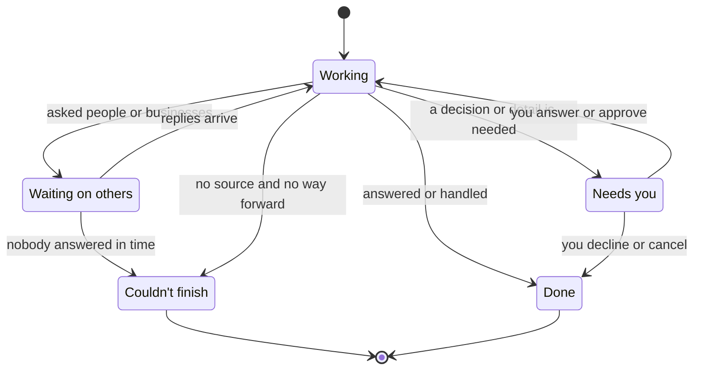
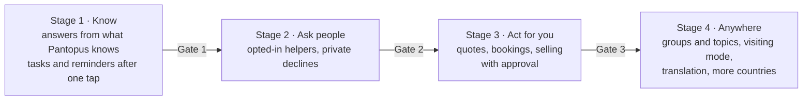

# Pantopus Agent: Product Design Document

October 4, 2026 · Status: proposal for founder review (no application code in this change)

> Companion: the [system design](pantopus-agent-system-design-2026-10-04.md) says how to build it. The public summary is the [Pantopus Product Vision](https://claude.ai/artifact/LtGrXERq4acJPJHf8v1auC) page, which is private until it is shared.
>
> Integration notes come from a read-only survey of `master` at `906b89f5a`. Before any build, apply the [verification-first rules](../VERIFICATION_FIRST_2026-09-13.md). "Pantopus Agent" is a working name.

Say what you need, and Pantopus gets it done. AI does the legwork. Real, verified people help only where a person matters. Every request ends in an outcome, and Pantopus remembers it with your permission.

## Summary

**The idea.** Every product in this space makes people do the work: browse feeds, join groups, write listings, chase contractors and answer the same questions again. Pantopus Agent takes one sentence, a photo or a voice note, works through four layers in order, and returns an outcome.

**The four layers**

1. **What Pantopus already knows:** the home file, answers neighbors gave before, and official sources.
2. **People who agreed to help:** residents of a place, followers of a topic or members of a group, each asked for something small and specific.
3. **Businesses and crews:** quotes, bookings, and bundling with neighbors who need the same work.
4. **You decide:** anything involving money, a commitment or personal details waits for your yes.

**The decisions that make it work**

1. Every request ends in an outcome, never a feed.
2. Answers come from sources, and the agent says so when it doesn't know.
3. People are asked, never used: small requests, private declines, monthly limits.
4. Money, commitments, new contacts and personal details always wait for the person's yes.
5. The agent always says it is an agent, and a verified person stands behind it.
6. Every job has one named owner until it is closed.
7. Memory is visible, editable and kept only with permission.
8. No ads and no selling data, so the agent's only job is to finish the task.

**Timing.** Stage 1, answers from what Pantopus already knows, starts after the mobile pilot's first read, in the pilot area, on iOS and Android. Each later stage starts only when the one before it passes its gate. Nothing here changes the [mobile pilot build brief](../mobile-pilot-build-brief-2026-10-03.md).

**Needs founder approval:** the working name, Stage 1's scope and entry point, the autonomy defaults, memory retention and the Stage 1 languages. The full list is under [Open decisions](#open-decisions).

## The problem

| Area | What people do today | What it costs them |
|---|---|---|
| Groups and forums | Join dozens of groups, scroll, ask the question everyone asked last week | Time, noise, answers buried in old threads |
| Buying and selling | Write listings, answer "Is this available?", haggle, wait for no-shows | Hours per item, and scams |
| Services | Request quotes that get sold as leads, call pros who don't call back, chase | Spam calls, vague prices, no memory of who did good work |
| Household | One person remembers every date, warranty and follow-up | Mental load, and things that slip |
| Local information | Read county PDFs and scattered social posts | Finding out after it matters |
| Travel | Ask strangers online, often in another language | No way to know who to trust |
| Helping others | Ask in a group chat and hope | Awkwardness, and favors land on the same few people |

The work around the task is often bigger than the task itself. That is the part Pantopus Agent takes over.

## Why Pantopus, and why now

AI answers are no longer rare. In 2026:

- Meta's Forum app answers a question by pulling replies from many groups and gives admins an AI agent. Facebook's AI Mode answers from public posts.
- Reddit Answers is part of Reddit search.
- Google's "Ask for Me" calls local businesses for quotes, now including home repair.

None of them has what Pantopus is built on:

- **A verified person with a real home behind every account.** As synthetic posts and accounts spread, this becomes the scarce thing.
- **Live help from people who agreed to help,** instead of mining old posts.
- **Outcomes someone is accountable for:** a named owner, money held until the job is done, and a recorded result.
- **A memory of the home without an ad business.** The agent earns when something gets done, so it has no reason to keep anyone scrolling.

Pantopus already has much of the raw material: the home file and its reminders, place facts, an AI assistant with tools, Support Trains for coordinating people, payments, and the Crew Day and Pulse designs. The new work is the single box in front and the agent that connects the layers.

## Who it's for

| Person | What they want | What the agent does for them |
|---|---|---|
| The household coordinator, the first customer | To stop carrying every date and follow-up | Answers about the home, reminders that are right, tasks handed to the right person |
| A newcomer to a town | To learn fast without joining ten groups | Answers from local knowledge and residents, with sources |
| A helper neighbor | To help sometimes without being on call | Small, clear requests within limits they set, private declines, thanks |
| A seller | To clear out a garage without the hassle | A listing from a photo, questions answered, offers filtered, pickup arranged |
| A local pro or crew | Real jobs instead of paid leads | Clear scopes, bundled routes, confirmed bookings, payment on completion |
| A visitor or traveler | Trustworthy local answers in their language | Questions routed to verified residents, translated both ways |

## Principles

1. **Outcomes, not feeds.** A request is done when something happened: an answer, a task, a booking, a sale, a plan, or a clear "couldn't, and here's why."
2. **Sources or silence.** Every factual claim comes from a tool result with a source and a date. When nothing supports an answer, the agent says it doesn't know and offers a next step.
3. **People are asked, never used.** Nobody receives a request they didn't opt into. Requests are small and specific, declines are private, and monthly limits protect generous people.
4. **The person decides.** Money, commitments, contacting someone new and sharing personal details always wait for a yes.
5. **Agents disclose.** Every message the agent sends says it comes from an agent acting for a named person.
6. **One owner per job.** Each task or job names one owner and stays open until it is closed.
7. **Quiet by default.** The agent interrupts only when a decision is needed or a result arrives.
8. **Memory you can see.** Everything the agent remembers is listed, editable and deletable.
9. **Content is data, never instructions.** Mail, posts, web pages and messages can't tell the agent what to do.
10. **Fail loudly.** When the agent can't finish, it says so and hands the task back with what it learned.
11. **Reuse before building.** Extend the existing assistant, home file, Support Trains, payments and designs.

## The experience

### The box

- One box: "What do you need?" Type, speak or add a photo.
- Stage 1 puts it at the top of the Today tab on iOS and Android. The existing AI chat becomes the same agent, so there is one assistant, not two.
- Later entry points: sharing a photo, link or letter to Pantopus from another app, and replying to a Pantopus notification.

### What a request becomes

The agent sorts each request into one of eight kinds. The person never picks one.

| Kind | Example | Usual outcome | First stage |
|---|---|---|---|
| Know | "When's trash pickup this week?" | An answer with sources | 1 |
| Check | "Is this letter from the county real?" | Warning signs and the official way to verify, never a verdict | 1 |
| Remember | "Remind me to test for radon in January." | A dated home task with a reminder | 1 |
| Handle at home | "Ask Sam to put the bins out Monday." | A task assigned to a household member | 1 |
| Ask people | "Who fixes old wood windows around here?" | Answers from residents who opted in, combined and credited | 2 |
| Plan | "Porch coffee for the street on Saturday." | An invitation and a list of who's coming | 2 |
| Get it done | "The gutters need cleaning." | Quotes, a booking, maybe a Crew Day with neighbors | 3 |
| Sell or give | A photo of a stroller | A listing, buyer questions answered, a pickup arranged | 3 |

### A request's life

| Status | What the person sees | What happens next |
|---|---|---|
| Working | "On it," with what the agent is checking | Usually seconds; longer work continues in the background |
| Needs you | One question or one approval, never several at once | Nothing moves until the person answers |
| Waiting on others | Who was asked, and by when | A notification when there's a result |
| Done | The outcome, its sources, and anything created | A follow-up only if the person asked for one |
| Couldn't finish | What was tried, what's missing, and the best next step | The person decides |

### Outcomes

- **Answer:** short and plain, each claim marked with its source and date. Official sources, the person's own records and neighbors' answers look different.
- **Created item:** a task, reminder or plan, opened with one tap and editable.
- **Booking or sale (Stage 3):** the confirmed details, the money held, and how to change it.
- **Couldn't finish:** never a guess. "I couldn't find your pickup day. Your city hasn't confirmed one. Set it now?"

## The four layers

### Layer 1: What Pantopus already knows (Stage 1)

- **Sources:** the person's home file (tasks, pickup days, records and documents they chose to add), their saved places, place facts, official entries curated for the area, mail they ask about, and their Support Trains.
- **May:** answer, explain, compare dates, and propose a task or reminder for one tap.
- **May never:** state a fact without a source, read another household's private data, or go beyond what a source says on health, law or money.

### Layer 2: People who agreed to help (Stage 2)

- **Who can be asked:** only people who opted in, for the kinds of help they chose, in the places or topics they chose.
- **How:** the agent picks the fewest people likely to know, sends each a short request in the asker's words, and stops when it has enough.
- **May never:** reveal the asker's exact address, ask anyone past their limit, or show who declined.

### Layer 3: Businesses and crews (Stage 3)

- **Who:** verified local businesses and crews, starting with those the person's neighbors used.
- **How:** writes the scope, requests quotes, shows them side by side with what each includes, and suggests bundling with neighbors when a Crew Day exists.
- **May never:** book or pay without the person's yes, present an estimate as a quote, or favor a business because it paid.

### Layer 4: You decide (every stage)

- Every action involving money, a commitment, a new contact or personal details appears as one clear approval with the exact terms.
- Approvals expire, and the agent never re-asks in a way that pressures.

## Your rules

People write standing rules in their own words. The agent turns each into a structured rule, shows it back, and saves it only after the person confirms.

| Rule type | Example | Stage |
|---|---|---|
| Quiet hours | "Nothing between 9 pm and 8 am unless it's urgent." | 1 |
| Who handles what at home | "Sam handles the bins." | 1 |
| What neighbors may ask me | "Tools and packages, at most twice a month." | 2 |
| Spending limit | "Ask me before anything over $200." | 3 |
| Selling floor and terms | "No less than $80, pickups on weekends only, no holds." | 3 |
| Preferred pros | "Use Harbor Plumbing if they're available." | 3 |

Rules are listed in one place, each with an on-off switch and a history of what it did. Quiet hours use the app's existing notification settings, and "who handles what" is kept as a remembered preference. Rules with money in them start in Stage 3.

## How much the agent does on its own

| Action | Stage 1 | Stage 2 | Stage 3 and later |
|---|---|---|---|
| Answer from sources | On its own | On its own | On its own |
| Create a task or reminder in the person's own home | After one tap | After one tap | Within the person's rules |
| Assign a task to a household member | After one tap | After one tap | After one tap |
| Ask opted-in people | Not available | After one tap, showing who and what | Within the person's rules |
| Answer a buyer's question about a listing | Not available | Not available | Within the person's rules |
| Decline an offer below the floor | Not available | Not available | Within the person's rules |
| Book, buy or pay | Not available | Not available | Always after approval |
| Share an address, phone number or document | Never | After approval, once | After approval, once |
| Accept terms or sign anything | Never | Never | Never |

Everything the agent does is logged in the request. Anything it did on its own can be undone while undoing is still possible.

## Memory

- **What it remembers:** facts the person told it to remember, preferences learned from finished requests (the pro they used, the price they paid, the household member who handles the bins) and the outcomes of past requests.
- **What it doesn't:** voice audio after transcription, other people's private details, and sensitive categories such as health unless the person adds them on purpose.
- **Controls:** one list of what Pantopus remembers, each item with its source request, an edit and a delete. "Forget everything" works in one step.
- **Retention:** kept until the person deletes it or closes the account. The proposed default is under Open decisions.
- **Use:** memory serves only that person and their household, as roles allow. It is never used for ads or sold, and private data is not used to train shared models.

## People layer rules (Stage 2)

These follow the Street Organizer and Pulse designs, so asking works the same everywhere.

- Each person privately chooses what others may ask them for, where, and how often. The default is nothing.
- A request says what's needed, how long it takes and when it ends.
- The first useful answer or yes is enough. Everyone else is released with thanks.
- Declines are private and need no reason. Nobody sees a decline count.
- Answers are credited by first name and label. With the helper's consent, an answer can become a lasting answer in Known.
- Favors are never paid. Paid help is a booking.
- Visitors can ask residents of a place, labeled as visitors.

## Business layer rules (Stage 3)

- Pros receive confirmed requests with a written scope, never paid leads.
- Quotes show what's included and whether the price is confirmed or an estimate.
- When neighbors need the same work, the agent suggests a Crew Day, and each household approves its own price.
- Payment is held until the person confirms the work, through the existing payment system.
- No business can pay to be suggested first.
- Paying household bills stays out of every stage, as the checklist's "Not now" list decides.

## Selling (Stage 3)

- A photo becomes a draft listing with a suggested price and where that price came from.
- The seller approves the listing and sets their rules once.
- The agent answers buyer questions from the listing and the seller's rules, says it is an agent, and passes anything else to the seller.
- Offers below the floor are declined politely; the rest wait for the seller.
- Pickup is scheduled within the seller's windows, and payment is held until the handoff.

## Anywhere (Stage 4)

- Places, topics and groups, with "Catch me up" summarizing any of them since the last visit.
- Visiting mode: set a place and dates, then ask its residents and book its services as a visitor.
- Translation both ways in requests and chat.
- Other countries one at a time, where address verification, payments and privacy rules are in place.

## Trust, safety and privacy

**Rules**

- The agent acts only for its verified owner and only within that person's permissions.
- It treats mail, posts, listings, web pages and messages as information. Text inside them that tries to instruct the agent changes nothing.
- It never claims to be a person, never imitates someone's voice, and never asks anyone for passwords or codes.
- It never declares a message a scam or safe. It shows warning signs and the official way to check.
- For emergencies it says to call 911 and stops.
- For health, legal and financial questions it gives sourced facts and points to a professional or official source. It never diagnoses or advises.

**Sensitive cases**

| Situation | What the agent does |
|---|---|
| A letter says to pay a fine by gift card | Shows the warning signs and the official contact, and suggests not paying until it's checked |
| Someone asks about a neighbor's household | Answers only from public facts about the address, never about the people |
| A request mentions self-harm | Responds with care, gives the 988 Suicide and Crisis Lifeline, and stops other work |
| Someone tries to make the agent message many strangers | Stage 2 asks reach only opted-in helpers within their limits, and repeated attempts are reviewed |
| A mail item contains instructions to the agent | Ignores them and answers the person's actual question |
| The agent isn't sure a fact is current | Shows the date of the source and says it may have changed |

**Laws to confirm with counsel:** consent for automated texts and calls; Washington's My Health My Data Act if health details are stored; state privacy rights of access and deletion; marketplace sales-tax collection once selling starts.

## Stages, scope and gates

### Stage 1 scope

**In:**

- The box on the Today tab and the existing AI chat, as one agent, on iOS and Android.
- Know, Check, Remember and Handle-at-home requests.
- Answers from the home file, saved places, place facts, curated official entries for the pilot area, mail the person asks about, and their Support Trains.
- Proposed tasks and reminders that the person confirms with one tap.
- Quiet hours and "who handles what at home" preferences.
- The memory list, with edit and delete.
- Feedback on every answer: helpful, wrong, or report.

**Out:** contacting anyone outside the household, money, public posting, marketplace and open gigs (still behind launch flags), the web app, and languages beyond those chosen for Stage 1.

**Gate 1, to start Stage 2:**

- Pilot households ask questions every week without prompting.
- Most answers are marked helpful, and no serious wrong answer stands unfixed.
- Cost per household fits the plan.
- Enough people in one town opt in to help.

**Gate 2, to start Stage 3:** routed asks get useful answers fast enough, helpers stay willing within their limits, and declines cause no friction. Stage 3 also needs the prerequisites listed in the system design, such as asking a specific pro for a quote and the Crew Day software.

**Gate 3, to start Stage 4:** bookings and sales finish with disputes below an agreed rate, and no approval was ever bypassed.

Targets for each gate are set after the first month of Stage 1, from real numbers.

## Metrics

| Measure | What it shows | Stage |
|---|---|---|
| Requests per household per week, unprompted | Whether people rely on it | 1 |
| Share answered from sources | Whether layer 1 carries most of the load | 1 |
| Helpful rate and wrong-answer reports | Answer quality | 1 |
| Time to outcome | Speed | 1 |
| Tasks and reminders created and completed | Whether answers turn into action | 1 |
| Cost per household per month | Unit economics | 1 |
| Ask acceptance, declines and time to the first useful answer | Health of the people layer | 2 |
| Helper requests per month against their limits | Burnout risk | 2 |
| Bookings and sales completed, disputes and refunds | Trust in agent actions | 3 |
| Week-four and week-eight return, counted as handled requests | Retention | All |

**Never goals:** time in the app, messages sent, notification opens, or requests per person for their own sake.

## Business model and costs

- **Free at Stage 1,** because it is the reason households keep Pantopus.
- **A fee on completed outcomes** from Stage 3: a share of finished sales and bookings.
- **Pros pay per finished job,** never per lead.
- **A subscription for more agent help,** once Stages 2 and 3 prove useful.
- **Costs:** model usage per request, text messages from Stage 2, support time and review of reported answers. Cost per household is measured from the first request.

## Risks and mitigations

| Risk | Why it matters | Mitigation |
|---|---|---|
| Wrong answers | One wrong pickup day or tax date breaks trust | Answers only from sources, dates shown, "I don't know" allowed, reports reviewed |
| Instructions hidden in content | Someone could steer the agent through a letter or a post | Content treated as data, and attack cases tested before each stage |
| Cost per household | Model costs could outrun value | Small models for sorting, stored answers first, a budget per person |
| An empty people layer | Stage 2 needs willing helpers | Stage 2 starts only where Gate 1 shows enough opt-ins; layers 1 and 3 work without them |
| Agent mistakes with money | Real losses and liability | Approval on every payment, held funds, an action log, undo and legal review |
| Over-asking helpers | Generous people burn out | Private permissions, monthly limits and rotation |
| Creepiness | People fear an AI that knows their home | Visible memory, delete anything, no ads, no selling data |
| Giants copy the AI | Meta, Google and Reddit already ship AI answers | Compete on verified people, live help, accountable outcomes and the home file |

## How it fits the other designs

- **Mobile pilot:** unchanged. Stage 1 starts after the pilot's first read and uses what the pilot builds: the home file, reliable reminders and place facts.
- **Pulse ([PR 625](https://github.com/WangPantopus/skinny-pantopus/pull/625)):** shares Known, the store of lasting answers. When a question needs a public answer, the agent drafts a Pulse post for the person to approve.
- **[Street Organizer](street-organizer-design-2026-09-27.md):** its small asks are the agent's Stage 2, and Crew Day is part of Stage 3. Its promise that nobody has to chase anyone is the agent's job description.
- **[Porchlight](porchlight-product-design-2026-09-26.md):** separate. The agent doesn't run check-ins or watch over a person.
- **Launch flags:** the agent respects them. Marketplace and open-gig actions stay off while those features are hidden.

## Open decisions

| Decision | Recommendation |
|---|---|
| Working name | "Pantopus" in the app, with the box reading "What do you need?"; "Pantopus Agent" in docs and code |
| Stage 1 entry point | The top of the Today tab, plus the existing AI chat as the same agent |
| Stage 1 languages | English, plus Spanish if pilot households need it; the rest wait for Stage 4 |
| Autonomy defaults | As in the table above: nothing automatic involving money or other people in Stages 1 and 2 |
| Memory retention | Keep until deleted, with a yearly reminder to review |
| Official entries for the pilot area | Curated by Pantopus with sources and review dates, starting with pickup rules, burn bans, utilities and permits |
| Model provider | Keep the current provider behind one internal interface so it can change without touching features |
| When Stage 1 starts | After the pilot's first read, inside the pilot area first |
| New tables | Approve the four Stage 1 tables in the system design for after the pilot's first read; the checklist's "Not now" list otherwise defers new owner-scoped tables |
