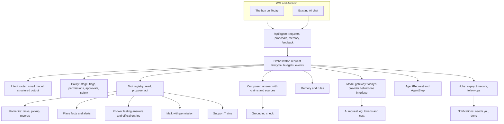

# Pantopus Agent: System Design

October 4, 2026 · Status: proposal for founder review (no application code in this change)

> Companion to the [product design](pantopus-agent-product-design-2026-10-04.md). This document covers the application and system design, not screens. Stage 1 is specified to build; Stages 2 to 4 are designed only as far as Stage 1 needs to stay compatible with them.
>
> Code facts come from a read-only survey of `master` at `906b89f5a` on October 4, 2026. Line numbers are anchors from that commit; if code has moved, find the same symbol before changing anything. Before any build, apply the [verification-first rules](../VERIFICATION_FIRST_2026-09-13.md).

## 1. Scope and constraints

**Covers:** the request lifecycle, the orchestrator, tools, data, approvals, memory, the model gateway, safety, evaluation, observability, the API, jobs, rollout and acceptance. Screens, layout and copy come later from a design pass built on the existing design system.

**Decisions already in force, which this design follows:**

- New builds are mobile only, on iOS and Android. Backend changes are additive and must not break the web (October 3).
- Launch flags hide marketplace, open gigs, public scheduling, the business directory, household extras, mail extras, Beacon and personas. Agent tools respect every flag.
- No generic saved-item, action or watch tables (September 16). Proposals live in the agent's step log, and every change executes through the domain table that already owns the data.
- The checklist's "Not now" list: paying bills by an assistant stays out of every stage, and new owner-scoped tables need the founder's explicit approval.
- Migrations follow the build brief's rules.
- The model provider today is OpenAI: the Responses API for chat and Whisper for transcription. The gateway keeps it swappable.

**Technical goals:** one agent behind the Today box and the existing AI chat; answers that cite sources and are checked against them; requests that survive disconnects and continue in the background; approvals bound to exact terms; visible memory; a full record of every step; cost budgets; and evaluation before every release.

**Not in Stage 1:** contacting anyone outside the household, money, the web app, vector search and any new outbound channel.

## 2. What already exists

The agent extends four areas of existing code. Each table says what exists, where it is, and what the agent does with it.

**The AI assistant** (paths relative to the repo root)

| What exists | Where | What the agent does with it |
|---|---|---|
| A multi-turn chat on the OpenAI Responses API, chained by `previous_response_id`, streaming over server-sent events, with up to 5 tool rounds and a 20-second total timeout | `backend/services/ai/agentService.js:144-437`, `:49-53` | The orchestrator reuses its stream handling and tool loop. It replaces the timeout with background continuation, enforces per-tool timeouts, and never drops the last round's tool outputs, which happens today when round 5 still asks for tools (`:210`, `:356`, `:394`) |
| `AIConversation`: one row per conversation with the provider's response id, title and counts, and no message rows | `supabase/migrations/20260908234526_application_baseline.sql:7436-7445` | Kept as the chat container. Requests and steps are stored in new tables, because today nothing can be shown, reviewed or evaluated afterward |
| `AIRequestLog`: endpoint, model, prompt version, status, latency, tokens, tool-call count, schema validity | `baseline.sql:7454-7470`, written by `agentService.js:63-87` | Extended with the request id and a cost estimate. Magic Task, briefings, local updates, property suggestions and transcription don't log today and should |
| Ten tools, all read-only or draft-only: user context, place alerts, one mail item, gig, listing and post drafts, mail summary, Support Train draft, list and summary | `backend/services/ai/tools.js:25-235`, executor `:263-478` | Kept. New read and propose tools are added in the same registry. The 5-second tool timeout (`:239`) is declared but never enforced, which the new registry fixes |
| Mail access guard: recipient or `can_view_mail` | `backend/services/ai/mailAccess.js:8-62` | Reused unchanged by the mail tools |
| Nine versioned prompts and strict JSON schemas with AJV re-validation | `backend/services/ai/prompts.js`, `schemas.js:237-274` | The router and composer get their own versioned prompts and strict schemas in the same files |
| Launch-flag filtering of chat tools | `agentService.js:30-47` | Generalized into the policy component, so every tool declares its flags and stage |
| Routes: chat, drafts, mail summary, place brief, conversations, transcription (Whisper, English only, 25 MB) | `backend/routes/ai.js`, transcription `:374-429` | Kept for compatibility. Voice input for the agent reuses transcription, with the language no longer fixed to English once other languages are approved |
| Rate limits: chat 20 per hour, drafts 30 per hour, kept in each server process's memory | `backend/middleware/rateLimiter.js:304-324` | The agent adds per-person daily budgets stored in the database, so limits hold across restarts and more than one server |
| Image upload for AI: up to 5 images, 10 MB each | `backend/routes/upload.js:1635`, `backend/services/s3Service.js:22` | Reused for photo input |
| Other model calls: Magic Task, briefing composer, local updates, Support Train drafts, property suggestions, seeder humanizer | `magicTaskService.js:334-387`, `context/briefingComposer.js:252-339`, `context/localUpdateProvider.js:122-168`, `supportTrainDraftService.js`, `propertySuggestionsService.js:62-103`, `pantopus-seeder/src/handlers/humanizer.py` | Unchanged. The briefing composer's output filter (no phone numbers, links or medical advice, `:252-276`) is a pattern the agent's safety checks follow |
| iOS: a pinned "Pantopus AI" row in the Inbox chat list opens the AI chat; messages live only on the device; draft cards open an empty composer | `ChatListViewModel.swift:47-62`, `InboxTabRoot.swift:146,345-360`, `ChatConversationViewModel.swift:67-177,860-925` | The same screen moves to the agent endpoints, so history comes from the server and draft content is no longer thrown away |
| Android: the same, through `AIChatRepository` and `AIConversationSession` | `data/ai/AIChatRepository.kt`, `RootTabScreen.kt:2007-2013` | The same move |
| Tests: tool shapes and schemas, the mail guard, one live Support Train evaluation; nothing tests the chat loop | `backend/tests/aiAgent.test.js`, `tests/unit/aiMailAccess.test.js`, `tests/ai/supportTrainDraft.eval.test.js` | The evaluation harness extends the live-evaluation pattern with the golden and attack sets |

**What the AI layer lacks today,** which the design adds: stored messages and tool calls; any tool that writes data, with confirmation and idempotency; server-side cancellation; enforced tool timeouts; per-person cost budgets; a kill switch other than removing the API key; any defense against instructions hidden in mail, images or posts (`docs/interview/ai-architecture-security-evidence-map.md:61` says the same); and tools for homes, tasks, the calendar and Known.

**The home file, place facts and reminders**

| What exists | Where | What the agent does with it |
|---|---|---|
| `HomeTask` with due date, status (`open`, `in_progress`, `done`, `canceled`), visibility and assignee, read through the permissioned `get_home_records` function, which returns `can_edit` and `can_complete` per row | `baseline.sql:11626`, latest function in `supabase/migrations/20260930153000_*.sql:182-235`, `backend/services/homeRecordService.js:40-101` | `list_home_tasks` calls the same function, so the agent sees exactly what the person may see. `propose_home_task` and `propose_task_assignment` execute through the same service the app uses |
| Recurring tasks with their own timezone and next due date | `supabase/migrations/20260910200000_*.sql:5-25`, `homeTaskRecurrenceService.js:43-75` | Read for "when is it next due"; created only through the existing service |
| Home records: maintenance log (with a link to the paid job that produced it), assets with warranty dates, issues, seasonal checklist, home systems with a ranked source and confidence | `baseline.sql:10870`, `:10386`, `:10765`, `:11556`, `:11603`; `homeSystemsService.js:83-172` | `list_home_records` returns these with their source. Home-system estimates are labelled as estimates, as the service already does |
| Pickup and civic dates: `AddressCalendarRule` with scope, rule, source, source URL and confidence (`official` or `unverified`); a household's own pickup day is stored at home scope | `baseline.sql:7538`, seeds `reference_baseline.sql:10-83`, `addressCalendarService.js:122-231` | `get_pickup_schedule` reads through the permissioned path and passes `confidence` through, so an unverified city default is always described as unconfirmed |
| Place intelligence sections, each with `source`, `as_of`, `coverage` and `status` | `placeIntelligenceService.js:902-1034`, `serializers/placeIntelligenceSerializer.js:45-186`, `placeSectionAdapters.js` | `get_place_facts` reads the same sections after the source fixes listed below |
| Hub Today: weather, air, alerts and ranked signals for the resolved location | `backend/routes/hub.js:652-664`, `context/providerOrchestrator.js:199-447`, `context/locationResolver.js:224-342` | The agent calls the orchestrator directly so it keeps each signal's provider, which the API drops today (`providerOrchestrator.js:360-368`) |
| Saved places | `baseline.sql:14061`, `backend/routes/savedPlaces.js:8-83` | Read for "my places"; the pilot's WP2 makes saved places drive Today |
| Notification preferences, including `quiet_hours_start_local` and `quiet_hours_end_local`, and the per-type toggles | `baseline.sql:14962-14985`, `notificationService.js:177-276` | The agent's quiet-hours rule writes these existing columns instead of a new rule. "Needs you" and "Done" pushes check them, because `createNotification` itself doesn't (`notificationService.js:321-401`) |
| Scheduled work: in-process cron and pg-boss jobs, plus seeder Lambdas for briefings and reminders | `backend/jobs/index.js:179-206`, `backend/jobs/pgBossJobs.js:39-61`, `pantopus-seeder/deploy/template.yaml:345-352` | Agent jobs run on pg-boss |
| Permission helpers: `getUserAccess`, `checkHomePermission`, and the SQL `home_effective_access`, `home_record_visible` and `home_task_readable` | `backend/utils/homePermissions.js:38-102`, `supabase/migrations/20260910001500_*.sql:20-117`, `20260910060000_*.sql:54-155` | Every agent tool calls these. `private_setup` homes get only task and calendar access, as today |
| Questions on posts: `ask_local` posts with an open or solved state, archived after 7 days, with no link to the answering comment and no search index | `baseline.sql:13491-13555`, `reference_baseline.sql:6470`, `backend/routes/posts.js:2318,3589` | Not reusable as lasting answers, which is why `KnownEntry` is new |

**Fix before Stage 1 cites a source.** The agent must never cite a source more confidently than the data deserves. The survey found:

1. **Labels that name the wrong provider.** Weather is labelled "National Weather Service" but comes from WeatherKit and then Open-Meteo (`context/weatherProvider.js:59-94`); alerts come from WeatherKit and then NOAA (`context/alertsProvider.js:20-52`). Labels must name the provider that actually answered.
2. **`as_of` means "when we fetched it" in most sections,** and seven sections have no date at all (`placeSectionAdapters.js`). The provenance contract below separates `published` from `fetched`; a fact without a published date says so.
3. **Dropped provider details:** NOAA alerts lose their URL and AirNow loses its observation time (`external/noaa.js:48-60`, `external/airNow.js:58-67`).
4. **Calendar truth:** 72 of the 74 seeded rules are unverified, and there are no holiday rows yet. The pilot's WP3 adds confirmed household days and holiday moves; until then the agent says "unconfirmed."
5. **No home timezone.** The calendar falls back to Los Angeles time (`addressCalendarService.js:40-41`). The agent uses the timezone the pilot's reminder work settles on.
6. **"Primary home" isn't deterministic** (`locationResolver.js:156,263-268`). The agent asks which home when a person has more than one and the request doesn't say.

**Kept out of agent tools in Stage 1:** emergency and medical details, pets' medical details, access codes and bills. Two findings go to their owning streams: `GET /api/homes/:id/emergencies` checks only membership, so any member can read allergies, medications and medical conditions (`backend/routes/home.js:3836-3850`); and Hub Today reads bills without the finance permission whenever the `household_extras` flag is on, which it isn't at launch (`context/internalContextCollector.js:68-83`).

**People, trust and channels** (used from Stage 2, except where noted)

| What exists | Where | What the agent does with it |
|---|---|---|
| Verified residency: `isVerifiedResident` requires a verified occupancy; `resolveTier` returns T4 for one | `backend/utils/homePermissions.js:432-443`, `backend/services/placeIntelligenceService.js:61-66` | Helper eligibility uses these. It doesn't use `computeTrustState`, whose fallback also counts provisional occupancies as "verified resident" (`backend/utils/trustState.js:23-263`, `backend/utils/homeMailAccess.js:40`) |
| Blocks in both directions, failing closed, with scoped profile blocks | `backend/services/blockService.js:14-67`, `baseline.sql:14830`, `:15146` | Every routing decision excludes blocked pairs |
| Connections and their permissions | `baseline.sql:13907-13927`, `backend/routes/relationships.js` | A routing signal later; never required to ask someone who opted in |
| Neighbor messages: verified sender, same small area, templates only, a weekly cap and dedupe, anonymised sender, silent drop when blocked | `backend/routes/neighborMessages.js:50-221`, `neighborMessageTemplates.js:19-57` | The pattern for bounded asks: templates, caps, dedupe and silent blocks. Its recipient choice, the first verified occupant with no opt-in (`:77-92`), is what Stage 2 replaces |
| Support Trains: slots with capacity, reservations, guests without accounts, reminders, private notes to organizers | `baseline.sql:14450-14669`, `backend/routes/supportTrains.js`, `backend/jobs/supportTrainReminders.js` | The claim-a-slot pattern serves "first yes claims it." The agent's Support Train tools already read trains |
| Chat rooms: direct, group up to 50, home, gig, support train | `baseline.sql:8944-8992`, `backend/routes/chats.js:893-1560` | The agent never opens a direct chat with someone on the asker's behalf. A direct chat needs no connection or verification today (`chats.js:893-936`), so asks use their own channel with opt-in and limits |
| Audiences, post origin, `ask_local` with open and solved states | `backend/routes/posts.js:117-1258,2318-2352` | When a question needs a public answer, the agent drafts a post for the person to publish |
| Reports and an admin queue; email alerts to admins | `baseline.sql:13636`, `:15223`, `backend/routes/adminReports.js`, `backend/services/adminAlerts.js:92-116` | Agent answers get a "report" path into the same queue |
| Audit logs: `HomeAuditLog`, `IdentityAuditLog`, `ResidencyClaimAccess`; `AdminAccessLog` exists but nothing writes it | `baseline.sql:10416`, `:11771`, `:13995`, `:7676` | Support access to a person's agent requests writes `AdminAccessLog`, which finally gets a writer |
| Email over SMTP | `backend/services/emailService.js:15-49` | A channel for helpers who prefer email |
| Push through APNs and FCM, gated by the global push setting and per-type toggles; quiet hours applied only by briefing routes | `backend/services/pushService.js:1-28`, `notificationService.js:177-392` | The agent's pushes apply quiet hours themselves |
| SMS: a stub that only logs; Twilio variables unused | `backend/services/smsService.js:22-25` | Texting helpers needs a real provider, consent records and STOP handling before Stage 2 uses text |

**What doesn't exist for Stage 2:** any record of who is willing to help with what, where or how often; routing beyond "first verified occupant"; per-helper limits; private declines (invites can't even be accepted or declined today, `supportTrains.js:3941-3942`); credit for answers; enforcement tools such as suspensions; and rate limits that survive more than one server, since all limits live in each process's memory (`backend/middleware/rateLimiter.js:39`).

**Jobs, payments and businesses** (used from Stage 3)

| What exists | Where | What the agent does with it |
|---|---|---|
| Stripe Connect Express with separate charges and transfers and manual capture; a 15% platform fee with per-business overrides | `backend/stripe/stripeService.js:1-24,231,695-712,927-947` | Bookings use the same flow. The agent never moves money itself; it prepares the payment step the person completes |
| Card authorization at acceptance with an idempotency key, capture only when the owner confirms completion, a 48-hour hold, then the payee's wallet | `backend/services/gigPaymentAcceptance.js:17-98`, `backend/routes/gigs.js:4535-4586,5874-5904`, `backend/jobs/processPendingTransfers.js`, `backend/services/walletService.js:240-310` | "Payment held until you confirm" is already how jobs work. Card holds lapse after about seven days (`stripeService.js:24`), so agent bookings further out authorize close to the date, as instant-accept tasks already do (`backend/routes/gigsV2.js:121-138`) |
| Refund requests with receipts, dispute handling that freezes the payment, tips with previewed terms | `supabase/migrations/20260922020300_*.sql`, `backend/stripe/stripeWebhooks.js:1054-1190`, `backend/routes/pays.js:910-1167` | Reused unchanged |
| Preview-then-commit bound to the exact terms and the session: stop requests, tips, the completion digest | `backend/routes/gigs.js:1039-1055`, `backend/routes/pays.js:1110-1167`, `backend/utils/requestSessionScope.js:6-26` | The agent's approval endpoint follows the same pattern: approval binds to a digest of the exact terms shown, and a changed proposal needs a new approval |
| Home task to job publication with a reviewed request, replay protection, a receipt and an audit row | `supabase/migrations/20260910220000_home_task_gig_publication.sql:46-124` | The model for "Handle this" handing a home task to a pro |
| Business profiles with service areas, verification and team permissions; reviews tied to jobs; homes can save vendors | `baseline.sql:8581,8730-8767,10505,14039-14051`, `backend/routes/businessVerification.js`, `backend/utils/businessPermissions.js:41-60` | Quote requests go to verified businesses whose service area covers the home, starting with vendors the household or street already used |
| Listings with offers that expire, a hold on acceptance, and a listing draft from photos with a price from at least three local comparables | `baseline.sql:8811,11969`, `backend/services/marketplace/listingOfferService.js:261-643`, `priceIntelligenceService.js:37-100`, `agentService.js:590-691` | The selling agent builds on these, with the seller's approval before anything goes live |
| Audit: `BusinessAuditLog`, `HomeAuditLog`, the wallet ledger; Stripe calls with idempotency keys | `baseline.sql:8415,10416,7213`; `stripeService.js:1116,1221,1404` | Agent money actions also write the agent's own step log, so one place shows what the agent proposed and what the person approved |

**Gaps Stage 3 must close first:**

1. **Asking a specific pro for a quote.** Quotes today are bids on open tasks, which are hidden at launch. `preferred_helper_id` is never read (`backend/routes/gigs.js:1223`), and catalog requests create a `BusinessBooking` with no notification or status route, in a table that exists only in the older migrations folder (`backend/database/migrations/159_business_bookings.sql`).
2. **Rebooking a known pro.** The rebookable list is read-only (`gigs.js:3189-3287`).
3. **Crew Day software.** No code exists for route bundling, one confirmed price per home on a shared day, or travel-aware availability. Its charge rule, charging 24 hours after the crew reports done unless there's a problem, differs from today's "capture when the owner confirms."
4. **Re-approving a changed price or scope** once a card hold exists (`gigs.js:6181-6197` refuses it).
5. **Selling.** Listings go live as soon as they're posted, with no draft step for approval (`backend/routes/listings.js:492`). Listing checkout places a card hold that no code ever captures (`backend/routes/pays.js:296-353`). The 15% fee contradicts "0% marketplace fee" copy.
6. **Crew checks.** Business verification has no insurance or registration evidence type (`supabase/migrations/20261001140000_*.sql:9-15`).
7. **One record of money actions.** There is no payment history table; payment operations log to output only (`backend/routes/paymentOps.js:22-30`).

Paying household bills stays out of every stage. It is on the checklist's "Not now" list.

## 3. Architecture



**Components**

| Component | Responsibility | New or extended |
|---|---|---|
| Agent routes | The request, action, rule, memory and feedback endpoints | New route file, beside the existing AI routes |
| Orchestrator | Runs one request from input to outcome, emits events, persists every step | New service, built from the existing chat loop |
| Intent router | Sorts a request into one of eight kinds and flags safety cases | New, small model with structured output |
| Policy | Decides allowed tools, approvals, budgets and safety handling; pure functions with no model calls | New |
| Tool registry | Each tool declares its schema, kind, stage, flags and permission check | Extends the existing tool list |
| Composer and grounding check | Produces the answer as claims with sources, then verifies every claim against tool results | New |
| Memory and preferences | Stores what the person asked Pantopus to remember. Quiet hours write the existing notification settings. Standing rules with money in them arrive in Stage 3 | New, plus existing settings |
| Model gateway | One interface for routing, composing, vision and transcription models, with timeouts, retries and cost accounting | Wraps the existing client configuration |
| Jobs | Approval expiry, request timeouts and follow-ups | Uses the existing scheduled-job setup |
| Notifications | "Needs you" and "Done" pushes that respect quiet hours | New templates on the existing service |

## 4. Data model

All new tables enable row-level security, are written only by the backend's service role, and follow the migration rules in the [build brief](../mobile-pilot-build-brief-2026-10-03.md#04-how-work-moves): a reserved migration number, `Backwards compatible: yes.`, a lock timeout, and revoked `EXECUTE` on any security-definer function. New tables need founder approval before the build.

**Stage 1: four new tables**

| Table | Purpose | Key columns |
|---|---|---|
| `AgentRequest` | One request from input to outcome | `id`, `user_id`, `conversation_id` (the existing `AIConversation`, nullable), `home_id`, `saved_place_id`, `input_text`, `input_kind` (`text`, `voice`, `image`), `language`, `kind` (the eight kinds), `status` (`working`, `needs_you`, `waiting`, `done`, `couldnt`, `cancelled`), `stage`, `outcome_type`, `outcome_summary`, `outcome_ref`, `sources` jsonb, `feedback` (`helpful`, `wrong`, `reported`), `cost_micros`, `created_at`, `updated_at`, `closed_at` |
| `AgentStep` | Every step of a request, including each proposal the person must approve. Proposals live here, not in a separate action table, following the September 16 decision against generic action tables | `id`, `request_id`, `seq`, `type` (`route`, `tool`, `compose`, `ground`, `proposal`, `notify`), `tool_name`, `label` (plain words shown to the person), `input_redacted` jsonb, `output_summary` jsonb, `status`, `latency_ms`, `model`, `tokens_in`, `tokens_out`, `error`. Proposals also carry `proposal_type`, `payload` jsonb, `terms_digest`, `proposal_status` (`proposed`, `approved`, `declined`, `expired`, `executed`, `failed`, `undone`), `approved_at`, `executed_at`, `undo_until`, `result_ref` and a unique `idempotency_key` |
| `AgentMemoryItem` | One remembered fact or preference, including "who handles what at home" | `id`, `user_id`, `home_id`, `subject`, `fact`, `structured` jsonb, `source_request_id`, `created_by` (`person`, `agent`), `confirmed`, `sensitive`, `expires_at`, `deleted_at` |
| `KnownEntry` | A lasting answer for a place, shared with the Pulse design. Stage 1 holds only curated official entries | `id`, `area` (city, county or place id), `topic`, `question`, `answer`, `sources` jsonb, `status` (`draft`, `published`, `stale`, `retired`), `last_confirmed_at`, `review_by`, `created_by`, a generated full-text column |

**Why new tables.** Nothing existing stores a request, its steps or its sources: `AIConversation` keeps only the provider's response id, and `AIRequestLog` keeps metadata. Memory has no home either, and `ask_local` posts can't serve as lasting answers (section 2). The checklist's "Not now" list includes new owner-scoped tables, so these four need the founder's approval and none is built before the pilot's first read. Quiet hours need no table: they use the existing `quiet_hours_start_local` and `quiet_hours_end_local` notification settings.

**Stages 2 to 4, design level**

| Table | Stage | Purpose |
|---|---|---|
| `HelperPermission` | 2 | What a person may be asked, where, how often and on which channels |
| `AskRequest` and `AskRecipient` | 2 | A routed question, each recipient's state (`asked`, `accepted`, `declined`, `answered`, `released`, `expired`), the answer, credit and Known consent |
| `AgentRule` | 3 | Standing rules with money in them: spending limits, selling floors and terms, preferred pros |
| `QuoteRequest` | 3 | A scope sent to a business, the quote, whether it is confirmed or an estimate, and its expiry |
| Group, topic and visit tables | 4 | Designed with Pulse's audience model when Stage 4 is scheduled |

Bookings, payments and listings reuse the existing job, payment and listing tables rather than adding parallel ones.

## 5. Request lifecycle and protocol

The states match the product design: `working`, `needs_you`, `waiting`, `done`, `couldnt`, plus `cancelled`. Only the orchestrator and jobs change a request's status, and each change writes an `AgentStep`.

**Server-sent events** on the request stream:

| Event | Payload |
|---|---|
| `request.created` | Request id, kind, status |
| `step` | A plain-language label such as "Checking your pickup schedule", with start or end |
| `answer.delta` | Streaming text for the answer |
| `answer.final` | The answer, its claims and sources, follow-up suggestions |
| `proposal` | The proposal step, its exact terms, its terms digest and whether it needs approval |
| `status` | A status change, for example to `needs_you` |
| `error` | A plain message and whether retrying could help |

A client that disconnects reads the request with `GET /api/agent/requests/:id`. Work that outlives the connection, or waits on someone, continues in a job and ends with a push notification.

## 6. Orchestration, Stage 1

1. **Receive.** Authenticate, apply the rate limit and the person's budget, validate input. Voice input goes through the existing transcription route first.
2. **Screen for safety.** Emergencies and self-harm take a fixed safe response with no tool loop: call 911, or the 988 Suicide and Crisis Lifeline.
3. **Route.** The router returns the kind, the home or place it concerns, the language and safety flags.
4. **Build context.** The person's homes and roles, the selected home or place, relevant rules and memory items, today's date and the household's time zone. Nothing from another household.
5. **Run tools.** The model calls only the tools policy allows for this kind and stage, with at most six tool calls, a timeout per tool and a token budget. Tool output is wrapped as data with its provenance.
6. **Compose.** The model returns structured output: the answer, a list of claims each tied to source ids, the sources, proposed actions and at most one follow-up question.
7. **Check grounding.** A deterministic check confirms that every claim cites a source returned by a tool in this request, and that every date, amount and name in a claim appears in its cited sources. A failed claim triggers one regeneration with the failures listed; anything still failing is removed, and the answer says what is unknown.
8. **Persist and emit.** Save the request, steps and actions; emit the final events.
9. **Act on approval.** A proposal executes only after the person approves it with `POST .../proposals/:stepId/approve`, carrying the proposal's terms digest. This is the preview-then-commit pattern tips and stop requests already use. It runs through the existing service that owns the data, with the proposal's idempotency key, and the result becomes the outcome.

## 7. Tools, Stage 1

Every tool checks permissions in code with the same helpers the app's own routes use. The prompt never decides access.

| Tool | Kind | Purpose |
|---|---|---|
| Existing context, alert, mail and Support Train tools | Read | Kept as they are, behind the same flags |
| `get_home_overview` | Read | The person's homes, their role in each, and what data each holds |
| `list_home_tasks` | Read | Tasks due, overdue or assigned, with dates and owners |
| `get_pickup_schedule` | Read | The next pickups, holiday moves, and whether each day is confirmed or a city default |
| `list_home_records` | Read | Systems, warranties and service history the household recorded |
| `get_place_facts` | Read | Place facts such as radon, hazards, water and civic districts, each with provider and date |
| `search_known` | Read | Published Known entries for the person's areas |
| `propose_home_task` | Propose | A task or reminder with a date and owner, created after one tap |
| `propose_task_assignment` | Propose | Assign an existing task to a household member, after one tap |
| `propose_preference` | Propose | Quiet hours, saved to the existing notification settings, or "who handles what at home," saved as a memory item, after confirmation |
| `propose_memory` | Propose | Something to remember, saved after confirmation |

Existing draft tools for posts, listings and open tasks keep their current behavior and launch-flag gates. Drafts never publish on their own.

## 8. Grounding and provenance contract

Every read tool returns facts as:

```json
{
  "facts": [
    {
      "id": "pickup-2026-10-06",
      "text": "Garbage and recycling pickup on Tuesday, October 6",
      "source": {
        "kind": "home_record | official | place_data | known | mail | memory",
        "label": "City of Camas collection schedule",
        "as_of": "2026-10-01",
        "confirmed": false,
        "url": null
      }
    }
  ]
}
```

The composer returns:

```json
{
  "answer": "Your next pickup is Tuesday. The city hasn't confirmed this schedule yet.",
  "claims": [{ "text": "Your next pickup is Tuesday", "source_ids": ["pickup-2026-10-06"] }],
  "proposed_actions": [],
  "follow_up": null
}
```

Rules:

- An unconfirmed fact is always described as unconfirmed, matching the pilot rule that unconfirmed dates never appear as confirmed.
- A source older than its freshness window carries its date and "may have changed."
- Answers about the person's own records say so: "From your records."

## 9. Policy and safety

- **Allowed tools** depend on the stage flag, the launch flags, the request kind and the person's role in the home.
- **Approvals:** every `propose` and `act` tool creates a proposal step. In Stage 1 all of them need a tap, and the approval binds to the terms digest the person saw.
- **Content as data:** mail, posts, listings and web text enter the model only inside a marked data envelope, and the system prompt says such text is never an instruction. Because every change needs the person's tap, injected text can't change data on its own. Attack cases run before each release.
- **Privacy:** tools return the minimum needed. Other household members' contact details stay out of model input unless the request is about them. Logs store redacted inputs.
- **Budgets:** a per-person daily request limit, a per-request token budget, and a global daily spending cap with a kill switch.
- **Abuse:** repeated injection attempts, probes for other households' data, and floods of requests are flagged for review.

## 10. Memory, rules and deletion

- Memory items reach the model only when relevant to the request, chosen by subject and recency, and sensitive items only when the request is about them.
- Rules are applied by policy code, not by the model. The model may propose a rule; only confirmation saves it.
- "Forget" deletes the memory item. "Forget everything" deletes all of the person's memory items.
- Account deletion removes requests, steps and memory within 30 days, except what the law requires keeping.
- Raw inputs follow the retention default the founder approves; the product design recommends keeping until deleted, with a yearly review reminder.
- Model provider settings for data retention and training use are confirmed before Stage 1, and private data is never sent for training.

## 11. Model gateway and cost

- One interface, `generate({ task, input, tools, schema, modelClass })`, with four model classes: `router` (small and fast), `composer`, `vision` and `transcription`.
- Each class maps to a model through environment variables, starting from the existing ones, so models change by configuration.
- Timeouts, one retry with backoff, and a clear failure event when the provider is down.
- Every call records tokens and an estimated cost from a price table in configuration, linked to its request.
- Budgets degrade gracefully: past a soft limit, answers come from Known and records without the composer model where possible; past the hard limit, the agent says to try later.

## 12. Evaluation

- **Golden set:** the questions from the founder's twenty interviews, then consented questions from pilot households, each with the sources a correct answer must use.
- **Automatic checks:** grounding pass rate, citation coverage, correct "I don't know", latency and cost per request.
- **Attack set:** instructions hidden in mail, requests for another household's data, scam letters, emergencies, self-harm, and questions about unconfirmed pickup days.
- **When it runs:** on every change to prompts, tools or models, and before raising the stage flag. Results are recorded in the pull request.
- **Human review:** every "wrong" or "report" within a day, and a weekly sample of answers.

## 13. Observability

- Every request is readable as its steps, for the person in plain words and for support with the person's consent.
- An admin summary reports requests per day, helpful rate, grounding failures, cost per household, latency and errors.
- Alerts fire on error spikes, cost spikes and grounding-failure spikes.

## 14. API, Stage 1

| Method and path | Purpose |
|---|---|
| `POST /api/agent/requests` | Start a request: text, transcribed voice or images, optional home or saved place, optional conversation id, the client's time zone. Responds with the event stream |
| `GET /api/agent/requests` | The person's requests, filterable by status |
| `GET /api/agent/requests/:id` | One request with its steps, outcome, sources and actions |
| `POST /api/agent/requests/:id/cancel` | Cancel a request that isn't finished |
| `POST /api/agent/requests/:id/proposals/:stepId/approve` | Approve a proposal; carries its terms digest; idempotent |
| `POST /api/agent/requests/:id/proposals/:stepId/decline` | Decline a proposal |
| `POST /api/agent/requests/:id/feedback` | Helpful, wrong or report, with an optional note |
| The existing notification-preference endpoints | Quiet hours. A rules endpoint arrives with `AgentRule` in Stage 3 |
| `GET /api/agent/memory`, `PATCH` and `DELETE /api/agent/memory/:id`, `DELETE /api/agent/memory` | What Pantopus remembers |
| `GET /api/admin/agent/summary` | The admin summary |
| Admin `GET`, `POST`, `PATCH /api/admin/known` | Curating official Known entries for the pilot area |

The existing AI chat route keeps working. The chat screen moves to the request endpoints with its conversation id, so both entry points share one agent.

## 15. Mobile integration (behavior, not UI)

- One agent client per platform: the request stream, models for requests, events, sources and actions, and a store the Today box and the chat screen share.
- Two new push categories, "Needs you" and "Done", that open the request. Both respect quiet hours and the person's notification settings.
- Stage 1 needs a connection; offline input shows a clear error rather than queueing.
- Screen layout, copy and accessibility come from a later Claude Design pass, built from the existing design system.

## 16. Jobs

| Job | Schedule | Does |
|---|---|---|
| Approval expiry | Hourly | Expires proposed actions past their window and tells the person once |
| Request timeout | Every 15 minutes | Moves stale `waiting` requests to `couldnt` with what was tried |
| Follow-ups | As scheduled | Runs "check back" requests the person asked for |
| Known review | Daily | Marks official entries past their review date as `stale` and lists them for the curator |
| Cost rollup | Daily | Totals cost per household and checks budgets |

## 17. Stages 2 to 4, design level

**Stage 2: the people router**

- **Eligibility:** the helper's permission covers the request kind and the place or topic; the helper is verified, not blocked, under their monthly limit, outside quiet hours and not the asker.
- **Ranking:** match to place or topic, past helpfulness, likelihood of answering, and rotation so the same people aren't always first.
- **Sending:** one to three people in sequence until there's a useful answer, by push, text or email. Text needs a real SMS provider; the current service only logs.
- **What the helper sees:** the question in the asker's approved words, the asker's first name and label, and a coarse distance. Never the exact address.
- **Closing:** the agent combines answers, credits helpers, asks consent before an answer becomes a Known entry, and releases everyone else with thanks.
- **Built once:** the same machinery serves the Street Organizer's small asks and Pulse's routed questions.

**Stage 3: businesses, bookings and selling**

- **Prerequisites:** the gaps listed at the end of section 2, starting with quote requests to a specific business, rebooking a known pro, the Crew Day software and the listing checkout that is never captured.
- Quote requests go to verified businesses whose service area covers the home, with a written scope. Each quote is marked confirmed or estimate, and expires.
- Bundling groups requests by street, service and time window into a Crew Day offer, and each household approves its own price.
- Booking and payment reuse the existing manual-capture flow. Bookings more than a few days out authorize close to the date, because card holds lapse after about seven days.
- Standing rules with money in them live in `AgentRule`. Policy code applies them; the model can only propose them.
- The selling agent builds on the listing-from-photo draft and its price comparables. Listings need a draft state the seller approves. Buyer questions are answered with disclosure, offers below the floor are declined, pickup is scheduled in the seller's windows, and payment is held until the handoff. It needs the marketplace flag on and sales-tax handling.
- Paying household bills stays out.

**Stage 4: anywhere**

- Groups and topics follow Pulse's audience and permission model.
- Visiting mode grants time-limited access to a place's public conversation and services.
- Translation keeps the original text and shows the translation, both ways.
- Each new country needs address verification, payments and privacy compliance before launch.

## 18. Rollout and acceptance

- **Flags:** a server-side `agent_stage` from 0 to 4, an allowlist for pilot households, a kill switch, and a flag per tool.
- **Stage 1 acceptance,** verified on the iOS simulator and the Android emulator against the real API and database:
  1. Asking for the next pickup returns the right day and says whether it is confirmed.
  2. Asking about radon cites the place fact and its date.
  3. "Remind me to test radon in January" proposes a task; one tap creates it, and its reminder arrives.
  4. "Ask Sam to put the bins out Monday" assigns the task to Sam after one tap, and Sam is notified.
  5. A letter asking for gift-card payment gets warning signs and the official contact, never a verdict.
  6. A mail item containing instructions to the agent doesn't change its behavior.
  7. A question about another household's private data is declined.
  8. An emergency gets the 911 response with no other work.
  9. Memory items can be viewed, edited and deleted, and "Forget everything" works.
  10. Feedback is recorded, and a "wrong" report reaches the review list.

## 19. Effort and order, Stage 1

Rough sizes for one agent lane with founder review:

| Work | Size |
|---|---|
| Tables, orchestrator, policy, tools and grounding check | 1.5 to 2 weeks |
| Evaluation and attack sets | 0.5 to 1 week |
| iOS and Android agent clients, in parallel | 1 to 1.5 weeks |
| Curating official Known entries for the pilot area | Founder or curator, ongoing |
| End-to-end verification and fixes | 0.5 week |

## 20. Open technical decisions

| Decision | Recommendation |
|---|---|
| New `/api/agent` routes or extend the existing AI routes | New routes beside the old ones, sharing the same services, so the chat route keeps working |
| Conversation state | Store our own requests and steps for audit, evaluation and memory, and keep the provider's conversation id only as an optimization |
| Search for Known | Postgres full-text search first; add vector search only if evaluation shows misses |
| Models per class | Chosen by evaluation on the golden set, set by configuration |
| Raw input retention | The founder's decision in the product design |
| New tables and the "Not now" list | Approve the four Stage 1 tables for after the pilot's first read; every other table waits for its stage |
