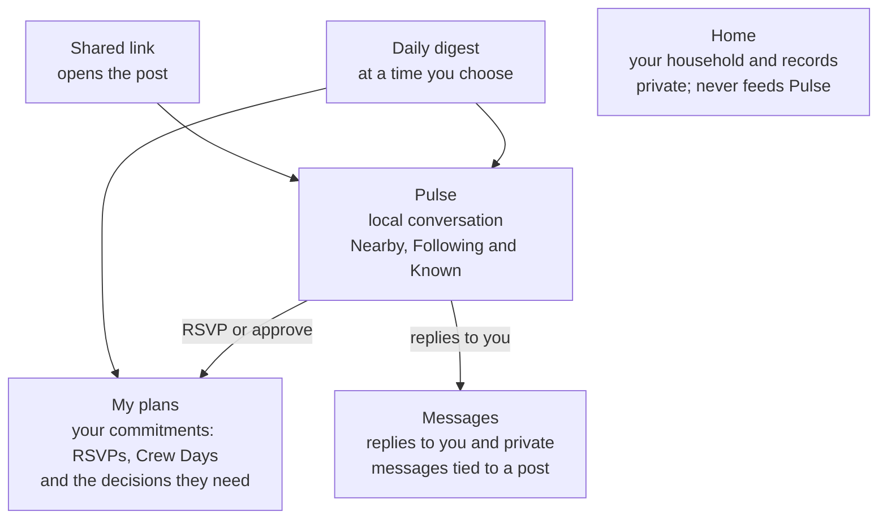
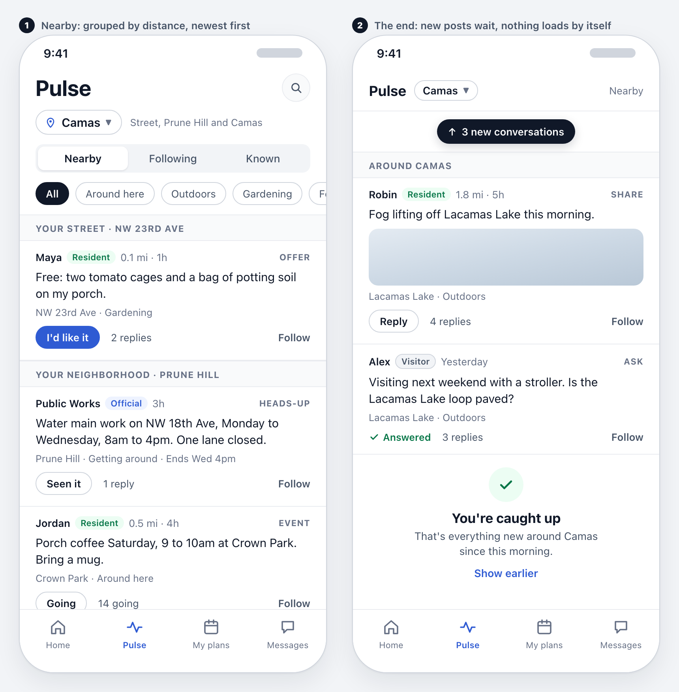
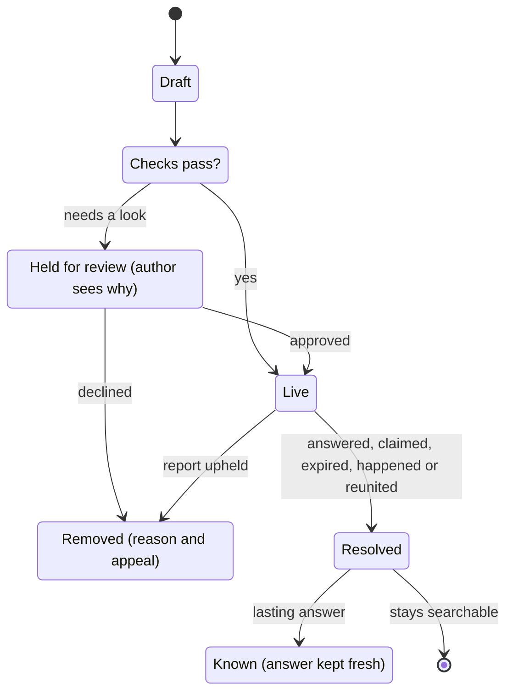
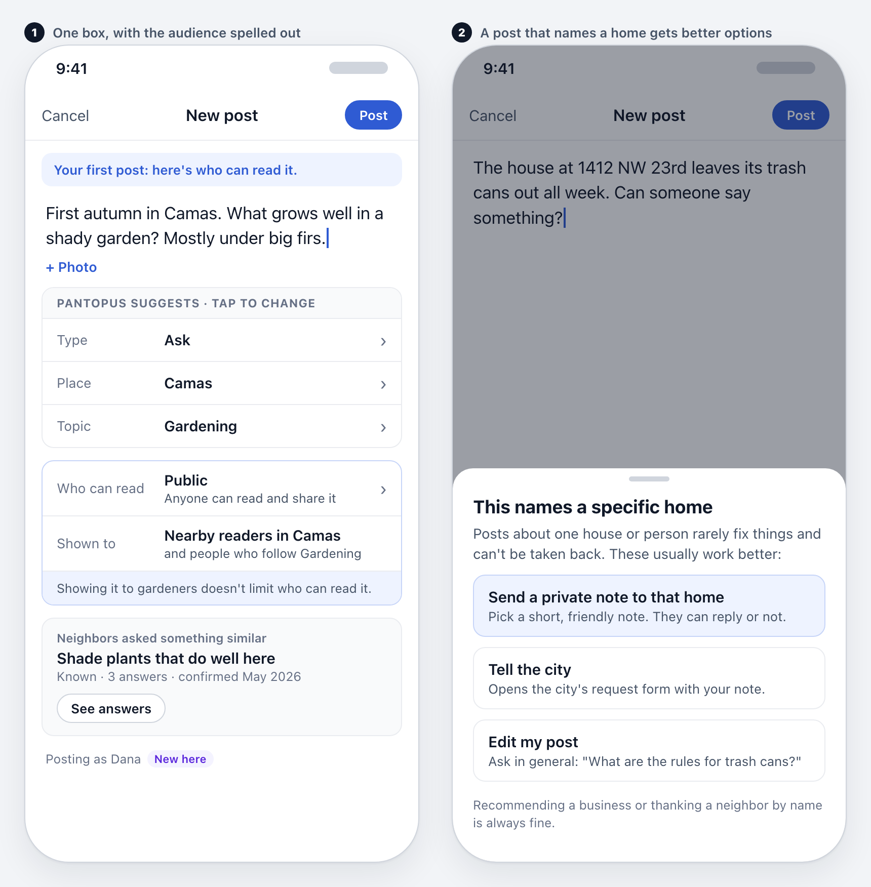
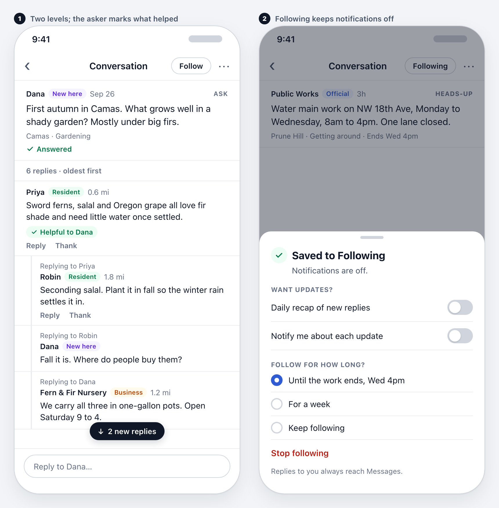
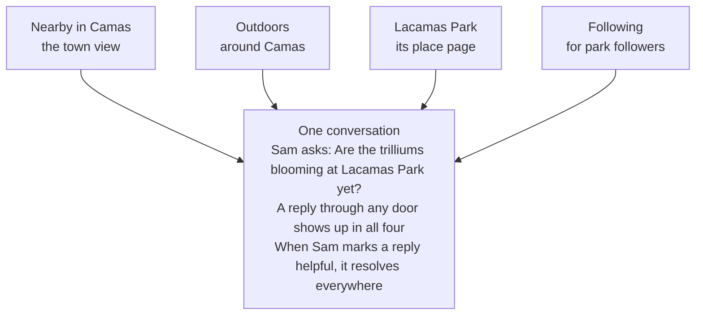
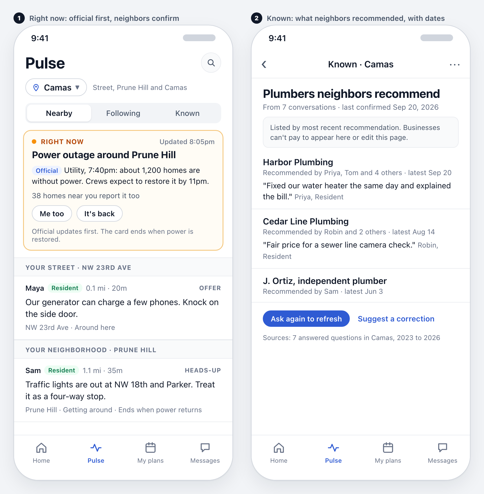
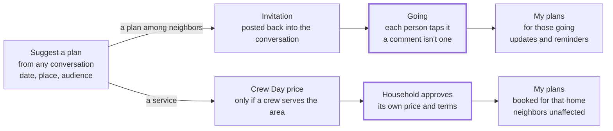
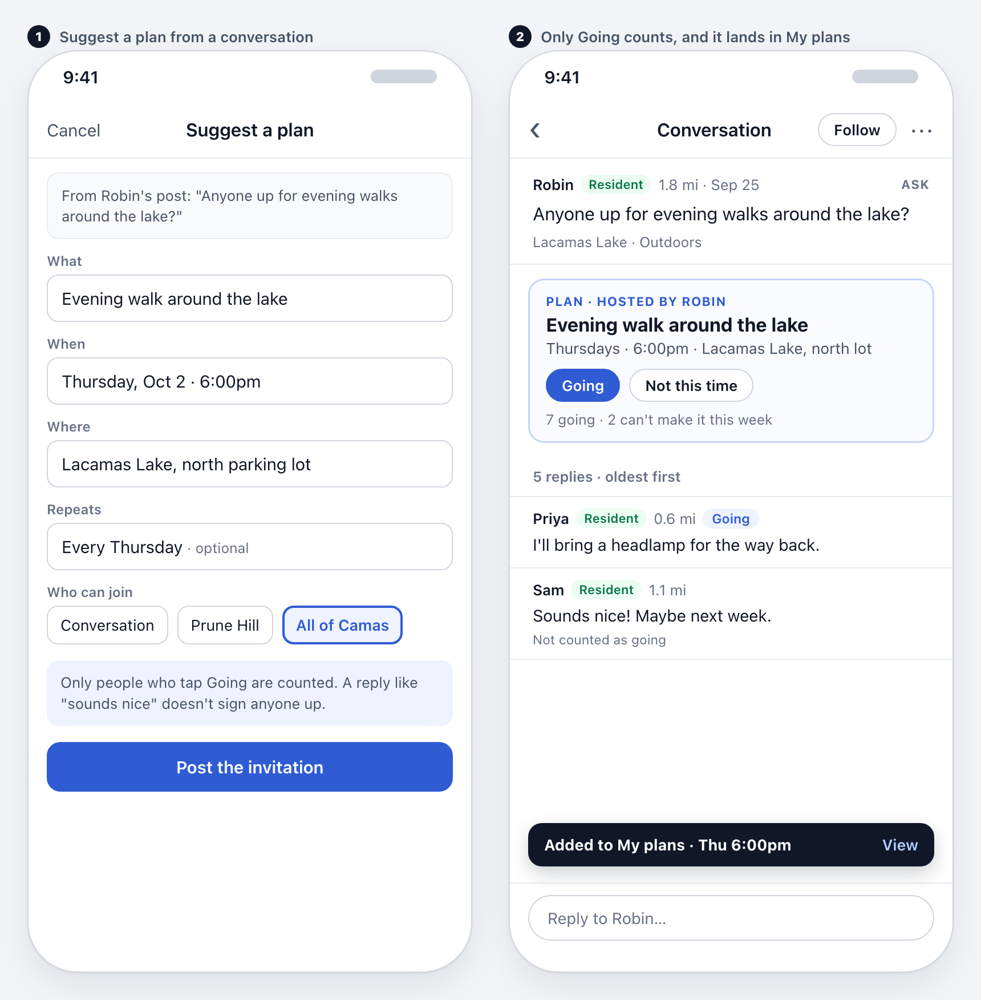
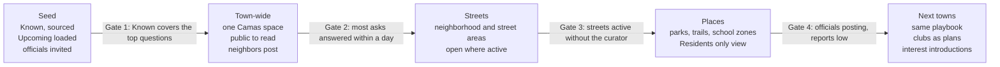

# Pulse: Product Design Document

September 27, 2026 · Status: proposal for founder review (no application code in this change)

> Live, editable version: [Pulse: Product Design Document](https://claude.ai/artifact/7dDakYgnAKNVuAjUS5wS4p). This file is a snapshot; diagrams are rendered as Mermaid, and the concept wireframes are in `pulse-screens/` (fictional people and posts; visual style not approved).
>
> Integration notes come from earlier product decisions (the launch list and the Street Organizer and Porchlight designs), not a code audit. Before any build, apply the [verification-first rules](../VERIFICATION_FIRST_2026-09-13.md).

## Summary

Pulse becomes one calm conversation space per town: place is the membership, topics are filters, and every post ends. Nobody joins groups, answers to volunteer admins or scrolls an endless feed, and every reply shows whether its writer lives there.

The promise, in a resident's words: "I can participate here without taking on another thing to manage."

**What people get**

- Conversation by distance (street, neighborhood, town), with a few fixed topics to filter by.
- Six kinds of post, recognized from what people write: Ask, Share, Offer, Heads-up, Event, Lost and found. Each has a way to end.
- Known: what the town already knows, refreshed whenever someone asks again.
- A deliberate path from talk to action: any conversation can become a plan, and a service conversation can lead to a Crew Day.

**The decisions that make it work**

1. Browsing, following and committing never imply one another.
2. Who can read a post is shown separately from who it is shown to.
3. Open to read, labeled to write, walled at the street.
4. Time order instead of engagement ranking, and a page that ends at "You're caught up."
5. No volunteer admins, and no invisible moderation.
6. Businesses reply under a label but cannot post.
7. Nothing anyone does in Pulse is used to target offers.

**Timing.** Pulse was cut from the launch list as a feed. It returns in this form after the Crew Day launch, town-wide first, with smaller areas switched on as activity supports them.

**Needs founder approval:** the navigation (Home, Pulse, My plans, Messages), returning place pages from the cut list, the labels and permissions, adult-only posting at launch, and paid moderation for the first town.

This design merges three proposals; the last section credits each one.

## The problem

People want to talk with the people around them, but the tools they use were built for strangers and growth, not neighbors. Local conversation lives in Reddit city forums, Facebook Groups, Nextdoor and group chats, and each wears people out in its own way.

| What wears people out | Where it shows up | What it costs people |
| --- | --- | --- |
| Joining groups to read | Facebook Groups | Dozens of memberships, admission questions, and a different rulebook and admin for each |
| The same question in five places | Facebook Groups, Nextdoor | Answers scattered across copies; nobody knows which thread is current |
| Ranking that rewards fights | Feeds ranked by comments and reactions | The angriest thread rises and useful questions sink |
| Feeds with no end | All of them | No natural stopping point; people leave feeling worse |
| Joining means notifications | Facebook Groups | A passing interest becomes a subscription |
| Strangers in local fights | Reddit, public groups | No way to tell who actually lives in town |
| Call-outs and shaming | Neighborhood feeds and groups | Posts about a neighbor's yard, car or "suspicious" visitors |
| The same questions every week | All of them | "Who's a good plumber?" asked again; old answers buried |
| Volunteer admins | Facebook Groups, Reddit | Inconsistent rules, power struggles, burnout |
| Moderation nobody sees | Reddit, Facebook | Posts silently held or removed; people wonder if anyone saw them |
| Business promotion | Neighborhood feeds and groups | Ads and self-promotion crowd out neighbors |

What people still want is simple: ask something and get a useful answer from someone nearby, share something they enjoyed, hear what's happening before it affects them, and meet the people around them without joining a club.

## Why Pantopus can do better

Pantopus knows where each person lives, and that one fact fixes problems other products can only moderate. A verified home makes place the membership, shows whether each writer lives here, and keeps street conversation among actual neighbors.

- **Place is the membership.** Verifying a home already places a person in their street, neighborhood and town. There is nothing to join.
- **Every reply shows where its writer stands.** "Resident" versus "Visitor" answers the question city forums and public groups cannot: does this person live here?
- **Walls where they matter.** Street and neighborhood posts reach verified neighbors only; town conversation can be public.
- **A path to action.** Plans, Support Trains and Crew Day turn talk into things that happen.
- **A business model that doesn't need attention.** Services and plans pay for Pantopus, so time in the app is not the goal and the page is allowed to end.
- **A private household beside a public town.** Home records, bills and Porchlight never touch Pulse, so people can trust one app with both.

Nextdoor also verifies addresses, but it keeps a ranked feed, advertising and groups of its own. Pantopus uses verification to remove those things rather than to add reach.

## Who it's for

Pulse is built first for residents who want a quick, trustworthy answer or a small connection, and it must stay pleasant for the many who only read. Each person below should find something useful in their first minute.

| Person | What they want | What Pulse gives them |
| --- | --- | --- |
| Newcomer | Learn the place fast and meet a few people | Known answers, a "New here" label, Upcoming events, welcomes from the street |
| Helper, the neighbor who knows things | Help without being on call | Questions in topics they chose, one quiet nudge when a question sits unanswered, private thanks |
| Parent | School news, safety, activities | School-zone place pages, Heads-ups, Events |
| Hobbyist: gardener, walker, cook | Talk about what they love, locally | Topic filters, Share posts, Suggest a plan |
| Quiet reader | Know what's going on without posting | The daily digest and a page that ends; no pressure to engage |
| Visitor or nearby resident | Ask about a park, report a trail condition | Public town pages and dated observations on place pages |
| Official: city, utility, school district | Reach residents with trusted updates | Attributed posts, the Right now card, Known entries |
| Local business | Be recommended and answer questions | A labeled reply identity and one labeled offers spot, but no posting |

Helpers are the scarce resource. Pulse works when a few dozen people in each town answer freely without burning out, so every design choice protects their time.

## Principles

Eight rules decide every screen; when a feature conflicts with one, the feature changes.

1. **Place is the membership; topics are filters.** Nobody joins anything to read or reply.
2. **Browsing, following and committing never imply one another.** A comment is not an RSVP, a follow is not a notification, and interest is not a booking.
3. **Every post resolves.** Questions get answered, offers get claimed, heads-ups expire and events happen. Lasting answers move to Known.
4. **Calm by default.** Time order, no engagement ranking, no public scores, and a page that ends.
5. **Open to read, labeled to write, walled at the street.** Anyone can read public town conversation, every writer's relationship to the place is shown, and street and neighborhood conversation stays among verified neighbors.
6. **Nobody to obey.** No volunteer admins or group rules: one set of rules, shown when it applies and enforced by paid staff.
7. **Nothing invisible.** A held or removed post tells its author why, and every post can answer "Why am I seeing this?"
8. **Never manufacture activity.** No invented neighbors, no false urgency, no "someone posted near you."

## Where Pulse lives

Pulse is one of four places in the app, and for most people the daily digest is how they arrive. Each place answers one question, so nobody wonders where something went.

Conversation happens in Pulse. Something moves to My plans only when a person RSVPs or approves it, and household data never flows into Pulse.

- **Home** answers "what about my home?" It holds the household and its records, and stays private.
- **Pulse** answers "what's going on around me?" with three views: Nearby, Following and Known.
- **My plans** answers "what have I committed to?", including any decision a plan needs from you.
- **Messages** answers "who is talking to me?" It is separate from Mail, which holds physical mail.
- **The daily digest** arrives by email or push at the time each person picks. It carries what's new nearby, the home's own items (pickup days, alerts) and what their plans need. A weekly street digest sums up the street's week.

These four places are a proposal for the app's navigation. Mapping them onto the existing screens needs design approval; this document changes no screens.

## The first visit

The first visit shows real local conversation before asking for anything. People sign up only when they want to post or reply, and verify their home only when they want to reach their street.

| How they arrive | What they see first | What they can do without an account |
| --- | --- | --- |
| A shared link to a public post | That conversation and its replies | Read, open the place page, browse the town |
| A shared link to a neighbors-only post | A plain card: "Only verified neighbors can read this" | Nothing from the post; sign in or verify |
| Opening Pantopus directly | "Pick a town to look around," then that town's Pulse | Browse any town without claiming to live there |
| A Crew Day or digest email | Their own item first, then their town's Pulse | Read public town conversation |

**Signing up at the moment of posting**

1. They write a reply or a post.
2. Pantopus asks for an email address or phone number and sends a code. No password, photo, interests or tour of groups.
3. Their draft survives sign-up and posts right after, labeled with where they stand: Visitor, Nearby or New here.
4. To post in their street or neighborhood, they verify their home with the postcard code. Until then they can post at town level as "New here," with a daily limit.

Every topic is on at first. After a few days of use, one line appears: "Seeing too much? Mute what you don't care about." There is no questionnaire, and restricted spaces such as a building's residents still require verified access.

## The Pulse page

The Pulse page shows what's new since the last visit, grouped by distance and in time order, and then it ends. Nothing reorders while someone reads, and nothing rises because people argued about it.

*Concept wireframes with fictional people and posts. They show behavior, not visual design; build work reuses the existing Pantopus screens and components.*

From top to bottom:

1. **Area picker.** "Camas" holds the distance dial: my street, my neighborhood, the town, or another place. Early on a town is one space; smaller areas appear only where they would show a few new conversations a week.
2. **Views.** Nearby, Following and Known.
3. **Topic chips.** All, Around here, Outdoors, Gardening, Food, More. Tapping one filters the page; it joins nothing.
4. **Right now card,** only while an outage, smoke, a closure or a storm affects many homes.
5. **Posts grouped by distance:** the street, the neighborhood, then the town, newest first within each. Each post shows its writer's label, distance, place, topic and one action.
6. **New conversations** wait behind a pill at the top instead of moving the page.
7. **The end:** "You're caught up," with a quiet "Show earlier" link. Nothing loads by itself.

Rules for the page:

- Relevance comes only from choices a person can see: area, topics, follows and time. Replies, reactions and time spent never move a post up.
- Quiet days say so ("Quiet on NW 23rd today") and point to Known or Upcoming instead. Nothing is invented to fill space.
- A post leaves Nearby when it resolves or ages out, and stays searchable afterward.

## Posts and how they end

Every post is one of six types, recognized from what the person writes, and each type has its own way of ending. That keeps Pulse from filling up with stale threads.

**A post card, top to bottom**

1. Name, label, distance and time: "Maya · Resident · 0.1 mi · 1h."
2. The words, photo or invitation.
3. Place and topic: "NW 23rd Ave · Gardening."
4. The type's one action, the reply count and Follow. Everything else sits in the "…" menu.

| Type | Example | Its one action | How it ends |
| --- | --- | --- | --- |
| Ask | "What grows well in shade here?" | Answer | The asker marks a reply Helpful; unmarked Asks close after 7 days |
| Share | A photo of fog on the lake | Reply | Leaves Nearby after 3 days; stays on its topic and place |
| Offer | "Free: tomato cages on my porch" | I'd like it | The first claim wins, and later claimants are told it's gone |
| Heads-up | "Water main work Monday to Wednesday" | Seen it | Expires at the time it names |
| Event | "Porch coffee Saturday at 9" | Going | Happens, then shows who came; it can become a plan |
| Lost and found | "Found: gray cat near Forest Home Rd" | It's mine, or Seen it | Marked reunited, or closes after 14 days |

The 3-, 7- and 14-day windows are proposed defaults to tune in the first town. Before an Ask closes, the asker gets one reminder to mark what helped.

A post that fails a check is held and its author is told why. A resolved Ask with a lasting answer becomes a Known entry.

## Writing a post

Posting starts with a person's own words in one box: "Ask, share, or make a plan…". Pantopus suggests the rest, and the person confirms it at a glance.

**What Pantopus fills in, each editable with one tap**

| Choice | Example | How it's set |
| --- | --- | --- |
| Type | Ask | Read from the words; nobody picks a type to start |
| Place | Camas | The place the post is about |
| Topic | Gardening | Suggested; changing it is easier than rewriting the post |
| Who can read | Public: anyone can read and share it | Town topics default to public; street and neighborhood posts default to verified neighbors |
| Shown to | Nearby readers in Camas, and people who follow Gardening | Where Pulse will place it; never a limit on who can read |

Who can read and who it's shown to are different promises, and the composer always shows both. "Shown to gardeners near Camas" must never suggest that others can't see a public post. A person's first post opens a short audience review; after that the choices appear as one line to confirm.

**Checks before posting.** They help people post well; none is a punishment.

- **Existing answers first.** "Neighbors asked something similar" links the Known entry; posting anyway takes one tap.
- **Call-outs.** A post that names a home or accuses a person offers a private note, the city's request form, or an edit. Recommending a business or thanking a neighbor by name is fine.
- **Private details.** Photos lose their location data. A visible house number, license plate or phone number prompts a blur or an edit.
- **Tone.** A heated draft gets one suggestion. Ordinary disagreement posts as written.
- **National politics.** Pulse has no topic for it, and the composer says so.

Drafts survive sign-up, switching apps and moving around a conversation.

## Conversations

A conversation is the original post and its replies in a stable order, two levels deep, so people can follow a back-and-forth without a maze. The question and the people carry the page, not scores.

- **Two levels.** Replies to the post, and replies to those replies marked "Replying to Robin." Deeper exchanges stay in that branch without more indentation.
- **Stable order.** Oldest first. New replies wait behind "2 new replies" instead of appearing where someone is reading.
- **Long branches collapse** with a label, such as "6 more replies between Sam and Robin."
- **Helpful, not verified.** The asker can mark replies "Helpful to Dana." That resolves the Ask without claiming the answer is true.
- **Private thanks.** "Thank" sends the helper a private note. There are no public likes, votes, or counts attached to people.
- **Offers.** "I'd like it" claims the item; the first claim wins, and later claimants are told it's gone.
- **Heated exchanges slow down.** When an exchange between two people turns heated, their replies to each other drop to one an hour in that conversation. Everyone else carries on.
- **Businesses reply under their label,** and only where someone asked about their kind of service.
- **Drafts stay put** when someone scrolls or opens another branch.
- **Report and mute** sit in each reply's "…" menu, out of the way until needed.

## Topics and places

Topics and places are ways into the same conversations, never separate groups. One post has one conversation, reachable through its area, its topic, its place page and people's Following view.

A reply through any door lands in the same conversation, so a question is never split across copies.

**Topics**

- A fixed list of 12 broad topics, a few shown at a time: Around here, Outdoors, Gardening, Home and repairs, Food, Kids and schools, Pets, Arts and culture, Sports and fitness, Getting around, Local government, Volunteering.
- Nobody creates topics. Topics have no owners, member counts, admission questions or rules of their own.
- Specific interests come from search, such as "dahlias," not from new topics.
- Choosing a topic filters the page. It creates no membership and no notifications.

**Places**

- Place pages cover real, bounded places: a park, a trail, a lake, a library, a school attendance zone, an HOA, a council district, an apartment building.
- A place page shows conversations about the place, Upcoming events there, sourced facts such as hours and rules, official updates under their names, and dated visitor observations.
- Following a place is optional and grants no access or authority. Nobody owns a place page.
- Restricted places, such as an apartment building or an HOA, show conversation only to verified homes inside them.
- Place pages are on the launch cut list, so bringing them back with Pulse needs founder approval.

## Following, notifications and the digest

Following keeps something within reach, and notifications interrupt; they are separate switches. One tap on Follow says "Saved to Following. Notifications are off."

| Control | What it means | Default |
| --- | --- | --- |
| Follow a conversation | Keep it in the Following view | Off until tapped |
| Follow a place or topic | Its future posts appear in Following | Off until tapped |
| Follow for a while | Ends when the conversation resolves, or after a week | Offered on every follow |
| Notifications | Interrupt me under conditions I choose | Off, except replies to you |

The conversation wireframes above show the Follow sheet.

**The noise budget**

- **Always instant:** replies to you, a claim on your offer, and a decision a plan needs from you.
- **Your choice:** the daily digest at a time you pick, the weekly street digest, and alerts on things you follow.
- **Never:** "someone posted near you," trending alerts, unread counts meant to pull people back, or re-engagement nudges.
- **At most one push a day** for anything not directly about you.

**The daily digest** lists what's new by distance, the home's own items and what your plans need, and ends the way the page does. People who never open the app still get the value by email or push.

**Precise controls.** Every post's "…" menu offers:

- Why am I seeing this?
- Follow this conversation
- See more of this topic
- Mute this topic in this area
- Mute this person
- Report a problem

"Why am I seeing this?" cites only the reader's own choices, such as "You're viewing Camas, all topics, newest first." One preferences page lists every follow, mute and alert, each with an undo. After a few days of use, one line offers: "Seeing too much? Mute what you don't care about."

## Known, Upcoming and Right now

Known is the town's memory: short, sourced answers to the questions people keep asking, refreshed each time someone asks again. Upcoming lists what's happening soon, and Right now covers live conditions that affect many homes.

**Known**

- Entries answer recurring questions: trash and recycling days, plumbers neighbors recommend, where to cut keys, library museum passes, burn ban rules.
- Each entry shows its sources (the conversations it came from and any official links) and a "last confirmed" date.
- Asking a question Known already covers shows the entry first. If the person asks anyway, the new answers refresh the entry.
- Recommendations list who recommended whom and when, newest first. There are no star ratings, and businesses cannot pay to appear or edit an entry.
- Pantopus drafts entries from resolved Asks and official sources, and staff approve them. Any resident can suggest a correction or flag an entry as outdated, which asks the town again.

**Upcoming**

- Events posted in Pulse, official events and plans open to the area, in date order.
- "Going" is one tap and is the only RSVP. Interest alone doesn't count anyone.
- Any event can become a plan with a host, updates and a list of who's going.

**Right now**

- Appears at the top of Pulse only while something affects many homes: a power or water outage, wildfire smoke, a road closure, severe weather, a boil-water notice.
- Official information comes first, with its source and time. Neighbors add "Me too" or "It's back," never free-form posts inside the card.
- It can start from neighbors' reports when several nearby homes report the same outage, labeled "Reported by neighbors" until an official source confirms it.
- It ends when the official source clears it or reports stop.
- It is never used for crime or "suspicious person" alerts.

## From conversation to plan

Any conversation can become a plan, but only through a deliberate step, and nobody is enrolled by commenting. This is where Pulse meets the rest of Pantopus: plans, Support Trains and Crew Day.

Commitment happens only at the highlighted steps: a person taps Going, or a household approves its own price.

- A plan has a host, a time, a place, an audience (the conversation, the neighborhood, the town or invited people) and a list of who's going.
- "Sounds nice" in a reply doesn't make anyone an attendee. Only Going does, and it adds the plan to that person's My plans.
- Recurring plans, like a Thursday walk or a book club, are how small clubs exist without groups. They have a host, a schedule and a list of who's in, and they pause when the host stops.
- The Crew Day option appears only when a participant chooses "Suggest a plan" and a crew serves the area. Pantopus never inserts a promotion into a conversation.
- Each household approves its own price and terms, and no booking depends on neighbors joining.
- The original conversation keeps a link to the plan and gets a closing line when it happens.

## Identity and provenance

Every post and reply shows the writer's relationship to the place, so readers can weigh it. Verification is by home address through the postcard code, and it gates only street and neighborhood conversation.

| Label | Who it is | How they get it |
| --- | --- | --- |
| Resident | Lives in the area, verified | The postcard code or another accepted proof for their home |
| New here | Says they live here; verification pending | Requested a postcard; limits apply until it's confirmed |
| Nearby | A verified resident of a neighboring town | Their own verified home in the region |
| Visitor | Signed in, with no home here | The default for everyone else |
| Official | A city, utility, school district or agency | Verified by Pantopus staff |
| Business | A local business replying | A verified business account; replies only |
| Pantopus | The labeled curator account | Staff |

What each label can do (the daily limits are proposed defaults):

| Can they… | No account | Visitor | Nearby | New here | Resident |
| --- | --- | --- | --- | --- | --- |
| Read public town posts | Yes | Yes | Yes | Yes | Yes |
| Reply at town level | No | Yes | Yes | Yes | Yes |
| Start a town post | No | Asks only, 1 a day | Yes | Yes, 2 a day | Yes |
| Add observations on place pages | No | Yes, dated | Yes | Yes | Yes |
| Read and post in a street or neighborhood | No | No | No | No | Their own areas |

**Names and details**

- Public town posts show a first name and label: "Dana · New here."
- Inside a neighborhood, readers also see the street and distance: "Maya · NW 23rd Ave · 0.1 mi."
- A house number appears only inside the street area, and anyone can hide theirs. Full names and photos are optional.
- Distances are rounded, and shown as "nearby" where few homes are close, so a reply can't pinpoint a house.
- One account per adult, linked to their home. Posting is for adults at launch, and a ban applies to the person, not the household.
- Local government and Getting around conversations offer a "Residents only" view that shows only verified residents' replies.
- After a move, areas switch with the verified home. Old areas fade out over a month with a goodbye line, and the person's posts stay.

## Privacy and audience

Audience is set by place, stated before posting, and never widened afterward. Each area has a clear wall, and the household stays entirely outside Pulse.

| Area | Who can read | What readers see about the writer | Sharing |
| --- | --- | --- | --- |
| Household | Its members | Everything the household shares with itself | Never appears in Pulse |
| Street | Verified homes on that street | First name, street and distance; house number if shown | No share button; links open only for verified neighbors |
| Neighborhood | Verified homes in the neighborhood | First name, street and distance | Same as the street |
| Town | Anyone, with or without an account | First name and label | Share links work |
| The web | Search engines and anyone | Public town posts only: first name and label, no street | Authors can remove a post from the web view |

**Rules**

- An author can narrow a post's audience or delete it at any time, but never widen it after posting.
- Photos lose their location data on upload. Screenshots can't be prevented, so the composer reminds people that street posts are for their neighbors.
- "Why am I seeing this?" never reveals what other people follow, read or mute.
- No contact uploads, no "people you may know" and no follower counts. People follow conversations, places and topics, never other people.
- Pulse uses the verified home and the area a person picks. It never tracks live location; even Right now reports are tied to the home.
- Nothing anyone writes, reads, follows or mutes in Pulse is sold or used to target offers or ads. Offers appear only in one labeled spot and never use Pulse, household, Crew Day or Porchlight data.
- Deleting an account deletes the person's posts and replies; conversations show "Reply removed" where they were.
- Requests from law enforcement require legal process, and Pantopus publishes a transparency report on them.

## Safety and moderation

Pulse prevents most harm in the composer, handles the rest with paid human moderators, and shows every action to the person it affects. There are no volunteer admins to appeal to or fear.

**The rules,** shown in context rather than as a wall:

1. Talk about places, services and issues, not about identifiable private people.
2. No call-outs of a home, car or person; use a private note or the city instead.
3. No personal attacks, slurs, threats or harassment.
4. No one else's private information.
5. No promotion, except a business replying under its label.
6. Local disagreement is welcome; national partisan politics has no topic here.
7. Emergencies go to 911 first.

**The moderation ladder** (the times and limits are proposed targets):

| Step | When | What the person sees |
| --- | --- | --- |
| Suggestion | The composer spots a likely problem | One line of advice; they can post as written unless rule 2 or 4 applies |
| Held for review | A likely rule break, a new account's link, or several reports | "Awaiting review, usually within 2 hours" on their own post |
| Removed | A moderator upholds a rule break | The rule, the reason and an appeal button |
| Slow mode | Repeated removals | One post and three replies a day for 30 days |
| Ban | Continued abuse or one severe act | A plain reason and a human appeal; it applies to the person, not the household |

**Guardrails against common harms**

- **Private notes to a home** use short templates ("Your car's lights are on"), one note per issue. The recipient can reply or block, and repeat senders are reviewed.
- **No crime-alert culture.** There is no crime topic and no "suspicious person" post. A heads-up about a crime needs a public source, such as a police notice, and cannot describe people by appearance.
- **Heated exchanges slow down** for the two people involved, not the whole conversation.
- **Crisis content.** A post suggesting self-harm is held, the writer sees crisis resources, and trained staff follow up. Threats go to law enforcement under the published policy, and child sexual abuse material is reported to NCMEC as US law requires.
- **Moderators are paid staff** trained on local context, with published response targets. Moderation cost per town is tracked as a core business number.
- **A quarterly public report** lists posts held, removed and restored on appeal.

## Businesses, officials and the curator

Businesses can answer questions and be recommended, but they cannot post into anyone's Pulse. Officials post under verified names, and Pantopus's own curator account is labeled and never pretends to be a neighbor.

**Businesses**

- A verified local business can reply where someone asked about its kind of service, labeled "Business."
- Businesses cannot start posts, follow or message people first, or edit Known.
- Known lists a business only when residents recommended it, and no business can pay to appear or rank there.
- Offers from locally verified businesses appear in one labeled "Local offers" spot, never in the conversation list. They are never targeted on what anyone said in Pulse.
- A resident recommending a business is welcome. A business owner posing as an ordinary resident to promote it breaks the rules.
- Crew Day providers are businesses too. Their page shows credentials and what nearby homes said.

**Officials**

- Cities, utilities, school districts and agencies post as "Official," verified by staff.
- They can post Heads-ups, Events and Right now updates, and reply in conversations.
- Their posts follow the same rules, and they cannot remove residents' replies to them.

**The curator**

- A labeled account ("Pantopus · Camas") seeds useful content: road closures, meeting agendas, event listings and Known entries from official sources.
- It never invents neighbors or conversation, never posts opinions, and always shows its sources.
- Its share of posts should fall as residents take over. It is a starter, not a voice.

## Edge cases

Most edge cases come from density: too few people makes Pulse empty, and too many makes it noisy. The rules stay the same everywhere; only the geography changes.

| Situation | What Pulse does |
| --- | --- |
| A quiet town at launch | One town-wide space, an honest "Quiet today," Known and Upcoming, the curator's sourced posts, and an invitation to start a conversation. No fake activity. |
| A dense city | The smallest area is a few blocks, the town level becomes the neighborhood, and topics matter more. |
| Rural roads | Areas are measured by drive time rather than miles, and distances show as "nearby" to avoid pinpointing homes. |
| Apartment buildings | The building is the street area. Unit numbers are never shown, and the building's Known page (laundry, packages, who to call) comes first. |
| Moving | Areas switch with the verified home. Old areas fade over a month with a goodbye line; the person's posts stay. |
| Two homes | One primary home for posting; a second verified home can be added for reading its areas. |
| Visitors | They browse any town, ask and reply as Visitor, and add dated observations on place pages. |
| An emergency | The Right now card leads with official information. Posts spreading unverified claims about causes or people are held for review. |
| A heated local issue | The Local government topic, a "Residents only" view, slowed exchanges, and official sources pinned in the conversation. |
| Duplicate questions | The composer shows existing answers first, and moderators can merge duplicates into one conversation. |
| A business owner who lives here | They post as a resident about neighborhood life and reply as the business about their services. |
| People under 18 | They have no Pulse accounts at launch; a household can revisit this later. |
| Lost pets | Lost and found with a photo and last-seen area; the street area sees it first, and it closes when the pet is home. |

## How Pulse fits the rest of Pantopus

Pulse is the conversation layer on top of the verified home: it feeds plans and Crew Day, and it never reads the household. Each connection has a direction and a limit.

| Product | How Pulse connects | The limit |
| --- | --- | --- |
| Street Organizer | Conversations become plans; plans and welcomes appear in Nearby and the weekly street digest | A plan's details stay on the plan; only its invitation is posted |
| Crew Day | A service conversation can lead to a Crew Day price when a participant asks | Never an inserted promotion; each household approves its own terms |
| Support Trains and favors | Offered from a conversation by people who know the family | Details and sign-ups stay private to the train |
| Porchlight | None | Check-ins and follow-ups never appear in Pulse or shape it |
| Home | The home's items (pickup days, alerts) ride in the daily digest beside Pulse | Records, bills and household details never enter Pulse |
| Mail | None | Mail holds physical mail; Messages holds people |
| Local offers and Earn | One labeled offers spot | Never targeted on Pulse, household, Crew Day or Porchlight data |
| Property research | Known can cite public facts, such as a school zone or flood zone | No valuations or ownership details in conversation |

**Changes to the launch list** (each needs founder approval):

- Pulse as a feed was cut. This design brings Pulse back in a new form after the Crew Day launch.
- Place pages were listed as not built. They return as part of Pulse.
- Person-to-person connections and following people stay cut: people follow conversations, places and topics.
- Personas and identity switching stay cut: one person, one label per area.
- Existing Pulse screens, components and styles are reused. Any visual change goes to design review first.

## Business model and metrics

Pulse earns nothing directly. It pays for itself by keeping homes connected to Pantopus between services and by turning conversations into plans and Crew Days, which is why it can afford to be calm.

**How Pulse creates value**

1. **Retention.** A reason to open Pantopus between services: answers, events and what's happening nearby.
2. **Acquisition.** Public town pages and shared links bring residents in, and the postcard code turns readers into verified homes.
3. **Conversion.** Conversations become plans and Crew Day bookings, the main revenue.
4. **Offers.** The one labeled local-offers spot carries sponsored rewards under the data guardrail.
5. **Trust.** A calm, verified local space is what people recommend to their neighbors.

**Costs to plan for:** paid moderation per town, curator time, AI checks in the composer, and hosting public town pages.

**What to measure.** Targets are set after the first month in the first town.

| Metric | What it tells us |
| --- | --- |
| Asks marked Helpful within 24 hours | Whether the core promise works |
| Median time to a first helpful reply | How fast neighbors help |
| Posts that resolve on time | Whether Pulse stays fresh |
| Readers who post or reply at least once a month | How broad participation is |
| Distinct helpers per town per week | The health of the scarcest resource |
| Plans and Crew Day bookings started from Pulse | The bridge to revenue |
| Visitors from shared links or town pages who verify a home | Acquisition |
| Mutes per topic and "Seeing too much?" taps | Noise |
| Reports per 1,000 posts, review time, appeals granted | Safety and fairness |
| Sessions that reach "You're caught up" | Calm |

**Never goals:** time in the app, daily opens, reply counts, posts per person and notification open rates.

## Rollout

Pulse returns after the Crew Day launch in one town, as one town-wide space, and grows finer only when real activity supports it. Each phase has a gate that must hold before the next begins.

The gates are judged on the metrics above and reviewed monthly; a phase pauses if its gate stops holding.

- **Seed.** Before opening, the curator loads Known from official sources and Upcoming from public calendars, and officials get verified accounts.
- **Town-wide.** Pulse opens in Camas as one public space. Homes verified on Crew Day streets post first, and the helper nudge is on.
- **Streets.** Neighborhood and street areas switch on where each would show a few new conversations a week without the curator.
- **Places.** Place pages and the Residents only view arrive once officials post regularly and reports stay low.
- **Next towns.** The playbook repeats town by town. Recurring-plan clubs and mutual-interest introductions follow later, as experiments.

## Acceptance test

The design works when a first-time user can do each task below without help or explanation. If a task needs explaining, the design changes, not the user.

1. Find a conversation about gardening nearby.
2. Reply without joining anything.
3. Explain who can read their post before publishing it.
4. Follow a conversation without turning on alerts.
5. Mute one topic in their town and keep the rest.
6. Turn a discussion into an invitation without signing anyone up automatically.
7. Find their trash pickup day in Known.
8. See an existing answer before asking the same question again.
9. Tell whether a reply came from a resident or a visitor.
10. Try to post about a specific house, and choose the private note instead.
11. Find out why a post appears in their Pulse.
12. Reach "You're caught up" and know nothing is hidden below it.

**How to run it.** Each round uses 8 to 10 people in the first town, on the real app with real local conversation, recording success and time per task. Any task that fewer than 8 in 10 people complete unaided counts as a design defect. Each task is checked through the real screen, API and stored data, not a mock.

## Risks, open questions and decisions

The biggest risk is an empty or unanswered Pulse; the second is the cost of moderating a public space well. Starting in one town and gating each phase manages both.

| Risk | What it would look like | Mitigation |
| --- | --- | --- |
| An empty town | Few posts; questions go unanswered | One town-wide space, seeded Known and Upcoming, the helper nudge, and a start where Crew Day homes already are |
| Moderation cost | Held posts wait hours; staff are overwhelmed | Prevention in the composer, slow mode, one town at a time, and cost per 1,000 posts tracked from day one |
| Outsiders in local fights | Out-of-town accounts dominate a debate | Labels, the Residents only view, and limits for visitors |
| Call-outs and profiling | "Suspicious person" posts, or posts shaming a neighbor | The composer redirect, no crime topic, and no descriptions of people by appearance |
| Too calm to be fun | People find it sterile and drift away | Share posts, photos, events and plans; participation measured alongside resolution |
| Hidden promotion | Businesses posing as residents | Businesses reply only under a label; reported promotion is reviewed |
| A street post leaks | Screenshots spread outside the street | No share button, walled links, and a reminder in the composer |
| Legal exposure | Claims of defamation or harassment | The call-out redirect, clear rules, fast takedown and appeal, and counsel review before launch |
| "Isn't this Nextdoor?" | People assume it's the same product | Lead with the differences: nothing to join, every post ends, no business posts, a page that ends, labels on every reply |

**Open questions**

- Should Visitors be able to start town posts, or only reply? The proposal is Asks only, one a day.
- How many moderators does the first town need, and are they in-house or contracted?
- Is the 12-topic list right for Camas?
- Should residents edit Known directly, or only suggest corrections as proposed?
- Where does Messages sit next to Mail in the existing navigation?
- Should public town pages be indexed by search engines from the first day?

**Decisions needed from the founder**

- [ ] Approve the navigation proposal: Home, Pulse, My plans, Messages.
- [ ] Bring place pages back from the cut list as part of Pulse.
- [ ] Approve the labels and what each label can do.
- [ ] Approve adult-only posting at launch.
- [ ] Fund paid moderation for the first town.
- [ ] Confirm that Pulse follows the Crew Day launch rather than joining it.

## Where these ideas came from

This design merges three proposals reviewed on September 27, 2026, taking from each the parts it did best.

| Source | What it contributed |
| --- | --- |
| Claude's first social design | Place as membership and topics as filters; post types that end; Known shown before asking; the Right now card; the unanswered-question nudge; mutual-interest introductions, later |
| "Five surfaces, one dial" (outside proposal) | The page that ends; the distance dial with defaults set by density; one composer that infers type, topic and area; answers rather than comments; private thanks; Known and Upcoming; no admins; the call-out redirect; businesses reply only; the labeled curator; slow mode, then bans; new-resident posting; rules for apartments and rural roads |
| "Pulse as one shared local conversation space" (outside proposal) | Browsing, following and committing kept separate; who can read versus who it's shown to; following separate from notifications; one post with many doors; room for personality; stable reading; precise mutes and "Why am I seeing this?"; visible moderation; conversation to plan; one town-wide space first; the usability tasks; the promise |
| Added in the merge | Open to read, labeled to write, walled at the street; the labels and the Residents only view; slowed heated exchanges; follows that end when a conversation resolves; no targeting on Pulse content; private messages only in context |

**Left out on purpose:** purpose rooms, a new "Today" front screen, per-topic volume settings, flat capped threads, and private clubs (replaced by recurring plans).

**Related designs:** [Porchlight](porchlight-product-design-2026-09-26.md) and [Street Organizer](street-organizer-design-2026-09-27.md).
