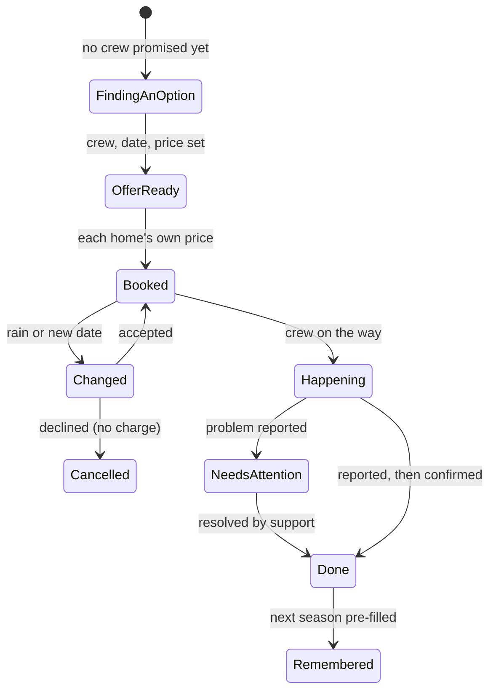
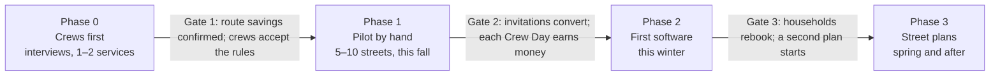
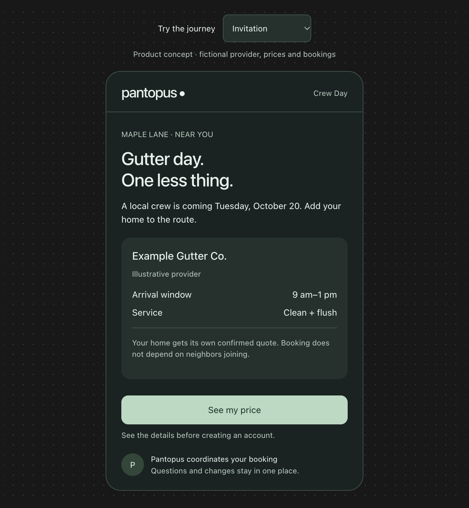
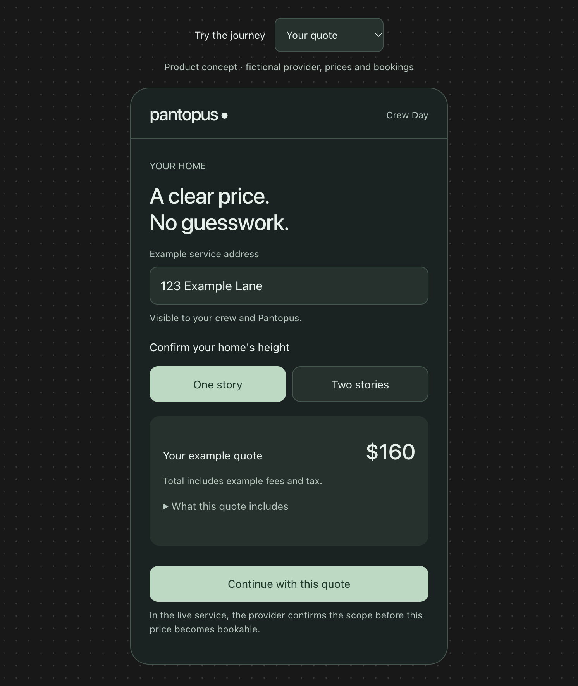
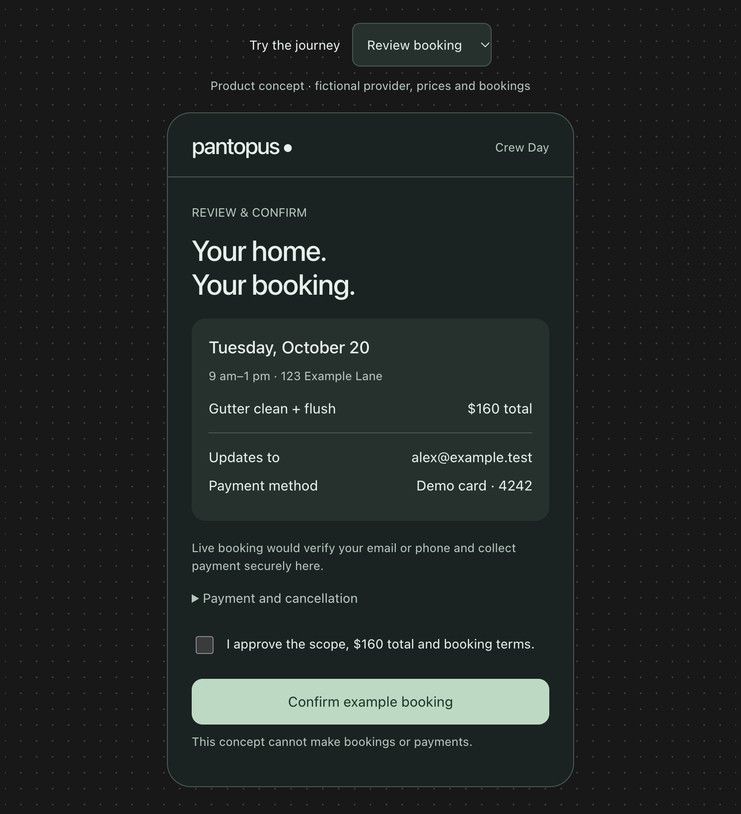
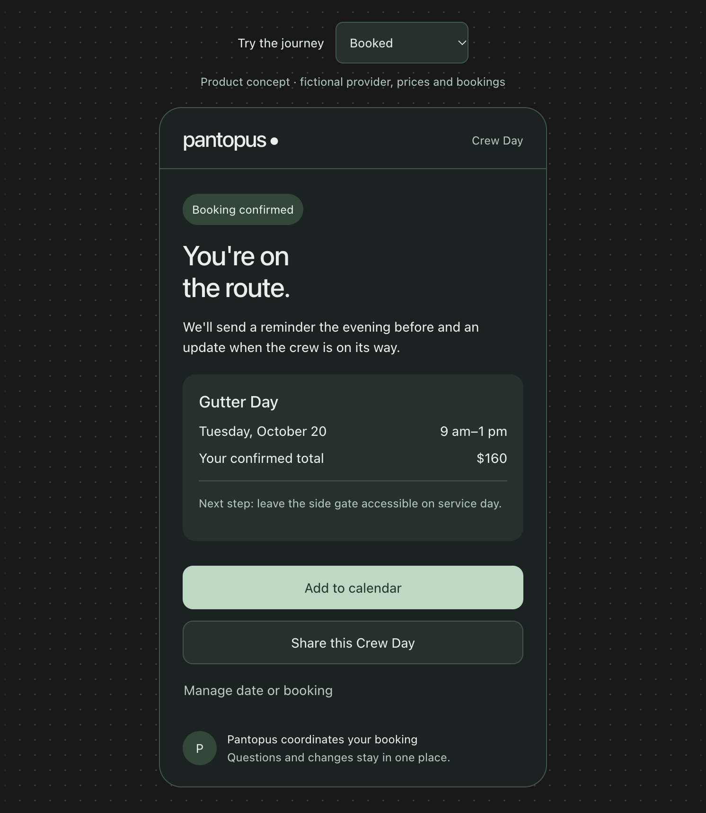
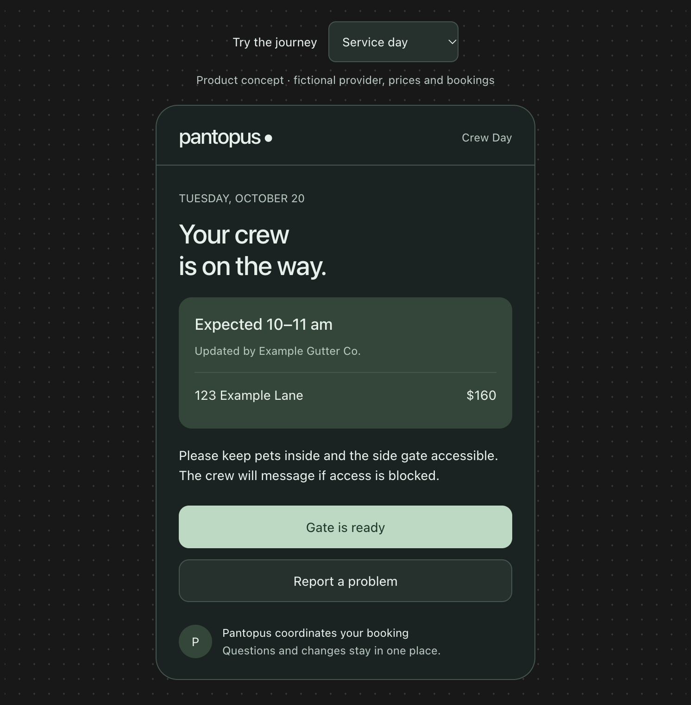
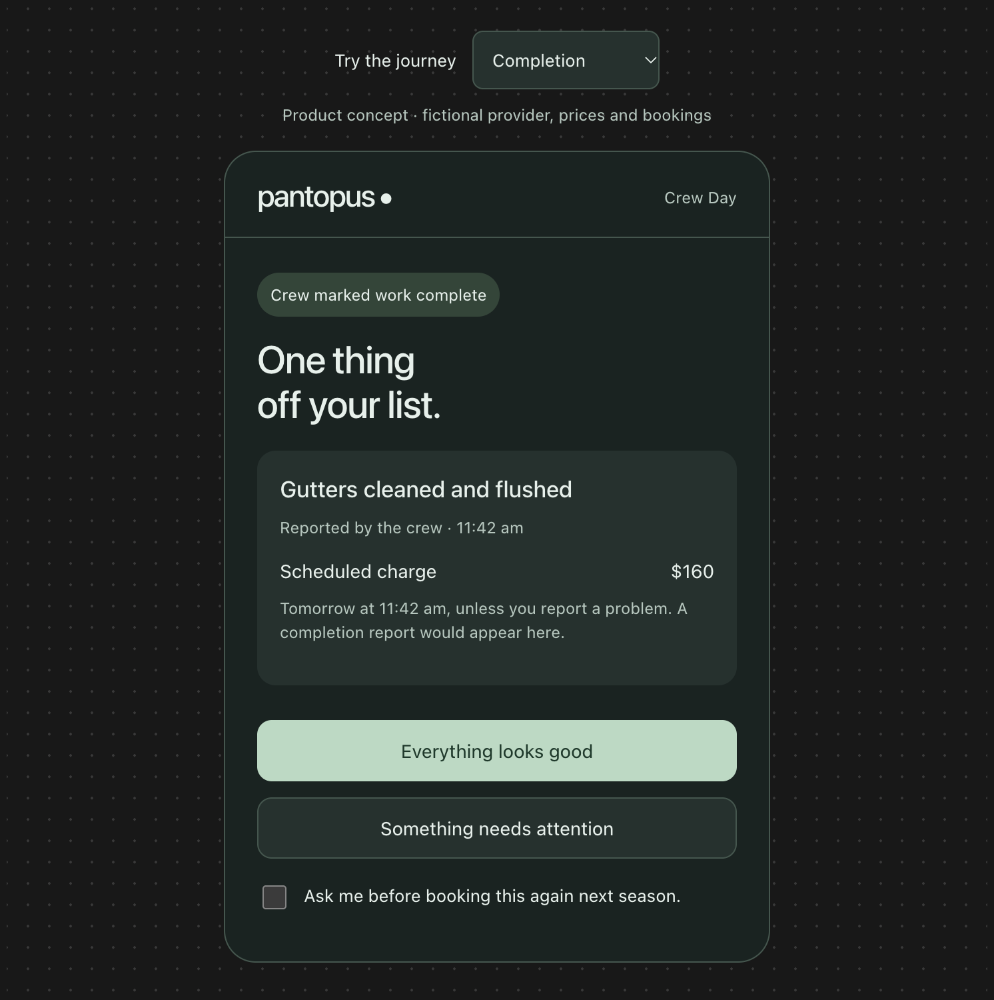
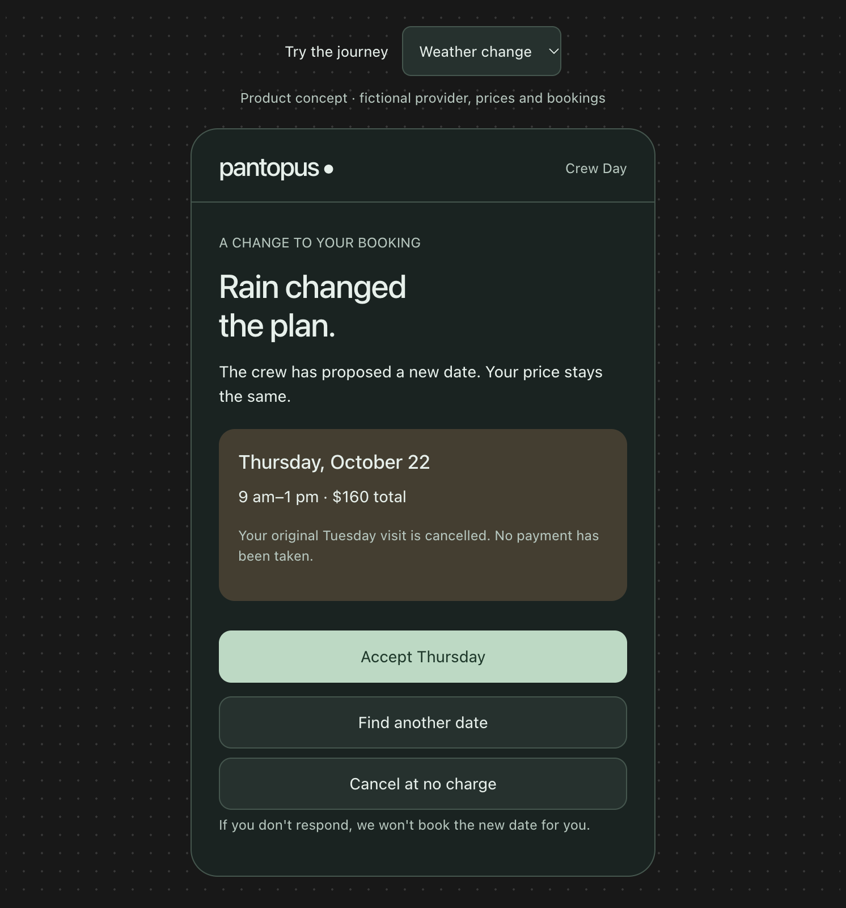
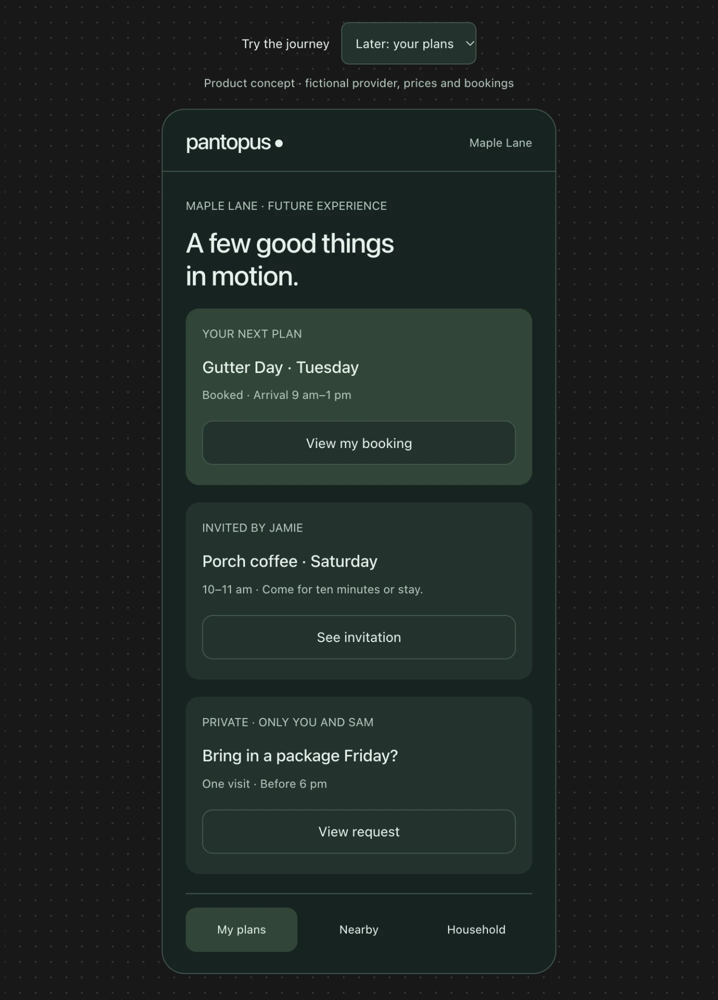

# Street Organizer: Product Design Document

September 27, 2026 · Status: proposal for founder review (no application code in this change)

> Live, editable version: [Street Organizer: Product Design Document](https://claude.ai/artifact/XE4jYYtqcyxzEUiqvSF4Ez). This file is a snapshot; diagrams are rendered as Mermaid, and the concept screens are in `street-organizer-screens/` (illustrative provider and prices; visual style not approved).
>
> Integration notes come from the README and handoff, not a code audit. Before any build, apply the [verification-first rules](../VERIFICATION_FIRST_2026-09-13.md).

Good things happen on your street, without you having to organize everything. Crew Day is the first proof. A local crew comes on a set date, and each home gets its own confirmed price. Pantopus does the coordinating that a neighbor used to do. This design combines three outside proposals with our own analysis, and it earns each next step with evidence.

## Why the street, and why Pantopus

The street is where people share a trash route, a storm drain and a view of each other's porches, yet almost no product is built around it. Neighbors are willing to help each other. What's missing is someone who does the organizing.

**The insight**

- Home products serve either one household (Zillow, Ring, Skylight) or the neighborhood as an audience (Nextdoor, Facebook groups, Citizen). The street, roughly 15 to 80 homes, is where shared services, favors, safety and belonging actually happen.
- The willingness exists. [76% of Americans would bring in a neighbor's mail, but only 26% know most of their neighbors](https://www.pewresearch.org/short-reads/2025/05/08/how-connected-do-americans-feel-to-their-neighbors/). People [underestimate how often others agree to a direct request by about 48%](https://ecommons.cornell.edu/items/2c50b460-fb5c-4490-9047-9bb02b9f6f25).
- The missing piece is organizing: finding a crew, asking neighbors, handling money, chasing replies and saying thanks. It's the tax nobody wants to pay.
- Government already treats this size as a unit. Washington's [Map Your Neighborhood](https://mil.wa.gov/emergency-management-division/preparedness/map-your-neighborhood) prepares 15 to 20 homes to rely on each other before responders arrive.

**Why Pantopus**

- **Verified addresses:** it knows who really lives on a street.
- **Mail:** it can reach every door by postcard, and a postcard code can verify a home in one scan.
- **Payments and local work:** gigs and Stripe Connect already move money to local pros.
- **Civic data:** it knows each address's governments and official channels.

**The competition**

| Company | What it does | What it means for us |
| --- | --- | --- |
| Thumbtack | [Bundles same-day bookings within a ZIP code](https://patch.com/massachusetts/boston/how-boston-residents-can-save-35-percent-gutter-cleaning), such as $50 off gutter cleaning, and [acquired StreetFair in April 2026](https://grepbeat.com/2026/04/28/charlottes-streetfair-announces-acquisition-by-thumbtack/) | Don't compete on supply or discounts alone. Crews can come from anywhere, including Thumbtack |
| [OneNeighbor](https://www.oneneighbor.com/faq) | Neighborhood group buying for lawn care and similar services; the price drops as more homes sign up; an HOA partner program | Group pricing is proven and taken. Our first version gives each home one confirmed price instead |
| Nextdoor | A neighborhood feed with news and alerts | We build no feed. Plans, not posts |

Our angle is to own the street as a lasting unit: its doors, its welcome, its calendar and its trusted people. We win on the quality of coordination and on what happens after the first job. The health test is a second street plan that isn't a Crew Day.

## Goals, non-goals and the proof we need

The goal is simple: living on a street with Pantopus is easier. Jobs get done properly, plans hold when something goes wrong, and a few neighbors become people you can count on.

**Goals**

1. A household can book a Crew Day from an invitation in about two minutes, without installing anything.
2. Whoever starts something never becomes responsible for chasing people, collecting money or handling complaints.
3. Every plan ends with a clear outcome: done, changed or cancelled. Nothing stays silently stuck.
4. A quiet household gets full value without joining any conversation.
5. Each Crew Day earns money after all costs.
6. Streets start a second, non-commercial plan without Pantopus prompting every step.

**Non-goals**

- A feed, a discussion board or crime reports.
- Running crews ourselves.
- Safety monitoring of people. That is Porchlight, a separate product.
- Ads, or selling data.
- Promising outcomes Pantopus doesn't control, such as a city's decision.

**Three proofs before expanding**

1. Households use Pantopus again when their next relevant need arises, judged on the service's natural schedule.
2. Crews want more Pantopus bookings on terms that work for them.
3. Residents start another plan without the founder prompting each step.

**Measures** (proposed targets, to confirm in the pilot)

| Measure | What it tells us | Target |
| --- | --- | --- |
| Completed bookings | The service happened as promised | Grows each season |
| Problems and time to resolve | Reliability | Each problem has an owner within 1 business day and is resolved within 3 |
| Organizer effort | Whether starting is really easy | Starters report under 5 minutes of work |
| Invitation-to-booking rate | Whether invitations are useful | Tracked separately for shares, postcards and welcome cards |
| Repeat participation | Whether households come back | Next season's rebooking rate |
| Second plan that isn't a Crew Day | Whether the street is coming alive | Within 60 days on at least a third of pilot streets |
| Crews asking for more | Whether supply is healthy | Most pilot crews want more routes |
| Contribution per Crew Day | Whether it's a business | Positive after crew payment, fees, acquisition, support, refunds and operator time |
| Daily app opens | Nothing useful | Not a success measure |

## Design principles

The moment to design for: something in your life got handled by your street without you organizing it. Every screen follows these rules.

1. **It asks nothing until it has something for you.** No empty screens. The street's first plan exists before you arrive.
2. **One useful thing is the whole onboarding.** Nobody needs to understand Pantopus to book a gutter cleaning.
3. **Browser, text and email work fully.** The app is offered only after it has proven useful. [Partiful already works this way for event guests](https://help.partiful.com/en-us/articles/15525328-do-my-guests-need-to-download-the-app).
4. **Pantopus does the awkward parts:** asking, declining, chasing, collecting money and saying thanks. You're never the organizer, the debt collector, the complaints department or the guilty non-responder.
5. **Status is always honest.** An estimate isn't a confirmed quote. "Invitation sent" isn't "covered." "Reported by the crew" isn't "confirmed by you." "Submitted" isn't "resolved."
6. **Nothing changes without your yes.** No silent rebooking, no added scope or price without approval, and no automatic repeat bookings unless you turn them on.
7. **A real person owns every unresolved problem.** Software prepares updates; it can't make an unreliable crew reliable.
8. **Quiet by default.** One weekly digest, instant messages only for plans you joined, and at most one notification a day. When nothing needs you, the app says "You're all set."
9. **A quiet household still gets full value.** Joining a plan never publishes your address or adds you to a group chat.
10. **It remembers, with permission:** the crew, the scope and price, the gate note, who lends the ladder. Next time is review, approve, confirm.
11. **Money is plain.** One total, when it's charged, and what happens if plans change, all on one screen.
12. **Street-sized and real.** Use the real street name, such as "Maple Lane," never "neighborhood" or "zone."
13. **Reuse before building.** Extend existing Pantopus features and its design system. The prototype's visual style is concept-only until approved.

## Who's involved

Every role has a narrow job, and the product removes the parts people dislike doing.

| Role | Example | What they do | What they never have to do | How they take part |
| --- | --- | --- | --- | --- |
| Resident | Alex at 123 Maple Lane | Books a plan, approves prices and confirms completion | Organize anyone, or explain a decline | Browser, text, email or app |
| Starter | Jamie, who asked for a Gutter Day | Taps "I'd like this on my street," picks acceptable dates and decides whether to share | Chase neighbors, collect money or handle complaints | Browser or app |
| Host | Jamie, hosting porch coffee | Agrees to host one specific event | Track RSVPs, send reminders or run signups | App or text |
| Helper | Priya, who lends tools | Chooses what neighbors may ask for, then accepts or declines each request | Explain a decline, or be asked beyond a monthly limit | App or text |
| Crew | Example Gutter Co. | Sets dates, capacity and prices, does the work and marks each home done with photos | Market door to door or chase payment | Provider tools on a Pantopus business profile |
| Pantopus operator | The founder, during the pilot | Recruits crews, owns problem cases and moderates | Not applicable | Internal tools |
| Neighbor not on Pantopus | A home that received a postcard | Nothing, unless they choose to join | Anything at all | Postcard and browser |
| HOA board or building manager (optional) | A board planning a street cleanup | Uses the event, crew and civic tools for free | Enforce rules through Pantopus, which never happens | App |
| Family far away (later) | Sam, in another city | Joins a private request or house-watch plan for a relative's home | Organize neighbors they don't know | App or text |

## Core concepts

Everything on a street is a plan, and every plan records the same few things. That shared shape is what lets Pantopus do the organizing.

**The street**

- A street segment, cul-de-sac or building, usually 15 to 80 homes, drawn from verified addresses. Residents can correct the boundary, and a corner home can belong to two streets.
- On rural roads, the street is the homes within a five-minute drive. In apartments, it's the building or one floor.
- It always uses the real name, such as "Maple Lane."

**Membership**

- Street members are verified residents. A postcard code or Pantopus's existing verification proves the address.
- Booking a Crew Day doesn't require membership. It needs only one verified phone number or email.
- Neighbors who haven't joined are never shown anywhere.

**A plan and what it records**

A plan is a Crew Day, an event, a small ask, a house-watch plan or a civic request. Each one records the complete handoff:

| Record | Crew Day example |
| --- | --- |
| Outcome | Gutters cleaned and flushed at 123 Maple Lane |
| Details needed | One story, side gate, dog kept inside |
| Who is responsible | Example Gutter Co. for the work; Pantopus support for problems |
| Who agreed | Your booking, and the crew's confirmed capacity |
| What needs your decision | Approving the $160 total, or accepting a new date after rain |
| Status | Booked, on the way, reported done, confirmed |
| What happened | Completion photos, time and the final charge |

A plan never skips a state quietly. A proposed change waits for your answer, and a problem becomes a case with a named owner.

**Other building blocks**

- **Street calendar:** seasonal plans for each region, such as gutters in October and roof moss in March.
- **Memory:** facts the household approved Pantopus keeping, such as the crew, the scope, the price and the gate note.
- **Weekly digest:** "Your street this week," which always includes the home's own items, such as pickup day.
- **Ask permissions:** what each resident has said neighbors may ask them for, with monthly limits.
- **Case:** what "Something needs attention" opens. Pantopus support owns it until it's resolved.

## The app: My plans, Nearby and Household

The app has three places. Its opening screen answers three questions: what's happening, do I need to do anything, and who is taking care of the next step?

### My plans (the opening screen)

- **Needs you:** anything waiting on your decision, shown first. Examples: accept a new date after rain, or confirm a completed job.
- **In motion:** plans you joined, each with its status and one action. "Gutter Day · Tuesday · Booked · Arrival 9 am–1 pm." "Invited by Jamie · Porch coffee · Saturday." "Private, only you and Sam · Bring in a package Friday?"
- **Done:** completed work with photos and receipts, kept as the home's service record.
- **When nothing needs you,** it says "You're all set." It never invents activity to fill the screen.

### Nearby (the street)

- The street's name and count: "Maple Lane · 17 of 42 homes."
- **Happening now:** one card per open plan with its count and a single action, such as "Gutter Day, October 20 · Add your home."
- **A seasonal suggestion:** "It's leaf season, and four homes are due. Start a leaf day?"
- **Ask your street:** one text box with quick choices: borrow, package, plants, pet, ride, recommend, a hand.
- **This month on Maple Lane:** what got done and what the street saved, as totals, never names.
- **"I'd like this on my street":** the button to start a plan.

### Household (private)

- Home details the household chose to keep: stories, gate, pets and access notes that expire.
- Household members and what each can do.
- Preferences: channels, quiet hours, and what neighbors may ask you for.
- Service history: crews, scopes, prices and photos.
- Saved payment methods.

### The plan page

Every plan has exactly one page. It shows the purpose, the date, the people involved where appropriate, who is responsible, each commitment, the current status and anything waiting on your decision. Conversation lives inside the plan, so a question about gate access sits beside the booking it affects. A weather change updates the plan everyone sees.

### Notifications

- One weekly digest, "Your street this week."
- Instant messages only for plans you joined, and only when timing matters: the crew is on the way, the weather changed, the work is done.
- Otherwise, at most one notification a day.
- Separate controls for invitations, service updates and street updates.

In today's app, these places map onto existing surfaces: My plans extends Today, Nearby extends the Place hub, and Household extends home management. Any new tab needs design approval first.

## Crew Day, supply first

A Crew Day is offered only when the crew side already works. An attractive screen can't fix an uneconomic service.

### Before any offer, Pantopus secures

- [ ] A capable crew with credentials checked. In Washington, construction work requires [L&I contractor registration, a bond and liability insurance](https://lni.wa.gov/licensing-permits/contractors/register-as-a-contractor/); every crew carries liability insurance regardless.
- [ ] A real date and the number of homes the crew can serve that day.
- [ ] A clear scope, and a way to quote each home from a few details such as stories and access.
- [ ] Agreed rules for payment timing, cancellation, weather, extra work and problems.
- [ ] The crew's confirmation that nearby homes save real time and money.

### Choosing the first services

- **Criteria:** people already buy it, it recurs each season, crews gain from nearby jobs, it's low-risk, and it can be quoted from a few details.
- **Start with exterior work,** so nobody needs to be home and nobody enters a house. "You don't need to be home" is a major relief.
- **Pacific Northwest candidates this fall:** gutter cleaning, leaf cleanup, roof moss treatment and holiday light installation. Pick one or two after interviewing crews.
- **Later:** work inside homes, such as furnace tune-ups, once the trust bar is met.

### Pricing

- **One confirmed price per home,** never dependent on neighbors joining. The crew builds the savings of a nearby route into that price.
- **An estimate never looks like a confirmed quote.** The crew confirms the scope before a price becomes bookable.
- **A cancellation never changes anyone else's price.**
- **One total,** with fees and tax included.
- **Later test:** a guaranteed street rate when a route is already full, still never conditional on others joining.

### Crew rules and tools

- **The route:** homes in order with door notes such as gate, pets and parking. Crews see addresses only on the job day.
- **During the job:** mark each home done with photos, send extra work as a separate proposal, and message the household inside the plan if access is blocked.
- **Payment:** the charge happens 24 hours after the crew marks the job done, unless the household reports a problem. Payouts use Stripe Connect.
- **Quality:** homes served rate the crew, two bad days remove a crew, and Pantopus never runs crews itself.
- **Growth tools:** crews pay for postcards on their route, offer open slots ("I'm on Maple Lane Tuesday, 3 slots left"), and extend to the next street ("The crew is next door on the 21st").

## Crew Day, the resident journey

Starting a Crew Day takes about 30 seconds, and joining one takes about two minutes. Neither requires the app.

### Starting a Crew Day

1. Jamie taps "I'd like this on my street," or answers yes to a seasonal suggestion.
2. Jamie picks the service, confirms the address and chooses acceptable dates.
3. Pantopus checks crews. The status reads "Finding an option" or "Quote requested," never "booked."
4. When a crew confirms, Jamie sees a concrete offer: the crew, the date, the arrival window and Jamie's own price.
5. Jamie books like anyone else, then decides whether and where to share. Pantopus drafts the invitation, and Jamie's part is done.

The share message helps the person receiving it: "I'm booked for gutter cleaning on Tuesday, October 20. The crew has room for nearby homes if you need yours done too."

### Joining: the first two minutes

1. **Invitation.** A link, postcard or welcome card opens a browser page: "Gutter day. One less thing. A local crew is coming Tuesday, October 20. Add your home to the route." It shows the crew, the arrival window and the service, plus "Your home gets its own confirmed quote. Booking does not depend on neighbors joining." The button is "See my price," with the note "See the details before creating an account."
2. **Quote.** Confirm the address, marked "Visible to your crew and Pantopus," and a few details such as one or two stories. "Your quote: $160, including fees and tax," with what it includes. If the crew must confirm the scope first, the screen says so.
3. **Review and confirm.** The date, window, address, scope and total appear together, with the updates channel, the payment method and the payment and cancellation terms. A checkbox reads "I approve the scope, the $160 total and the booking terms." Verifying one phone number or email creates a private account.
4. **Booked.** "You're on the route." A reminder comes the evening before, and an update when the crew is on the way. The next step is shown: "Leave the side gate accessible." Buttons: Add to calendar, Share this Crew Day (optional, and the preview shows the street and date, never your address), and Manage date or booking.
5. **Continue by text or email.** The app is offered only after the job is done.

### Service day

- The evening before: a reminder with prep notes, such as keeping pets inside.
- On the day: "Your crew is on the way. Expected 10–11 am. Updated by Example Gutter Co."
- "You don't need to be home."
- One tap for "Gate is ready," and "Report a problem" if something is wrong.
- If access is blocked, the crew messages inside the plan.

### Completion

- "One thing off your list. Gutters cleaned and flushed. Reported by the crew at 11:42 am," with the crew's photos.
- "Scheduled charge: $160, tomorrow at 11:42 am, unless you report a problem."
- Buttons: "Everything looks good" and "Something needs attention," which opens a case owned by Pantopus support.
- Rebooking: Pantopus asks before booking the same work next season. Automatic rebooking happens only if the household turns it on.

### Weather or schedule changes

- "Rain changed the plan. The crew has proposed new dates. Your price stays the same." Offer two or three dates, not one.
- "Your original Tuesday visit is cancelled. No payment has been taken."
- Buttons: accept a date, find another date, or cancel at no charge.
- "If you don't respond, we won't book the new date for you."

### Returning households

Next season, Pantopus asks: "Would you like another quote for the same work?" The household reviews what changed, approves the price and confirms. Saved details are reused only with permission.

## Reaching the street

Almost nobody will find this in an app store. People arrive through a neighbor's share, a postcard, a text, or a welcome card when they move in.

| Channel | Who it reaches | Rules |
| --- | --- | --- |
| Share link | Anyone the resident chooses | Optional. The preview shows the street and date, never the sender's address, and each recipient sees their own price |
| Crew-funded postcard | Every address on the crew's route | Neutral voice ("A local crew is coming October 20"), addressed to "Resident." A neighbor's first name appears only if they previewed and agreed. At most one postcard per home per month, and a stop-mail request is always honored |
| Welcome card | A home that just changed hands | Printed, arriving in the first week, with the first names of members who agreed and a join code. Triggered by public sale records or a neighbor's heads-up; the household can decline further mail |
| Text | People who replied first | STOP always honored, and business texting registration completed before launch |
| Email | Anyone who chose email | The same content as text |
| App | Members who chose it | Offered after the first useful experience |

### The postcard doubles as address verification

Each postcard carries a one-time code printed for one address, so scanning it proves the reply came from that address. Joining the street as a member then needs no separate verification step. Booking a Crew Day needs only a verified phone number or email.

### An example postcard

- **Front:** "Maple Lane · Gutter Day · Tuesday, October 20. A local crew is coming. Add your home to the route. Each home gets its own confirmed price. Scan to see yours. No app needed."
- **Optional, with consent:** "Jamie at #12 has already booked."
- **Back:** "Sent by Pantopus for Example Gutter Co. Don't want street mail? Scan and choose Stop."

### The weekly digest: "Your street this week"

- Always useful, because it includes the home's own items: pickup day, a weather heads-up and open plans.
- Offers such as free tomatoes or moving boxes appear only here, never as interruptions.
- Heads-up notices from neighbors: "Tree removal Tuesday. The street may be blocked from 9 to noon."
- Monthly totals without names: "4 homes did gutters, and 2 requests were answered."

### Paper, for people without the app

- A yearly fridge-magnet calendar of the street's seasonal plans.
- A printed monthly street sheet for residents who ask for one.

### People already on Pantopus

They're placed on their street automatically from their verified home, with a card: "17 homes on Maple Lane use Pantopus. A Gutter Day is coming October 20."

## Beyond Crew Day

Crew Days don't automatically create friendships. Each next kind of plan is an option, not an obligation, and it starts only when the step before it shows real evidence.

| Next step | Smallest useful version | Evidence needed before the next step |
| --- | --- | --- |
| Repeat Crew Days | Rebook a successful service, approving any change in scope, price or crew | Households and crews come back without subsidies |
| Events | One named host, a time and place, browser RSVP, reminders and optional contributions | Residents host again and report less organizing work |
| Small asks | A specific task, a deadline, chosen recipients, explicit acceptance and a Done step | Requests get completed without chasing or social pressure |
| Watch my house | A private plan with chosen contacts and individually accepted tasks | People reliably complete small favors and ask for this |
| Civic | One concrete local issue, supporting facts, a responsible organizer and a tracked official submission | Residents find the coordination useful beyond discussing the issue |

### Events

- **Start with porch coffee:** "Saturday 10–11 am. Come for ten minutes or stay." A resident agrees to host, and Pantopus handles invitations, replies and reminders.
- **Later:** a block party with help on the street-closure permit where the city requires one, a multi-family garage sale, a Halloween map, a holiday lights tour, National Night Out in August, and a Map Your Neighborhood preparedness meeting.
- **The Halloween map** shows only homes that opted in, only to street members, and disappears after the night.
- **Sign-ups** let one person claim each dish or task. Photos are shared only with consent.
- **Heads-up notices replace complaints:** "Party Saturday until 11. Text me if it's too loud."

### Small asks and offers

- Each resident privately chooses what neighbors may ask them for, such as tools, packages, plants, a ride or tech help. The default is nothing, and there is a monthly limit.
- Every ask is bounded: what the help is, how long it takes and when it ends. "Could someone bring this package under cover before 6?" "Could I borrow a folding table until Sunday?"
- Pantopus says who it will ask, in what order: "Priya and Tom said neighbors can ask them for tools. I'll ask Priya first, then Tom. OK?" The choices are Ask Priya, Ask both and Never mind.
- The first yes claims the ask, and the others are released silently. Declines are private and need no reason. The task stays visibly uncovered until someone accepts.
- Offers, such as free tomatoes or moving boxes, go in the digest only.
- Favors are never paid, so they stay favors. Paid help is a Crew Day or a gig.
- **Lost pet:** one quiet alert with a photo goes to the street and the streets next to it, and "I've seen it" claims the search.
- **Teen jobs (later):** mowing, pet sitting or snow shoveling for neighbors, approved by a parent and paid through Pantopus. State rules for minors apply.

### Watch my house

- A private arrangement among people the resident selects. It is separate from the street.
- The plan lists tasks, such as bringing packages inside Friday, putting bins out Monday evening and watering plants Wednesday.
- Each task needs an accepted owner, and "invitation sent" never looks like "covered."
- Absence dates, access instructions and exact home details are visible only to the people who need them. Access expires when the plan ends, and the dates are deleted.
- A verified address shows someone lives there, not that they're trustworthy or willing to help. Watching a house isn't checking on a person; that is Porchlight.
- **After storms or outages (later):** a safe-status round and generator sharing among neighbors who opted in.

### Civic

- **Concrete requests only,** such as a broken streetlight or a pothole. Pantopus helps residents gather facts, submits the request to the right city channel and tracks it.
- **Submitted, acknowledged and resolved** are shown as different states. Pantopus never promises a government outcome.
- **Building-permit and zoning filings** near the street appear as neutral facts. Residents comment individually, for or against, and there is no "comment together" button.
- **Joining a plan never implies support** for any position.
- **Preparedness:** with Clark County emergency management, a street can complete Map Your Neighborhood: a skills and equipment list, a neighborhood map and a contact list.

## Street memory

People come back because Pantopus remembers and delivers, not because it sends notifications. Each completed plan makes the next one easier: "I don't have to explain our home from scratch."

### What Pantopus remembers, with permission

| Memory | Example | Who can see it | How long |
| --- | --- | --- | --- |
| A crew that did good work | Example Gutter Co., rated 5 by you | Your household; the street sees only overall ratings | Until you remove it |
| The last job's scope and price | Clean and flush, one story, $160 | Your household | Until you remove it |
| Access notes | Side gate, dog kept inside | Your household, and the crew on the job day | Until you change them |
| Access codes | The gate code given to the crew | The crew, during the job | Expires automatically |
| Who agreed to help with what | Priya lends tools | Street members, when it's relevant to an ask | Until Priya changes it |
| Events people enjoyed | Porch coffee, with 8 people | Street members | Reused for next year's invitation |
| The home's service record | Photos and dates of each completed job | Your household; passed to the next owner only if you choose | Kept with the home |

### What memory makes possible

- **Next season:** "Would you like another quote for the same work?"
- **After a good gathering:** "Use this invitation again?"
- **Homes on a street age together.** Homes built the same year by the same builder often need new roofs, water heaters or siding at the same time. Using public records of when each home was built, Pantopus can offer: "Three 1998 homes on Maple Lane replaced their roofs this year. Yours is the same age." That opens larger group jobs, offered as suggestions and never pushed.
- **A home service record.** Each completed job's photos and dates join the home's history, which an owner can pass to the next owner at sale, alongside the welcome card.
- **The street's year in review.** Each December, a shareable card: "Maple Lane in 2026: $1,240 saved, 19 requests answered, 3 families welcomed." Totals only, never names.
- **Group demand for big upgrades (later).** "12 homes want fiber internet." "8 homes want solar." Providers build where demand is proven, as solar co-ops already do.

## Reliability

The happy path is easy; the product earns its place in the awkward moments. A real person owns every unresolved problem, and the resident who started a plan never becomes the complaints department.

| Moment | What happens | Who owns it |
| --- | --- | --- |
| Nobody else joins | The booking still goes ahead at the agreed price | The crew and Pantopus |
| A neighbor cancels | Everyone else's confirmed price stays the same | Pantopus |
| No crew can do the starter's dates | The status stays "Finding an option." The starter gets other dates, or a clear "no crew available" | The Pantopus operator |
| The job needs extra work | A separate proposal. Nothing is added without approval | The crew proposes; the household decides |
| Rain or a crew delay | Two or three new dates, or cancellation at no charge. Never a silent rebooking | The crew proposes; the household decides |
| The crew is running late | An updated arrival window, labeled "Updated by Example Gutter Co." | The crew |
| Access is blocked | The crew messages inside the plan. The household taps "Gate is ready" or reschedules at no charge | The household and the crew |
| The crew misses something | "Something needs attention" opens a case | Pantopus support |
| Property damage | A case is opened, and Pantopus helps the household claim against the crew's insurance | Pantopus support and the crew's insurer |
| The crew doesn't show up | No charge. Pantopus offers the next date or another crew | Pantopus support |
| The crew reports completion | Photos and time are shown, and the charge comes 24 hours later unless a problem is reported | The crew reports; the household confirms |
| A charge is disputed | Handled home by home through the existing gig dispute process | Pantopus support |
| A neighbor can't help with a favor | Declining is one private tap with no reason needed. The task stays visibly uncovered until someone accepts | The asker decides the next step |
| A helper doesn't follow through | The ask reopens, and the asker is told plainly | Pantopus |
| Something just feels wrong | The "Something needs attention" button on every plan reaches a person | Pantopus support |

### The support model

- Every case gets a named owner within one business day, with a status the household can see.
- Software drafts updates, flags missing replies and handles routine steps. It can't make an unreliable crew reliable.
- In the pilot, the owner is the founder or an operator, and their time counts as a cost of the service.
- A crew with two bad service days is removed.

## Community health

Neighborhood apps become exhausting when joining one thing creates endless obligations and arguments. Pantopus is designed so busy, private or less social people feel comfortable, because if one invitation feels like a commitment, people won't accept the first one.

### Social comfort

- Joining a service doesn't publish your address or add you to any chat.
- Counts appear without showing which households joined.
- Helpers choose when they're available, and recipients choose whether to accept.
- Declining never needs an explanation, and nobody sees who declined.
- Joining a plan never implies support for any civic position.
- Invitations, service updates and street updates have separate controls.
- There are no public generosity scores, debts or leaderboards.
- Monthly limits and rotation protect the few generous people from being overused.

### Moderation

- No feed, opinion posts, anonymous posts or crime reports.
- Comments exist only inside a plan, among the people in it.
- A complaint about a specific home is never a plan.
- Posting requires verified residency, with rate limits and blocking.
- No direct messages outside a plan unless both people agree.
- An AI tone check warns before sending ("This might read as harsh. Send anyway?"), but never blocks.
- Reports go to a person at Pantopus. Residents never moderate each other.
- Pantopus never poses as a neighbor. When no resident has started a plan, the organizer is clearly labeled "Pantopus."

### HOAs, apartments and rural roads

- **HOA boards are allies.** They get the event, crew and civic tools free. The street never depends on the HOA, and Pantopus never becomes its enforcement arm.
- **In apartments,** the street is the building or one floor. Crew Days become bulk services tenants can buy, and property managers can join building-wide jobs.
- **Renters** join events, asks and house-watch plans even when they don't buy exterior services.
- **On rural roads,** the street is the homes within a five-minute drive, and Crew Days cover septic, propane and tree work.

### What we never build

- A feed, likes or public comments.
- Public scores for people or homes.
- Crime or "suspicious person" reports.
- Ads on the street.
- A directory of who lives where.

## Privacy and safety

The street should feel friendly, never exposed. Nothing ever shows who is away or who lives alone, and people who haven't joined are never displayed.

### Who sees what

| Information | Street members | Neighbors not on Pantopus | The crew | Helpers on a task | Pantopus staff |
| --- | --- | --- | --- | --- | --- |
| That you joined a plan | Only inside a count ("5 homes") | Only inside a count, on postcards | Homes on its own route | No | For support |
| First name and house number | Yes, unless you hide it | Never | On the job day only | Only for a task they accepted | With permission, logged |
| Your address on a booking | No | No | On the job day only | No | For support, logged |
| Access notes and codes | No | No | On the job day only; codes expire | Only for an accepted house-watch task, until it ends | Only for an open case, logged |
| Away dates | Only the people chosen for a house-watch plan | Never | Never | Only the people chosen | No |
| Photos of your home | No | No | Yes, their own job | No | For an open case |
| What neighbors may ask you | Used to route asks, never listed | Never | No | No | No |
| Payment details | Never | Never | Never | Never | Never; Stripe holds them |

### Rules

- Anyone can hide their house number, and any home can be invisible: no street mail and never shown. This protects people such as domestic-violence survivors.
- Postcards are addressed to "Resident" and never name anyone without consent.
- No location tracking and no cameras.
- A plain "Who can see what" page is one tap away.
- Access codes expire when the job or plan ends, and away dates are deleted after the trip.
- Event photos are shared only with consent, especially photos of children.
- Plan conversations are kept for one year, then deleted. A deleted account's data is removed within 30 days (proposed, to confirm with counsel).
- Watching a house isn't checking on a person. Checking on someone who lives alone is Porchlight, a separate product with its own consent rules.

## Payments, security and compliance

Money moves only after the household approved the price and the crew reported the work done. Every rule is shown before booking, on the same screen as the total.

### Payments

- The card is saved at booking, and nothing is charged until the crew reports the job done. The charge follows 24 hours later.
- "Everything looks good" confirms early. "Something needs attention" pauses the charge and opens a case.
- One total, with fees and tax included. Any change in scope needs separate approval.
- Crews are paid through Stripe Connect after the charge. Pantopus never stores card numbers.
- Cancellation is free until 48 hours before (proposed). After that, the crew's stated fee applies, shown at booking. Cancelling after a weather or crew change is always free.
- Repeat bookings are never automatic unless the household turns them on, and turning them off takes one tap.
- Favors are never paid. Paid help is a Crew Day or a gig.

### Security baseline

- **Sign-in:** one-time codes by text or email for browser bookings, and passkeys for app members. A second check is required before sensitive changes such as payout details, access notes or household members.
- **Staff access:** plan contents only for an open case or with the household's permission, always logged.
- **Encryption:** in transit and at rest. Access notes and codes are encrypted separately and expire.
- **No revealing lookups:** nothing shows who lives at an address or who joined what, and address searches are rate-limited.
- **Abuse detection:** fake crews, fake reviews, spam asks and repeated unwanted invitations.
- **Crew checks:** identity, registration and insurance, with reviews only from homes the crew served.

### Laws and rules (to confirm with counsel)

| Rule | Why it applies | What we do |
| --- | --- | --- |
| Washington contractor registration | Construction work on homes | Check [L&I registration, bond and insurance](https://lni.wa.gov/licensing-permits/contractors/register-as-a-contractor/) before listing a crew |
| Telephone Consumer Protection Act and carrier rules | Automated texts | Text only people who replied first or consented, always honor STOP, and complete business texting registration before launch |
| Postal mail | Postcards | Consent isn't legally required, but stop-mail requests are always honored |
| Automatic renewal rules | Rebooking next season | Only with explicit opt-in, and easy to cancel |
| State privacy laws | Personal data | Access and deletion on request, and no sale of data |
| Accessibility | Public web pages and the app | Meet WCAG 2.2 AA |
| Marketplace terms | Crew payments and disputes | Existing Pantopus gig terms and Stripe Connect |
| Street-closure permits | Block parties | Help residents apply; the city decides, and the host is named on the permit |

## Business model and unit economics

Pantopus charges first for coordination it demonstrably delivers. Residents see one total, and the crew's pay is agreed up front. Joining and asking stay free, and a membership waits until households get recurring value worth paying for.

### Revenue, in order

| Source | How it works | When |
| --- | --- | --- |
| Crew Day fee | A share of each completed booking, paid by the crew out of the driving and marketing it saves. Kept low so the price stays good | Launch |
| Per filled route | An alternative to the fee: crews pay only when a route fills, never per lead | Tested against the fee in the pilot |
| Crew-funded postcards | Crews pay for postcards on their own route, instead of door hangers | Launch |
| Household membership | The "get this sorted" assistant, family circles across cities and automatic house-watch plans | Later, once recurring value is proven |
| Porchlight | The separate safety subscription, for streets and families that want it | Later |

Pantopus never earns from ads on the street, selling data or letting crews pay to be listed first.

### Contribution per Crew Day

Contribution is revenue minus the crew's pay, payment processing, acquisition, support and operator time, and refunds. A busy route that loses money isn't evidence of a healthy business.

**Illustrative only, to replace with pilot data:**

| Line | Amount |
| --- | --- |
| 8 homes at $160 | $1,280 |
| Crew's share at 85% | −$1,088 |
| Pantopus fee at 15% | $192 |
| Card processing, about 3% of the total | −$38 |
| One hour of operator time | −$40 |
| Refund reserve, 2% of the total | −$26 |
| Postcards, paid by the crew | $0 |
| Contribution | $88, about $11 per home |

The fee percentage, operator time and refund rate are the pilot's key unknowns. Operator time per Crew Day must fall as the software takes over routine steps.

## How it fits into Pantopus

The street organizer is built mostly from what Pantopus already has. The genuinely new parts are the plan, the street boundary and the crew tools.

| Existing Pantopus piece | Its job in the street organizer |
| --- | --- |
| Verified addresses and mail verification | Street membership. The postcard code verifies a home in one scan |
| Today | Becomes My plans: what needs you, what's in motion, what's done |
| Place hub and AI place brief | Becomes Nearby: the street's plans, suggestions and asks |
| Home management (household info, guest Wi-Fi, maintenance logs, family calendar) | Becomes Household: access notes, service history, members and preferences |
| Gigs, Magic Task and Stripe Connect | Crew Day bookings, payouts and disputes, and other paid help |
| Business profiles and professional mode | Crew profiles, credentials and route tools |
| Chat | Conversation inside each plan |
| Digital mailbox | Street mail, welcome notes and the digest |
| Civic data (your governments, ballot) | City channels for civic requests, block-party permits, and filings shown as neutral facts |
| Trust graph | Ratings from homes served, and who agreed to help with what |
| AI agent | Drafting invitations, updates and summaries, plus the tone check |
| Notifications | The noise limits and separate controls |

**New to build:** the plan and its lifecycle, street boundaries, crew route tools, postcards with per-home codes, ask permissions, and the support case queue. Following the project's reuse rule, each is checked against existing and archived implementations first.

### Navigation

- Start inside existing surfaces: Today, the Place hub and home management. A separate Street tab or a new home screen needs design approval.
- The prototype's dark-green look is concept-only. Real screens use Pantopus's existing design system.
- Invitations and bookings open as public web pages on the existing web app, so nobody needs the app to join.

### Relationship to Porchlight

- **Different promises.** The street organizer coordinates services and favors. Porchlight watches over a person who lives alone, with a daily check-in and a named follow-up.
- **Shared machinery.** Both use a request with a named owner, explicit acceptance, honest status and closure.
- **Mutual strength.** An active street gives Porchlight's nearby follow-up more people who can help.
- **Kept separate.** Porchlight is offered to streets later as an opt-in, paid layer. Watching a house never implies that a person is safe.

### Relationship to "take this off my plate"

The household assistant comes later as the paid membership. It routes household jobs to the street's proven crews and helpers, so it starts with trusted supply and history instead of from scratch.

## Launch plan

Talk to crews before anything else, run the first streets by hand this fall, and build software only for what the pilot proves.

### Phase 0: crews first (now to mid-October)

- Interview 5 to 8 local crews about route savings, pricing per home, weather rules and paying for postcards.
- Pick one or two exterior services where nearby homes clearly save the crew time.
- **Gate 1:** crews confirm the route savings and accept the rules for payment, cancellation, weather and problems.

### Phase 1: pilot by hand (this fall)

- 5 to 10 streets in Camas and Washougal, with one or two crews.
- A simple browser invitation and booking page, text and email, and crew-funded postcards with per-home codes.
- The founder is the operator and owns every problem. Operator time is tracked as a cost.
- On streets that complete a Crew Day, test one porch coffee with a resident host.
- **Gate 2:** invitations convert into bookings, crews want more routes, problems are resolved within the promise, and each Crew Day earns money after all costs.

### Phase 2: first software (this winter)

- Plans and their lifecycle, and My plans, Nearby and Household inside existing surfaces.
- The full Crew Day flow, crew route tools, postcards with codes and the automated digest.
- Small asks with permissions, private house-watch plans, welcome cards and the support case queue.
- **Gate 3:** households rebook when their next need arises, crews stay on terms that work for them, and a third of streets start a second plan that isn't a Crew Day.

### Phase 3: street plans (spring and after)

- Events for block-party season, civic requests with tracked states, and a Map Your Neighborhood partnership with Clark County.
- House-watch plans with family in other cities, and an HOA kit.
- Then the household membership, Porchlight for streets that want it, bigger jobs for homes that age together, and group demand for fiber or solar.

### When to stop and rethink

- Invitations don't convert, measured as homes booked per 100 invitations against a target set before the pilot.
- Crews can't make one price per home work.
- Contribution per Crew Day stays negative after operator time falls.
- No street starts a second, non-commercial plan within 60 days of a Crew Day.
- Problems pile up faster than the operator can resolve them within the service promise.

## Risks and mitigations

The biggest risks are routes that don't make money and streets that go quiet after the first job. The pilot tests both before any software is built.

| Risk | Why it matters | Mitigation |
| --- | --- | --- |
| Routes that lose money | A busy route that loses money is failure, not growth | Supply first, contribution tracked per Crew Day, and clear stop conditions |
| Invitations don't convert | Without bookings, it's just a web page | Test cheaply in Phase 1 with useful share wording, crew postcards and welcome cards |
| Thumbtack and OneNeighbor | They compete on discounts and supply | Compete on coordination and what happens after the job, and take crews from anywhere |
| Crew quality | One bad day spreads fast on a street | Credential and insurance checks, reviews from homes served, removal after two bad days, and Pantopus owning problems |
| Operator overload | Human time makes each Crew Day expensive | Track operator minutes per Crew Day, automate routine steps, and scale only as that time falls |
| Streets go quiet after the discount | It becomes a coupon, not a street | Test porch coffee, keep a seasonal calendar, track the second-plan measure, and accept that some streets won't come alive |
| Turning into Nextdoor | Arguments drive people away | No feed, comments only inside plans, human moderation, and no complaints about homes |
| Generous neighbors burn out | Asks stop being answered | Ask permissions, monthly limits, rotation and private declines |
| Privacy leaks | Showing who is away or alone invites harm | The visibility rules, expiring access, invisible homes and no directory |
| Confusion with Porchlight | False reassurance about a person's safety | Keep the products separate, and say plainly that watching a house isn't checking on a person |
| Postcards or texts feel like spam | Complaints and lost trust | Neutral wording, frequency limits, stop-mail honored and reply-first texting |
| Seasonality | Crew Days cluster in a few months | A calendar that spreads services across the year, with pre-season booking |
| Legal and licensing issues | Fines and disputes | Contractor checks, legal review and existing marketplace terms |
| Building too much | A slow launch and a confusing product | Evidence gates. The five kinds of plans are options, not a commitment to build them all |

## Open decisions

Fifteen decisions need an answer before or during Phase 1. Each has a recommendation.

| Decision | Recommendation |
| --- | --- |
| Which first service or services? | Decide after crew interviews. Exterior work only; gutters and leaf cleanup are the likely fall candidates |
| A share of each booking, or a fee per filled route? | Test both with pilot crews |
| How large a share? | Start near 15% and adjust after crew interviews |
| Who pays for postcards? | Crews, as their marketing |
| Neighbor names on postcards? | Only with explicit consent after a preview. Neutral wording by default |
| How long before the charge? | 24 hours after the crew marks the job done |
| Free cancellation until when? | 48 hours before, then the crew's stated fee |
| Default street boundary? | The segment between two intersections, adjustable by residents |
| Where does it live in the app? | Inside Today, the Place hub and home management first. A new tab only with design approval |
| Which visual style? | Pantopus's existing design system. The prototype's look is concept-only |
| Where to launch? | 5 to 10 streets in Camas and Washougal |
| Does Pantopus carry its own liability insurance for coordination? | Get quotes before Phase 1 |
| Rebooking default? | Ask before rebooking. Automatic only if the household turns it on |
| House numbers visible to street members by default? | Yes, with a one-tap hide and an invisible-home option |
| Event photos? | Off by default, shared only with consent |

## Appendix: screens and message library

These concept screens come from one of the outside proposals. The crew, prices and bookings are illustrative, and the visual style isn't approved; real screens will use Pantopus's existing design system. The notes under each screen say what to keep and what to change.

### 1. Invitation

- **Keep:** "Booking does not depend on neighbors joining" and "See the details before creating an account."

### 2. Quote

- **Keep:** "Visible to your crew and Pantopus," and the crew confirming the scope before the price becomes bookable.

### 3. Review and confirm

- **Keep:** scope, total and terms on one screen, with an explicit approval checkbox.

### 4. Booked

- **Add:** "You don't need to be home," and a share preview showing the street and date, never the address.

### 5. Service day

- **Keep:** the "Gate is ready" button, and updates labeled with who sent them.

### 6. Completion

- **Change:** show the crew's photos instead of a placeholder. Ask before rebooking by default; the prototype's checkbox defaults to rebooking automatically.

### 7. Weather change

- **Change:** offer two or three dates instead of one. **Keep:** "If you don't respond, we won't book the new date for you."

### 8. My plans, later

- **Keep:** one card per plan with its single action, and labels such as "Private, only you and Sam."
- **Change everywhere:** replace small all-caps labels with sentence case, and check that gray text on dark green meets contrast standards.

### Message library

| Moment | Channel | Message |
| --- | --- | --- |
| Share from a resident | Text or link | "I'm booked for gutter cleaning on Tuesday, October 20. The crew has room for nearby homes if you need yours done too." |
| Postcard | Mail | "Maple Lane · Gutter Day · Tuesday, October 20. A local crew is coming. Add your home to the route. Each home gets its own confirmed price. Scan to see yours. No app needed." |
| Booking confirmed | Text or email | "You're on the route for Tuesday, October 20, 9 am–1 pm. Total: $160. We'll remind you the evening before." |
| Evening before | Text | "Gutter Day is tomorrow, 9 am–1 pm. Please keep pets inside and the side gate accessible. You don't need to be home." |
| On the way | Text | "Your crew is on the way, expected 10–11 am. Reply READY when the gate is open." |
| Done | Text | "Your gutters are cleaned and flushed. Photos are in your plan. We'll charge $160 tomorrow at 11:42 am unless you tell us something needs attention." |
| Weather | Text | "Rain changed the plan. The crew can come Thursday, October 22 or Friday, October 23 at the same price. No payment has been taken. If you don't respond, we won't book a new date." |
| Seasonal suggestion | App or digest | "It's leaf season, and four homes on Maple Lane are due. Start a leaf day?" |
| Ask | App | "Priya and Tom said neighbors can ask them for tools. I'll ask Priya first, then Tom. OK?" |
| Ask accepted | App or text | "Priya said yes. The ladder will be on the porch Saturday. Send a thank-you?" |
| Porch coffee | Text or link | "Jamie is hosting porch coffee Saturday, 10–11 am, at #12. Come for ten minutes or stay." |
| Welcome card | Mail | "Welcome to Maple Lane, from Jamie, Priya, Tom and your neighbors. Scan to join your street. Nothing to set up." |
| Heads-up | Digest | "Tree removal at #18 on Tuesday. The street may be blocked from 9 to noon." |
| Weekly digest | Email | "Your street this week: recycling Thursday, Gutter Day on October 20, and free moving boxes at #22." |
| Year in review | App or share | "Maple Lane in 2026: $1,240 saved, 19 requests answered, 3 families welcomed." |
| Stop mail | Postcard back | "Don't want street mail? Scan and choose Stop." |

## Sources

Pages were read on September 26–27, 2026. The founder's outside proposals and clickable prototype also shaped this design; they aren't public sources.

**Neighbors and willingness to help**

- [Pew Research Center, how connected Americans feel to their neighbors (May 2025)](https://www.pewresearch.org/short-reads/2025/05/08/how-connected-do-americans-feel-to-their-neighbors/)
- [Bohns, 2016, underestimating compliance with direct requests](https://ecommons.cornell.edu/items/2c50b460-fb5c-4490-9047-9bb02b9f6f25)
- [Washington Emergency Management Division, Map Your Neighborhood](https://mil.wa.gov/emergency-management-division/preparedness/map-your-neighborhood)

**Competition**

- [Patch, Thumbtack neighborhood purchasing discounts](https://patch.com/massachusetts/boston/how-boston-residents-can-save-35-percent-gutter-cleaning)
- [GrepBeat, StreetFair's acquisition by Thumbtack (April 2026)](https://grepbeat.com/2026/04/28/charlottes-streetfair-announces-acquisition-by-thumbtack/)
- [OneNeighbor, frequently asked questions](https://www.oneneighbor.com/faq)

**Precedents and rules**

- [Partiful Help Center, guests don't need the app](https://help.partiful.com/en-us/articles/15525328-do-my-guests-need-to-download-the-app)
- [Washington L&I, contractor registration](https://lni.wa.gov/licensing-permits/contractors/register-as-a-contractor/)
